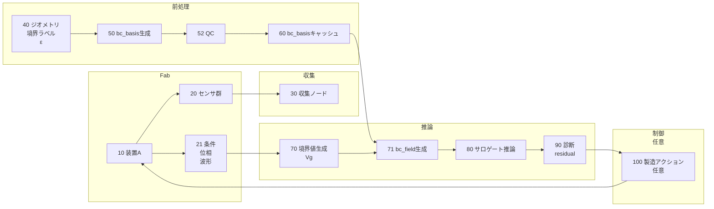
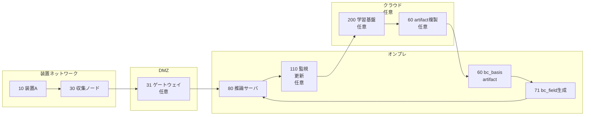
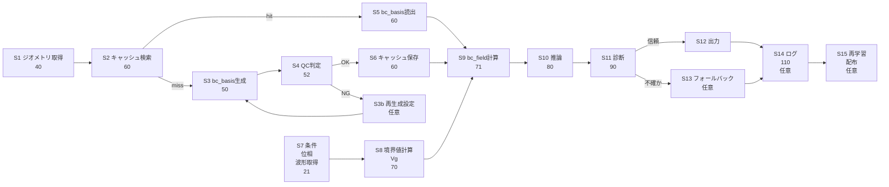
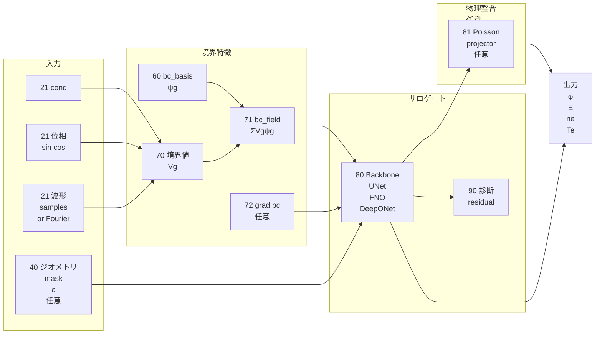
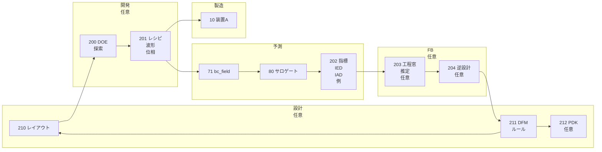

## 0. 管理情報（メタ）

* **資料種別**：特許資料（発明開示書〜明細書素材）
* **発明名称（案）**：
  **調和拡張に基づく境界影響基底の前計算キャッシュと、位相・波形に応じた境界影響場注入によるプラズマサロゲート推論**
* **発明の要点（3点）**：

  1. 境界条件を「境界値ベクトル」ではなく「境界影響場（bc_field）」に変換して注入
  2. 調和拡張に基づく基底（bc_basis）を geometry ごとに前計算しキャッシュ再利用
  3. RF 位相・波形を境界値→境界影響場へ落として注入（時間依存BCの汎化）
* **想定適用**：プラズマプロセス（エッチング等）の空間場サロゲート（UNet/FNO/DeepONet/Coord-MLP等）
* **関連発明（本文言及）**：poisson_hybrid（特許2）との連携、境界値生成（特許3）への委譲（いずれも本文中で言及）
* **作成日**：2026-03-02（JST）
* **匿名化方針**：装置名等は **装置A** などに置換（入力に固有名なし）
* **注意**：本資料は**法的助言ではなく**、特許文書化のための**説明素材・請求項たたき台**です。

---

## 1. 1ページ要約（発明の要旨／新規性の核3点／期待効果の定量）

### 発明の要旨

半導体プラズマの空間場（特に電位 φ / 電場 E）は、**多電極・多材料・非同次**な境界条件、および **RF 位相・波形**の違いで**非局所的**に変化する。従来のサロゲート（UNet/FNO/DeepONet/MLP等）で境界条件を単なるスカラー（例：Vpp, phase）として入力すると、幾何学的な影響伝播をネットが**暗記**しやすく、未学習条件（外挿）に弱い。

本発明は、境界条件を **調和拡張（Laplace 解）**により **境界影響基底（bc_basis）**へ変換し、推論時は境界グループごとの境界値 (V_g(\theta)) と基底 (\psi_g(\mathbf{x})) の線形結合で **境界影響場（bc_field）**を生成し、サロゲートへ注入する。さらに、Laplace solve を推論時に行わず、**geometry ごとに前計算してキャッシュ**し、推論実用性と再現性を確保する。

### 新規性の核（3点）

1. **境界条件を「境界影響場」に変換して注入**

   * 境界値ベクトルではなく、(\phi_{\text{bc-ext}}(\mathbf{x};\theta)=\sum_g V_g(\theta)\psi_g(\mathbf{x})) の **空間場**として入力化。
2. **bc_basis を geometry ごとに前計算・キャッシュ（再利用）**

   * Laplace solve は推論ボトルネックになり得るため、前処理成果物として固定し、**推論では線形結合のみ**。
3. **位相・波形（RF phase / waveform）を境界影響場へ落として注入**

   * 位相依存/任意波形（サンプル列または Fourier 係数）から (V_g(\theta)) を構成し、**波形変化→空間場変化**を境界影響場としてモデルに渡す。

### 期待効果の定量（例・推定・要確認）

> 下記は本文の計算量・データ形状から導ける **概算例（推定）**。実測値は要確認。

* **推論計算の軽量化（推定）**

  * 推論時：Laplace solve 不要、(O(G\cdot N_{\text{grid}})) の線形結合のみ
  * 例：2D 256×256（(N=65,536)）、G=5 → 乗算加算 ≈ 327,680 点（軽量）
* **キャッシュメモリ（例・推定）**

  * float32 で (\psi) を保存すると容量 ≈ (4\cdot G\cdot N) バイト
  * 例：2D 256×256, G=5 → 約 1.3 MB
  * 例：3D 128³, G=5 → 約 40 MB
* **汎化（外挿）耐性の向上（定量指標は要確認）**

  * 指標例：未学習波形/位相条件での φ/E の相対誤差、境界近傍誤差、Poisson 残差など
  * 理由：境界影響の幾何学的伝播を (\psi_g(\mathbf{x})) で明示し、ネットの暗記負担を減らす
* **安定性の向上（本文根拠）**

  * 調和関数の最大値原理により、bc_field は入力として**発散しにくい**方向（離散化誤差は QC で監視）

---

## 2. 技術分野・適用範囲（工程/装置/タスク/導入形態）

### 工程

* **プラズマプロセス**：エッチング、アッシング、成膜前後処理など（一般カテゴリ）
* 特に本文が強調：**低圧・高密度**で RF シースが IED/IAD に強く影響する条件

### 装置

* **装置A**：RF 駆動プラズマチャンバ（多電極、接地壁、誘電体表面、ウェハチャック等を含み得る）

### タスク

* サロゲートでの空間場推定：

  * 電位 φ、電場 (E=-\nabla \phi)、電子密度 (n_e)、電子温度 (T_e) 等（本文の出力例に準拠）
  * **位相/波形条件付き**の場推定（θ または波形入力）
* **境界条件の入力化**（本発明の中心）：境界値 → 境界影響場（bc_field）

### 導入形態

* **オフライン**：プロセス開発・最適化・探索（本文で外挿耐性の必要性を示唆）
* **オンライン（推定）**：装置レシピ最適化や異常検知に利用（※本文にAPC/MES連携の明示はないため「推定/要確認」）

---

## 3. 従来技術（背景）と先行技術カテゴリ（※技術文章の言及＋一般的カテゴリ。最後に「先行との差分候補」）

### 技術文章で言及される従来カテゴリ

* **UNet / FNO / DeepONet / MLP** 等のサロゲート
* 課題：境界条件が

  * 非一様・非同次（電極ごとの電位、絶縁、誘電体、複数ポート）
  * 時間（位相）依存（RF 位相、波形、パルス）
  * 境界条件差が空間場（特に φ/E）を**非局所**に変化

### 一般的な先行技術カテゴリ（一般論）

* 境界条件を **スカラー/ベクトル条件**としてネットに入力（cond ベクトル）
* 境界を表す **マスク/ラベルチャネル**を入力（境界種別を離散的に表現）
* PDE 残差などを用いる **物理制約付き学習**（PINN/ハイブリッド）
* 境界条件を扱うための **関数入力（DeepONet等）**／境界サンプル点のセンサ化
* 境界を満たすための **補助場（例：調和拡張）**という考え方自体（一般論）
  ※本文では「Neural Operator 文脈で Laplace solve が推論ボトルネックになり得る」点に言及

### 先行との差分候補（本発明の差分主張になり得る点）

* 境界条件を **調和拡張に基づく基底 (\psi_g)** により **「境界影響場」に変換**して注入する点
* (\psi_g) を **geometry ごとに前計算・キャッシュ**し、推論時の Laplace solve を回避する点
* RF 位相・任意波形を (V_g(\theta)) として境界影響場へ反映し、**波形変化の汎化**を狙う点
* さらに **モデル種別に依存しない前処理成果物**として bc_basis を固定し、比較・再現性を担保する点

---

## 4. 従来の課題（発生条件、現行対策の限界、評価指標、制約）

### 課題が顕在化する発生条件

* 多電極・多材料（誘電体/絶縁）・複数境界グループが存在
* RF 位相・波形・パルスなど**時間依存境界**
* 条件探索（最適化）で未学習条件へ踏み込む必要がある（本文の外挿耐性ニーズ）

### 現行対策の限界（本文の主張に沿う）

* 境界条件を cond ベクトルに入れるだけだと、

  * 境界影響の空間伝播をネットが暗記しやすい
  * 外挿に弱くなる
* 調和拡張を都度解くと推論でボトルネックになり得る（本文）

### 評価指標（本文の QC/診断と整合）

* **境界整合**：Dirichlet 境界上での一致度（bc_error）
* **PDE整合**：(|\nabla\cdot(\kappa\nabla\psi_g)|) や Poisson 残差（residual_norm）
* **安定性**：値域チェック（range_min/max）・最大値原理に基づく逸脱検出
* **推論性能**：レイテンシ、スループット、推論の再現性（同一 bc_basis 固定時）

### 制約

* 推論で Laplace solve を行うと計算負荷が重い
* 幾何・境界定義が変わると基底が変わり、管理が必要（geometry_hash 等）

---

## 5. 提案手法（データ→前処理→学習→推論→不確かさ→製造アクション→監視/更新）

### 5-1. システム構成（文章）

本手法は、以下を**一体の仕組み**として構成する。

1. **前処理（オフライン）**

* geometry（マスク/SDF/メッシュ）、境界ラベル、任意で誘電率分布 ε を入力し、
  境界グループ (g=1..G) ごとに **重み付き Laplace** を解いて (\psi_g(\mathbf{x})) を生成
* (\psi_g) の品質を **QC**（bc_error/residual/range）で評価
* **キャッシュ**に成果物（psi/meta/qc/manifest）として保存

2. **推論（オンライン/バッチ）**

* cond + 位相 θ + 波形（サンプル列または Fourier 係数）から **境界値 (V_g(\theta))** を構成
* キャッシュから (\psi_g) を読み出し、
  [
  \phi_{\text{bc-ext}}(\mathbf{x};\theta)=\sum_{g=1}^{G}V_g(\theta)\psi_g(\mathbf{x})
  ]
  を計算して **bc_field** を得る（線形結合のみ）
* bc_field をサロゲートの入力チャネル、または Poisson 初期値 (\phi^{(0)}) 等に利用（本文）

3. **不確かさ/信頼度（本文の QC/診断を根拠に設計）**

* bc_basis 生成時 QC（bc_error, residual_norm, range_check）
* 推論後の residual diagnostics（本文に「residual diagnostics」の出力例あり）
* これらに基づき、**フォールバック**（例：再生成/高忠実度計算/再計測）へ分岐（※分岐の具体アクションは本文では明示されないため「要確認/運用例」）

4. **製造アクション・監視/更新（推定/要確認）**

* 推論結果がプロセス制御や探索に用いられる場合、APC/MES/FDC等への接続が想定される
  ※本文は「サロゲート基盤」「探索で未学習条件に触れる」に言及するが、APC/MES具体連携は未記載のため推定

---

### 5-2. 入力データ仕様（種類/同期/欠損/特徴量/独自性候補）

#### 入力データの種類（本文ベース＋運用に必要な項目は要確認）

| 区分    | 入力名                | 形式例                   | 同期         | 欠損 | 独自性候補                      |
| ----- | ------------------ | --------------------- | ---------- | -- | -------------------------- |
| 幾何    | domain_mask        | 2D/3D配列               | 静的         | 低  | geometry_hashの源泉           |
| 幾何    | boundary_label_map | 2D/3D配列 or 面ID        | 静的         | 低  | **境界グループ g 定義**            |
| 材料    | eps_map            | 2D/3D配列               | 静的         | 中  | κ=ε の重み付き調和拡張              |
| 条件    | cond               | ベクトル                  | 位相と同期（要確認） | 中  | boundary_value_builder の入力 |
| 位相    | θ                  | スカラー                  | 推論時刻       | 低  | sin/cos encoding（本文）       |
| 波形    | waveform           | サンプル列 K または Fourier係数 | θ と整合      | 中  | **任意波形注入**（本文）             |
| 前処理成果 | bc_basis（ψ）        | (G,H,W) 等             | 静的         | 低  | **前計算キャッシュ**（本文）           |
| 推論特徴  | bc_field           | 空間場                   | θごと        | 低  | **ΣVgψg による場入力**           |

#### 同期・欠損に関する設計メモ

* 位相 θ を用いる場合、**cond と θ**の定義（例：1周期内のスナップショットか、周期平均か）は **要確認**
* waveform をサンプル列で渡す場合：K 分割点と θ の対応（位相原点、遅延）が **要確認**
* 欠損時の方針（推定）：

  * waveform 欠損→パラメトリック正弦波で代替（本文の Vg(θ) 形式）
  * eps_map 欠損→ κ=1（kappa_mode="ones"）にフォールバック（本文）

---

### 5-3. 教師データ/ラベル定義（生成/ノイズ/分割/リーク防止）

> 本節はサロゲート学習の一般構成。本文は学習データ生成を詳細化していないため、**仮定/要確認**を明示します。

#### 教師データ生成（仮定）

* **高忠実度シミュレーション**（輸送方程式＋Poisson の自己無撞着解）からスナップショットを生成（本文背景と整合）
* **実機計測**（例：VIプローブ、OES等）から一部ラベル化（※本文未記載、要確認）

#### ラベル（出力）定義（本文の例に準拠、詳細は要確認）

* 例：(\phi(\mathbf{x}), E(\mathbf{x}), \log n_e(\mathbf{x}), T_e(\mathbf{x}))
* 任意（本文に optional として）：(\rho_{\text{eff}}) 等

#### ノイズ・誤差源（仮定）

* シミュレーション：離散化誤差、収束誤差
* 実測：センサノイズ、時刻同期誤差（位相ずれ）

#### データ分割とリーク防止（要確認だが重要）

* **波形外挿**を狙うなら：

  * train：波形集合A、test：波形集合B（同一geometryでも波形を分ける）
* **geometry汎化**を狙うなら：

  * train geometry と test geometry を分離（ただし bc_basis は各geometryで生成するため、分離粒度の設計は要確認）
* **条件リーク**防止：

  * 同一ランの近接θを train/test に跨らせない（位相連続性がある場合）

---

### 5-4. AIモデル仕様（モデル種別/構造/学習/推論/閾値/不確かさ）

#### モデル種別（本文）

* UNet / FNO / DeepONet / MLP などモデル不問
* bc_basis を「モデル種別に依存しない前処理成果物」として扱う

#### 構造と注入位置（本文の推奨に沿う）

* **UNet**：入力チャネルに bc_field を concat、任意で (\nabla bc_field) も追加
* **FNO**：物理場と同一グリッドチャネルとして bc_field を追加
* **Coord-MLP**：(\psi_g(\mathbf{x})) を補間して特徴量として入力（bc_field を明示生成しない変形例）
* **DeepONet**：trunk の query features に (\psi_g(\mathbf{x}_q)) 等

#### 学習（要確認）

* 主損失：教師あり回帰（MSE等）
* 任意（本文の「residual diagnostics」思想に合わせた運用例）：

  * Poisson 残差や境界整合を補助損失に入れる（※本文は特許2連携を示唆、ここは要確認）

#### 閾値・不確かさ（本文の QC/診断から構成）

* bc_basis 生成時：

  * bc_error / residual_norm / range_check が閾値以内か判定（本文）
* 推論時：

  * 出力の residual diagnostics を計算し、閾値超過でフォールバック（本文に「+ residual diagnostics」出力例）
  * フォールバック内容（再計算/再計測/保守など）は **運用例として要確認**

---

### 5-5. 製造アクション（APC/MES/FDC/保全/ホールド/再計測）

> 本文は「最適化・探索時の安全性」「工業的に重要」を述べるが、APC/MES/FDCの具体I/Fは未記載のため **推定/要確認**として整理します。

* **再計測（推定）**：不確かさが高い条件で追加計測（VI/OES等）を要求
* **ホールド（推定）**：境界整合や残差が閾値外の場合にロット/ウェハを保留
* **レシピ調整（推定）**：RF 位相・波形、電極電位（(V_g(\theta))）を変更

  * 本文の位相波形注入は、レシピ探索と自然に接続し得る
* **保全（推定）**：幾何変化（堆積/摩耗）で geometry_hash が変化した場合に点検を促す

---

### 5-6. 実装制約（リアルタイム、計算資源、I/F、フェイルセーフ、監査）

* **リアルタイム性**：

  * 推論で Laplace solve を避け、線形結合 (O(GN)) にする（本文の狙い）
* **計算資源**：

  * bc_basis のメモリ常駐（例は1章参照、実サイズは解像度/3Dで増大）
* **I/F（要確認）**：

  * bc_basis 配布：artifact（npz + manifest.yaml）
  * 推論入力：cond/phase/waveform と bc_basis の参照（キャッシュパス）
* **フェイルセーフ（本文の QC から導ける）**：

  * QC NG の bc_basis は使用しない
  * キャッシュ miss 時は生成にフォールバック（ただしオンラインで生成するかは要件次第）
* **監査性（本文の manifest に準拠）**：

  * 生成コード commit hash、生成日時、入力統計の記録（manifest.yaml）
* **セキュリティ/ガバナンス（推定）**：

  * オンプレ/DMZ/クラウド分離（図2参照、クラウドは任意）

---

## 6. 提案手法による効果（従来vs提案の表、測定条件、因果説明）

### 従来 vs 提案（整理表）

| 観点     | 従来（代表例）            | 提案（本発明）                          | 期待効果               |
| ------ | ------------------ | -------------------------------- | ------------------ |
| 境界入力   | condベクトルに境界電位等を入れる | **bc_field = Σ Vg ψg** を空間チャネル入力 | 幾何学的影響伝播を明示、暗記を減らす |
| 時間依存BC | 位相/波形をスカラーや系列で渡すだけ | 位相/波形→ **Vg(θ)** → bc_field      | 波形変更時の汎化を狙う        |
| 推論計算   | 調和拡張を都度解くと重い場合あり   | **bc_basisを前計算キャッシュ**、推論は線形結合    | レイテンシ低減（推定）        |
| 安定性    | 入力の発散や非物理を学習し得る    | 調和拡張＋最大値原理、**range_check**       | 異常入力の抑制に寄与         |
| 再現性    | 境界処理がモデル/実装依存      | bc_basis を固定成果物化＋manifest        | モデル比較・再現性向上        |

### 測定条件（要確認だが推奨）

* 評価タスク：未学習波形、未学習位相、未学習境界電位パターンでの φ/E 誤差
* 指標：境界近傍誤差、全体MSE、Poisson残差、推論時間、QC NG率

### 因果説明（本文に沿う）

* (\psi_g(\mathbf{x})) は geometry と境界グループ定義により決まり、**境界の影響が内部へどう広がるか**を表現
* bc_field は境界影響を空間場として与えるため、ネットは「境界→内部の伝播」を学習で無理に暗記せずに済み、外挿に強くなり得る
* 推論時に Laplace を解かないため、**実用上の成立性**が上がる（本文）

---

## 7. 新規性・進歩性（差分表、必須要素/任意要素の切り分け）

### 差分表（構成要素ごとの比較）

| 要素           | 先行の典型           | 本発明                         | 必須/任意     |
| ------------ | --------------- | --------------------------- | --------- |
| 境界条件の表現      | 境界値ベクトル/スカラー    | **境界影響場 bc_field**          | **必須**    |
| bc_field生成原理 | 学習で内包/ヒューリスティック | **調和拡張（Laplace）基底**         | **必須**    |
| 計算方式         | 推論時に都度計算し得る     | **前計算＋キャッシュ再利用**            | **必須**    |
| 時間依存BC       | 位相スカラー入力        | **Vg(θ) と ψg の線形結合**        | **必須**    |
| 波形注入         | 波形系列を直接入力       | **波形→Vg(θ)→bc_field**       | 目的次第で必須化可 |
| κの選択         | なし/固定           | κ=1 or κ=ε（本文）              | 任意        |
| 生成方式         | なし              | FD/FEM（本文）                  | 任意        |
| QC           | なし/簡易           | bc_error/residual/range（本文） | 任意だが強い差分  |

### 進歩性の論点（素材）

* **一体化の効果**：

  * 調和拡張（理論的に自然）だけでは推論が重くなり得る
  * そこで **前計算キャッシュ**を組み合わせ、推論実用性と再現性を担保
  * さらに **位相/波形→境界影響場**に落とすことで、時間依存BCの汎化を狙える
* **モデル非依存の基盤化**：UNet/FNO/DeepONet/MLP いずれにも同一 bc_field を注入でき、比較・移植が容易（本文）

---

## 8. 実施例（最低2つ：代表ケース＋変形例。条件・手順・結果が書ける範囲で）

### 実施例1：2Dグリッド（FD）＋UNet入力チャネル注入（代表例）

* **対象（例）**：装置Aの2D断面（計算領域 Ω を格子化）
* **境界グループ例（本文に沿う）**：

  * g1：powered electrode
  * g2：ground wall
  * g3：dielectric surface
  * g4：wafer chuck/edge ring
* **前処理**：

  1. domain_mask, boundary_label_map（任意で eps_map）を用意
  2. 各 g について (\nabla\cdot(\kappa\nabla\psi_g)=0) を FD（5点stencil）で離散化し解く
  3. QC：bc_error/residual_norm/range_check を計算し合格した (\psi_g) をキャッシュ
* **推論**：

  1. 位相 θ を [sinθ, cosθ] で表現（本文）
  2. (V_g(\theta)=V_{g,dc}+V_{g,rf}\sin(\theta+\varphi_g)) のようなパラメトリック表現で境界値を計算（本文）
  3. bc_field を線形結合で生成し UNet の入力チャネルに concat
  4. 出力：(\phi, E, \log n_e, T_e) 等（本文例）
* **結果（推定/要確認）**：

  * 境界近傍の φ/E 誤差が低下し得る
  * 未学習位相での外挿が改善し得る
  * 推論時間は Laplace solve を含まない分短縮（定量は要確認）

### 実施例2：3Dメッシュ（FEM）＋任意波形（Fourier）＋FNO/DeepONet（変形例）

* **対象（例）**：3Dチャンバメッシュ、複数電極・誘電体を含む
* **前処理**：

  * FEM で剛性行列を構成し、1回の factorization で multi-RHS（複数 g）を解き (\psi_g) を生成（本文）
  * κ=ε（kappa_mode="epsilon"）により材料分布の影響を反映（本文）
* **波形注入**：

  * (V(\theta)=a_0+\sum_{m=1}^M(a_m\cos m\theta+b_m\sin m\theta)) の係数を入力（本文方式B）
  * 各境界グループへ割当（boundary_value_builder で (V_g(\theta)) を生成）
* **推論**：

  * FNO：bc_field をグリッド/ボクセルチャネルとして入力
  * DeepONet：(\psi_g(\mathbf{x}_q)) を trunk 側特徴に入れる（本文）
* **結果（推定/要確認）**：

  * 任意波形の探索で入力次元が膨らみにくい（Fourier係数）
  * bc_basis キャッシュにより多数条件の sweep が現実的になる

---

## 9. 図面（Mermaid／左→右）と図面説明（符号表も）

### 9-1. 図1：全体システム構成図

**図1の説明**：
装置Aの条件（位相・波形を含む）から境界値 (V_g) を生成し、キャッシュされた bc_basis（(\psi_g)）を読み出して bc_field を生成し、サロゲートへ注入して推論する。bc_basis は geometry ごとに前計算・QC 付きでキャッシュされる。

---

### 9-2. 図2：ネットワークアーキテクチャ（装置ネットワーク/DMZ/オンプレ/クラウド任意）

**図2の説明**：
推論はオンプレで実行し、bc_basis artifact を配布・更新する構成例。クラウド学習は任意で、監視結果に基づく再学習・配布のループを構成し得る（※学習/更新は本文未詳細のため任意）。

---

### 9-3. 図3：処理フロー（S1〜Sn、不確かさ分岐、再学習まで）

**図3の説明**：
キャッシュ miss なら bc_basis を生成し QC 合格品を保存。推論時は bc_field を作ってサロゲートへ入力し、診断により信頼/不確かを分岐してフォールバック可能（※フォールバックと再学習は運用例として要確認）。

---

### 9-4. 図4：AIモデル構造（マルチモーダル融合等）

**図4の説明**：
位相・波形から境界値 (V_g) を得て bc_field を生成し、モデル入力に融合する。任意で Poisson projector（特許2連携）により物理整合を補強する。

---

### 9-5. 図5：設計—製造の閉ループ（プロセス予測/工程窓/逆設計/DFM/PDK更新）

**図5の説明**：
境界影響場注入により、波形・位相を含むレシピ探索での予測を高速化し、工程窓推定や設計フィードバックへ繋げる概念図（※設計FBは本文未詳細のため任意）。

---

### 9-6. 図面キャプション案（特許向けの短文）

* **図1**：境界影響基底のキャッシュと境界影響場生成を用いたサロゲート推論システムの全体構成図。
* **図2**：装置ネットワークとオンプレ推論環境における境界影響基底成果物の配布構成例。
* **図3**：境界影響基底の生成・品質判定・キャッシュおよび推論時の診断分岐を含む処理フロー。
* **図4**：位相・波形に基づく境界影響場を入力融合するサロゲートモデル構造例。
* **図5**：境界影響場に基づく予測を用いたプロセス開発と設計フィードバックの閉ループ概念図。

---

### 9-7. 符号の説明（表：符号→名称→役割）

|  符号 | 名称                | 役割                            |
| --: | ----------------- | ----------------------------- |
|  10 | 装置A               | プラズマ処理を実行する製造装置               |
|  20 | センサ群              | RF/VI/圧力等のプロセス観測（例）           |
|  21 | 条件・位相・波形          | cond/θ/waveform など推論入力        |
|  30 | 収集ノード             | データ収集・ログ（FDC相当、例）             |
|  31 | ゲートウェイ            | DMZ中継（任意）                     |
|  40 | ジオメトリ情報           | mask/SDF/mesh、境界ラベル、ε等        |
|  50 | bc_basis生成        | Laplace solve により (\psi_g) 生成 |
|  52 | QC                | bc_error/residual/range の品質判定 |
|  60 | bc_basisキャッシュ     | (\psi) と meta/qc/manifest を保存 |
|  70 | 境界値生成             | 位相・波形から (V_g(\theta)) を計算     |
|  71 | bc_field生成        | (\sum_g V_g\psi_g) の線形結合      |
|  72 | grad bc           | (\nabla bc_field) 特徴（任意）      |
|  80 | サロゲート推論           | UNet/FNO/DeepONet等の推論         |
|  81 | Poisson projector | 物理整合補助（任意、特許2連携）              |
|  90 | 診断                | residual diagnostics 等の信頼度評価  |
| 100 | 製造アクション           | ホールド/再計測/レシピ変更（任意）            |
| 110 | 監視・更新             | ログ/ドリフト監視/再配布（任意）             |
| 200 | DOE探索             | 条件探索・最適化（任意）                  |
| 201 | レシピ               | 波形・位相を含む条件候補（任意）              |
| 202 | 指標                | IED/IAD等の評価指標（例、任意）           |
| 203 | 工程窓推定             | プロセス窓の推定（任意）                  |
| 204 | 逆設計               | 目標指標に対する条件探索（任意）              |
| 210 | レイアウト             | 設計側入力（任意）                     |
| 211 | DFMルール            | 設計製造性ルール更新（任意）                |
| 212 | PDK               | 設計キット更新（任意）                   |

---

## 10. 本技術により創出される新たな価値（Value Creation：予測/設計/設計FB/事業KPI）

> 本章は本文の「探索で未学習条件に触れる」「安全性」等から自然に導ける価値を整理します。
> APC/DFM/PDKなどの接続は本文に明示がないため **推定/任意**を明示します。

### 10-1. 従来困難だった意思決定（何が初めて可能になるか）

* **波形・位相を変えたときの空間場変化**を、境界影響場として安定に入力化できるため、
  **未学習波形を含む探索**での予測が成立しやすくなる（本文の狙い）
* 境界影響の幾何学的伝播を (\psi_g) に固定化することで、
  モデルの種類が変わっても **同一前処理で比較可能**（再現性の意思決定が可能）

### 10-2. プロセス予測（運用）価値（例：先読み制御、計測負荷削減、停止削減）

* **高速推論**：キャッシュにより推論で Laplace solve を回避
* **異常検知の説明性（推定）**：

  * bc_basis QC、出力 residual diagnostics により「境界整合が崩れた」等の根拠を提示しやすい
* **計測負荷削減（推定）**：

  * 追加計測が必要な条件を診断で絞る運用が可能

### 10-3. プロセス設計（開発）価値（例：DOE削減、工程窓推定、逆設計）

* **DOEの高速化（推定）**：多数の波形/位相/境界条件の sweep を現実的にする
* **工程窓推定（推定）**：

  * 境界条件空間での安全域探索（最大値原理的に入力が安定）
* **逆設計（推定）**：

  * 目標指標（例：IED/IAD相当）に対して波形パラメータ（Fourier係数）を探索

### 10-4. 設計フィードバック価値（DFM/PDK更新、マスク反復削減）

* **設計—製造の閉ループ（任意）**：

  * 予測に基づく DFM/PDK 更新やマスク反復削減は概念的に接続可能（図5）
  * ただし本文未記載のため、実装・権利化観点は **要確認**

### 10-5. 価値指標テーブル（領域×KPI×根拠）

| 領域       | KPI例                      | 根拠（本文/推定）                   |
| -------- | ------------------------- | --------------------------- |
| 推論運用     | 推論レイテンシ、スループット            | 推論時 Laplace solve 回避（本文）    |
| 品質/安定    | 境界近傍誤差、Poisson残差、range逸脱率 | QC＋最大値原理の安定性（本文）            |
| 開発効率     | DOE回数、探索サイクル時間            | キャッシュ＋波形注入で sweep 容易（本文＋推定） |
| 制御（任意）   | 停止削減、ホールド削減               | 診断分岐の運用（推定）                 |
| 設計FB（任意） | マスク反復数、設計ルール更新頻度          | 図5の閉ループ概念（推定）               |

---

## 11. 請求項例（たたき台）

> **注意**：以下は特許クレームの「たたき台」です（法的助言ではありません）。
> 本文にない要素（APC/再学習/設計FB等）は、**従属項で任意要素**として例示し、要確認扱いです。

### 11-1. 独立請求項（方法）※発明の芯を1本にまとめる

**【請求項1】**
計算機により実行される方法であって、
(1) 半導体製造に用いられるプラズマ処理装置の計算領域を表すジオメトリ情報と、当該計算領域の境界を複数の境界グループに区分する境界ラベル情報とを取得する工程と、
(2) 前記境界グループの各々について、計算領域内で
(\nabla\cdot(\kappa(\mathbf{x})\nabla \psi_g(\mathbf{x}))=0)
を満たし、かつ前記境界グループにおいて所定値を取り、他のディリクレ境界において別の所定値を取るように境界条件を課して得られる調和拡張解 (\psi_g) を、境界影響基底として生成する工程と、
(3) 前記境界影響基底を、前記ジオメトリ情報に基づくハッシュ値および基底生成設定に基づくハッシュ値を含むキャッシュキーに関連付けて記憶装置に保存する工程と、
(4) 位相または波形を含む境界条件を表す入力に基づいて、前記境界グループごとの境界値 (V_g) を算出する工程と、
(5) 前記記憶装置から前記境界影響基底 (\psi_g) を読み出し、(\sum_g V_g\psi_g) の線形結合により境界影響場を生成し、当該境界影響場を機械学習モデルへの入力として与えて、プラズマに関する空間場を推定する工程と、
(6) 前記境界影響基底の生成時または前記空間場の推定後に、前記調和拡張解の残差ノルム、境界一致誤差、または値域逸脱の少なくとも一つを含む診断量を算出し、前記診断量が閾値を満たさない場合に、フォールバック処理を実行する工程と、
を含む方法。

* ここで必須要素として **(i) 入力データ構成/特徴量生成（bc_field）＋キャッシュ**、**(ii) 診断量に基づく分岐** を含めています（要件充足）。

### 11-2. 従属請求項（不確かさ分岐、装置差補正、ドリフト監視/再学習、工程窓推定、逆設計、設計FBなど）

**【請求項2】** 請求項1において、前記 (\kappa(\mathbf{x})) が 1 または誘電率分布 (\epsilon(\mathbf{x})) に基づいて選択される方法。

**【請求項3】** 請求項1において、前記境界影響基底の生成が、固定格子に対する有限差分離散化または有限要素メッシュに対する有限要素離散化のいずれかにより行われる方法。

**【請求項4】** 請求項1において、前記境界影響基底の生成に際し、前記境界グループの複数に対応する右辺を用いた複数回の求解を、同一の線形方程式系の分解結果を用いて実行する方法。

**【請求項5】** 請求項1において、前記位相が ([ \sin\theta, \cos\theta]) の位相エンコーディングとして表現され、前記境界値 (V_g) が当該位相エンコーディングに基づき算出される方法。

**【請求項6】** 請求項1において、前記波形が、1周期を分割したサンプル列、またはフーリエ係数のいずれかとして入力され、前記境界値 (V_g) が当該入力に基づき算出される方法。

**【請求項7】** 請求項1において、前記境界影響場の勾配に相当する特徴量を算出し、当該特徴量を前記機械学習モデルへの追加入力として与える方法。

**【請求項8】** 請求項1において、前記境界影響場が、電位場の初期値として物理プロジェクタに与えられる方法。

**【請求項9】** 請求項1において、前記フォールバック処理が、前記境界影響基底を別の解像度または別のソルバ設定で再生成する処理を含む方法。

**【請求項10】** 請求項1において、前記フォールバック処理が、前記空間場の推定結果に基づく追加計測要求または処理の保留を含む方法。

* ※追加計測/保留は本文未記載のため運用例（要確認）

**【請求項11】** 請求項1において、前記診断量の時系列を監視し、所定のドリフト条件を満たす場合に前記機械学習モデルの再学習または再配布を行う方法。

* ※ドリフト監視/再学習は本文未詳細（要確認）

**【請求項12】** 請求項1において、前記推定結果に基づき工程窓推定、逆設計、または設計フィードバックの少なくとも一つを行う方法。

* ※設計FBは本文未詳細（要確認）

### 11-3. 独立請求項（装置）

**【請求項13】**
プロセッサと記憶装置とを備える情報処理装置であって、
前記プロセッサが、請求項1に記載の方法を実行するように構成された情報処理装置。

### 11-4. 独立請求項（システム）

**【請求項14】**
ジオメトリ情報を取得するジオメトリ取得部と、境界影響基底を生成する基底生成部と、生成された境界影響基底をキャッシュする記憶部と、位相または波形を含む入力に基づいて境界値を生成する境界値生成部と、前記境界値と前記境界影響基底との線形結合により境界影響場を生成する境界影響場生成部と、前記境界影響場を入力として空間場を推定する機械学習推論部と、診断量に基づいてフォールバック処理を制御する診断部と、を備えるシステム。

### 11-5. 独立請求項（プログラム/記録媒体）

**【請求項15】**
コンピュータに請求項1に記載の方法を実行させるためのプログラム。

**【請求項16】**
請求項15に記載のプログラムを記録した非一時的な記録媒体。

### 11-6. クレーム設計メモ（広いクレーム/狭いクレーム、回避設計ポイント）

* **広い核（守りたい芯）**：

  * 「境界グループごとの調和拡張基底 (\psi_g)」＋「線形結合で bc_field」＋「キャッシュ再利用」
* **狭く強い限定（差別化を強める）**：

  * QC（bc_error/residual/range）＋ manifest（commit hash等）＋ multi-RHS factorization
  * 波形入力の 2方式（サンプル列 / Fourier 係数）
* **回避設計ポイント候補**：

  * Laplace 以外の拡散PDEで基底を作る（ただし本文は κ の一般化に触れているため、拡散係数付きもカバー余地）
  * bc_field を作らず、(\psi_g(\mathbf{x})) の値列を直接入力する（本文に変形例あり。これを従属で拾うと回避に強い）

---

## 12. 追加情報（実務で重要：データ量、汎化、更新、監査、セキュリティ/ガバナンス）

* **データ量（要確認）**：

  * geometry 数、境界条件パターン数、位相分割数、波形種類数
* **汎化（要確認）**：

  * geometry 汎化を狙うか、同一geometryで境界条件外挿を狙うか
* **更新（要確認）**：

  * bc_basis の再生成トリガ（装置状態変化、境界ラベル更新、解像度変更）
* **監査性（本文の manifest を活用）**：

  * artifact の版管理、生成コードのコミット、QCログの保存
* **セキュリティ/ガバナンス（推定）**：

  * artifact 配布経路（オンプレのみ/クラウド併用）、アクセス制御、改ざん検知（署名等は要確認）

---

## 付録A. 用語集（略語/専門語）

* **bc_basis**：境界グループごとに生成する境界影響基底 (\psi_g(\mathbf{x}))
* **bc_field / 境界影響場**：(\sum_g V_g(\theta)\psi_g(\mathbf{x})) により生成される空間場特徴
* **調和拡張（Harmonic extension）**：Laplace（または重み付きLaplace）方程式の境界値問題を解いて内部へ滑らかに拡張すること
* **Dirichlet エネルギー**：(\int_\Omega \kappa|\nabla \psi|^2 d\Omega)。調和拡張はこれを最小にする性質として整理される
* **最大値原理**：調和関数の内部値が境界の最大最小に抑えられる性質（離散誤差で逸脱はあり得るため QC）
* **G**：境界グループ数
* **κ（kappa）**：Laplace の係数。本文では 1 または ε を例示
* **QC**：品質チェック（bc_error/residual_norm/range_check）
* **UNet/FNO/DeepONet**：代表的サロゲートモデルカテゴリ
* **Poisson projector / poisson_hybrid**：推定場を物理的に整合させる補助演算子（本文では特許2として連携言及）

---

## 付録B. 追加で必要な情報（優先度：高/中/低。最大10項目）

> なるべく **Yes/No** や **選択式**で回答できる形にしています。

1. **【高】対象プロセスはどれですか？**（選択）

   * A: プラズマエッチング / B: アッシング / C: 成膜系 / D: その他
2. **【高】出力として推定したい空間場はどれですか？**（複数選択）

   * A: φ / B: E / C: (n_e) / D: (T_e) / E: その他（例：IED関連）
3. **【高】geometry 表現はどれを主に使いますか？**（選択）

   * A: グリッド mask/SDF / B: メッシュ FEM / C: 両方
4. **【高】境界グループ数 G とグループ定義は固定ですか？**（選択）

   * A: 固定 / B: 装置構成で変動 / C: 未定
5. **【高】κはどれを使いますか？**（選択）

   * A: κ=1 / B: κ=ε / C: 両方を切替 / D: 未定
6. **【中】波形入力方式はどれですか？**（選択）

   * A: 位相のみ（sin/cos） / B: サンプル列K / C: Fourier係数M / D: 併用
7. **【中】推論はオンライン運用を想定しますか？**（Yes/No）

   * Yesの場合：許容レイテンシ目標（ms〜s）のレンジを要確認
8. **【中】フォールバック処理を実運用で行いますか？**（選択）

   * A: 再生成（別解像度） / B: 高忠実度計算 / C: 再計測 / D: 行わない / E: 未定
9. **【低】bc_basis の成果物管理に必要な監査要件はありますか？**（Yes/No）

   * 例：生成コード版、QCログ、改ざん検知
10. **【低】特許2（poisson_hybrid）との統合は必須ですか？**（選択）

* A: 必須 / B: 任意 / C: 連携しない / D: 未定
