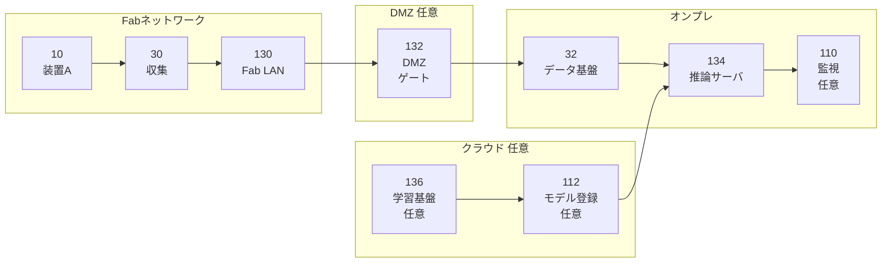
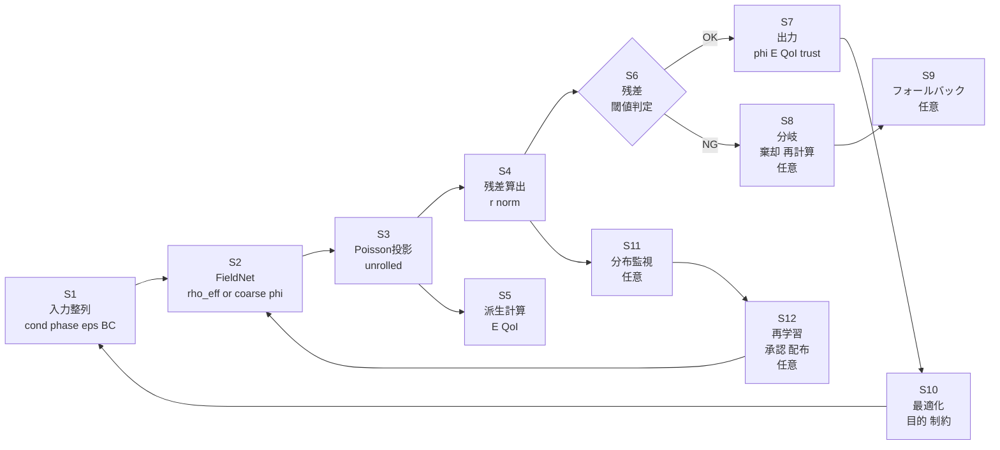
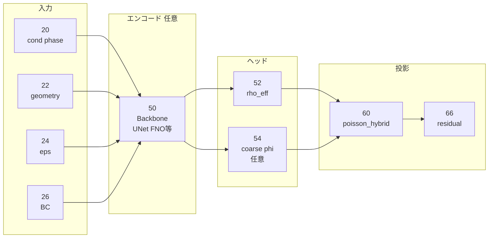
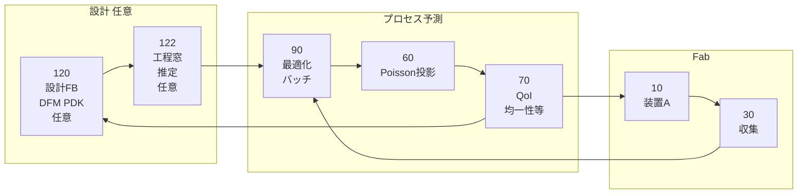

# 0. 管理情報（メタ）

* **文書種別**：特許資料（発明開示書〜明細書素材）
* **案件仮題（匿名）**：可変誘電率Poisson投影モジュールと残差活用による低温プラズマ場サロゲートの安定化
* **作成日**：2026-03-02（JST）
* **作成者**：特許技術者（AI支援）
* **対象分野**：半導体製造（低温プラズマ：CCP/ICP等）× AI（サロゲート／最適化／診断）
* **機密情報の取り扱い**：会社名・装置型番等は**匿名化**（例：装置A、ソルバA）
* **注意**：本資料は**法的助言ではなく**、技術説明素材および請求項たたき台です。
* **入力根拠**：ユーザ提示【技術文章】（「特許2（Poisson投影）レポート」）
* **未確定事項**：対象装置・工程の具体、データ実体（実測/シミュレーション）、性能数値、導入形態（オンライン/オフライン）など（本資料末尾で要確認事項を列挙）

---

# 1. 1ページ要約（発明の要旨／新規性の核3点／期待効果の定量）

## 発明の要旨

半導体製造向け低温プラズマ（CCP/ICP等）の場推定サロゲートにおいて、**電位 φ および電場 E=-∇φ**の破綻は、ウェハ上のイオンエネルギー、チャージング、均一性などの重要指標（QoI）を不安定化させる。
本発明は、学習モデルが出力する **有効電荷密度 ρ_eff（または粗い電位 coarse φ）**を入力として、**可変誘電率 ε(x) を含む Poisson 方程式**を **微分可能な反復解法（unrolled Jacobi/SOR等）**として実装した投影器（poisson_hybrid）で **φを投影生成**し、さらに **Poisson残差 r** を算出して、(i)推論診断（信頼度/OOD警告）、(ii)最適化の目的/制約、(iii)学習の物理損失に利用する。

> コアは「**投影（破綻抑制）＋残差活用（自己診断・安全弁・最適化の拘束）**」を、任意の学習モデル（UNet/FNO/DeepONet/MLP等）に対する標準部品として提供する点。

## 新規性の核（3点）

1. **可変 ε(x)・混在境界条件を扱う Poisson 方程式を、反復を層として unroll した“微分可能投影モジュール”として実装**し、学習モデルの出力（ρ_eff/coarse φ）から φ を生成する構成。
2. **Dirichlet 境界条件を各反復でハードに強制**（マスク上書き）しつつ、Neumann を ghost cell/片側差分等で扱う最小実装セットにより、境界混在・ε不連続での破綻を抑える構成。
3. **Poisson残差 r を数値化して出力**し、推論時の **trust score/OOD警告**、最適化時の **目的/制約（残差ペナルティ・閾値）**、学習時の **物理損失 L_pois** に**横断的に利用**する運用設計。

## 期待効果（定量の“指標”と“見込み”）

【技術文章】に具体値は無いため、以下は**指標定義＋見込み（推定）**です（実測/評価で要確認）。

* **残差指標**：res_L1 / res_L2 / res_Linf、res_wafer_plane（ウェハ面近傍重み付き）、bc_violation
* **物理整合の改善（推定）**：直接回帰 φ に比べ、投影後 φ は **Poisson残差を 1桁以上低減**（例：res_L2が×0.1以下）しやすい（※反復回数・ω・初期値次第、要確認）。
* **最適化の安全性（推定）**：外挿条件で “見た目はそれっぽいが物理破綻” する候補を、残差閾値で **自動棄却/再計測**でき、危険候補の採用率を低減。
* **計算コスト（推定）**：高忠実度ソルバAを毎探索点で回す代わりに、サロゲート＋投影で探索し、必要点のみ高忠実度再評価へ回すことで、**高忠実度計算回数を削減**（要確認：探索規模・精度要求・閾値設計依存）。

---

# 2. 技術分野・適用範囲（工程/装置/タスク/導入形態）

## 技術分野

* 半導体製造に用いられる **低温プラズマ（LTP）** の場計算（電位φ、電場E）と、それに基づくウェハ上指標（均一性、チャージング、イオンエネルギー関連）の推定・最適化。

## 適用工程（例・要確認）

* **エッチング、成膜、アッシング、表面改質**などのプラズマ工程（※【技術文章】は工程名を限定していないため例示）

## 装置

* CCP/ICP等のプラズマ装置（**装置A**）
* 誘電体部材を含むチャンバー構造（ε(x)の不連続を想定）

## タスク

* (a) **シミュレーションサロゲート**：入力条件→φ/E推定
* (b) **最適化**：均一性・損傷回避・チャージング抑制などの多目的設計（残差拘束付き）
* (c) **推論診断**：残差による信頼度推定、外挿警告
* (d) **学習安定化**：物理損失としての残差利用、投影による出力破綻抑制

## 導入形態（例・要確認）

* **オフライン**：レシピ/条件探索、DOE削減、設計検討
* **オンライン/準オンライン（任意・要確認）**：Run-to-Run/APCへの推奨値提示、異常候補のホールド提案

  * ※製造実装は【技術文章】で“最適化（batch/optimize）”が中心。オンライン制御は拡張として扱い、断定しない。

---

# 3. 従来技術（背景）と先行技術カテゴリ（※技術文章の言及＋一般的カテゴリ。最後に「先行との差分候補」）

## 背景（技術文章の言及）

* 低温プラズマの自己無撞着計算では、輸送方程式と **Poisson方程式**が結合して解かれ、φは結合の軸になる。
* φ/Eはウェハのイオンエネルギー・チャージング・均一性など上流であり、誤差が工業指標を不安定化。
* Poissonは毎ステップ解く必要があり計算コストが支配的になり得るため、ML Poissonソルバ研究の動機がある。

## 先行技術カテゴリ（一般的分類）

1. **φを直接回帰するサロゲート**（入力→φをニューラルネットで回帰）
2. **PINN/物理損失型**（Poisson残差を損失に入れるが、境界条件の扱い・収束・汎化に課題が出やすい場合がある）
3. **学習Poissonソルバ／演算子学習**（FNO/DeepONet等でPDE解を近似）
4. **unrolled最適化/反復法の学習化**（Jacobi/GS/SOR/CG等を層として展開し微分可能化）
5. **サロゲートを用いたプロセス最適化**（多目的最適化、制約付き最適化、探索）

## 先行との差分候補（本発明の主張軸）

* **“Poisson投影”をサロゲートの標準ヘッドとして組み込み**、学習モデル種類に依存せず、

  * 可変 ε(x)
  * 混在境界（Dirichlet hard enforce）
  * 投影後の **残差出力と、その診断・最適化・学習への横断利用**
    を一体で規定する点が差分候補。
* 直接回帰や単なるPINNと違い、**解くべき楕円型の非局所結合を反復投影に担わせる**ことで、少データや外挿最適化時の破綻を抑える設計。

---

# 4. 従来の課題（発生条件、現行対策の限界、評価指標、制約）

## 課題の発生条件（技術文章の言及）

* **境界条件混在**（電極Dirichlet、絶縁Neumann、誘電体ε不連続）で φ直接回帰が境界でズレやすい
* φの微小ズレが **E=-∇φ** で増幅され、工業指標に直撃
* 学習データが少ないと、Poissonの **非局所結合（楕円型）**をNNに背負わせるのが難しい
* 最適化で入力が外挿すると、**見た目はそれっぽいが物理破綻**しやすい

## 現行対策（一般的）と限界

* 対策例：データ増量、正則化、PINN化、境界損失の追加、後処理平滑化
* 限界：

  * 境界・ε不連続の“ハード制約”が弱い
  * 破綻を“数値で説明”しにくく、最適化の安全弁が不足
  * 物理整合と計算速度のトレードオフ

## 評価指標（本件で重要）

* **Poisson残差**：L1/L2/L∞（全域、ウェハ面近傍、界面近傍）
* **境界違反量**：Dirichlet上書きの有無、Neumannの流束不整合
* **φ誤差**（教師ありの場合）：Huber/MAE/RMSE
* **E誤差**：∇演算後の誤差（増幅が起きやすい）
* **最適化安定性**：探索中の破綻候補率、棄却率、収束率

## 制約（実務）

* 計算資源：推論時間・メモリ（2D/3D、格子解像度）
* I/F：最適化基盤、シミュレーション基盤、（任意）製造実行系との接続
* フェイルセーフ：残差が高い場合の扱い（棄却・再計算・フォールバック）

---

# 5. 提案手法（データ→前処理→学習→推論→不確かさ→製造アクション→監視/更新）

## 5-1. システム構成（文章）

本提案は、(A)入力生成（条件・形状・ε・境界）、(B)学習モデル推定（ρ_eff/coarse φ）、(C)Poisson投影（poisson_hybrid）、(D)残差算出と診断、(E)最適化・運用分岐、からなる。

* 学習モデルは **任意**（UNet/FNO/DeepONet/MLP等）でよく、出力は

  * **A案（推奨）**：ρ_eff を推定し、φは投影で生成
  * **B案**：coarse φ を推定し、投影で補正・整合化
* 投影モジュール（poisson_hybrid）は、可変 ε(x)・混在境界を扱うPoissonを **固定反復回数 T でunroll**して微分可能にする。
* 出力として φ に加え、**残差 r とそのノルム群（res_L1/L2/L∞等）**を返し、信頼度・最適化制約・物理損失に使う。

## 5-2. 入力データ仕様（種類/同期/欠損/特徴量/独自性候補）

### 入力の種類（技術文章の記載を核）

* **プロセス条件 cond**：圧力、RF/DC電力、周波数、ガス流量、温度 等（例・要確認）
* **位相/時刻 phase**：RF位相や時間ステップ（例：周期内の位相、要確認）
* **形状 geometry**：SDF（Signed Distance Field）等（SDFあり/なし両対応が記載）
* **誘電率分布 ε(x)**：誘電体含む場合の不連続を許容
* **境界条件 BC**：Dirichlet（電極）、Neumann（絶縁）、（将来）Robin等

### 同期・整合（独自性候補）

* cond/phase と、geometry/ε/BC を **同一格子上に整列**させ、投影器にそのまま投入可能なテンソル構造へ統一（例：`[B,1,H,W]`）。
* **境界マスク M_D** と **境界値 φ_D** を明示入力にし、**各反復で上書き**する設計（ハード制約）。

### 欠損・異常（要確認）

* 実測入力を含む場合の欠損（センサ欠損等）は要確認。

  * 対応案（例・仮定）：欠損フラグを特徴量に含める／最近傍補完／フェイルセーフでフォールバック。

### 特徴量/前処理（技術文章に沿う）

* ε(x) の面係数生成：セル面で **調和平均**（不連続に安定）
* マスク：`mask_active`（計算領域：プラズマのみ/全領域切替可能）

## 5-3. 教師データ/ラベル定義（生成/ノイズ/分割/リーク防止）

### 教師データの生成（例・要確認）

* **教師あり（φラベルあり）**：高忠実度ソルバA（商用/自社）等で自己無撞着計算を実施し、φを取得（※ソルバ名は匿名化）。
* **教師弱/無し**：φ以外のバルク量（例：電子密度 log_ne、電子温度 Te）をラベルとし、φは投影器で生成し残差で制約（技術文章の記載）。

### ラベル定義

* 主ラベル（任意）：φ(x)
* 派生評価（ラベルまたは後処理）：E(x)=-∇φ、ウェハ面近傍の指標（均一性など）

### ノイズ・偏り（要確認）

* 物理シミュレーション由来でもメッシュ/収束条件差のノイズがあり得る（要確認）。
* 実測を混ぜる場合は計測ノイズがあり得る（要確認）。

### 分割とリーク防止（重要）

* geometry（形状）やBCパターンが似通う場合、ランダム分割でリークしやすい。

  * 推奨（例）：**形状ID/材料構成/BCパターン単位**で train/val/test を分離（要確認）。

## 5-4. AIモデル仕様（モデル種別/構造/学習/推論/閾値/不確かさ）

### モデル種別

* バックボーン：UNet/FNO/DeepONet/MLP 等（**限定しない**）
* 出力ヘッド：

  * ρ_eff head（推奨）
  * coarse φ head（任意）

### Poisson投影器 poisson_hybrid（中核）

* 目的：入力（ρ_eff, ε, BC, 初期値）から **Poisson整合な φ** を生成
* 方程式：`div(ε(x) grad φ(x)) = -ρ_eff(x)`
* 離散化：FD（2D: 5点、3D: 7点へ拡張）
* ε面係数：**調和平均**（δでゼロ割防止）
* 反復：unrolled Jacobi（ダンピング ω）
* 境界条件：Dirichletを **毎反復ハード上書き**、Neumannを ghost cell/片側差分（v1推奨）

### 初期値 φ^(0)（実務で効く、技術文章記載）

* (a) bc拡張場（別特許要素として言及：bc_basis）由来（**要確認：別件との関係**）
* (b) coarse φ を初期値にする
* (c) 0初期値

### 学習

* 教師あり：

  * `L = L_data + λ L_pois`
  * `L_data`：Huber等
  * `L_pois`：`||r||_1` 等
* 教師弱/無し：

  * φは投影生成し、`||r||` を「破綻しない範囲」に抑える（λスケジュール）

### 推論と不確かさ（残差ベース）

* 出力：φ と、残差r、ノルム（L1/L2/L∞）
* trust score（例）：訓練分布の p95 を超えたら warning（技術文章記載）
* **分岐**（例）：resが閾値超過なら、候補棄却・再計算・（任意）高忠実度ソルバ呼出

> 重要：不確かさは“AIっぽい指標”ではなく、**Poisson残差という物理破綻の数値指標**で運用できる点が芯。

## 5-5. 製造アクション（APC/MES/FDC/保全/ホールド/再計測）

【技術文章】の中心は“最適化（batch/optimize）”であり、製造実行系は拡張扱い。以下は**例（任意）**。

* **最適化候補のフィルタ**：`res_L2 < threshold` を満たす候補のみ採用
* **再計算/再評価**：残差が高い候補は高忠実度ソルバAで再評価（任意）
* **ホールド/再計測提案**（任意）：残差が高く危険度高い条件は、追加計測やレビューへ回す
* **レシピ更新**（任意）：最適化出力をAPCへ提案値として提示（人手承認付き等、要確認）

## 5-6. 実装制約（リアルタイム、計算資源、I/F、フェイルセーフ、監査）

* **リアルタイム性**：

  * オフライン最適化なら許容時間は比較的緩い（要確認）
  * オンライン適用はレイテンシ要件（ms〜s〜min）が要確認
* **計算資源**：格子サイズH×W×D、反復回数T、ωで支配
* **I/F**：入力テンソル（cond/phase/geometry/ε/BC）生成のためのデータ仕様統一が重要
* **フェイルセーフ**：

  * 残差が閾値超過→棄却/再計算/フォールバック（従来ソルバ）
* **監査/再現性**：

  * モデル版数、T/ω、閾値、入力スナップショットをログ化（任意だが推奨、要確認）

---

# 6. 提案手法による効果（従来vs提案の表、測定条件、因果説明）

## 従来 vs 提案（比較表）

| 観点        | 従来（例：φを直接回帰）      | 提案（Poisson投影＋残差活用）              |
| --------- | ----------------- | ------------------------------- |
| 境界条件混在    | 境界でズレやすい／場が破綻しやすい | Dirichletを反復ごとに**ハード強制**、破綻しにくい |
| ε不連続（誘電体） | 学習が不安定化しやすい       | ε面係数（調和平均）＋投影で安定化しやすい           |
| E=-∇φの安定  | φ誤差がEで増幅          | φがPoisson整合→Eの破綻を抑制しやすい         |
| 外挿最適化     | “それっぽい破綻”を検知しにくい  | **残差 r**で数値検知→棄却/制約化可能          |
| 信頼度       | ブラックボックスで説明困難     | 残差ノルムをtrust scoreとして出力          |
| 学習データ不足   | 非局所性をNNに背負わせる     | 非局所性を投影器に担わせ負担軽減                |

## 測定条件（要確認）

* 2D/3D、格子解像度、ε分布・BC構成、評価領域（全域/ウェハ面近傍）
* 比較対象（直接回帰、PINN等）、同一データ分割、外挿条件の定義

## 因果説明（なぜ効くか）

* Poissonは楕円型で、局所特徴だけでは決まりにくい“全体結合”を持つ。
* 直接回帰では境界・ε不連続・外挿で破綻しやすいが、投影は「Poissonを満たす集合」へ写像するため、**物理整合の下限**を担保しやすい。
* 残差は“どの程度Poissonから逸脱しているか”を示すので、運用上の安全弁（診断・制約）になる。

---

# 7. 新規性・進歩性（差分表、必須要素/任意要素の切り分け）

## 差分表（先行カテゴリに対して）

| 先行カテゴリ       | 典型構成          | 本提案の差分候補                                                         |
| ------------ | ------------- | ---------------------------------------------------------------- |
| φ直接回帰サロゲート   | NN: 入力→φ      | **NN出力→Poisson投影→φ**、残差で診断/最適化                                   |
| PINN         | NNでφを表現し残差最小化 | **反復解法をunrollした投影器**でφ生成、Dirichletハード強制を明示                       |
| 学習Poissonソルバ | 演算子学習でφ推定     | **可変ε＋混在BCを明示入力**、投影後の残差を運用に組込                                   |
| unrolled最適化  | 反復を層化         | 半導体プラズマの **Poisson投影ヘッド**として、ρ_eff/coarse φと結合し残差を診断・最適化・学習で横断利用 |

## 必須要素（発明の芯）

* 可変係数Poisson（ε(x)）
* 学習モデル出力（ρ_eff または coarse φ）を入力とする
* **微分可能な反復解法として実装された投影モジュール**（unrolled iterations）
* **Poisson残差 r の算出**
* 残差を **推論診断** または **最適化（目的/制約）** または **学習損失** に利用（少なくとも1つ、推奨は複数）

## 任意要素（従属で広げる）

* 反復法の種類（Jacobi/SOR/GS/CG、赤黒、マルチグリッド等）
* iters_train と iters_infer の分離
* ダンピング ω、ε下限、面係数（調和平均）
* 残差の領域重み付け（ウェハ面、界面近傍）
* 初期値設計（bc拡張場、coarse φ、0）
* OOD判定（p95閾値等）
* （任意）製造実行系連携、ドリフト監視・再学習

---

# 8. 実施例（最低2つ：代表ケース＋変形例。条件・手順・結果が書ける範囲で）

## 実施例1（代表）：ρ_eff→Poisson投影→残差制約付き最適化（A案）

* **対象**：装置A（CCP/ICP等）に相当する低温プラズマチャンバー（2Dまたは3D、要確認）
* **入力**：cond（圧力・電力等：要確認）、phase、geometry、ε(x)、BC（Dirichlet/Neumann）
* **学習モデル**：バックボーン（UNet等、任意）が **ρ_eff** を出力
* **投影**：poisson_hybrid（可変ε、unrolled Jacobi、Dirichletハード強制、ω設定）で φ生成
* **診断**：res_L2、res_wafer_plane を算出
* **最適化**：目的 `J_uniformity` に加え、`β||r||_2` を入れる、または `res_L2<th` を制約にする
* **期待結果（推定/要確認）**：

  * 外挿条件での破綻候補を残差で自動排除
  * φ/Eの物理破綻が減り、最適化が安定

## 実施例2（変形）：coarse φ→Poisson投影で補正（B案）＋教師弱学習

* **対象**：固定形状（SDFなし）で、ε(x)/BCが固定に近いケース（技術文章の13.2に整合）
* **入力**：cond、phase（要確認）、固定geometry、固定ε/BC
* **学習モデル**：coarse φ を出力（当てやすい）
* **投影**：coarse φ を初期値として poisson_hybrid で refine
* **学習**：φラベルが弱い/無い場合、主損失を別ラベル（例：log_ne）に置き、φは投影で生成し `||r||` を制約（λスケジュール）
* **期待結果（推定/要確認）**：

  * 少データでも φ の破綻が起きにくい
  * 推論時に iters を増やして高精度化できる

---

# 9. 図面（Mermaid／左→右）と図面説明（符号表も）

## 9-1. 図1：全体システム構成図

```mermaid
flowchart LR
  subgraph fab[Fab]
    A10[10\n装置A\n低温プラズマ]
    A20[20\n入力\ncond phase]
    A22[22\n形状\ngeometry]
    A24[24\n誘電率\nε(x)]
    A26[26\n境界\nBC]
  end

  subgraph data[収集 前処理]
    B30[30\n収集\nデータ化]
    B32[32\n保存\nデータ基盤]
    B40[40\n前処理\n特徴量]
  end

  subgraph ai[AI 推定 投影]
    C50[50\nFieldNet\n学習モデル]
    C52[52\n出力\nrho_eff]
    C54[54\n出力\ncoarse phi\n任意]
    C60[60\nPoisson投影\npoisson_hybrid]
    C66[66\n残差\nr norm]
  end

  subgraph use[利用 診断 最適化]
    D70[70\n派生\nEとQoI]
    D80[80\n診断\ntrust]
    D90[90\n最適化\nバッチ]
    D100[100\n製造接続\n任意]
  end

  A10 --> B30
  A20 --> B30
  A22 --> B30
  A24 --> B30
  A26 --> B30

  B30 --> B32 --> B40 --> C50
  C50 --> C52 --> C60
  C50 --> C54 --> C60
  C60 --> D70
  C60 --> C66 --> D80 --> D90
  D70 --> D90
  D90 --> D100
```

## 9-2. 図2：ネットワークアーキテクチャ（装置ネットワーク/DMZ/オンプレ/クラウド任意）



## 9-3. 図3：処理フロー（S1〜Sn、不確かさ分岐、再学習まで）



## 9-4. 図4（任意だが推奨）：AIモデル構造（マルチモーダル融合等）※技術文章に合う場合のみ

> 【技術文章】ではバックボーンは任意とされているため、以下は**例（任意）**です。



## 9-5. 図5（推奨）：設計—製造の閉ループ（プロセス予測/工程窓/逆設計/DFM/PDK更新）

> 【技術文章】に「設計FB/PDK更新」は明示されていないため、以下は**拡張の例（任意・要確認）**です。
> ただし「最適化（batch/optimize）」は記載があるため、閉ループ化の説明素材として整合します。



## 9-6. 図面キャプション案（特許向けの短文）

* **図1**：低温プラズマ場サロゲートにPoisson投影器を組み込み、電位生成と残差診断および最適化利用を行う全体構成を示す図。
* **図2**：Fabネットワーク、DMZ（任意）、オンプレ／クラウド（任意）におけるデータ収集・学習・推論の配置例を示す図。
* **図3**：入力整列からPoisson投影、残差に基づく分岐、最適化ループおよび（任意の）再学習までの処理手順を示すフローチャート。
* **図4**：バックボーンモデルとρ_eff/coarse φヘッド、およびPoisson投影器からなる推定系の一例を示す図。
* **図5**：最適化結果とプロセス予測を設計側へフィードバックする閉ループ運用の一例を示す図。

## 9-7. 符号の説明（表：符号→名称→役割）

|  符号 | 名称（匿名）                     | 役割                     |
| --: | -------------------------- | ---------------------- |
|  10 | 装置A（低温プラズマ装置）              | プロセス実行・対象系             |
|  20 | プロセス条件 cond/phase          | 入力条件（位相/条件）            |
|  22 | 形状 geometry                | 形状入力（SDF等を含み得る）        |
|  24 | 誘電率分布 ε(x)                 | 可変係数Poissonの係数場        |
|  26 | 境界条件 BC                    | Dirichlet/Neumann等の入力  |
|  30 | 収集モジュール                    | 入力データの収集・整列            |
|  32 | データ基盤                      | 学習・推論用データ保存            |
|  40 | 前処理                        | 特徴量生成・正規化等             |
|  50 | FieldNet（学習モデル）            | ρ_eff または coarse φ を推定 |
|  52 | ρ_eff                      | Poisson右辺（有効電荷密度）      |
|  54 | coarse φ（任意）               | Poisson投影の初期値等         |
|  60 | Poisson投影器（poisson_hybrid） | unrolled反復でφを生成        |
|  66 | 残差 r / ノルム                 | trust/最適化/学習に用いる指標     |
|  70 | 派生計算（EとQoI）                | E=-∇φ、均一性等の算出          |
|  80 | 診断（trust）                  | 残差に基づく信頼度・警告           |
|  90 | 最適化（バッチ）                   | 目的＋残差ペナルティ/制約          |
| 100 | 製造接続（任意）                   | APC/MES等との接続（拡張）       |
| 110 | 監視（任意）                     | 残差分布等の監視               |
| 112 | モデル登録（任意）                  | 版数管理・配布                |
| 120 | 設計FB（任意）                   | DFM/PDK等への反映（拡張）       |
| 122 | 工程窓推定（任意）                  | 工程設計・逆設計支援（拡張）         |
| 130 | Fab LAN                    | 装置側ネットワーク              |
| 132 | DMZゲート（任意）                 | セキュア接続境界               |
| 134 | 推論サーバ                      | 推論実行環境（オンプレ例）          |
| 136 | 学習基盤（任意）                   | 学習実行環境（クラウド例）          |

---

# 10. 本技術により創出される新たな価値（Value Creation：予測/設計/設計FB/事業KPI）

## 10-1. 従来困難だった意思決定（何が初めて可能になるか）

* 外挿条件の候補でも、**Poisson残差という物理破綻指標**で「危険度」を数値化し、

  * 採用/棄却
  * 追加評価
  * 制約付き探索
    を体系的に行える。
* “AIが出したから”ではなく、**Poisson整合と残差の大きさ**に基づき、説明可能な運用ができる。

## 10-2. プロセス予測（運用）価値（例：先読み制御、計測負荷削減、停止削減）

* **先読み評価**：ウェハ面近傍Eや均一性の候補比較を高速化（推定）
* **停止/手戻り削減**：残差閾値で破綻候補を初期段階で排除（推定）
* **（任意）計測負荷削減**：残差が低い条件は計測優先度を下げる等（要確認）

## 10-3. プロセス設計（開発）価値（例：DOE削減、工程窓推定、逆設計）

* **最適化の安定化**：残差制約付き探索で“物理破綻”を避け、探索効率が上がる可能性（推定）
* **DOE削減**：高忠実度計算の代替点を増やし、必要点のみ厳密評価へ（推定）
* **工程窓推定（任意）**：残差とQoIを併用して安全域を推定（要確認）

## 10-4. 設計フィードバック価値（DFM/PDK更新、マスク反復削減）

* 【技術文章】に明示なしのため**任意の拡張（要確認）**：

  * 形状（SDF）を入力に含める場合、形状とQoIの関係を探索し、設計側へフィードバック可能。

## 10-5. 価値指標テーブル（領域×KPI×根拠）

| 領域       | KPI例                           | 根拠（技術文章ベース）            |
| -------- | ------------------------------ | ---------------------- |
| 予測の物理整合  | res_L2, res_Linf, bc_violation | 残差を診断に使う、Dirichlet強制   |
| 最適化の安全性  | 破綻候補率、棄却率、収束率                  | 残差を制約/ペナルティに使う         |
| E/QoIの安定 | E誤差、ウェハ面指標のばらつき                | φの微小誤差がEを増幅→投影で抑制      |
| 計算効率（推定） | 高忠実度評価回数、探索時間                  | Poissonは高頻度で解く→サロゲート動機 |
| 運用の説明可能性 | 警告の根拠提示率                       | trust scoreとして残差を返す    |

---

# 11. 請求項例（たたき台）

> 重要：以下は**技術要素の整理**としての請求項例であり、法的助言ではありません。文言・範囲は弁理士等の専門家と要調整です。

## 11-1. 独立請求項（方法）※発明の芯を1本にまとめる

**【請求項1】**
半導体製造に用いられる低温プラズマプロセスに関する電位分布を推定する方法であって、
(a) 計算格子上で、プロセス条件および位相情報、形状情報、誘電率分布ε(x)、ならびに境界条件を表す境界マスクおよび境界値を入力データとして取得し、
(b) 前記入力データに基づいて、学習モデルにより、有効電荷密度ρ_eff(x)および／または粗い電位分布を推定し、
(c) 前記ρ_eff(x)および前記誘電率分布ε(x)を含む可変係数のPoisson方程式に対応する反復解法を、所定回数だけ層状に展開して微分可能に構成された投影演算として実行し、当該投影演算により前記電位分布φ(x)を生成し、
(d) 前記投影演算の反復ごとに、前記境界マスクおよび前記境界値に基づいてDirichlet境界条件を前記電位分布に対して強制し、
(e) 前記生成された電位分布φ(x)について、前記Poisson方程式の残差r(x)を算出し、
(f) 前記残差に基づいて、前記電位分布φ(x)の出力に関する信頼度を算出し、前記信頼度が所定条件を満たさない場合に、再計算、候補棄却、又はフォールバック処理の少なくとも一つを選択する、
ことを含む方法。

* 必須要素として **(i)入力データ構成（ε/BC/形状/同期）** と **(ii)残差に基づく分岐（信頼度）** を内包。

## 11-2. 従属請求項（不確かさ分岐、装置差補正、ドリフト監視/再学習、工程窓推定、逆設計、設計FBなど）

**【請求項2】** 請求項1において、前記反復解法がJacobi法、Gauss-Seidel法、SOR法、共役勾配法のいずれかである方法。

**【請求項3】** 請求項1において、前記誘電率分布ε(x)が不連続を含む場合に、セル中心の誘電率からセル面の誘電率を調和平均で算出して離散化係数を生成する方法。

**【請求項4】** 請求項1において、学習時の反復回数と推論時の反復回数とを異ならせ、推論時の反復回数を学習時より大きくする方法。

**【請求項5】** 請求項1において、前記投影演算がダンピング係数ωを用いて反復更新を行う方法。

**【請求項6】** 請求項1において、前記残差r(x)のノルムとしてL1、L2、L∞の少なくとも一つを算出し、さらにウェハ面近傍に重み付けした残差指標を算出する方法。

**【請求項7】** 請求項1において、前記信頼度の判定が、訓練データにおける残差指標の分布に基づく所定パーセンタイル値を閾値として行われる方法。

**【請求項8】** 請求項1において、前記フォールバック処理が、別の数値ソルバによる再評価、又は別の初期値を用いた投影演算の再実行を含む方法（※“別ソルバ”は任意、要確認）。

**【請求項9】** 請求項1において、前記学習モデルが有効電荷密度ρ_eff(x)を出力し、前記電位分布φ(x)を前記投影演算で生成する方法。

**【請求項10】** 請求項1において、前記学習モデルが粗い電位分布を出力し、当該粗い電位分布を前記投影演算の初期値として用いる方法。

**【請求項11】**（任意・要確認）請求項1において、残差指標の時間推移又は分布変化を監視し、所定条件でモデル更新を実施する方法（ドリフト監視・再学習）。

**【請求項12】**（任意・要確認）請求項1において、前記残差指標を制約又はペナルティとして用いた最適化により、プロセス条件の候補を探索する方法。

## 11-3. 独立請求項（装置）

**【請求項13】**
請求項1〜12のいずれかに記載の方法を実行するための装置であって、
入力データを取得する入力部と、演算処理を行うプロセッサと、前記学習モデルおよび投影演算を実行するプログラムを記憶するメモリと、を備える装置。

## 11-4. 独立請求項（システム）

**【請求項14】**
半導体製造に用いられる低温プラズマプロセスに関する電位分布推定システムであって、
入力データを収集する収集サブシステムと、学習モデルによりρ_eff(x)および／または粗い電位分布を推定する推定サブシステムと、可変係数Poisson方程式に基づく投影演算により電位分布φ(x)を生成し残差を算出する投影サブシステムと、残差に基づく信頼度判定を行う診断サブシステムと、を備えるシステム。

## 11-5. 独立請求項（プログラム/記録媒体）

**【請求項15】**
コンピュータに、請求項1〜12のいずれかに記載の方法を実行させるためのプログラム。

**【請求項16】**
請求項15のプログラムを記録した非一時的記録媒体。

## 11-6. クレーム設計メモ（広いクレーム/狭いクレーム、回避設計ポイント）

* **広く取りたい核（技術メモ）**：

  * 「可変εのPoissonを、unrolled反復として微分可能に実装した投影器」＋「残差算出」＋「残差の診断/最適化/学習利用」
  * 反復法はJacobiに限定せず（Jacobiは実施例で厚く）、**一般の反復解法**として表現。
* **狭く強い従属（実装メモ）**：

  * Dirichletを毎反復上書き、ε面係数の調和平均、iters_train/infer分離、ウェハ面重み残差など。
* **回避設計の例（要注意点）**：

  * “投影”ではなく別の方法でPoisson整合を担保する（例：別形式の制約付最適化）
  * 残差を出力しない／使わない
    → ただし本件の価値は残差運用にあるため、残差の「算出＋利用」をどこまで必須化するかが設計上重要（技術観点）。

---

# 12. 追加情報（実務で重要：データ量、汎化、更新、監査、セキュリティ/ガバナンス）

* **データ量・カバレッジ**：cond/phase/geometry/ε/BCの組合せ空間が広い。形状やBCの一般化戦略（形状ID分割等）が重要。
* **汎化**：外挿最適化が前提なら、残差閾値運用とフォールバック設計は必須。
* **更新**（任意・要確認）：残差分布の変化（ドリフト）を監視し、再学習・承認・配布の手順を定義。
* **監査**：入力スナップショット、モデル版数、T/ω、閾値、残差指標を保存して追跡可能に。
* **セキュリティ/ガバナンス（任意・要確認）**：Fabネットワーク分離、DMZ、モデル配布の署名、アクセス権限管理。

---

# 付録A. 用語集（略語/専門語）

* **LTP**：Low Temperature Plasma（低温プラズマ）
* **CCP/ICP**：容量結合/誘導結合プラズマ（装置方式）
* **φ**：電位
* **E**：電場（E=-∇φ）
* **ε(x)**：誘電率（材料により空間変化、不連続を含み得る）
* **ρ_eff**：有効電荷密度（物理由来でも学習モデル由来でも可）
* **Poisson方程式**：div(ε grad φ) = -ρ_eff
* **残差 r**：離散/連続Poissonに対する逸脱量（物理破綻の数値指標）
* **unrolled反復**：反復解法を固定回数展開し、ニューラルネット層として扱うことで微分可能にする実装
* **Dirichlet/Neumann**：境界条件（電位固定/法線方向微分固定）
* **QoI**：Quantity of Interest（均一性等の工業指標）
* **SDF**：Signed Distance Field（形状表現の一種）

---

# 付録B. 追加で必要な情報（優先度：高/中/低。最大10項目）

1. **【高】対象工程はどれですか？（選択）**

   * [ ] エッチング / [ ] 成膜 / [ ] アッシング / [ ] その他（____）
2. **【高】主なデータ源はどれですか？（選択）**

   * [ ] 高忠実度シミュレーション中心 / [ ] 実測中心 / [ ] 混在
3. **【高】次元と格子仕様（選択）**

   * 次元： [ ] 2D / [ ] 3D
   * 格子： [ ] 一様格子 / [ ] 非一様（※FD前提が崩れる可能性、要確認）
4. **【高】境界条件の種類（Yes/No）**

   * Dirichlet（電極）を含む： [ ] Yes / [ ] No
   * Neumann（絶縁）を含む： [ ] Yes / [ ] No
   * Robin/インピーダンス等も必要： [ ] Yes / [ ] No
5. **【高】ε(x)の不連続は必須ですか？（Yes/No）**

   * [ ] Yes / [ ] No（連続近似でもよい）
6. **【中】出力の最重要QoIはどれですか？（最大3つ）**

   * [ ] ウェハ面均一性 / [ ] イオンエネルギー関連 / [ ] チャージング指標 / [ ] その他（____）
7. **【中】運用形態（選択）**

   * [ ] オフライン最適化 / [ ] 準オンライン（レシピ提案） / [ ] オンライン制御（厳しい）
8. **【中】許容レイテンシ（選択）**

   * [ ] <1秒 / [ ] 1〜10秒 / [ ] 10秒〜1分 / [ ] 1分以上
9. **【中】残差閾値の設計方針（選択）**

   * [ ] 絶対値閾値 / [ ] 訓練分布p95等 / [ ] 条件依存（ウェハ面重み等）
10. **【低】（任意）設計フィードバック（DFM/PDK等）まで視野に入れますか？（Yes/No）**

* [ ] Yes / [ ] No
