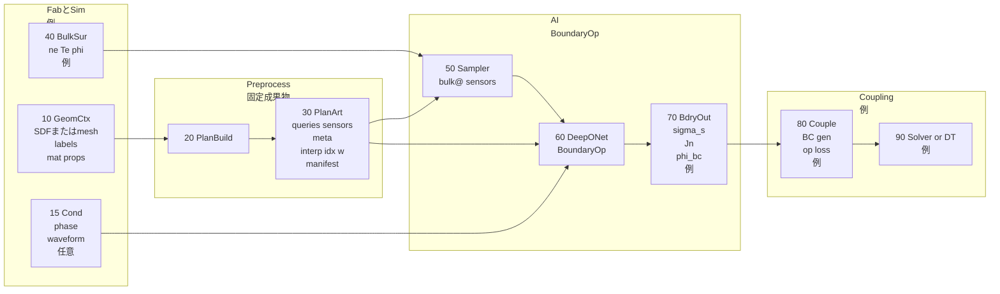
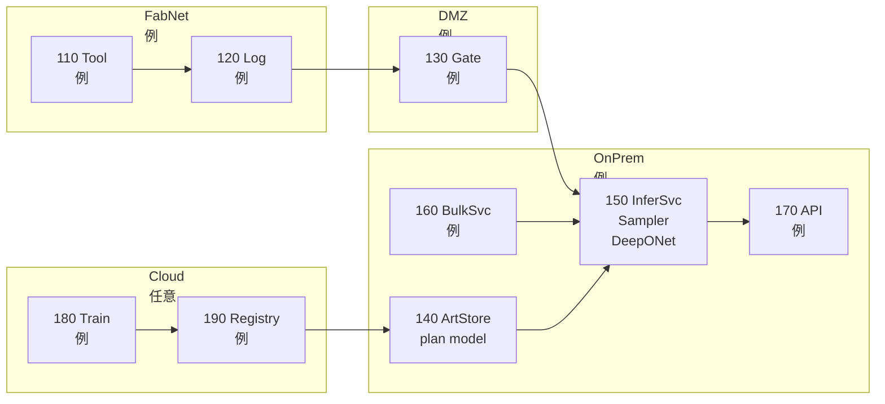
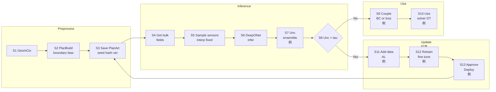
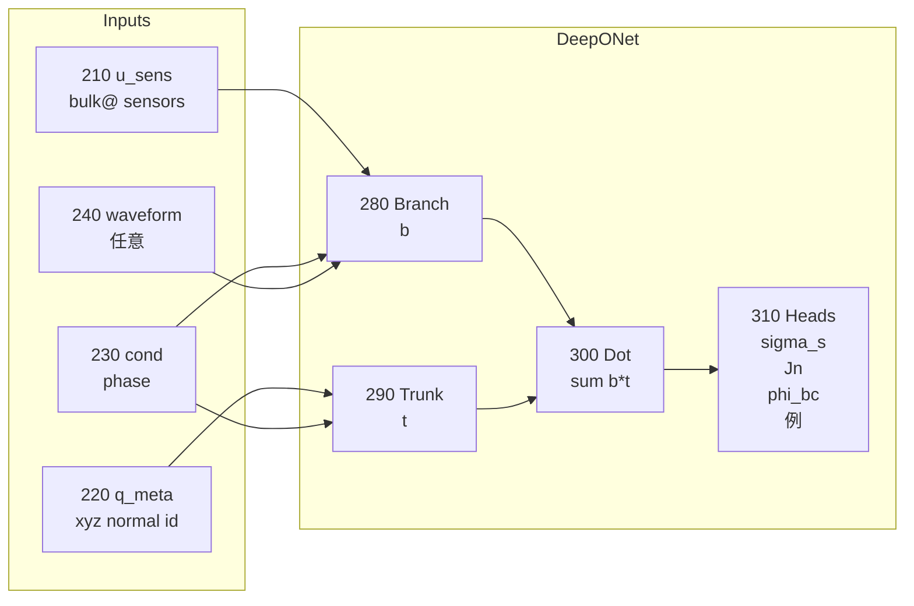
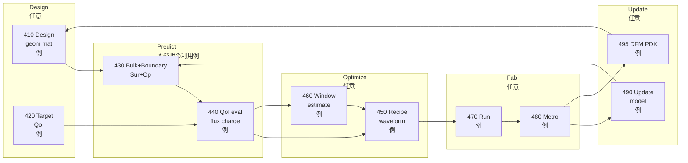

## 0. 管理情報（メタ）

* **資料種別**：特許開示書（発明開示書〜明細書素材）
  ※本資料は**法的助言ではありません**（弁理士の代替はしません）。ただし、特許文書化のための説明素材と請求項たたき台を提示します。
* **発明仮称**：
  **「境界演算子（表面電荷・壁面電流収支）を DeepONet で学習し、バルクサロゲートに接続する境界条件生成・更新」**
* **対象分野**：半導体製造の低圧 LTP（例：ICP/CCP）におけるプラズマ—境界相互作用のサロゲート／デジタルツイン
* **匿名化**：装置名・企業名・顧客名・型番等は原則匿名化（例：装置A、工業ソルバA）
* **根拠範囲**：以下はユーザ提示【技術文章】に基づく。
  技術文章に無い事項は **「推定」「仮定」「要確認」** を明示し断定しない。

---

## 1. 1ページ要約（発明の要旨／新規性の核3点／期待効果の定量）

### 1-1. 発明の要旨

低圧 LTP（例：ICP/CCP）では、**壁・電極・誘電体・ウェハ周辺部材など“境界”で決まる量**（表面電荷、壁面電流収支、浮遊条件など）が、シース・電場を介してバルク場（密度・温度・電位）やウェハ面 QoI（イオンフラックス分布、チャージング等）を支配しやすい。
しかし、バルクサロゲート単体（UNet/FNO/MLP等）では境界条件が暗黙化し、**形状・材料・波形/位相条件の変更で外挿が破綻**しやすい。

本発明は、Poissonそのものを主役にせず（※Poisson主役は別案前提）、**境界上方程式（表面電荷保存・壁面電流収支）に基づく“境界条件生成/更新”演算子を DeepONet（branch/trunk）で学習**し、バルクサロゲートに接続する。
さらに、geometry から **boundary-biased sensors/query を自動生成し、SamplingPlan を前処理成果物として固定・キャッシュ**することで、再現性と公平なベンチ比較を担保する。

### 1-2. 新規性の核（3点）

1. **境界演算子の主役化**：表面電荷・壁面電流収支など、体積方程式が必要とする境界側情報を生成/更新する演算子を DeepONetで学習対象化。
2. **SamplingPlan artifact による再現性・公平性**：boundary-biased sensors/query と補間定義（index/weight）を保存固定し、モデル比較の条件を統一。
3. **operator loss 接続で少データ強化**：事前学習した境界演算子を boundary operator loss としてバルクサロゲート学習に接続し、境界物理一貫性を付与。

### 1-3. 期待効果（定量の置き方：推定／要確認）

※技術文章に定量値は無いため、下記は**評価指標の設定**と**目標例（推定・要確認）**。

* **境界QoI精度**：(\sigma_s(x_\Gamma,\theta))、(J_n(x_\Gamma,\theta))、(\phi_{bc}(x_\Gamma,\theta)) の面積重み付き MAE/RMSE

  * 目標例（推定）：境界QoI誤差 **20〜50%低減**（要確認）
* **条件変更耐性**：未知 geometry / material / waveform 条件での誤差増分

  * 目標例（推定）：誤差増分を **従来比 1/2**（要確認）
* **データ効率**：所定精度達成に必要な高忠実度ケース数

  * 目標例（推定）：**1/3〜1/10**（operator loss＋転移を前提、要確認）
* **再現性**：ベンチ差分の分散

  * SamplingPlan固定により **比較分散を有意に低減**（定量は要確認）

---

## 1-A. ブラッシュアップ：4カテゴリ「5行まとめ欄」＋詳細説明欄

> 以下は、審査官・弁理士・製造技術者が一読で整理できるよう、4カテゴリごとに **5行箇条書き（5項目）**でまとめ、続けて要点の詳細説明を付けます。
> 処理フロー／システム構成の Mermaid 図は **9章（図1〜図5）**に掲載。

### 1-A-1. 従来技術内容（5行）

* 工業ソルバAでは Poisson＋輸送方程式に加え、誘電体表面の**表面電荷分布ODE**を解き境界電場を扱う
* 境界条件（(-\epsilon\nabla V\cdot n=\rho_s) 等）を明示し、境界近傍の電場・シースを再現する
* 一方 ML サロゲートはバルク場回帰（UNet/FNO/MLP等）が中心で、境界項が暗黙化しやすい
* PINN等で物理残差を入れても、境界項が曖昧だと拘束が弱い
* 演算子学習（DeepONet等）はあるが、**境界条件生成/更新を主役化**する設計が鍵

**詳細説明（要点）**：
従来の高忠実度計算は境界方程式を明示し、境界が支配する低圧LTPで有効。一方 ML サロゲート単体は境界条件を学習で吸収しがちで、条件変更に弱い。演算子学習は関数→関数写像に適し、境界上分布を出す本課題と構造的に整合する。

---

### 1-A-2. 従来技術における問題点（5行）

* 形状・材料・波形/位相条件が変わると、バルクサロゲートの**境界挙動が外挿で破綻**しやすい
* 重要QoI（ウェハ面フラックス均一性、境界電位、チャージング）が当たりにくい
* 境界項が曖昧なまま物理制約を入れても、残差の意味が薄い
* データが少なく条件変更が頻繁で、都度学習が現実的でない
* sensors/query の選択が性能を左右し、比較が**再現不良／不公平**になりやすい

**詳細説明（要点）**：
境界支配のプロセスでは、体積場の回帰だけでは境界条件の変化（誘電体表面電荷、浮遊条件、SEE影響等）を取り込めず、外挿で破綻しやすい。またサンプリング設計が変わると比較が成立しないため、評価の再現性が課題となる。

---

### 1-A-3. 問題点の解決手段（本技術システム）（5行）

* 表面電荷・壁面電流収支に基づく**境界条件生成/更新演算子**を DeepONet で学習する
* geometry から boundary-biased **queries（境界上）／sensors（境界近傍）**を自動生成する
* SamplingPlan（点集合＋メタ＋補間index/weight）を**成果物として固定・キャッシュ**する
* phase（sin/cos）や waveform を入力に注入し、周期定常の境界応答を学習する
* 事前学習境界演算子を **operator loss**としてバルク学習に接続し、少データ適応を強化する

**詳細説明（要点）**：
本発明の中核は「Poissonを解く」ではなく、Poisson/輸送が必要とする**境界側情報（(\sigma_s)、(J_n)、(\phi_{bc}) 等）を生成/更新する演算子**を学習対象として分離する点にある。DeepONetはセンサー点サンプル（branch）とクエリ点評価（trunk）の構造が、境界分布出力に適合する。SamplingPlanを固定成果物化することで、推論・学習・モデル比較を同一条件で実行できる。

* システム構成：**図1**参照
* 処理フロー：**図3**参照

---

### 1-A-4. 解決手段により得られる効果（本技術による価値）（5行）

* 境界QoI（(\sigma_s)、(J_n)、(\phi_{bc})）の推定精度・安定性が向上
* 条件変更（geometry/material/waveform/phase）に対する汎化が改善し、外挿破綻を抑制
* SamplingPlan固定により、モデル比較の再現性・公平性を担保できる
* operator loss 接続で少データでも境界一貫性を維持しやすい
* 不確かさ推定（アンサンブル等）で多値性/外挿領域を検知し、追加データ取得へつなげられる

**詳細説明（要点）**：
境界演算子を分離して学ぶことで、バルク側が境界多様性を丸暗記する負担を減らし、特に誘電体・浮遊壁・波形依存など境界支配条件での安定性が上がる。SamplingPlan固定は「入力点の違い」を排除し、評価と運用の信頼性を底上げする。

---

## 2. 技術分野・適用範囲（工程/装置/タスク/導入形態）

### 2-1. 技術分野

* 低圧 LTP（半導体製造の ICP/CCP 等）における、境界—バルク相互作用のサロゲート/演算子学習。

### 2-2. 適用装置・工程（要確認）

* 装置：ICP/CCP 等（技術文章に例示）
* 工程：エッチング/成膜/アッシング等（**推定・要確認**）

### 2-3. 対象タスク

* 境界上分布推定：(\sigma_s(x_\Gamma,\theta)) を中心に、(J_n)、(\phi_{bc}) 等へ拡張
* バルクサロゲート結合：BC生成、入力チャネル、operator loss

### 2-4. 導入形態（要確認）

* オフライン設計（高忠実度データで学習／設計探索）
* 準オンライン推論（**推定・要確認**）：デジタルツインとして高速評価

---

## 3. 従来技術（背景）と先行技術カテゴリ（※技術文章の言及＋一般的カテゴリ。最後に「先行との差分候補」）

### 3-1. 技術文章に基づく従来技術（背景）

* 工業ソルバAでは、体積の Poisson＋輸送方程式に加え、誘電体表面の**表面電荷分布ODE**や境界条件を明示して解き、境界近傍の電場変化を扱う。
* バルクサロゲート単体回帰では、誘電体やfloating境界条件が暗黙化し、条件変更で外挿が壊れやすい。

### 3-2. 先行技術カテゴリ（一般的分類）

1. 高忠実度 PDE ソルバ（Poisson＋輸送＋境界ODE）
2. バルク場 ML サロゲート（UNet/FNO/MLP 等）
3. 物理制約付き ML（PINN 等）
4. 演算子学習（DeepONet/FNO 等）
5. 境界条件推定（パラメタ化・境界表現学習 等）

### 3-3. 先行との差分候補

* 境界方程式（表面電荷・電流収支）を**独立の学習対象（境界演算子）**とし、バルクサロゲートへ結合
* geometry から boundary-biased sensors/query を生成し、**SamplingPlan artifact**として固定保存
* 事前学習境界演算子を **operator loss**として接続し、少データ条件で境界一貫性を強化

---

## 4. 従来の課題（発生条件、現行対策の限界、評価指標、制約）

### 4-1. 発生条件

* 誘電体が関与し表面電荷が蓄積する
* floating境界で電流収支（net current=0）が支配的
* RF位相依存・波形依存の周期定常応答が重要
* 形状・材質・波形条件の変更が頻繁

### 4-2. 現行対策の限界

* バルクサロゲート単体では境界条件が暗黙化し、外挿で破綻
* 物理残差を入れても境界項が曖昧だと拘束が弱い
* サンプリング設計が揺れると評価が再現しない

### 4-3. 評価指標（例）

* 面積重み付き境界誤差（SamplingPlanの area weight を使用）
* 境界タイプ別誤差（wafer/dielectric/electrode/wall など）
* 未知条件の hold-out（geometry / waveform / material）での誤差増分
* 周期性誤差（(\theta=0) と (2\pi) の整合）

### 4-4. 制約（技術文章）

* 法線符号の統一（normal_sign）
* 多値性（ヒステリシス/モード遷移）
* sensors/query の選択が性能を支配 → plan version 管理が重要

---

## 5. 提案手法（データ→前処理→学習→推論→不確かさ→製造アクション→監視/更新）

### 5-1. システム構成（文章）

* GeometryContext：SDF/メッシュ/マスク、境界ラベル、材質、法線定義
* SamplingPlanBuilder：boundary-biased queries/sensors 生成
* SamplingPlan artifact ストア：queries/sensors/meta/interp定義/manifestを固定保存
* Bulk Surrogate：バルク場（ne, Te, phi 等）を出力
* Sampler：artifactの補間定義でセンサー点特徴量を生成（再現性担保）
* DeepONetBoundaryOperator：境界量分布（(\sigma_s)等）を推定
* Coupling：BC生成／入力チャネル／operator loss として結合
* 不確かさ推定：アンサンブル等（技術文章で言及）で多値・外挿領域を検知しALへ

### 5-2. 入力データ仕様（種類/同期/欠損/特徴量/独自性候補）

#### 5-2-1. 入力データの種類

* geometry：SDF（Case A）／メッシュorマスク（Case B）
* 境界ラベル：wafer, dielectric, powered electrode, other wall 等
* cond：圧力、ガス比、パワー等（項目は**要確認**）
* 位相：(\theta) を (\sin\theta,\cos\theta) で入力
* 波形：(V(\theta)) を位相サンプル点でサンプルし branch 入力に連結（任意）
* バルク場：ne, Te, phi 等、および派生量（E、法線勾配など：**例**）

#### 5-2-2. 半導体製造特有のデータ取り扱いと効果（表）

| 製造特有の論点       | 本手法での取り扱い                           | 効果                      | 特許上の切り口候補               |
| ------------- | ----------------------------------- | ----------------------- | ----------------------- |
| RF位相同期        | (\sin\theta,\cos\theta) を入力に持つ      | 周期定常の学習が安定              | 位相条件注入を構成要件化            |
| 波形依存          | (V(\theta_m)) を branch 入力に連結        | 波形→境界応答の演算子性            | 波形サンプル設計を要件化            |
| 境界ラベルの重要性     | wafer/dielectric/electrode 等を meta化 | 境界タイプ別挙動を分離             | ラベルmap/versionを要件化      |
| サンプリングの公平性    | SamplingPlanをartifact固定             | 比較の再現性・公平性              | artifact固定・manifestを要件化 |
| 補間差によるブレ      | interp index/weight を保存             | 推論結果の安定化                | 補間定義の保存を要件化             |
| 面積重み          | queries_area_weight を保存             | 積分量やglobal current評価に有効 | 面積重みの保存を従属要件化           |
| 法線符号ブレ        | normal_sign を統一しplanに保存             | 符号ミス由来の学習崩れ回避           | 法線定義保存を要件化              |
| データ不足（一般に多い）  | pre-train＋転移＋operator loss          | 少データでも境界一貫性維持           | operator loss接続を要件化     |
| 装置状態ドリフト（推定）  | 不確かさで検知→更新（任意）                      | 劣化/季節/清掃影響に対処           | 監視/更新は**推定**（要確認）       |
| データ持ち出し制約（推定） | artifact/モデルをオンプレ運用（任意）             | ガバナンス適合                 | ネットワーク構成は**例**          |

※「ドリフト」「オンプレ運用」等は技術文章に明記がないため **推定・要確認**。

### 5-3. 教師データ/ラベル定義（生成/ノイズ/分割/リーク防止）

* 教師：高忠実度シミュレーション／既存ソルバ（工業ソルバA）
* ラベル：(\sigma_s(x_\Gamma,\theta))、可能なら (J_n(x_\Gamma,\theta))、(\phi_{surf}(x_\Gamma,\theta))
* 分割（推奨・要確認）：geometry / waveform / material の hold-out
* リーク防止：同一geometryでは同一SamplingPlanを使い比較を公平化

### 5-4. AIモデル仕様（モデル種別/構造/学習/推論/閾値/不確かさ）

* DeepONet（branch：センサーサンプル、trunk：クエリ点＋メタ）
* 条件注入：cond + phase、任意で waveform
* 出力：(\sigma_s(x_\Gamma,\theta)) を中心に multi-head 拡張（例：(J_n)、(\phi_{bc})、(V_{float})）

### 5-5. 製造アクション（APC/MES/FDC/保全/ホールド/再計測）

* 技術文章で明確なのは **ソルバ/サロゲートの境界条件生成・学習拘束**まで。
* APC/MES/FDC等の工場運用への接続は **推定・要確認**（本資料では従属・任意要素として整理）。

### 5-6. 実装制約（リアルタイム、計算資源、I/F、フェイルセーフ、監査）

* artifact固定（seed/hash/version/commit）で追跡可能
* Ms（センサー数）に比例してサンプル計算が増える → plan設計が性能支配
* フェイルセーフ（推定）：不確かさが高い場合は高忠実度計算へフォールバック等（要確認）

#### 5-6-2. 各手法のバリエーション例（テーブル）

| ID | geometry入力 | sensors/query設計 | 条件注入           | 出力                       | 結合            | 学習            | 適用/注意      |
| -- | ---------- | --------------- | -------------- | ------------------------ | ------------- | ------------- | ---------- |
| V1 | SDF        | 境界タイプ比率＋法線オフセット | phase          | (\sigma_s)               | BC生成          | data loss     | 最小構成       |
| V2 | SDF        | V1＋面積重み         | phase          | (\sigma_s,J_n,\phi_{bc}) | BC＋入力         | data loss     | multi-head |
| V3 | SDF        | V1              | phase＋waveform | (\sigma_s)               | BC生成          | data loss     | 波形設計に強い    |
| V4 | mesh/mask  | 曲率/エッジbias（例）   | phase          | (\sigma_s)               | BC生成          | data loss     | SDF無の代替    |
| V5 | SDF        | 複数plan version  | phase          | (\sigma_s)               | BC生成          | plan別ベンチ      | plan設計比較   |
| V6 | SDF        | V1              | phase          | (\sigma_s)               | BC生成          | data＋弱拘束      | 表面ODE残差（弱） |
| V7 | SDF        | V1              | phase          | (\sigma_s)               | operator loss | pretrain＋接続学習 | 少データ強化     |
| V8 | SDF        | V1              | phase          | (\sigma_s)               | BC/学習         | ensemble＋AL   | 多値/外挿検知    |
| V9 | SDF        | V1              | phase          | (\sigma_s)               | BC生成          | trunk微調整      | 転移運用（技術文章） |

※「曲率/エッジbias」「AL具体運用」などは技術文章に方向性があるが実装詳細は **要確認**。

---

## 6. 提案手法による効果（従来vs提案の表、測定条件、因果説明）

### 6-1. 従来 vs 提案（表）

| 観点      | 従来（バルク回帰中心） | 提案（境界演算子＋artifact）        |
| ------- | ----------- | ------------------------- |
| 境界条件の明示 | 暗黙化しやすい     | 境界条件生成/更新を直接推定            |
| 条件変更耐性  | 外挿破綻しやすい    | phase/waveform/材質/境界IDで分離 |
| 再現性     | サンプル点差でブレる  | plan固定で比較公平               |
| データ効率   | 多数ケースが必要    | pretrain＋operator loss＋転移 |
| 多値性     | 切り分け困難      | 不確かさで検知→追加データ             |

### 6-2. 測定条件（要確認）

* どの軸で外挿させたいか（geometry/waveform/material/cond）
* 面積重み付き誤差、境界タイプ別誤差、周期性誤差

### 6-3. 因果説明

境界支配条件では、境界量（(\sigma_s)、収支条件）がシースを介して QoI を左右。境界演算子として切り出し、境界近傍情報を sensors で与えることで、バルク回帰が境界多様性を丸暗記する必要が減り、汎化・安定性が上がる。

---

## 7. 新規性・進歩性（差分表、必須要素/任意要素の切り分け）

### 7-1. 差分表（必須/任意）

| 要素 | 内容                                           | 必須/任意    |
| -- | -------------------------------------------- | -------- |
| A  | 境界方程式に基づく境界条件生成/更新演算子を DeepONetで学習           | **必須**   |
| B  | geometryから boundary-biased sensors/query を生成 | **必須**   |
| C  | SamplingPlanをartifactとして固定保存（補間定義含む）         | **必須**   |
| D  | phase入力（sin/cos）                             | 任意（強い）   |
| E  | waveform injection                           | 任意（強い）   |
| F  | operator loss接続                              | 任意（強い）   |
| G  | 不確かさ分岐＋AL                                    | 任意（運用強化） |

### 7-2. 進歩性の方向性（技術的作用効果）

* 「境界条件生成/更新」を演算子として主役化し、DeepONetで学習する点
* SamplingPlan artifact 固定により再現性・公平性を**前処理成果物**で担保する点
* operator loss でバルク学習を拘束し少データ適応を成立させる点

---

## 8. 実施例（最低2つ：代表ケース＋変形例。条件・手順・結果が書ける範囲で）

### 8-1. 実施例1（代表）：誘電体表面電荷 (\sigma_s(x_\Gamma,\theta)) 推定

* 入力：SDF＋境界ラベル、bulk（ne,Te,phi）、cond、phase
* SamplingPlan：境界タイプ比率＋法線オフセット sensors、補間定義保存
* 学習：高忠実度教師 (\sigma_s(x_\Gamma,\theta)) で pre-train、周期性損失
* 出力：(\hat{\sigma}*s(x*\Gamma,\theta)) を BC生成/更新に利用
* 評価：面積重み付き誤差、誘電体境界での誤差、未知条件 hold-out（要確認）

### 8-2. 実施例2（変形）：floating壁＋SEEを含む multi-head

* 入力：floating境界ラベル、（任意でSEE係数をcondへ）
* 出力：(J_n(x_\Gamma,\theta))、(\phi_{bc}(x_\Gamma,\theta))、（例：(V_{float})）
* 多値対策：履歴要約特徴（前周期平均等）＋不確かさ（アンサンブル）で検知（技術文章）
* 追加：operator loss でバルク学習を拘束（任意）

---

## 9. 図面（Mermaid／左→右）と図面説明（符号表も）

> 技術文章にない構成要素は「例」「任意」を明示しています。

### 9-1. 図1：全体システム構成図

### 9-2. 図2：ネットワークアーキテクチャ（任意の例）

### 9-3. 図3：処理フロー（S1〜、不確かさ分岐、再学習まで）

### 9-4. 図4：AIモデル構造（DeepONet）

### 9-5. 図5：設計—製造の閉ループ（任意の例）

### 9-6. 図面キャプション案

* 図1：境界演算子学習システムの全体構成を示す。
* 図2：推論サービスおよび成果物ストアの配置例を示す（任意）。
* 図3：SamplingPlan固定と不確かさ分岐を含む処理フローを示す。
* 図4：DeepONet境界演算子のbranch/trunk構造を示す。
* 図5：設計—製造閉ループでの適用例を示す（任意）。

### 9-7. 符号の説明（表）

|      符号 | 名称                 | 役割                             |
| ------: | ------------------ | ------------------------------ |
|      10 | GeomCtx            | geometry/境界ラベル/材質/法線定義         |
|      15 | Cond               | cond/phase/waveform（任意含む）      |
|      20 | PlanBuild          | SamplingPlan生成                 |
|      30 | PlanArt            | plan成果物（点集合/補間/manifest）       |
|      40 | BulkSur            | バルク場出力（例）                      |
|      50 | Sampler            | sensorsでバルクを取得（補間固定）           |
|      60 | DeepONetBoundaryOp | 境界演算子推論                        |
|      70 | BdryOut            | (\sigma_s)、(J_n)、(\phi_{bc}) 等 |
|      80 | Couple             | BC生成／operator loss（例）          |
|      90 | Solver/DT          | 利用先（例）                         |
| 110-190 | ネットワーク要素           | 図2の任意構成                        |
| 210-310 | モデル要素              | 図4の入出力と合成                      |
| 410-495 | 閉ループ要素             | 図5の任意構成                        |

---

## 10. 本技術により創出される新たな価値（Value Creation：予測/設計/設計FB/事業KPI）

### 10-1. 従来困難だった意思決定（何が初めて可能になるか）

* 境界条件が動く条件（誘電体・floating・波形依存）で、境界応答を演算子として分離し、条件変更に追随しやすい形で使える
* SamplingPlan固定により、モデル比較の意思決定が「サンプリング差」に左右されにくい
* operator lossにより、データが少ない条件で境界一貫性を維持しやすい

### 10-2. プロセス予測（運用）価値（例：停止削減、診断） ※一部推定

#### 活用事例（業務）1：フィールドサポート／異常診断（推定・要確認）

| レイヤ    | 課題                            | 本手法の解決手段                             | 効果               |
| ------ | ----------------------------- | ------------------------------------ | ---------------- |
| L1（業務） | 条件変更や部材劣化で結果が揺れ、原因切り分けが遅い（推定） | 境界量（(\sigma_s), (J_n)）の推定をモニタ指標化（推定） | 原因候補の絞り込み迅速化（推定） |
| L2（運用） | データが少なく、再現性のある比較が難しい          | SamplingPlan固定＋補間固定で比較条件を統一          | 比較ブレ低減、再現性向上     |
| L3（技術） | 多値/外挿領域で誤推定の恐れ                | 不確かさ（アンサンブル等）で閾値分岐→追加データへ            | 誤運用リスク低減（推定）     |

※FDC連携や保全KPIは技術文章に明記が無いので **推定・要確認**。

### 10-3. プロセス設計（開発）価値（例：DOE削減、波形検討）

#### 活用事例（業務）2：アプリ開発／レシピ・波形検討（推定・要確認）

| レイヤ    | 課題                 | 本手法の解決手段                                        | 効果                |
| ------ | ------------------ | ----------------------------------------------- | ----------------- |
| L1（業務） | 波形/位相/条件の探索が重い（推定） | waveform injection＋phase-conditioned で境界応答を高速推定 | 探索の試行回数・時間を削減（推定） |
| L2（運用） | 条件変更時にモデルが外挿で崩れる   | 境界演算子として分離し、境界側の汎化を強化                           | 条件変更耐性向上          |
| L3（技術） | 少データで新条件へ追随しづらい    | pre-train＋operator loss＋転移（trunk微調整）            | 追加データ量を削減（推定）     |

### 10-4. 設計フィードバック価値（DFM/PDK更新、マスク反復削減） ※推定

#### 活用事例（業務）3：装置設計／境界部材設計（誘電体窓・リング等）（推定・要確認）

| レイヤ    | 課題                        | 本手法の解決手段                            | 効果             |
| ------ | ------------------------- | ----------------------------------- | -------------- |
| L1（業務） | 部材設計変更の影響評価に高忠実度計算が必要（推定） | geometry→SamplingPlan→境界演算子で境界応答を比較 | 設計比較の高速化（推定）   |
| L2（運用） | 評価条件が揃わず比較が難しい            | SamplingPlan artifact 固定で比較条件を統一    | 比較の公平性向上       |
| L3（技術） | 変更で境界条件が飛びやすい             | boundary-biased sampling＋meta入力で安定化 | 変更感度の説明性向上（推定） |

※設計FB（DFM/PDK）は技術文章に直接記載が無いので **推定・要確認**。

### 10-5. 価値指標テーブル（領域×KPI×根拠）

| 領域    | KPI例                | 期待方向 | 根拠                     |
| ----- | ------------------- | ---- | ---------------------- |
| 予測精度  | 境界(\sigma_s)の面積重み誤差 | 低下   | 境界量を直接学習（技術文章）         |
| 汎化    | 未知条件での誤差増分          | 低下   | 条件注入＋演算子学習（技術文章）       |
| データ効率 | 必要ケース数              | 低下   | operator loss＋転移（技術文章） |
| 再現性   | ベンチ差分分散             | 低下   | SamplingPlan固定（技術文章）   |
| 運用KPI | ダウンタイム等             | 低下   | **推定・要確認**             |

---

## 11. 請求項例（たたき台）

> 注意：以下は**権利化イメージを掴むための叩き台**です。最終表現・クレームの適否は弁理士判断が必要です。
> 技術文章にない要素は「任意」「推定」と明示し、従属で扱います。

### 11-1. 独立請求項（方法）

**【請求項1】**
プラズマ処理装置に関する情報処理方法であって、
(1) 対象装置の geometry を表すデータと境界ラベル情報とに基づき、境界タイプごとに配分された境界上のクエリ点集合と、前記クエリ点から法線方向に内側へ所定距離だけオフセットされたセンサー点集合とを含むサンプリング計画を生成し、前記サンプリング計画を、補間に用いるインデックスおよび重み、並びに境界メタ情報とともに前処理成果物として固定保存する工程と、
(2) バルク場データから、前記前処理成果物に含まれる補間定義に従って前記センサー点におけるバルク近傍特徴量を再現性をもってサンプルする工程と、
(3) 前記バルク近傍特徴量を branch ネットワークへ入力し、前記クエリ点および前記境界メタ情報を trunk ネットワークへ入力し、さらに運転条件および位相情報を入力して、前記 branch ネットワーク出力と前記 trunk ネットワーク出力の合成により、境界上に定義される境界量の分布を推定する DeepONet 型境界演算子を実行する工程と、
(4) 前記推定された境界量の分布に基づき、境界条件生成または境界条件更新に用いる出力を生成し、バルク場推定またはバルク方程式計算に結合する工程と、
(5) 複数回の推定結果に基づく不確かさを算出し、前記不確かさが閾値を超える場合に追加データ取得またはモデル更新の対象として当該条件を登録する工程と、
を含むことを特徴とする情報処理方法。

* 独立請求項で必須に入れた要素：

  * (i) 入力データの構成・同期・特徴量生成（SamplingPlan生成＋補間定義固定）
  * (ii) 不確かさに基づく分岐（登録→追加データ/更新）
    ※（iii）製造アクション（APC/MES等）や（iv）ドリフト監視は技術文章に明記が薄いため従属・任意扱い。

### 11-2. 従属請求項（代表例：6〜12本）

**【請求項2】** 請求項1において、前記クエリ点集合が、ウェハ境界、誘電体境界、電極境界、壁境界のうち2種類以上に対し異なる比率で配分される方法。
**【請求項3】** 請求項1において、前記センサー点集合が、各クエリ点に対して複数の距離オフセットを含む方法。
**【請求項4】** 請求項1において、前記前処理成果物が法線ベクトルおよびその符号定義を含み、学習と推論で同一定義が用いられる方法。
**【請求項5】** 請求項1において、前記位相情報が (\sin\theta) と (\cos\theta) として入力され、境界量分布が周期解として推定される方法。
**【請求項6】** 請求項1において、波形 (V(\theta)) が位相サンプル点でサンプルされ branch 入力に連結される方法。
**【請求項7】** 請求項1において、境界量が表面電荷密度分布に加えて壁面電流/フラックスまたは有効境界電位を含む方法。
**【請求項8】** 請求項1において、表面電荷の面上ODEに基づく差分残差を損失関数に含める方法。
**【請求項9】** 請求項1において、事前学習境界演算子出力とバルク由来境界量の一致を損失としてバルクサロゲート学習を拘束する方法（operator loss）。
**【請求項10】**（推定）請求項1において、推論結果に基づき装置運用のホールドまたは追加計測を指示する方法。※工場運用接続は要確認。
**【請求項11】** 請求項1において、前サイクルの境界量要約を入力に含め、多値性を低減する方法。
**【請求項12】** 請求項1において、サンプリング計画を plan version として複数管理しベンチ比較する方法。

### 11-3. 独立請求項（装置）

**【請求項13】**
請求項1に記載の方法を実行する情報処理装置。

### 11-4. 独立請求項（システム）

**【請求項14】**
前処理成果物ストアと推論装置とを含み、前処理成果物に基づいて DeepONet 型境界演算子を実行する情報処理システム。

### 11-5. 独立請求項（プログラム/記録媒体）

**【請求項15】** 請求項1の方法を実行させるプログラム。
**【請求項16】** 請求項15のプログラムを記録した非一時的記録媒体。

### 11-6. クレーム設計メモ（広い/狭い、回避ポイント）

* **広い核**：SamplingPlan artifact 固定＋DeepONet境界演算子＋BC生成/更新結合
* **狭く強い従属**：位相/波形注入、補間定義保存、面積重み、operator loss、unc閾値分岐
* **回避設計**：plan固定をしない／別の演算子学習に置換／境界biasを無効化
  → そのため「artifact固定」「補間定義保存」「境界タイプ配分」は厚く入れる価値が高い

---

## 12. 追加情報（実務で重要：データ量、汎化、更新、監査、セキュリティ/ガバナンス）

* **データ量設計（要確認）**：必要ケース数、位相サンプル数、geometry数、波形バリエーション数
* **汎化軸の宣言（要確認）**：何に対して外挿させたいか（geometry/material/waveform/cond）
* **更新運用（要確認）**：plan version とモデル version の独立管理、承認フロー（図3のUpdate部は任意）
* **監査性**：manifest（hash/seed/config/commit）による追跡（技術文章の方向性）
* **セキュリティ（推定）**：オンプレ運用、アクセス制御、改ざん検知（要確認）

---

## 付録A. 用語集（略語/専門語）

* LTP：低温プラズマ
* ICP/CCP：誘導結合/容量結合プラズマ
* (\sigma_s)：表面電荷密度
* distributed ODE：境界面上で定義されるODE
* floating：正味電流=0条件が効く壁
* SEE：二次電子放出
* DeepONet：branch/trunk による演算子学習
* sensors/query：入力関数サンプル点／出力評価点
* SamplingPlan artifact：点集合＋補間定義＋メタ＋manifest の固定成果物
* operator loss：事前学習演算子で別モデル学習を拘束する損失

---

## 付録B. 追加で必要な情報（優先度：高/中/低。最大10項目）

### 優先度：高

1. **対象装置**：ICP / CCP / 両方（選択）
2. **geometry表現**：SDFあり / メッシュ / マスク / 混在（選択）
3. **境界タイプ**：wafer / dielectric / powered electrode / floating wall / other（該当選択）
4. **主ラベル**：(\sigma_s)のみ / (\sigma_s+J_n) / (\sigma_s+\phi_{bc}) / 全部（選択）
5. **位相・波形**：phase入力必須？（Yes/No）／waveform注入する？（Yes/No）

### 優先度：中

6. **結合方式**：BC生成 / 入力チャネル / operator loss / 複合（選択）
7. **不確かさ運用**：閾値分岐を入れる？（Yes/No）／AL（追加データ）運用する？（Yes/No）
8. **転移運用**：trunk微調整などを想定する？（Yes/No）

### 優先度：低

9. **工場運用接続**：APC/MES/FDC/保全に接続する予定（Yes/No）※推定項の確定
10. **評価KPIの具体**：境界QoI誤差の目標値・許容範囲（数値、要確認）

---
