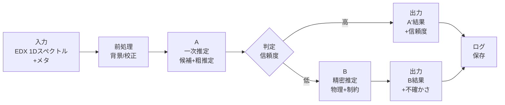
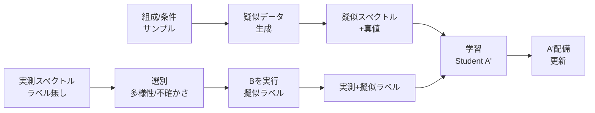
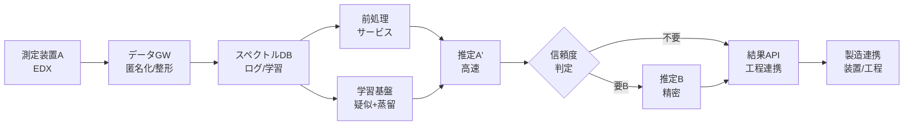
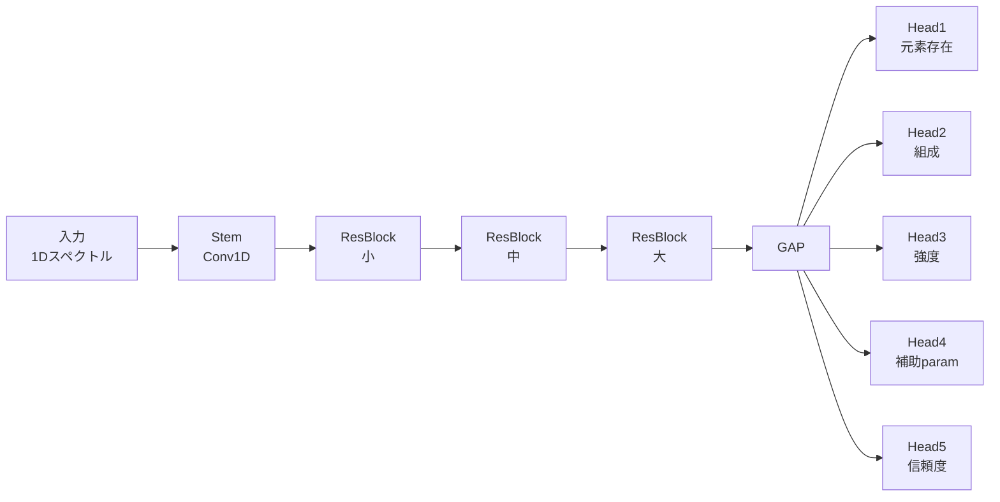

# 特許資料（発明開示書〜明細書素材）

> **免責（最重要）**：本資料は、弁理士による法的助言・権利化判断の代替ではありません。ここでは、第三者（審査官・弁理士・製造技術者）が**新規性/進歩性/有用性を技術的に把握しやすい**ように、発明の説明素材と請求項たたき台を提供します。
> **断定の制約**：入力された技術内容に明示されていない事項は、本文中で **「推定」「仮定」「要確認」** と明記し、断定しません。
> **匿名化**：会社名/顧客名/装置型番/機密値は「装置A」「工程X」「顧客Y」等に匿名化します。

---

## 1. 発明の名称（案）

**EDXスペクトルに基づく成分組成推定のためのハイブリッド推定・疑似データ生成・蒸留学習システム、方法及びプログラム**

---

## 2. 技術分野

本発明は、半導体製造におけるパーティクル/コンタミ評価等で取得される **EDX（エネルギー分散型X線分光）1次元スペクトル**（エネルギーごとの強度データ）から、元素候補・ピーク強度・成分組成を推定するデータ処理・機械学習・物理モデル推定に関する。

---

## 3. 背景技術（従来一般の概要）

半導体製造では、工程内・装置内のコンタミやパーティクルが製品歩留まりに影響するため、EDXにより元素種や組成を推定する。しかし、EDXスペクトルは、背景（Bremsstrahlung）、ノイズ、ピークシフト、複数線（Kα/Kβ/L…）、近接ピーク重なり等により、従来のピークフィッティング（非線形最適化）では計算負荷が高く、また定量の不確かさが課題となる。

---

## 4. 従来技術内容（5行箇条書き）

* 各元素のピークエネルギー辞書を用い、ピーク関数（例：ガウス）と背景関数でスペクトルを近似する。
* ピーク位置・幅・高さ・背景係数を最適化（反復）してフィットし、強度を得る。
* 得られたピーク強度を元に元素存在や相対組成を推定する。
* 近接ピークは複数ピークの同時最適化で分離を試みる。
* 装置条件差・放射係数/感度係数の未知は、経験則や手動調整・校正に依存することが多い。

### 従来技術内容（詳細説明）

従来、EDXスペクトル解析は、(i) 元素線の既知エネルギーの辞書化、(ii) これらのピーク形状（ガウス等）と背景関数を足し合わせた前向きモデル、(iii) 非線形最適化でパラメータ推定、(iv) 強度→組成の換算（必要に応じ校正）という枠組みが一般的である。
しかし、半導体製造現場のように大量スペクトルを高速処理したい場合、反復最適化の計算負荷が顕在化しやすい。

---

## 5. 従来技術における問題点（5行箇条書き）

* スペクトル強度や重なりの条件により最適化が収束しづらく、計算回数・時間が増大する。
* 同一成分で複数線が存在し線比が未知/変動すると、成分量推定が不安定になる。
* 近接ピーク重なりで、誤分離（別元素へ誤割当）が起きやすい。
* ピークシフト、分解能変動、ノイズにより、ピーク辞書照合が不安定になる。
* 実測の教師データ（真の組成ラベル）が収集困難で、学習型モデルの構築が難しい。

### 問題点（詳細説明）

* **計算負荷**：非線形フィットは初期値依存や局所解問題を生み、複数ピーク・多元素になるほど探索空間が拡大する。
* **定量不確かさ**：放射係数・検出器効率・吸収等の影響が残ると、強度→組成変換が不安定になる。
* **現場制約**：半導体製造のパーティクル解析ではスペクトル本数が多く、ライン停止/対策判断の時間制約が強い一方で、真値組成付きデータの準備は難しい（標準試料や厳密定量が必要）。

---

## 6. 問題点の解決手段（本技術システム）（5行箇条書き）

* **A→Bの二段推定**：高速一次推定（A）で候補元素・粗強度・信頼度を算出し、必要時のみ精密推定（B）を実行する。
* **疑似データ生成**：物理モデル/シミュレーションに基づく疑似スペクトルを大量生成し、教師不足を補う。
* **蒸留学習**：精密推定（B）の出力を擬似ラベルとして蓄積し、高速推定器（A’）へ知識蒸留する。
* **不確かさ/信頼度制御**：残差・確率分布・OOD指標等に基づき、B呼び出しや製造アクションを制御する。
* **製造アクション接続**：推定結果と信頼度を、装置保全・レシピ調整・ロット判定等の工程アクションへ接続する（推定/要確認）。

### 解決手段（詳細説明：発明の芯）

本発明の芯は、単なる「AI推定」ではなく、**(1) 入力データを“推定に適した形”に作る仕組み（疑似データ・前処理・辞書/基底設計）、(2) 速さと信頼性を両立する二段推定（A→B）、(3) 教師データ不足を運用ログで埋める蒸留学習、(4) 不確かさを用いて製造判断に安全に接続する制御**にある。

---

## 7. 解決手段により得られる効果（価値）（5行箇条書き）

* 大量スペクトルを高速処理しつつ、難例のみ精密推定に回すことで**スループットを向上**できる。
* 近接ピーク・複数線・ノイズ条件での誤判定を抑え、**推定の安定性/再現性**を向上できる。
* 教師データが不足しても、疑似データと擬似ラベルにより**学習・改善サイクルを構築**できる。
* 信頼度を出力し、B呼び出しや保全判断を制御することで、**誤判定に起因する過剰対応/見逃しのリスクを低減**できる（推定）。
* 組成推定結果を工程アクション・設計フィードバックに接続し、**歩留まり改善や原因解析の時間短縮**に寄与し得る（推定/要確認）。

---

## 8. 発明の概要

### 8.1 想定入力・出力

* **入力**：EDX 1Dスペクトル（エネルギー×強度）、取得条件メタデータ（加速電圧等：要確認）、運用コンテキスト（工程/装置/ロット等：要確認）
* **出力**：

  * 元素候補（存在確率/スコア）
  * 線/ピーク強度（元素ファミリ単位を含む）
  * 成分組成（相対組成、または at%/wt%：どちらが必要か要確認）
  * 不確かさ/信頼度（分散、区間、残差指標、OOD指標等）
  * （任意）製造アクション提案（推定/要確認）

### 8.2 用語（本資料内の便宜定義）

* **A**：超高速一次推定器（候補元素・粗強度・信頼度）
* **B**：物理/制約付き精密推定器（教師、擬似ラベル生成源）
* **A’**：蒸留により生成・更新される高速推定器（運用の主役）
* **疑似データ**：物理モデル/シミュレーションで生成したスペクトル（真値組成等付き）
* **擬似ラベル**：Bの出力（組成・強度・信頼度等）を教師として用いるラベル

---

## 9. 実施形態：処理ワークフロー（Mermaid）

### 9.1 運用時（A→Bゲーティング）

### 9.2 学習・更新（疑似データ＋蒸留）

---

## 10. 実施形態：システム構成（Mermaid）

> 製造連携（M）は、工程停止/清掃/条件変更等の具体は現場依存のため **要確認**。本資料では「推定結果の受け渡しとトリガ制御」を発明の対象例とする。

---

## 11. 実施形態：アルゴリズム詳細（A→B＋疑似＋蒸留）

### 11.1 前処理（背景・校正・正規化）

* **背景補正**：Bremsstrahlung背景を安定化して、候補検出の誤作動を抑える。

  * 例：SNIP/AsLS等（採用方式は要確認）
* **エネルギー校正**：既知線の観測位置からオフセット/ゲインを補正（推定）。
* **分解能推定**：装置分解能（FWHM）の変動を推定し、辞書/基底に反映（推定）。
* **入力変換**：`log1p(counts)` 等でダイナミックレンジを圧縮（推定）。

> 前処理は「精度」だけでなく **信頼度指標（残差/OOD）**の安定化に寄与する点が重要。

---

### 11.2 A：超高速一次推定（候補元素・粗強度・信頼度）

Aは「最終定量」より **候補集合縮小とB呼び出し制御**を目的とする。

#### Aの中核（例）

* **辞書マッチ**：元素線エネルギー辞書に基づき、所定窓の強度や相関でスコア化（推定）。
* **非負スパース回帰（推定）**：

  * スペクトル `y` を、基底行列 `G`（候補線＋背景基底）と係数 `w` の線形結合 `y≈G w` として推定。
  * `w≥0` とし、必要に応じてスパース化（L1/グループ正則化）で候補を絞る。
* **信頼度**：

  * 残差（フィット誤差）
  * 候補元素確率のエントロピー
  * 近接ピーク領域の説明率
  * OOD指標（AE再構成誤差等：推定）
    から総合スコアを算出。

---

### 11.3 ゲーティング（A→B判定）

* **目的**：Bを全件に回さず、**難例のみ**に計算を集中。
* **判定ロジック（例：推定）**

  * `conf < th_conf` または `residual > th_res` ならBへ
  * 特定重要元素（例：金属汚染）候補が出た場合はBへ（要確認）
  * OODが高い場合はBへ、または「未知フラグ」出力へ（推定）

---

### 11.4 B：精密推定（Teacher）

Bは「遅いが高信頼」の推定器として構成し、蒸留・擬似ラベル生成源となる。

#### Bの構成要素（例）

* **物理モデル**：線群（Kα/Kβ/L…）の整合、検出器応答、背景を含む前向きモデル（推定）。
* **最適化**：Poisson尤度/KL等、カウント統計に適合した目的関数を用いる（推定）。
* **補正**：必要に応じ行列補正（XPP/CitZAF等）や感度係数を考慮（推定/要確認）。
* **出力**：組成・強度・不確かさ・残差・品質フラグ。

> Bの具体実装は、商用/公的/OSSいずれでもよい（例：DTSA系、EDSモデル系、独自実装等）。発明の本質は「Bを教師として運用ログからA’を育てる構成」と「A→Bの制御」にある。

---

### 11.5 疑似データ生成（物理モデル/シミュレーション）

教師不足を補うため、疑似データ生成を併用する。

#### 2層構成（推奨：推定）

* **高速大量生成（Fast Physics）**

  * 線辞書＋背景モデル＋検出器応答＋Poissonノイズ
  * 装置条件・シフト・分解能・背景形状等を**分布でランダム化**
* **高忠実少量（MC/詳細モデル）**

  * 形状/基板混入/吸収影響等をより現実寄りに反映（推定）

#### ドメインランダム化（重要：推定）

* `ΔE`（エネルギーずれ）
* FWHM（分解能）
* 背景係数
* 総カウント（取得時間/電流相当）
* 基板混合比（粒子＋基板）
* 逃避/サム等のアーティファクト（簡易注入でも可）

---

### 11.6 蒸留（Bを教師にA’を更新）

運用ログから教師データを増やし、A’を継続改善する。

#### 学習データ

* **疑似データ**：真値（組成/強度/条件）付き
* **実測＋擬似ラベル**：Bが出力した組成/強度/信頼度をラベル化
* （任意）実測ラベル無し：自己教師あり/一貫性学習に利用（推定）

#### 学習目標（マルチタスクが安定：推定）

* 元素存在（multi-label）
* 組成（simplex制約）
* 線/元素ファミリ強度
* 補助パラメータ（ΔE、FWHM、背景スケール）
* 品質/信頼度（残差予測）

#### 擬似ラベル品質の扱い（重要）

* Bの残差/品質フラグで**重み付け**し、低品質ラベルの悪影響を抑える（推定）。
* Teacherを複数用意し合議する構成も可能（推定）。

---

## 12. Student（A’）ネットワークアーキテクチャ（例：推定）

### 12.1 推奨：1D ResNet + マルチヘッド

* 1D CNNはピーク形状に強く、推論が速い
* マルチヘッドで「組成だけ」より安定（補助タスクで正則化）

#### 出力制約（例：推定）

* 組成：Softmaxで総和1を保証
* 強度：ReLU/Softplusで非負を保証
* 信頼度：温度付き確率/分散推定/アンサンブル等（推定）

---

## 13. 各手法のバリエーション例（テーブル）

| 区分  | バリエーション                      | 目的/使い所     | メリット        | デメリット/注意    |
| --- | ---------------------------- | ---------- | ----------- | ----------- |
| A   | 辞書窓積分（超軽量）                   | まず候補を出す    | 最速          | 重なりに弱い      |
| A   | 非負回帰（NNLS）                   | 候補＋粗強度     | 速い/安定       | 辞書G品質に依存    |
| A   | スパース/グループ回帰（推定）              | 近接ピーク誤割当抑制 | 候補絞り強い      | 実装/調整要      |
| A   | 検索型（疑似DB近傍検索）（推定）            | 初期値/候補極小化  | Bの計算激減      | sim2real鍵   |
| B   | 物理モデル＋最適化（推定）                | 高信頼組成      | 解釈性/精度      | 計算コスト       |
| B   | 行列補正（XPP/ZAF等）（推定）           | 定量の現実性     | 工程説明に強い     | 条件/標準が要     |
| 疑似  | Fast Physics（線+背景+応答）        | 大量学習       | 作成が容易       | 現実ギャップ      |
| 疑似  | MC/高忠実（推定）                   | ギャップ補正     | SEM条件に寄せやすい | 計算重い        |
| 蒸留  | 単一Teacher                    | 最短構築       | 実装容易        | Teacher誤差継承 |
| 蒸留  | 複数Teacher合議（推定）              | 安全性/頑健性    | 系統誤差に強い     | 工数増         |
| 信頼度 | 残差+エントロピー                    | B呼び出し制御    | 実装容易        | 閾値調整要       |
| 信頼度 | 分布推定（Dirichlet/Ensemble）（推定） | 不確かさ重視     | 安全運用        | 計算/実装増      |

---

## 14. 半導体製造特有のデータ取り扱いと効果（テーブル）

> 以下は半導体製造の一般的事情に基づく整理であり、貴社運用への適用は **要確認**。

| 製造特有データ/制約（要確認）                | 取り扱い（本発明での設計）            | 効果（価値）         |
| ------------------------------ | ------------------------ | -------------- |
| ロット/ウェハ/工程/装置/chamber/レシピの多軸管理 | 推定結果にメタを付与しDBへ保存、ドリフト監視  | 原因解析の探索空間を縮小   |
| 条件ドリフト（検出器/校正/汚れ）              | 信頼度/OODで検知、B呼び出し増やし蒸留で追従 | 誤判定と見逃しの低減（推定） |
| データ秘匿・共有制限                     | 匿名化・集計特徴量化・擬似データ中心学習     | 機密を守りつつ学習可能    |
| 現場の時間制約                        | A’で全件処理、Bは一部のみ           | スループット向上       |
| “見逃しコスト”が高い特定汚染                | 重要元素ルールでBへ強制ルーティング（要確認）  | リスク最小化（推定）     |
| 装置メーカー/工場間の差                   | ドメインランダム化＋蒸留で適応          | 横展開性向上（推定）     |

---

## 15. 活用事例（半導体製造装置業界の業務：3例×3レイヤ説明）

> 「3レイヤ」は、(L1)現場運用、(L2)工程/装置技術、(L3)設計/組織改善 の観点で整理します（推定）。

### 事例1：コンタミ種類の高速スクリーニング（ライン判断）

* **課題（L1）**：大量パーティクルのEDXを短時間で判定し、対策要否を判断したい。

* **解決手段（L1）**：A’で全件を高速推定し、信頼度低/重要元素疑いのみBで精密化。

* **効果（L1）**：判定時間短縮、B実行回数削減（推定）。

* **課題（L2）**：近接ピーク・ノイズで誤判定しやすい。

* **解決手段（L2）**：疑似データで重なり/シフト/背景条件を網羅、蒸留で頑健化。

* **効果（L2）**：誤判定・再解析回数低減（推定）。

* **課題（L3）**：装置/工程の再発防止につなげたい。

* **解決手段（L3）**：推定結果をメタ付きで蓄積し、工程/装置別に傾向分析（要確認）。

* **効果（L3）**：恒久対策・設計改善の入力データになる（推定）。

---

### 事例2：装置状態監視（ドリフト検知・保全）

* **課題（L1）**：装置状態変化で推定が不安定になり、現場の判断がぶれる。

* **解決手段（L1）**：信頼度/OOD指標で異常を自動フラグ、B実行率を自動調整。

* **効果（L1）**：オペレータ依存を低減（推定）。

* **課題（L2）**：検出器校正ズレ・汚れ・チャンバー状態変化を捉えたい。

* **解決手段（L2）**：A’が補助パラメータ（ΔE/FWHM等：推定）を出力し、監視に使う。

* **効果（L2）**：予防保全のトリガが増える（推定）。

* **課題（L3）**：保全施策の効果検証が難しい。

* **解決手段（L3）**：保全前後の分布比較（組成・残差・信頼度）を自動レポート（要確認）。

* **効果（L3）**：保全の費用対効果が見える化（推定）。

---

### 事例3：材料/工程変更時の立上げ支援（設計フィードバック）

* **課題（L1）**：新材料/新レシピで未知のピークや混合が増え、解析が難しい。

* **解決手段（L1）**：OODで未知フラグ、Bで精密解析、結果を蒸留に反映。

* **効果（L1）**：立上げ期間の解析負荷を低減（推定）。

* **課題（L2）**：未知候補の探索が属人化。

* **解決手段（L2）**：Bの残差ピークから候補辞書を更新し、疑似データ生成条件に追加（推定）。

* **効果（L2）**：辞書整備の半自動化（推定）。

* **課題（L3）**：設計部門へフィードバックする情報が散在。

* **解決手段（L3）**：推定結果・信頼度・装置条件を統合し、変更点と相関分析（要確認）。

* **効果（L3）**：材料選定・装置設計の学習データになる（推定）。

---

## 16. 先行技術との差分（新規性/進歩性検討の観点：技術的整理）

> ここは「法的結論」ではなく、審査官/弁理士向けに**差分の観点**を整理します。

* 従来のピークフィット/定量は、**一つの推定器（最適化）を全件に適用**しがちで、スループットと安定性が両立しにくい。
* 本発明は、**A→Bのゲーティング**で計算資源を配分し、**信頼度を中核に運用制御**する点が特徴となり得る。
* 教師データ不足に対し、**疑似データ＋運用ログ（Bの擬似ラベル）＋蒸留**で継続学習する「学習データ生成機構」をシステム要件として組み込む点が差分となり得る。
* 出力を組成だけでなく、**不確かさ/残差/品質指標**とセットで提供し、製造アクション（保全・停止・再測定）へ接続する点が差分となり得る（要確認）。
* 半導体製造特有のメタデータ（工程/装置/ロット等）と結合し、**ドリフト監視とモデル更新**を同一枠組みに統合する点が差分となり得る（要確認）。

---

## 17. 請求項例（たたき台）

> **注意**：請求項は権利化方針（回避設計、実施形態、先行技術）に依存します。ここでは技術要点を漏れなく含むための叩き台を提示します。

### 17.1 独立請求項（方法）

**【請求項1】**
エネルギー分散型X線分光により取得された1次元スペクトルデータに基づいて成分組成を推定する方法であって、
（a）前記スペクトルデータに対して背景成分の低減及び/又はエネルギー軸補正を含む前処理を行う工程と、
（b）前処理後のスペクトルデータを入力として、候補元素及び粗い成分組成又は強度を推定するとともに信頼度指標を算出する一次推定工程と、
（c）前記信頼度指標が所定条件を満たさない場合に、物理モデル又は制約条件を用いた精密推定により前記成分組成を推定する精密推定工程と、
（d）一次推定結果又は精密推定結果として、成分組成及び信頼度指標を出力する工程と、
（e）前記精密推定工程の出力を教師信号として、一次推定に用いる推定器を更新する学習工程
を含むことを特徴とする成分組成推定方法。

### 17.2 独立請求項（システム）

**【請求項2】**
請求項1に記載の方法を実行するためのシステムであって、
スペクトルデータを取得する測定装置と、
前処理部、一次推定部、信頼度判定部、精密推定部、学習部、及び結果出力部を備え、
前記信頼度判定部は一次推定部の信頼度指標に基づいて精密推定部の実行を制御することを特徴とするシステム。

### 17.3 独立請求項（プログラム/記録媒体）

**【請求項3】**
コンピュータに請求項1に記載の方法を実行させるためのプログラム、又は当該プログラムを記録した非一時的記録媒体。

---

### 17.4 従属請求項（例）

**【請求項4】**
請求項1において、前記一次推定工程は、元素線辞書に基づく基底行列と非負制約を用いた回帰により候補元素及び粗い強度を推定することを特徴とする方法。

**【請求項5】**
請求項1において、前記信頼度指標は、残差、候補元素確率のエントロピー、又は分布外指標の少なくともいずれかを含むことを特徴とする方法。

**【請求項6】**
請求項1において、前記疑似データは、物理モデルに基づき、エネルギー軸ずれ、分解能、背景形状、及び総カウントの少なくともいずれかをランダム化して生成されることを特徴とする方法。

**【請求項7】**
請求項1において、前記学習工程は、疑似データと、実測スペクトルに対する精密推定工程の出力とを用いて、一次推定に用いる推定器を蒸留学習により更新することを特徴とする方法。

**【請求項8】**
請求項1において、前記一次推定工程の推定器は、1次元畳み込みニューラルネットワークを含み、元素存在、組成、強度、及び信頼度の少なくとも2つを同時に推定することを特徴とする方法。

**【請求項9】**
請求項1において、前記出力は、成分組成に加えて、製造装置又は工程管理システムに対する再測定要求又は保全要求を含むことを特徴とする方法（要確認）。

---

## 18. 追加で必要な情報（優先度付き・最大10件）

不足があっても本資料は作成しましたが、権利化・実装整合・効果主張のために、以下の確認が有効です（Yes/Noや選択式中心）。

1. **測定前提**：対象は主に **SEM-EDX** ですか？（Yes/No）※TEM/薄片前提かでB/疑似生成が変わる
2. **出力目標**：最終出力は **相対組成**でよいですか？それとも **at%/wt%（定量）**が必須ですか？（選択）
3. **対象元素範囲**：候補元素は固定の上限集合（例：20〜40元素）ですか？（Yes/No/要確認）
4. **基板寄与**：スペクトルに基板（Si等）が混入するケースは多いですか？（多い/少ない/不明）
5. **データ量**：運用で得られる1Dスペクトルは月あたり概ね何本ですか？（<1万 / 1万-10万 / >10万 / 不明）
6. **許容レイテンシ**：1スペクトルあたりの許容処理時間は？（<10ms / <100ms / <1s / <10s / 不明）
7. **B（教師）の候補**：現場で既に使っている精密解析手法はありますか？（既存ソフト有/自作/無し）
8. **重要コンタミ**：見逃しコストが高い元素/材料カテゴリはありますか？（Yes/No、Yesなら分類のみ）
9. **製造連携**：推定結果をどのアクションに接続しますか？（再測定/装置清掃/ロットホールド/レシピ変更/レポートのみ 等、複数選択）
10. **学習運用**：モデル更新はオンライン（随時）ですか、オフライン（週次/月次）ですか？（選択）

---

必要なら、上記の回答（特に1,2,6,9）を仮定して、**請求項の依存関係の最適化**、**効果（スループット/誤判定低減）の定量指標案**、**実施例（疑似データ分布レンジ、ゲーティング閾値の設計例）**まで、発明開示書として一段具体化した追補版も作れます。
