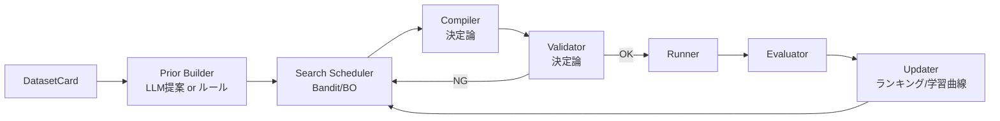

# 汎用LLM Agentによる「マルチ手法MLパイプライン探索」技術レポート

（同一データセットに対して：データクレンジング × 前処理 × 特徴量化 × 学習手法 × 評価手法 を体系的に回し、再現可能に比較する）

---

## 0. ここで扱うテーマ（要約）

同一データセットに対して、以下を **“組合せ爆発”**させながら最適解（または運用可能な上位解）に到達するための **汎用LLM Agent技術**をまとめます。

* 複数の **データクレンジング**（欠損・外れ値・重複・ラベルノイズ・リーク対策…）
* 複数の **前処理**（スケーリング・エンコード・正規化・変換…）
* 複数の **特徴量化**（統計特徴・時系列ラグ・画像特徴・埋め込み…）
* 複数の **学習手法**（線形/木/深層/確率モデル…）
* 複数の **評価手法**（CV、時系列分割、群分割、校正、頑健性、コスト指標…）

**核心の設計思想**は次の2点です。

1. LLMは「提案（Plan）」に限定し、**実行可能性・整合性・再現性は決定論（コンパイラ/バリデータ）で保証**する
2. 変化の激しいLLM/Agentフレームワークは交換可能にし、**長く使える“ワークフローと契約（スキーマ/カタログ）”を固定**する

そのために、LLMには run.yaml のような詳細設定を直接書かせず、**構造化出力（JSON Schema準拠）**で `recipe_id` 等を返させる設計を推奨します。OpenAIは Structured Outputs を「JSON modeの進化」として位置づけ、スキーマ準拠を保証する用途を明示しています。 ([OpenAI Developer][1])

---

## 1. 背景：なぜこの問題が難しいのか

### 1.1 現場の実態：MLは「モデル選び」より「手順の組合せ探索」

実務のMLでは、モデルそのものよりも、以下のほうが支配的です。

* データ品質のばらつき（欠損、外れ値、重複、スキーマ逸脱、リーク）
* データの型（表、時系列、画像、テキスト、グラフ）による前処理の分岐
* 評価設計（CVの仕方、時系列の未来リーク、group leakage）
* 目的関数の多面性（精度だけでなく、コスト、説明可能性、運用制約）

結果として、人間が「試す順序」「切り捨て」「深掘り」の意思決定に多くの時間を使います。

### 1.2 LLMが入ると何が変わるか

LLMは “知識・推論” を使って

* 目的の言語化（例：精度より運用頑健性が重要、など）
* 候補の絞り込み（このデータならこの変換は危険、など）
* 実験結果の要約と次の一手の提案

ができます。

ただし、LLMは **厳密な列挙値・キー整合・実行可能性の保証**が苦手なので、ここをLLMに任せると運用が壊れます（存在しない手法名、比較不能な条件混在など）。

そのため、**LLMは提案、決定論コアが確定**という分離が、長期運用で最も堅牢です。

---

## 2. 目的：汎用LLM Agent基盤の狙いと重要度

### 2.1 目的（Goal）

* **意思決定コストの削減**
  人が “何を試すか” を決める負担を減らし、探索を体系化する
* **再現性・比較可能性の担保**
  条件が揃っていない比較（誤った結論）を防ぐ
* **探索の高速化（計算資源の節約）**
  悪い候補を早く切り、良い候補を深掘る（多段探索）
* **説明責任・監査**
  なぜその前処理/特徴量/モデルを選んだか、履歴として残す
* **LLMの進化への耐性**
  LLMを差し替えてもワークフローが崩れない構造にする

### 2.2 重要度（なぜ今必要か）

* 企業内でMLが“試行錯誤”から“運用”に移るほど、**比較可能性・監査・再現**が重要になります
* LLM/Agent関連のフレームワークは進化が速く、**LLM依存を薄くしておかないと資産が陳腐化**します
* 「ワークフローと契約」を固定できると、LLMを変えても **知見（レシピ、評価規約、ガードレール）**が残ります

---

## 3. 全体アーキテクチャ：LLMを交換可能にする“長寿命設計”

ここでは、LangGraphが整理している **「Workflows（固定経路）」と「Agents（動的経路）」**の区別が参考になります。Workflowsは決められた順序で動き、Agentsはツール使用や手順を状況に応じて変える、という整理です。 ([LangChain Docs][2])
長寿命化には、**実行の骨格はWorkflow化**し、LLMは動的提案に限定するのが効きます。

---

## 4. 基本概念：目的→レシピ→実行計画（Plan）→DAGコンパイル

### 4.1 用語

* **GoalSpec**：目的・制約・予算（人が入力する最小情報）
* **DatasetCard**：データの型・統計・スキーマ・リーク危険箇所など（決定論で作る）
* **RecipeCatalog**：長く使う “業務レシピ” のカタログ（人が保守）
* **Plan**：LLMが返す「レシピID＋予算＋制約」程度の小さい構造化出力
* **Pipeline DAG**：実行可能なタスクグラフ（決定論で生成）
* **Comparability Key**：比較可能性（同条件比較）のためのキー（決定論で生成）

### 4.2 LLMをどこに置くか

* LLMは **Plan生成（提案）**と **結果要約**に使う
* DAG生成、互換性検証、再現性担保は **決定論コア**

OpenAIは Structured Outputs を公式に推奨し、スキーマ準拠を保証する用途を示しています。 ([OpenAI Developer][1])
また、OpenAI Agents SDKはツール利用やトレースなど、エージェント構築のための枠組みを提供することを明示しています。 ([OpenAI Developer][3])
このような“Agent SDK”は便利ですが、**長寿命化には、SDKの上に“固定スキーマ”を置く**のがポイントです。

---

## 5. ワークフロー（Mermaid / 左→右）

以下は、どのオーケストレーター（Airflow / Kubeflow / Argo / ClearML / Prefect 等）でも実現できる **固定ワークフロー**です。

```mermaid
flowchart LR
  A[User / API<br/>GoalSpec入力] --> B[Dataset Profiler<br/>DatasetCard生成]
  B --> C[Recipe Selector<br/>LLM or Rules]
  C --> D[Recipe Compiler<br/>決定論]
  D --> E[Validator<br/>互換性・リーク・再現性]
  E -->|OK| F[Executor<br/>DAG実行(分散)]
  E -->|NG| C

  F --> G[Evaluator<br/>CV/TS split/Group split]
  G --> H[Analyzer<br/>ランキング/診断]
  H --> I[Reporter<br/>LLM要約(任意)]
  H --> C

  subgraph Artifacts[Artifacts / Metadata]
    B -.-> B1[DatasetCard.json]
    D -.-> D1[Compiled DAG + Config]
    F -.-> F1[Models/Features/Cleansed Data]
    G -.-> G1[Metrics/Diagnostics]
    H -.-> H1[Leaderboard + ComparabilityKey]
  end
```

---

## 6. ネットワーク/システムアーキテクチャ（Mermaid / 左→右）

LLMやAgentフレームワークが変わっても壊れないように、**LLMはGateway経由で差し替え**、ツールは **標準プロトコル（例：MCP）や互換API**で公開します。

MCP（Model Context Protocol）は、LLMアプリと外部ツール/データソースを標準化して接続するためのオープンプロトコルとして仕様が公開されています。 ([Model Context Protocol][4])

```mermaid
flowchart LR
  U[UI / SDK / CLI] --> API[Orchestrator API]

  API --> WF[Workflow Orchestrator<br/>固定手順(状態機械)]
  WF --> LLMGW[LLM Gateway<br/>Provider切替]
  LLMGW -->|Structured Output| LLM[(LLM Provider)]
  
  WF --> TOOL[Tool Router<br/>MCP Client / REST]
  TOOL --> T1[Profiler Service]
  TOOL --> T2[Recipe/Policy Service]
  TOOL --> T3[Compiler+Validator Service]
  TOOL --> T4[Execution Service<br/>K8s/Batch/Queue]
  TOOL --> T5[Evaluation Service]

  T4 --> CLUSTER[(Compute Cluster)]
  T4 --> OBJ[(Artifact Store<br/>S3/GCS/MinIO)]
  T5 --> OBJ
  T3 --> META[(Metadata DB<br/>Runs/Configs)]
  T5 --> META

  WF --> LINEAGE[Lineage Emitter<br/>OpenLineage]
  LINEAGE --> LINDB[(Lineage Store)]
```

**補足：なぜMCPをここに入れるか**
MCPは「LLMアプリ ↔ 外部ツール」を標準化する狙いがあり、プロトコル仕様が公開されています。 ([Model Context Protocol][4])
ツール接続を標準化しておくと、LLM側（OpenAI/Claude/Gemini/ローカル）やAgentフレームワーク（LangGraph/AutoGen系）が変わっても、**Tool側の資産を流用**しやすくなります。

---

## 7. “固定すべき契約”：スキーマ・カタログ・比較可能性キー

長く使える基盤にするため、次を **バージョン管理**します。

### 7.1 DatasetCard（決定論で生成）

最低限の例：

```json
{
  "dataset_id": "hash",
  "modality": "tabular|time_series|image|text|graph|multimodal",
  "rows": 120000,
  "columns": 200,
  "target": {"name": "y", "type": "regression"},
  "schema": {"dtypes": {"col1":"float", "col2":"category"}},
  "missing_summary": {"col1": 0.01},
  "leakage_risks": ["timestamp_after_event", "future_aggregate"],
  "split_recommendation": "group_kfold",
  "sensitive_fields": ["customer_id"]
}
```

* **重要**：DatasetCardは“生データ”ではなく統計・メタ情報中心にする（LLMへ渡す情報の上限にもなる）

データのスキーマ/異常検知は TFDV のように「統計量とスキーマ比較」で実現できます。TFDVは統計とスキーマを比較して異常を検出し、training-serving skew やドリフト検知も可能と説明されています。 ([TensorFlow][5])

### 7.2 RecipeCatalog（人が保守する“長寿命知見”）

レシピはテンプレではなく「候補集合＋適用条件＋予算プリセット＋禁止事項」。

例（概念）：

```yaml
recipe_id: tabular_baseline
applicability:
  modality: tabular
defaults:
  cleanse: [schema_validate, dedup]
  preprocess: [impute_simple, standardize]
  feature: [onehot, target_encode_optional]
  model: [ridge, lightgbm]
  evaluation: [kfold]
budgets:
  small: {max_trials: 20}
  large: {max_trials: 200}
bans:
  forbid_ops: [leaky_future_aggregate]
```

### 7.3 Plan（LLMが返すのはここまで）

LLM出力は **recipe_idと予算・制約**だけにします。
（Structured OutputsでJSON Schema準拠にし、崩れにくくする。） ([OpenAI Developer][1])

例：

```json
{
  "recipe_id": "tabular_baseline",
  "budget": "small",
  "constraints": {
    "no_deep_learning": true,
    "prefer_interpretable": true
  },
  "rationale": [
    "欠損が少なくカテゴリが多いので木モデルを含める",
    "リーク懸念があるのでGroup splitを推奨"
  ]
}
```

### 7.4 Comparability Key（比較可能性を守る）

同一データセットでも、分割方法や前処理が違うと比較が歪みます。
比較の単位を強制するために、キーを生成し、leaderboardはキーごとに分割集計します。

---

## 8. 技術詳細：各ステップのアルゴリズム（クレンジング〜評価）

ここからは “第三者が実装できる粒度” を狙って具体化します。

---

### 8.1 データクレンジング（Data Cleansing）候補とアルゴリズム

#### (1) スキーマ検証（Schema Validate）

* dtype、範囲、カテゴリ語彙、必須列、ユニーク制約などを検証
* Great Expectationsのように “期待（expectations）” をテストとして定義し、Checkpointでバッチ検証・結果保存・ドキュメント化する流れが一般的です。 ([Great Expectations][6])

**典型チェック**

* `col is not null`（必須）
* `col in set(...)`（語彙）
* `min <= col <= max`（範囲）
* 行単位整合（合計100%など）

#### (2) 重複除去（Dedup）

* 完全一致：主キー一致の重複除去
* 近似一致：文字列距離（Levenshtein）、数値距離、ブロッキングを使ったレコードリンケージ

#### (3) 欠損処理（Missing）

* 単純補完：mean/median/mode
* KNN補完、MICE（多重代入）
* 欠損フラグを特徴として残す（Missingness as signal）

#### (4) 外れ値・異常値（Outlier/Anomaly）

* 単変量：IQR、Z-score、winsorize
* 多変量：Isolation Forest、LOF、Robust covariance
* 時系列：季節分解＋残差の異常検知、CUSUM

#### (5) ラベルノイズ推定（Label Noise）

* 学習→予測不一致の一貫性で疑わしいサンプルを抽出（例：Cross-validated disagreement）
* “人の再確認”に回す（自動削除はリスク）

#### (6) リーク対策（Leakage）

* 未来情報の列（イベント後タイムスタンプや将来集計列）を検出
* 分割設計（Time split / Group split）を固定
* Training-serving skew を監視（TFDVは training-serving skew 検知も説明） ([TensorFlow][5])

---

### 8.2 前処理（Preprocessing）候補

* 数値：標準化、RobustScaler、対数変換、Box-Cox/Yeo-Johnson
* カテゴリ：One-hot、頻度エンコード、ターゲットエンコード（CV内で）
* テキスト：正規化、トークン化、サブワード
* 画像：正規化、リサイズ、色空間変換
* 時系列：欠損補完、再サンプリング、平滑化

**重要**：前処理は `fit/transform` の状態（パラメータ）を保存し、推論でも同一適用する（train-serve skewを避ける）。

---

### 8.3 特徴量化（Feature Engineering）候補

#### 表形式（tabular）

* 相互作用特徴（数値×カテゴリ）
* 統計集計（groupby集計：ただしリーク注意）
* カテゴリ埋め込み（学習内で）

#### 時系列（time series）

* ラグ特徴（t-1, t-7）
* 移動平均・分散・最大最小
* Fourier特徴（周期性）
* 変化点・勾配特徴

#### 画像（image）

* CNNバックボーン（ResNet/EfficientNet等）で埋め込み抽出
* 画像augmentation（flip/crop/blur など）

#### テキスト（text）

* 埋め込み（Transformer encoder）
* TF-IDF + 線形/木

#### グラフ（graph）

* ノード埋め込み、GNN（GCN/GAT）

---

### 8.4 学習手法（Model Zoo）と「ネットワークアーキテクチャ」

ここでは「MLモデルのアーキテクチャ」を **モダリティ別**に整理します（汎用基盤の“モデルプラグイン”として実装）。

#### (A) 表形式：強い現実解

* 線形（Ridge/Lasso/ElasticNet）：ベースライン・説明性
* 木系（XGBoost/LightGBM/CatBoost）：非線形、欠損・カテゴリに強い場合あり
* 深層（TabTransformer/FT-Transformer等）：データ量が多い場合に検討

#### (B) 画像：CNN/ViT

* CNN：ResNet系（局所パターン）、EfficientNet（効率）
* ViT：大規模データ/転移学習が効く

#### (C) テキスト：Transformer Encoder

* BERT系などを微調整、または埋め込み＋軽量モデル

#### (D) 時系列：Transformer/TCN/RNN

* TCN：畳み込みで長期依存
* Transformer：長期依存、マルチ変量
* 伝統的：ARIMA/Prophet（説明性）

---

## 9. 探索アルゴリズム：組合せ爆発をどう解くか

### 9.1 探索は「粗→精」の多段が基本

全組合せは不可能なので、段階を固定します。

1. **ベースライン**：最小コストで完走する一本
2. **粗スクリーニング**：候補を広く、計算は軽く
3. **深掘り**：上位kだけHPO/高コスト特徴/深層へ
4. **最終選抜**：再現性検証、頑健性、運用制約で決定

### 9.2 Multi-fidelity / Successive Halving（概念）

* 低予算（サンプル少、エポック少、特徴少）で多く試す
* 上位だけ予算増やして再評価

### 9.3 Bayesian Optimization（局所探索）

* 連続ハイパラ（学習率、正則化）に効く
* ただし探索空間が混合離散（手法選択）だと難しいので、**レシピで離散を絞ってから**使う

### 9.4 LLMの役割：探索の“初期分布”を良くする

* DatasetCardを見て「危険な前処理（リーク）を除外」
* 目的（説明性/速度）で候補を絞る
* 結果から「次に試すべき変換」を提案

ただし **採用は決定論ルール**で行う（LLMは提案のみ）。

---

## 10. 評価（Evaluation）を“複数”持つ意味と実装

### 10.1 なぜ複数評価が必要か

1つのスコアだけでは、運用失敗（リーク、特定群の性能劣化、校正不良、ドリフト耐性不足）を見逃します。

### 10.2 評価の層（推奨）

* **性能**：AUC/F1/RMSEなど
* **分割の妥当性**：Time split / Group split、Nested CV
* **校正**：Brier、ECE（確率の信用度）
* **頑健性**：ノイズ付与、欠損率変化、分布シフト
* **運用制約**：推論レイテンシ、メモリ、コスト
* **データ健全性**：スキーマ逸脱、ドリフト、skew

TFDVは training-serving skew やドリフト検知もできる、と説明しています。 ([TensorFlow][5])

---

## 11. 実験追跡・再現性・系統比較（Tracking / Lineage）

### 11.1 実験追跡（Experiment Tracking）

複数手法を回すとき、**ログが揃っていないと比較が破綻**します。

* パラメータ（入力）
* メトリクス（出力）
* アーティファクト（特徴量、モデル、図、レポート）

MLflowは experiment logging/parameter/metric/artifact の追跡機能を提供すると説明しています。 ([MLflow][7])
また MLflow の Dataset tracking は「データの系譜（lineage）や再現性」を支える機能として説明されています。 ([MLflow][8])

### 11.2 データ系譜（Lineage）

“同一データセット”のはずが、実は別バージョンを混ぜていた、は頻出事故です。
OpenLineageは、実行中ジョブの lineage メタデータ収集のためのオープン標準として説明されています。 ([OpenLineage][9])

---

## 12. LLM Agent実装のパターン：シングル vs マルチエージェント

### 12.1 シングルエージェント（最初はこれ）

* 1つのAgentが Plan生成→結果要約まで担当
* 内部でToolを呼び、Structured OutputsでPlanを返す

### 12.2 マルチエージェント（規模が出たら）

役割分担すると、長期運用が安定します。

* **Planner**：目的→候補提示（LLM）
* **Compiler**：候補→DAG生成（決定論）
* **Validator**：互換・リーク・比較可能性チェック（決定論）
* **Executor**：実行（決定論）
* **Analyst**：結果の統計・比較（決定論＋LLM要約）
* **Safety/Policy**：禁止事項やデータ取り扱い制限

LangGraphはワークフロー/エージェントのパターン（固定経路 vs 動的）を整理し、状態保持やデバッグ等の利点を述べています。 ([LangChain Docs][2])
Microsoft側でもAutoGen等の流れを引き継ぐ “Agent Framework” を提供し、マルチエージェントや状態管理、型安全、テレメトリ等を統合する狙いを説明しています。 ([Microsoft Learn][10])

---

## 13. この手法の課題・限界・使い所

### 13.1 強い使い所

* データ品質が揺れる（クレンジングの分岐が多い）
* “正しい評価設計”が難しい（時系列/群/リーク）
* チームで多数の実験を回す（再現性と比較可能性が必要）
* 運用制約や監査がある（意思決定ログが必要）

### 13.2 限界・注意点

* **LLM幻覚**：存在しない手法/キーを生成しがち
  → Structured Outputs + enum化 + 決定論コンパイラで封じる。 ([OpenAI Developer][1])
* **評価の設計を誤ると全てが無意味**
  → 評価規約（split/リーク検査）を固定ワークフローにする
* **ツール連携のセキュリティ**（ファイル/DB/クラウド操作は特に）
  → Tool Routerで最小権限・監査ログ・サンドボックス化
  MCPは仕様として公開される一方、ツール接続が増えるほど攻撃面が増えるので、認可と境界設計が重要です。 ([Model Context Protocol][4])
* **計算資源の爆発**
  → 粗→精の探索、multi-fidelity、早期打ち切り、キャッシュ

---

## 14. 実装ブループリント（第三者が作れる粒度）

### 14.1 MVP（最小で価値が出る構成）

1. Dataset Profiler（DatasetCard生成：統計・スキーマ）
2. RecipeCatalog（まずは5〜10レシピ）
3. LLM Plan（Structured Outputsで `recipe_id` を返すだけ）
4. 決定論コンパイラ（DAG生成）
5. バリデータ（互換性・リーク・比較可能性）
6. 実行＋評価＋Leaderboard
7. ループ（上位kだけ深掘り）

### 14.2 最小Tool API（LLM/Agentから見た固定接口）

* `profile_dataset(dataset_ref) -> DatasetCard`
* `list_recipes() -> recipe_id[]`
* `select_recipe(goal, DatasetCard) -> Plan`（LLMまたはルール）
* `compile(plan, DatasetCard) -> dag + configs`
* `validate(dag/configs) -> report`
* `run(dag) -> run_ids`
* `evaluate(run_ids) -> metrics`
* `summarize(metrics) -> leaderboard`

### 14.3 “長寿命”に効く運用ルール（おすすめ）

* RecipeCatalogとValidatorを最重要資産として扱う（LLMより重要）
* すべてのRunで comparability key を生成し、比較はキー単位
* データ/特徴/モデル/メトリクスの系譜（lineage）を残す（OpenLineage等） ([OpenLineage][9])
* LLMへ渡す情報を DatasetCard（統計・メタ）に制限し、生データは渡さない
* 例外処理（失敗時の自動リトライ/フォールバック）をWorkflowに固定化

---

## 15. 参考：探索ループ（Mermaid / 左→右）

「LLMは提案、探索はアルゴリズム、確定はルール」を視覚化します。



---

## 16. 最後に（このレポートの使い方）

* あなたが作るべき「汎用LLMAgent基盤」のコアは、LLMの選定よりも
  **(1) レシピカタログ**、**(2) コンパイラ/バリデータ**、**(3) 評価規約**、**(4) 比較可能性キー/追跡/系譜**です。
* LLMはそれらの上で「提案」と「説明」をする部品に留めることで、LLMの進化が速くても資産が残ります。

---


[1]: https://developers.openai.com/api/docs/guides/structured-outputs/?utm_source=chatgpt.com "Structured model outputs | OpenAI API"
[2]: https://docs.langchain.com/oss/python/langgraph/workflows-agents?utm_source=chatgpt.com "Workflows and agents - Docs by LangChain"
[3]: https://developers.openai.com/api/docs/guides/agents-sdk/?utm_source=chatgpt.com "Agents SDK | OpenAI API"
[4]: https://modelcontextprotocol.io/specification/2025-11-25?utm_source=chatgpt.com "Specification"
[5]: https://www.tensorflow.org/tfx/guide/tfdv?utm_source=chatgpt.com "TensorFlow Data Validation: Checking and analyzing your ..."
[6]: https://docs.greatexpectations.io/docs/0.18/oss/guides/validation/validate_data_overview?utm_source=chatgpt.com "Data Validation workflow"
[7]: https://mlflow.org/docs/latest/ml/?utm_source=chatgpt.com "MLflow: A Tool for Managing the Machine Learning Lifecycle"
[8]: https://mlflow.org/docs/latest/ml/dataset/?utm_source=chatgpt.com "MLflow Dataset Tracking"
[9]: https://openlineage.io/docs/?utm_source=chatgpt.com "About OpenLineage"
[10]: https://learn.microsoft.com/en-us/agent-framework/overview/?utm_source=chatgpt.com "Microsoft Agent Framework Overview"
