# 技術資料集：計算手法・実装・費用・参考文献

[開発指針の本文に戻る](ガスケミカルエッチング_計算手法選定レポート_20261005.md)

本文で選んだ課題について、実装・仮定・検証の詳細を確認するための資料集。通読を前提としない。文献調査基準日：2026年10月5日。主要実装の公式説明は2026年10月6日に再確認。事前学習モデル・データセットの比較と追加一次資料S30〜S36を同日に更新。

- [A 化学計算とスケール接続](#detail-a)
- [B 機械学習](#detail-b)
- [C 費用・実装・データ・検証](#detail-c)
- [D 参考文献](#research-references)

## A 化学計算とスケール接続

- [新規ガスを化学から絞る](#section-4)
- [DFTと遷移状態計算で反応を決める](#section-5)
- [AIMDと近似量子MDで反応を観察する](#section-6)
- [反応性古典MDで多数の衝突を扱う](#section-7)
- [未知の反応経路を探索する](#section-8)
- [自由エネルギー計算で遅い反応を探る](#section-9)
- [物理的な速度と長時間を得る](#section-10)
- [QM/MMと粗視化などの補助手法](#section-11)
- [表面速度論：MKMとkMCを選ぶ](#section-12)
- [輸送と形状で実用スケールを扱う](#section-13)
- [用途例 HF系でSiO2とSiNxを比較する](#section-14)
- [用途例 金属酸化物の新規除去ガスを探す](#section-15)
- [非ML計算で注目する最近の進展](#section-16)
- [気相反応と追加の物理を計算する](#section-31)

### 新規ガスを化学から絞る

#### 用途と手順

最初の問いは「基板元素を気相へ運び出せるか」である。候補分子の安定性や結合解離だけでなく、吸着、表面改質、基板原子との結合交換、揮発性生成物の形成、脱離、残った表面の再活性化を一巡させる。ALEでは、改質剤と除去剤の組合せを探索単位にする。

| 評価 | 入力と計算 | 出力と採用判断 |
| --- | --- | --- |
| ガスの反応性 | 分子構造、電荷・スピン、DFTまたは高精度分子計算 | 解離、プロトン移動、錯体形成の候補。表面反応性は別評価 |
| 熱力学 | 反応物・表面・気体生成物の自由エネルギー、T、分圧 | 反応の駆動力。有利でも速いとは限らない |
| 揮発化 | 単量体・二量体・付加体・塩の候補、脱離経路 | 除去可能性。生成物が表面に残る経路も比較 |
| 速度と選択性 | 対象膜と保護膜の吸着・TS、被覆率 | 候補温度域、競合反応、残渣や停止層の危険 |
| 供給と循環 | 気相安定性、供給温度、反応器内生成種 | 表面に到達できる候補か。再堆積や壁反応も評価 |

#### メリットと限界

分子計算は、新元素や新しい配位子の組合せにも着手しやすく、経験力場が未整備でも比較できる。分子DFTから少数の表面DFTへ進む段階的な絞り込みは、候補全てに大規模MDを実施するより初期投資を抑えやすい。

ただし、分子の沸点や反応熱だけによる順位付けは不十分である。表面錯体の強い結合、非揮発性の塩、改質層内拡散、気相での会合により、除去が停止する場合がある。実験の蒸気圧や熱分析データが入手できるなら計算と照合する。DFTから蒸気圧を得る場合も、凝縮相との自由エネルギー差を要し、分子1個の計算だけでは済まない。

#### 実装と費用

分子の高精度化にはORCA、周期表面にはCP2K、Quantum ESPRESSO、VASP、探索前処理にはxTBが候補となる。初期比較は小規模から開始できるが、表面被覆、相、TSの組合せが主要な費用を決める。ORCAは学術利用と企業利用の条件が異なり、企業の研究用途を一律に無料と扱わない。[[S01](#s01)–[S05](#s05)]

#### 図から定義するガス探索の評価単位

概念図01の一巡を、一つの「除去仮説」として登録する。吸着に成功しても、基板原子を含む生成物が脱離しなければエッチングは成立しない。反応後の表面が次の分子を受け入れるか、停止するかまで追うことで、連続エッチングと自己制御的なALEを区別する。

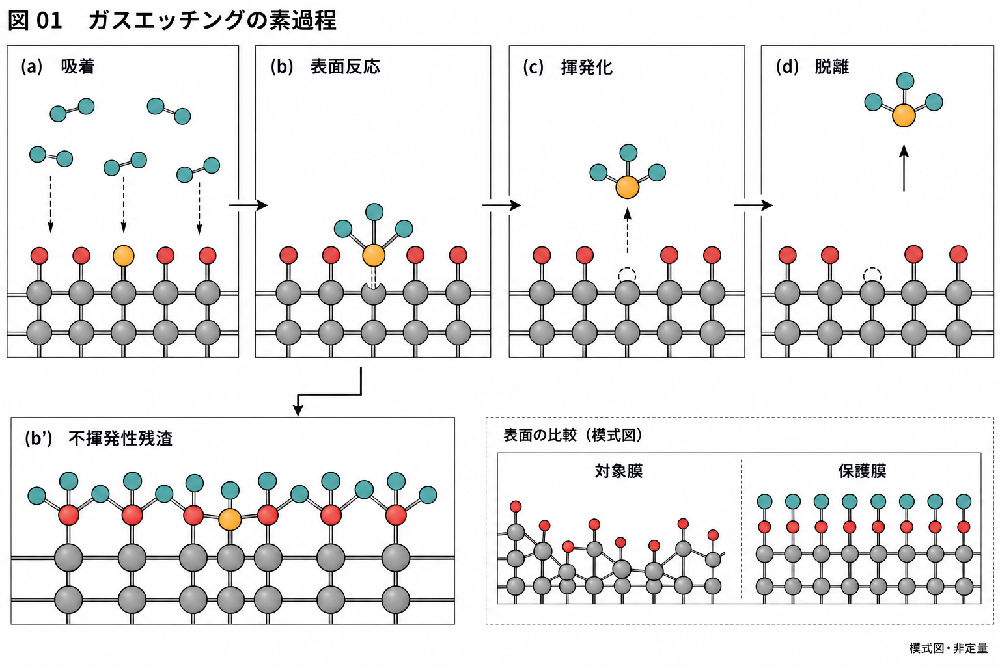

**概念図01　ガスから揮発性生成物までの表面反応。** 吸着、表面結合の変換、揮発性生成物の形成と脱離、残存終端を示す。球の色は構造を区別するための模式表現であり、特定の材料・ガスの化学量論を規定しない。

候補ガスごとに、対象膜・保護膜それぞれについて、このサイクルのどこが未確認かを記録する。生成物候補が不明なら分子DFTと反応探索、表面から抜ける障壁が不明なら周期DFTとTS探索、反応が止まる原因が不明なら被覆依存の速度論を選ぶ。分子構造だけを入力した機械学習の順位表は、この評価票を置き換えない。

### DFTと遷移状態計算で反応を決める

#### 用途と原理

周期境界のスラブDFTは、吸着と表面結合切断、フッ化・塩化、配位子交換、基板原子の脱離をエネルギー地形として比較する主力である。分子クラスター計算は反応中心を詳しく扱えるが、切り出し境界、電荷、誘電環境の影響を点検する。

CI-NEBは既知の始状態と終状態を複数の中間像でつなぎ、最小エネルギー経路を探索する。dimer法やSellaなどの鞍点最適化は、終状態が確定しない局所探索にも使える。TSは虚振動とその方向、両側へ緩和した生成物を確認する。NEBの最大エネルギー像をTS候補として精密化し、振動と接続先を確認する。[[S06](#s06)]

| 項目 | 具体的な内容 |
| --- | --- |
| 入力 | 原子構造、終端・被覆、汎関数、擬ポテンシャル、基底・カットオフ、k点、電荷・スピン。NEBには両端構造 |
| 出力 | 吸着・反応エネルギー、TS、障壁、振動、電子状態。補正後の自由エネルギーと速度定数 |
| 長所 | 新規元素組合せに比較的対応しやすい。反応の原因を電子状態と構造で説明できる |
| 短所 | 汎関数誤差、有限サイズ、非晶質サイトのばらつき。反応ネットワークの完全性は保証されない |
| コストと導入 | 中〜高。NEBは複数像と反復が必要。計算器の導入は中程度、信頼できる表面・TS設定には専門性が必要 |

#### エッチングで必要な設定

未反応面だけでなく、低・高被覆、欠陥、共吸着H₂OやNH₃、反応途中の改質層、保護膜も比較する。気相分子の並進・回転エントロピー、表面振動、圧力の化学ポテンシャルを扱い、0 Kの電子エネルギーとプロセス自由エネルギーを区別する。柔らかい吸着モードに機械的な調和振動子近似を使うとエントロピー誤差が大きくなるため、必要に応じて自由エネルギー法へ進む。

HFによるSiO₂対Siの選択エッチングをDFTで調べた2023年の研究は、表面の段階的フッ化と反応障壁を比較した直接的な事例である。特定の結晶・終端モデルの結果を、別の非晶質膜や共反応物条件へ移す際には再計算が必要となる。[[R01](#r01)]

#### 静的経路と有限温度軌跡を使い分ける

概念図02では、DFTによるエネルギー評価、NEBによる経路最適化、AIMDによる時間発展を分けている。NEBの横軸は経路座標であり、反応が何秒で起きるかを直接表す軸ではない。

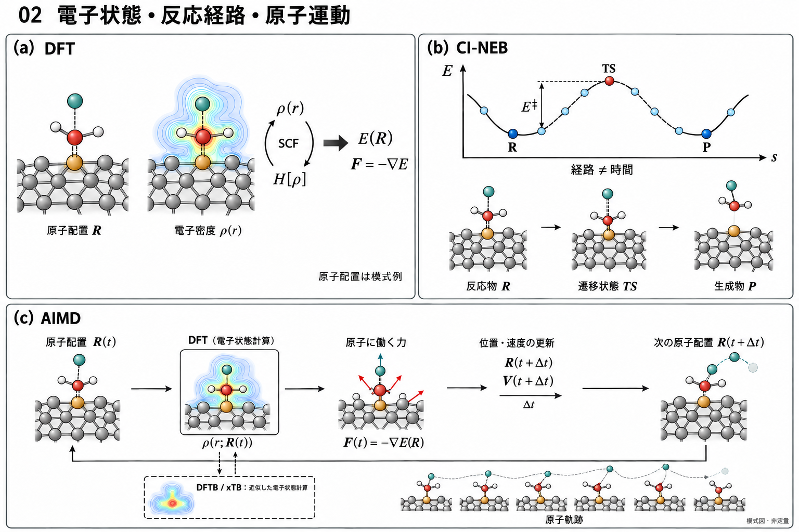

**概念図02　DFT・NEB・AIMDの役割。** 同じエネルギー・力計算器を、構造最適化、経路計算、MDに利用する。図中のエネルギー曲線や原子配置は説明用であり、特定反応の計算結果ではない。

構成図A02の実装では、始状態と終状態を個別に最適化し、原子対応を確認してNEBへ渡す。得られた候補をTSとして精密化し、虚振動方向と両側の接続先を確認する。速度係数に変換する段階で、温度・標準状態・サイト密度を明示する。

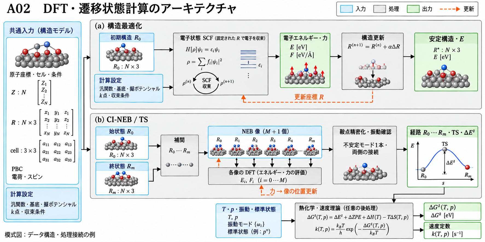

**構成図A02　DFT・NEB・TSから速度係数への処理。** 入力構造と電子状態設定から、経路像、TS、熱化学補正、速度係数へ進む。図の一次過程の速度単位は例示である。吸着・二分子反応の係数の次元は採用する速度式と濃度・被覆率の定義に従う。

**実装の選び方。** 周期表面の反応を基盤とする新規開発では、ASEとCP2KまたはQuantum ESPRESSOを第一候補にする。AIMD・QM/MMまで同じ環境で展開するならCP2K、既存の平面波計算資産があるならQuantum ESPRESSOを選びやすい。VASPの契約・計算資産・担当者が揃っていれば、それを維持する合理性がある。分子錯体や脱離生成物の高精度確認にはORCA等を併用するが、反応前後のエネルギーを異なる設定から無補正で合算しない。[[S01](#s01)–[S06](#s06)]

既知の始終状態にはNEB、局所的なTS候補にはdimerまたは鞍点最適化を使う。生成物自体が不明な場合は[未知の反応経路を探索する](#section-8)の探索へ戻る。NEB像数を増やすことだけでは未登録の分岐は解決しない。

### AIMDと近似量子MDで反応を観察する

#### 第一原理分子動力学

AIMDは各時刻の力を電子状態計算から求める。反応イベントの一覧を先に与える必要がなく、プロトン移動、協奏反応、局所的な配位変化、非晶質化の観察に向く。CP2K、VASP、Quantum ESPRESSOなどが候補となる。[[S01](#s01)–[S03](#s03)]

入力はDFTの条件に加えて温度、初期速度、時間刻み、境界・拘束、熱浴である。出力は軌跡、構造分布、力、観測された反応である。利点は未知の局所反応を電子状態に基づいて調べられる点で、欠点は1ステップの費用が大きく、稀な反応が起きるまで待てない点である。短い軌跡で未観測の反応は、障壁と観測時間から発生頻度を評価する。

#### DFTBおよびxTBによる近似量子計算

DFTBは電子状態計算をパラメータ化した近似で、xTBは広い化学空間を狙う半経験的タイトバインディング法である。構造生成、会合体、反応経路候補、AIMDより長い探索に有用だが、反応障壁や表面電荷移動はDFTで再評価する。DFTBでは元素ペアを含む適切なパラメータ一式が特に重要で、別々のパラメータ集合を無検証に混ぜない。[[S05](#s05),[S07](#s07)]

| 方法 | 入力と出力 | 採用範囲と計算費用 |
| --- | --- | --- |
| AIMD | 電子状態の設定と初期構造 → 軌跡、反応候補、有限温度構造 | nm局所領域・短時間を重点化。費用は非常に高い |
| DFTB MD | Slater–Koster等のパラメータと構造 → 軌跡、反応候補 | パラメータが対象結合に適合する場合。費用は中〜高 |
| xTB探索 | 分子・クラスター、電荷・スピン → 構造、経路候補 | 候補を多く作りDFTで選別。周期表面の対応は実装ごとに確認 |

#### 有効な使い分け

初期の未知反応探索には、小さな反応中心でAIMDや探索法を使う。非晶質モデルを作ったら密度、局所配位、表面組成を検証し、複数の独立構造で再現性を調べる。高温や過剰なガス投入で見つけた反応は仮説として保存し、実温度の障壁と競合経路を別途求める。

AIMDを使って非晶質Al₂O₃とAlF₃のモデルを作り、HFとTMAによる反応をDFTで解析した2025年の原著は、構造生成と機構計算を分担した例である。全プロセスを直接AIMDで時間追跡したものと解釈しない。[[R05](#r05)]

#### MDエンジンの入力と力計算器の選定

構成図A03の中心は、座標から力を計算し、その力で座標・速度を更新する反復である。AIMD、反応力場MD、MLIP-MDはこの反復を共有し、力計算器が異なる。温度制御と境界条件は別の入力として扱う。

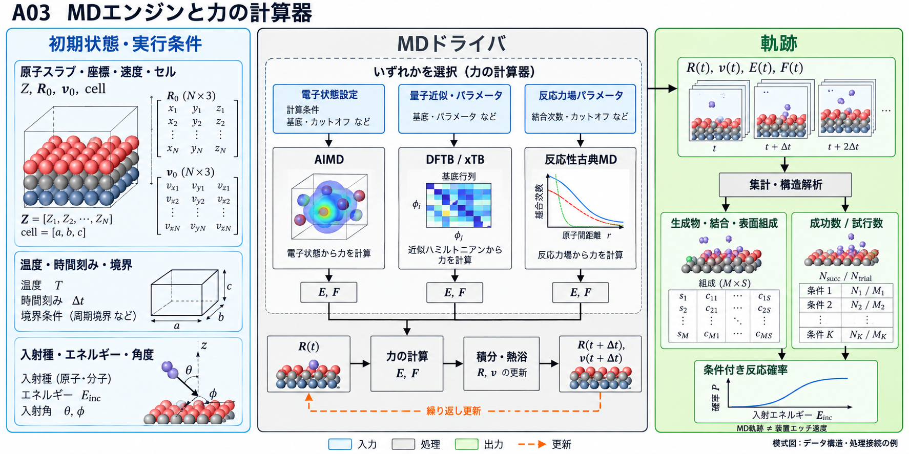

**構成図A03　MDエンジンと力計算器の分離。** 原子種・座標・セルと初期速度を入力し、力評価と時間積分を反復して軌跡を得る。電子状態計算・古典力場・MLIPは代替の計算器であり、無条件に同時使用する構成ではない。

出力軌跡からは、結合・配位数の変化だけでなく、脱離物の組成、表面内に残る基板結合、被覆状態を解析する。判定規則を固定しないまま動画を見て反応数を数える運用は、比較結果が担当者に依存する。反応検出器は原子種、結合判定の閾値、持続時間、表面からの距離を記録可能な処理として実装する。

電子状態が未知で少数経路の理解を優先するならAIMD、検証済みパラメータがあり多数の構造候補が必要ならDFTB/xTB、同一化学系の多数衝突なら反応力場または専用MLIPを選ぶ。DFTB/xTBは予備探索と位置付け、採否を左右する障壁を統一したDFTで再評価する。[[S01](#s01)–[S03](#s03),[S05](#s05),[S07](#s07)]

### 反応性古典MDで多数の衝突を扱う

#### ReaxFFと結合次数型ポテンシャル

ReaxFFやTersoff・REBO系の反応対応ポテンシャルは、原子配置から結合状態と力を計算する。反応リストを与えずに結合の生成・切断を扱えるが、利用可能な反応はパラメータの再現範囲に制約される。通常の固定結合型分子力場は、未知のエッチング化学の主計算器には適さない。

| 項目 | 具体的な内容 |
| --- | --- |
| 入力 | 対象元素を同時に扱う検証済み力場、表面、入射種・速度・角度、温度、境界、熱浴、電荷平衡条件 |
| 出力 | 入射ごとの反応・反射・付着・除去確率、生成物、損傷、被覆、改質深さ、原子軌跡 |
| 長所 | DFTより多数の原子と衝突を扱いやすい。反応確率や表面変化の統計を集めやすい |
| 短所 | 採用前に対象反応の障壁をDFTと比較する。電荷平衡、短距離反発、熱除去の扱いに依存 |
| コストと実装 | 1軌跡は低〜中、統計全体は大きくなる。LAMMPSは無償、AMSのReaxFF環境は有償。新規パラメータ開発は重い |

#### ケミカルエッチングへの適用条件

HFとSiO₂を扱うReaxFF研究では、対象反応に合わせた量子化学データとパラメータ化が用いられた。これは「汎用ReaxFFを読み込めば任意の新規ガスを評価できる」という根拠にはならない。また、入射エネルギーを与えたMDの除去収率を、そのまま低温熱反応の速度に置き換えない。[[R03](#r03),[S08](#s08),[S09](#s09)]

実験と比較する場合は、試料の表面組成、入射エネルギー分布、フラックス比、損傷層を揃える。入射イベント間の緩和時間を短縮すると、熱蓄積や被覆変化を誤って増幅し得る。基板底層の拘束と熱浴の距離を変え、エネルギー散逸が反応を支配していないか確認する。

#### 力場を採用する前の短い検証

ガス分子と主要生成物の安定性、解離曲線、代表吸着、少数の律速候補障壁、清浄面と改質面の構造をDFTと比較する。全てを同時に再現できなければ、利用範囲を衝突・構造解析に限定するか、専用パラメータまたは第2部のMLIPへ進む。力場を別のガス用に単純に転用する判断は避ける。

#### 解像度と反応の記述範囲

概念図03は、全原子反応性MD、局所を量子化するQM/MM、多数原子をまとめる粗視化を比較する。計算対象を大きくする際は、削減する自由度が目的の結合切断・拡散・損傷に関与していないかを判断する。

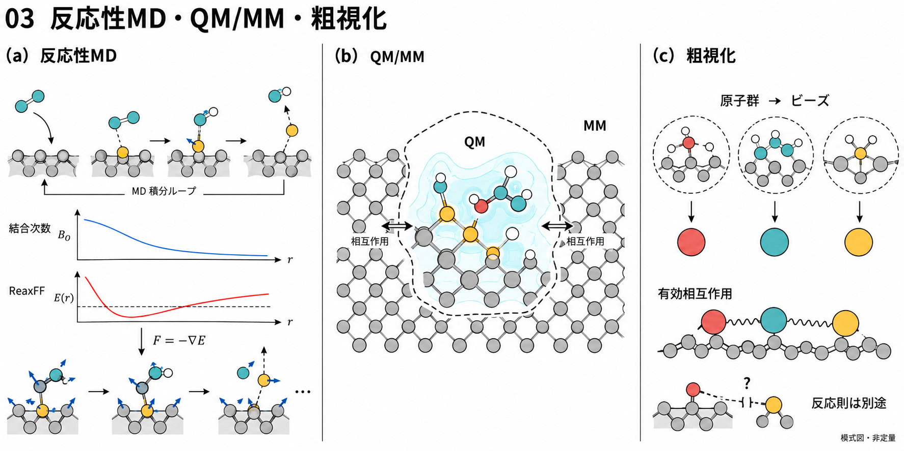

**概念図03　反応性MD・QM/MM・粗視化の解像度。** 全原子、局所量子領域、粗視化ビーズという異なる解像度を示す。粗視化のビーズ間結合を、実原子の共有結合反応と直接対応させない。

**採用判断。** LAMMPS＋ReaxFFは、対象の元素組合せだけでなくガス・表面・生成物・律速候補を同時に再現するパラメータがある場合に選ぶ。GUIによる解析や商用サポートを重視する場合はAMSを比較する。どちらも新規ガスのパラメータ適合性を別途検証する。[[S08](#s08),[S09](#s09)]

開発判断には、代表的な吸着・解離・脱離のDFT比較表を用いる。特定の障壁だけが外れるモデルを、温度を調整して実験速度へ無理に合わせない。統計が大量に必要で、既存力場の修正が広範囲に及ぶ場合には、[専用MLIPを作る場合の選択](#section-19)の専用MLIPと開発費を比較する。

### 未知の反応経路を探索する

#### AFIRとGRRM

AFIRは原子・フラグメント間に人工的な力を加え、反応経路を探索する。入力は初期構造、反応させる領域、探索条件、エネルギー・勾配計算器であり、全ての生成物やkMCイベントを先に列挙する必要はない。出力は中間体、反応候補、接続ネットワークで、最終TSや障壁は再最適化する。[[S10](#s10)]

新規ガスの会合、分解、配位子交換、局所的な表面反応に有用である。一方、大きな非晶質表面全体を無制限に探索すると組合せが増大する。反応領域と固定原子、気体分子数、エネルギー範囲を限定し、複数の初期配置で探索漏れを評価する。探索の終了は、反応ネットワークの完全性の証明ではない。

#### Pyntaによる表面反応計算の自動化

Pyntaは表面吸着構造、TS、熱化学・速度係数の計算を自動化するワークフローである。主に金属表面で開発されており、ユーザーが与える反応の定義と原子対応、表面サイト情報を用いる。未知の全てのエッチング反応を自動発見する汎用エンジンとして扱わない。酸化物、非晶質、厚い改質層には適用可否の検証や拡張が必要となる。[[R06](#r06),[S11](#s11)]

| 方法 | 何を事前に与えるか | 適した用途と制約 |
| --- | --- | --- |
| CI-NEB | 始状態と終状態 | 既知候補経路の障壁。未知生成物の発見は別手段 |
| dimer・鞍点探索 | 初期構造と探索方向など | 近傍のTS。どの反応へ行くかの制御と同定が必要 |
| AFIR | 初期構造、探索範囲、計算器 | 未知反応候補。探索費用と反応領域の設計が課題 |
| Pynta | 反応定義、表面と吸着種、計算器 | 多数の構造・TSの自動計算。適用表面の検証が必要 |

#### 導入と開発判断

ASEのNEBは既存計算器に接続しやすい。GRRMは有償で、計算器側の費用も別途必要となる。Pynta本体はGPLv3で公開されるが、DFT実行系、FireWorks、計算資源管理を含む環境構築が必要である。2026年7月公開のGRRM26は、高速な半経験的法やMLポテンシャルを使う場合の性能改善を公式に案内している。[[S06](#s06),[S10](#s10),[S11](#s11)]

#### 発見器と検証器を分離する

概念図04のネットワークには探索候補も含まれる。探索で見つかった接続を、そのまま速度論の素反応と見なさず、構成図A04の検証工程を通して採用する。

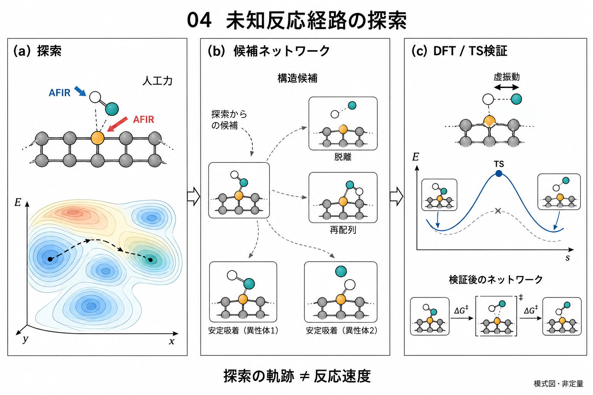

**概念図04　未知反応経路の探索と検証。** 人工力などで構造空間を探索し、中間体と接続候補を得る。線が存在することだけでは、その反応が実温度で進行するとは判定できない。

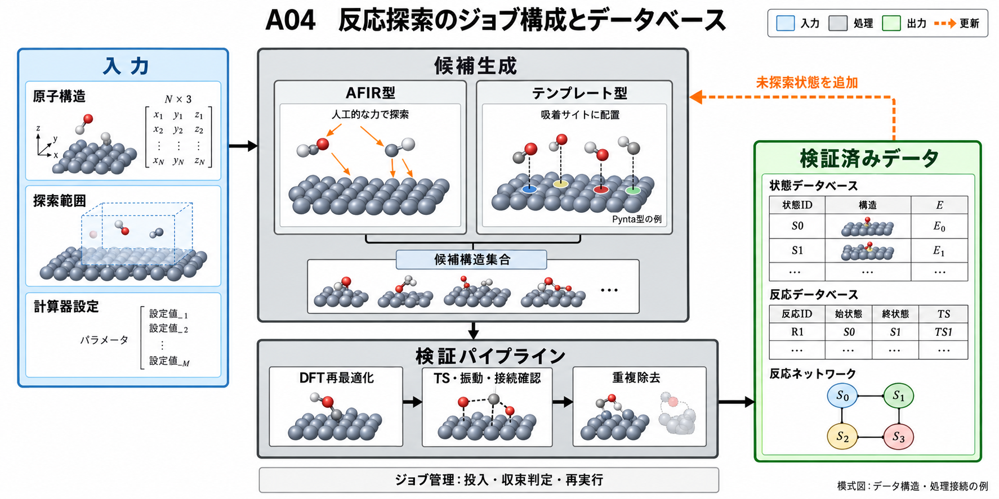

**構成図A04　反応探索と検証済みネットワーク。** 候補生成、重複排除、DFT再最適化、TSと接続先の検証を経て反応ネットワークへ登録する。探索用バイアス下のエネルギーは、物理的障壁として登録しない。

AFIR/GRRMは、予想外の会合や配位子交換を発見する必要があり、有償ライセンスと探索設計の工数を確保できる場合に選ぶ。Pyntaは、扱う反応群と表面サイトの定義があり、多数の吸着構造・TS計算の自動化を目的とする場合に選ぶ。両者の成果物は似ていても、前者の探索自由度と後者の反応定義に基づく自動化は別の機能である。[[S10](#s10),[S11](#s11)]

ネットワークの各辺には、反応式、原子対応、両端の構造ID、TSの構造ID、計算条件、障壁、検証状態を保存する。未検証の辺を表示できる探索用ネットワークと、速度計算へ渡す承認済みネットワークを分けることで、自動化の範囲を広げても入力の追跡性を維持できる。

### 自由エネルギー計算で遅い反応を探る

#### MetadynamicsとOPES

吸着分子の解離、プロトン移動、表面原子の脱離などを表すCVに沿ってバイアスを加え、通常MDでは訪れにくい状態を探索する。OPESは観測された分布から目標分布へ近づくバイアスを構築する。いずれもDFT、反応力場、MLIPなどの計算器を必要とし、手法自体が機械学習モデルというわけではない。[[S12](#s12)]

| 方法 | 入力から出力へ | 採用条件と弱点 |
| --- | --- | --- |
| Umbrella sampling | 反応座標と窓ごとの拘束 → 平均力ポテンシャル | 経路の見当がつく場合。窓間重なりと遅い直交自由度が重要 |
| Well tempered metadynamics | CVとバイアス条件 → 経路候補と自由エネルギー差 | 複数準安定状態の探索。CVから漏れた障壁に弱い |
| OPES・OPES explore | CVと目標分布など → 状態探索・自由エネルギー | 効率的な探索候補。再重み付け可能性と収束を確認 |
| Infrequent系・flooding | 状態、CV、バイアス制約 → 脱出時間や速度推定 | TS付近へのバイアス影響等の前提が必要。実時間の評価には手法固有の時間補正と適用条件の確認が必要 |

#### エッチングに必要なCV

Si–FやM–配位子の配位数、基板原子の高さ、Hの移動、残存基板結合数などを候補にする。ただし、高さだけでは基板から切れていない錯体を脱離と誤判定し得る。複数の結合と周辺被覆を組み合わせ、独立軌跡で経路が変わらないか調べる。

自由エネルギー面は、指定した温度、組成、粒子数、CVの条件付き結果である。固定粒子数の小セルで得た結果を、分圧が変わる開放系へ渡す際には、気体化学ポテンシャルと吸脱着の扱いを整合させる。

#### コストと実装

PLUMEDとCP2KまたはLAMMPSの連携が代表的である。費用は基礎MDの長さ、CV計算、窓や独立試行数で決まり、単発MDより軽いとは限らない。PLUMEDのPythonパッケージを入れるだけで、任意のMD実行系に機能が追加されるわけではない。連携対応、リンクまたはパッチ、ビルド構成を確認する。[[S12](#s12)]

#### バイアスを加える位置と結果の読み方

概念図05は状態間の移動を増やす考え方を、構成図A05はCVを評価して追加の力をMDへ返す構成を示す。基礎ポテンシャルとバイアスは別管理とし、後処理に必要なCV履歴とバイアス履歴を保存する。

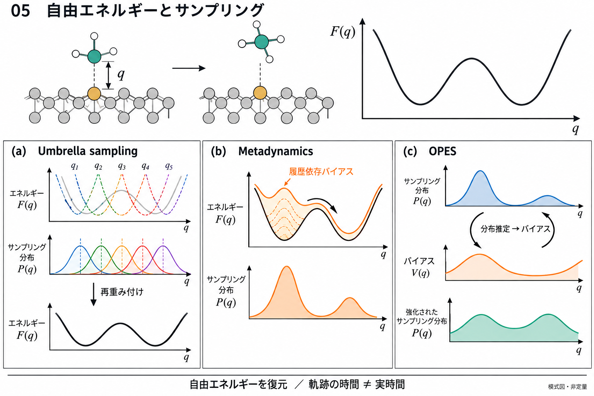

**概念図05　Umbrella・metadynamics・OPES。** Umbrellaは複数窓で反応座標を覆い、metadynamicsとOPESは履歴・分布に基づくバイアスを利用する。模式曲線の形状は実際のエッチング自由エネルギーを表さない。

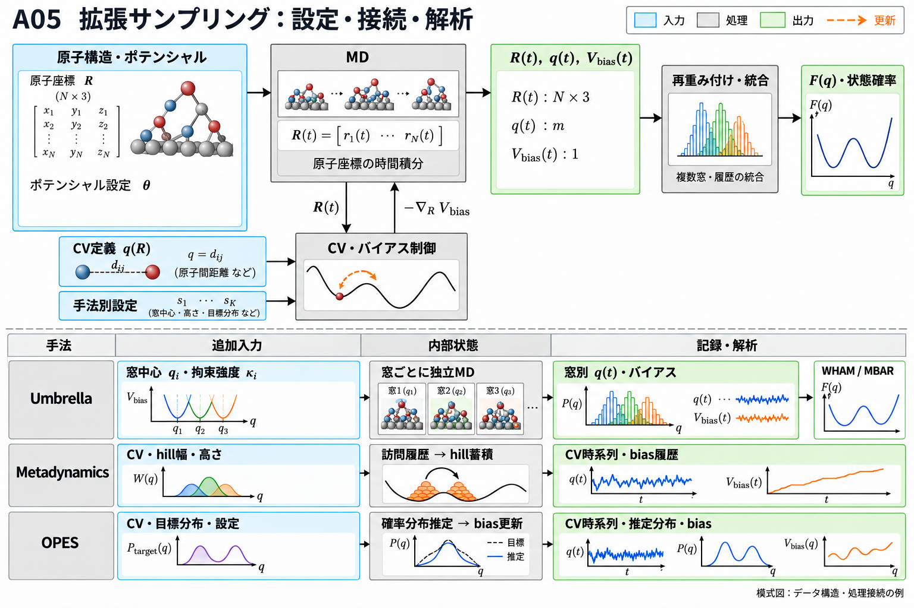

**構成図A05　CV・バイアス・再重み付けの処理。** 座標からCVを求め、スカラーのバイアスポテンシャルの座標勾配を力へ加える。再重み付けや窓の統合は手法に応じて行う。すべての探索設定で自由エネルギーや実時間が自動復元されるわけではない。

経路が既知で一つの脱離自由エネルギーを精密化するならUmbrella、複数の表面状態の移り変わりを探索するならmetadynamics/OPESを候補にする。いずれもPLUMEDと対応MDエンジンの組合せを小系で確認してから拡張する。採用判定は、窓間の重なり、独立試行間の再現性、CVに含めなかった遅い運動の有無で行う。[[S12](#s12)]

高分子配位子の脱離では、表面からの高さだけでなく、金属の基板配位数と配位子の結合状態を併せて監視する。速いCVの往復だけを見て収束と判定せず、実際の結合組換えが十分にサンプリングされていることを確かめる。

### 物理的な速度と長時間を得る

#### 遷移状態理論から速度定数を作る

平衡化された準安定状態と明確な障壁がある場合、遷移状態理論では k(T) ≈ κ(kBT/h) exp[−ΔG‡/(kBT)] と表せる。κは再交差などを補正する透過係数である。吸着の気相標準状態、表面サイト密度、被覆率、逆反応との整合性を揃えて速度論モデルへ渡す。

| 手法 | 追加入力と出力 | 主な条件と費用 |
| --- | --- | --- |
| Hyperdynamics | 状態内バイアス → 補正された経過時間 | 境界付近のバイアス条件が重要。加速率は系に依存 |
| Parallel replica dynamics | 準安定状態と独立レプリカ → 状態脱出時間 | 状態内平衡化と脱出統計の仮定。多数のCPU/GPUを消費 |
| Temperature accelerated dynamics | 高温軌跡と障壁評価 → 低温イベント推定 | 調和TSTなどの条件。高温で新しい機構が支配すると難しい |
| Weighted ensemble | 進行度、ビン、状態定義、重み → 反応流束・初到達統計 | 軌跡の分割・統合で稀な経路を強化。定常化と相関誤差を評価 |

LAMMPSにはhyper、prd、tadの公式実装がある。WESTPAはweighted ensembleの実装基盤で、外部の軌跡計算器と連携できる。これらは事前登録したkMCイベント一覧を必須にしないが、状態定義や適用仮定をなくす方法ではない。[[S13](#s13),[S14](#s14)]

#### 開放系の表面に適用する際の判断

ガスが継続的に到達し、被覆や表面形状が急速に変わる系では、定常的な準安定状態という前提が崩れやすい。まず一定被覆や単一脱離過程など限定した問題に適用し、到達イベントは別の確率過程として結合する。全エッチングを一括して「加速MDで秒まで延長できる」とは見積もらない。

#### 速度の精度をエネルギー精度に結び付ける

同じ前因子を仮定すると、速度の倍率fに対応する障壁差は kBT ln f である。400 Kでは2倍が約0.024 eV、10倍が約0.079 eVとなる。これはDFTやMLIPの一律の合格基準ではなく、速度予測が小さな障壁誤差にも敏感であることを示す。候補間の順位、実験誤差、モデル近似を含めた感度解析で必要精度を決める。

#### 「長い時間」を出力するための条件

概念図06と構成図A06は、時間補正、独立レプリカ、高温からの外挿、重み付き軌跡という異なる仕組みを分けている。目的が反応発見か、物理的な脱出時間かによって採用条件が変わる。

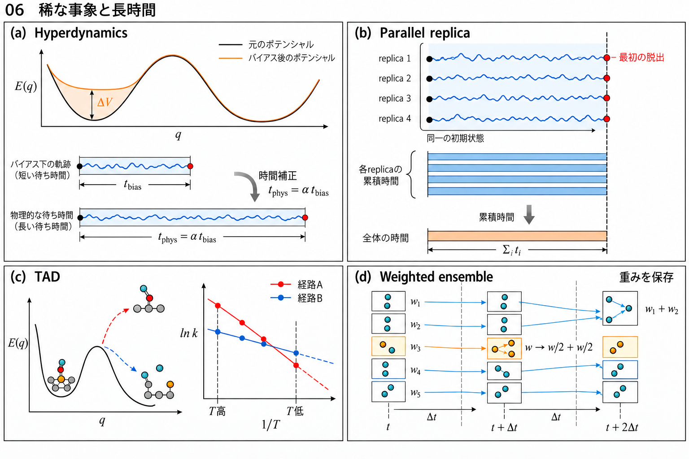

**概念図06　長時間化と重み付き軌跡。** hyperdynamics、parallel replica、TAD、weighted ensembleの概念比較。レプリカ本数や模式的な加速率は性能保証ではない。

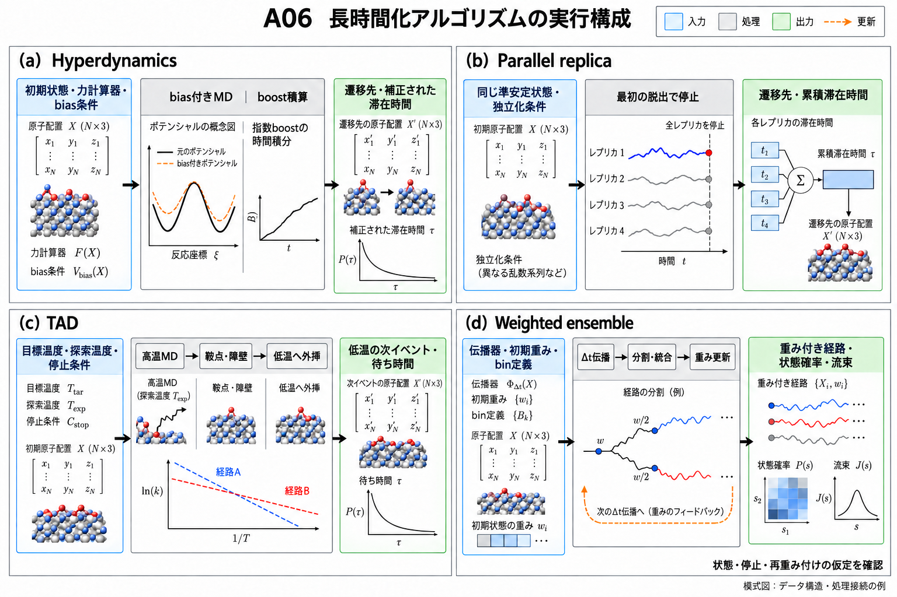

**構成図A06　加速MDとweighted ensembleの入出力。** 各手法に固有の状態定義・停止条件・重み・時間換算を入力し、脱出統計または流束を得る。WEでは軌跡の重みを保持し、分割した軌跡を独立試行として単純集計しない。

少数の律速候補が分かっていれば、まずDFT＋TSTを用いて必要な障壁精度と速度感度を見積もる。長い準安定状態があり、状態内平衡化を確認できるならLAMMPSの対応加速法を検討する。複数の経路を保ちながら到達統計を得たい場合はWESTPAと外部の軌跡計算器を比較する。TADは高温で得たイベントを低温に外挿する仮定の評価が不可欠である。[[S13](#s13),[S14](#s14)]

連続的なガス投入と表面改質を伴う全工程に、単一の加速倍率を適用しない。一定被覆での脱離など、切り出した過程の速度を求めてMKMへ渡す構成を優先する。状態定義に強く依存して速度が変わる場合は、状態分割または反応座標の設計へ戻る。

### QM/MMと粗視化などの補助手法

大空間に特化した方法でも、未知の表面化学を表す情報が別途必要になる。以下は用途を限定すれば有効な補助手法である。

| 区分 | 入力と出力 | 利点と採用を止める条件 |
| --- | --- | --- |
| QM/MM・埋込み | QM反応領域、MM周辺、境界・電荷結合 → 局所反応と周辺緩和 | 局所を高精度化。反応が境界を横切る、電荷移動が広域なら難しい |
| 適応QM/MM | 領域更新規則と結合方式 → 移動する反応領域 | 反応場所の移動に対応。エネルギー保存と領域境界の開発負担が大きい |
| 粗視化MD | ビーズ写像と有効相互作用 → 膜・層・集団の構造と緩和 | 空間拡大に有効。未知共有結合化学と時間換算は自明でない |
| 反応性粗視化・DPD | 粗視化相互作用と反応則 → 組成輸送と集団挙動 | 厚い層や輸送に候補。反応定数を入力する構成は機構発見器ではない |
| GCMCとMDの併用 | 温度、化学ポテンシャル、挿入・削除規則 → 平衡吸着量など | 被覆状態の生成に有効。MCステップは平衡状態のサンプリング回数を表す |
| k ART・適応kMC | 局所構造、鞍点探索、率 → 長時間の構造遷移 | イベントを逐次発見。ただし分類上はkMCであり非kMCではない |

#### エッチングでの具体的な使い道

QM/MMでは反応サイトだけを量子化し、厚い基板の弾性応答を古典領域で表す。非晶質膜の局所脱離などが候補だが、導電性や長距離分極が重要な場合は埋込み方式を慎重に選ぶ。CP2KはQM/MMの実装を提供する。[[S15](#s15)]

粗視化では、原子層より厚い改質膜の拡散や多成分層の形態を扱う余地がある。ただし反応中心を残した混合解像度の設計や、反応物・生成物ごとの輸送係数が必要である。一般的なDPDを導入しても、新規ガスによるSi–O切断機構は得られない。LAMMPSの反応対応粗視化機能にも、反応モデル側の入力が必要となる。[[S16](#s16)]

k-ARTは局所環境に応じてイベントを探索する方法で、事前イベント表を減らせる点が有用である。しかし、不完全なポテンシャルの誤りを修復するものではなく、入射ガスと動く表面への組込みには開発が必要である。[[R15](#r15)]

#### 周辺環境・有効自由度・吸着平衡を区別する

構成図A08の三つの枝は、別々の問題を解く。QM/MMは反応中心と周囲の結合、粗視化は削減した自由度の有効相互作用、GCMCは粒子数を変化させる平衡サンプリングを必要とする。

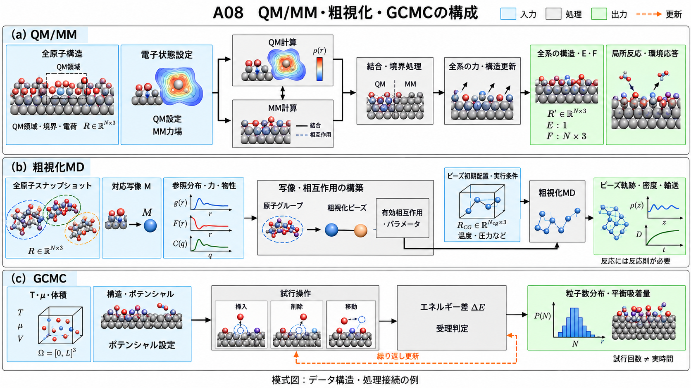

**構成図A08　QM/MM・粗視化・GCMCの入出力。** QM/MMでは領域間相互作用を含むエネルギーと力を構成する。粗視化には写像と独自の有効モデルを入力する。GCMCの挿入・削除は化学ポテンシャルに基づく平衡操作であり、反応時刻の発生ではない。

局所反応の周辺弾性や分極が重要ならCP2K等のQM/MMを選び、量子領域のサイズ依存を評価する。厚い改質層の拡散や集団緩和が主題なら、原子計算・実験から物性を与える粗視化を検討する。分圧に対応する平衡吸着構造が必要ならGCMCと緩和計算を使うが、反応性ガスの挿入成功率や化学種の定義を別途設計する。[[S15](#s15),[S16](#s16)]

### 表面速度論：MKMとkMCを選ぶ

#### 平均場MKMと反応拡散

MKMは吸着種の被覆率や中間体量の時間変化を、素反応の速度式とサイト収支で解く。必要な入力は反応ネットワーク、温度依存速度、分圧・フラックス、サイト密度、初期被覆である。出力は速度、被覆、誘導時間、生成物フラックス、感度であり、kMCイベントを時系列に抽選する必要はない。Canteraなどが実装候補となる。[[S17](#s17)]

MKMも反応ネットワークは必要である。「kMCの入力を使わない」とは「反応情報が不要」という意味ではない。DFTやMDから速度を計算するか、実験から同定する。局所の島形成、隣接種の協奏反応、サイト間の強い相関を平均化すると誤差が出る。必要なら対相関、複数サイト、空間分割を追加し、さらに必要な場合にkMCへ進む。

| 区分 | 得意な出力 | 採用基準 |
| --- | --- | --- |
| 平均場MKM | 速度、被覆、EPC、パラメータ感度 | 表面が概ね混合され、局所相関を詳細に追わなくてよい |
| 空間分解反応拡散 | 位置別の濃度・被覆、改質層の拡散律速 | 拡散係数・反応速度・境界条件が与えられる |
| 格子kMC | サイト配列、島、局所反応、揺らぎ | 隣接関係や確率分布が結果に重要 |
| 非格子・自己学習kMC | 格子が崩れる表面の長時間変化 | イベント探索と障壁計算の費用を許容できる |

#### 気体の到達と表面反応をつなぐ

平衡Maxwell分布の理想気体なら、単位面積への入射フラックスは Jᵢ = Pᵢ/√(2πmᵢkBTg) と書ける。付着係数と空きサイト割合を掛け、サイト密度で換算して被覆変化率を得る。分子ビーム、方向性の強い流れ、非平衡プラズマ種では、この式の代わりに実際の分布または輸送計算結果を用いる。

同一条件の独立な入射試行では、反応確率の推定値は成功回数/試行回数となる。反応ゼロでも確率ゼロとは言えず、独立同分布を仮定した95%上限の概算は3/Nである。表面が各衝突で変化する連続照射は独立同分布ではないため、被覆・履歴で条件分けして統計化する。

#### 同じ反応機構から二つの速度論を選ぶ

概念図07は、平均被覆率で状態を表すMKMと、サイトごとの配置を保持するkMCの違いを示す。構成図A07の共通入力は、検証した素反応と速度則である。

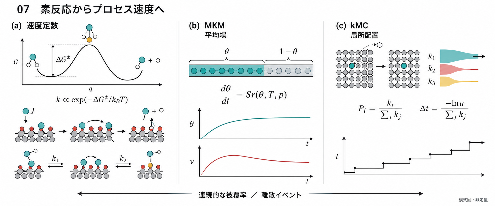

**概念図07　MKMとkMCによる表面速度論。** MKMは濃度・被覆率の連立速度式を解き、kMCは局所配置から可能なイベントを選ぶ。格子図の配置は模式例であり、非晶質表面が必ず固定格子で表現できるという意味ではない。

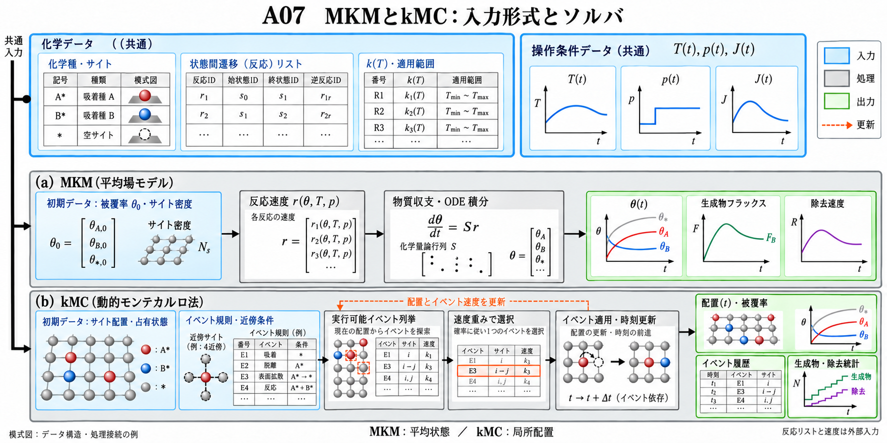

**構成図A07　MKMとkMCの実行構成。** MKMは物質収支を時間積分する。kMCの処理順は、可能イベントの列挙、率に基づく選択、状態と時刻の更新、影響するイベント率の再計算である。両者の出力を同じ平均量に集約して比較できる。

平面の速度、飽和、パルス依存を初めて予測する場合はCanteraまたは独自ODEによるMKMから始める。近接した吸着種の反応、サイト遮蔽、島形成が平均場で再現できず、結果を左右する場合にkMCへ進む。格子上の相互作用を持つ表面反応にはZacros、目的のイベント・並列処理を自ら実装する基盤にはSPPARKSを比較する。[[S17](#s17),[S20](#s20)]

kMCの導入判断では、速度差だけでなく必要なサイト表現を確認する。非晶質化・大きな表面再構成で格子の意味が変わるなら、固定格子の追加パラメータだけで解決せず、状態の再定義や別のモデル化を検討する。両方式ともネットワーク漏れは解決しないため、実験と合わないときは反応機構にも戻る。

### 輸送と形状で実用スケールを扱う

#### 表面モデルに加えて必要な物理

µmの溝形状やウエハ内分布を知りたい場合、表面の反応機構だけでは不足する。ガスが底へ届くか、側壁に失われるか、生成物が再衝突するかを計算する。モデル選択はKnudsen数Kn = 平均自由行程/代表長さを目安にし、実際の衝突・境界条件に合わせる。

| 方法 | 入力から出力へ | 適した条件と弱点 |
| --- | --- | --- |
| 粒子・ray Monte Carlo | 形状、入射分布、付着・反射・反応確率 → 局所フラックス | 分子流に近いフィーチャー。分子間衝突を省く場合は適用条件を確認 |
| DSMC | 分子衝突モデル、境界、気相反応 → 希薄気体分布・到達量 | 希薄流れ。セル・時間刻み・模擬粒子数の収束が必要 |
| CFDと反応輸送 | 流量、物性、反応機構、壁条件 → 分圧・温度・濃度場 | 連続体が妥当な反応器。低圧・細孔でそのまま使えない場合がある |
| Level set・表面追跡 | 局所の法線方向除去速度 → 形状変化・深さ・均一性 | nm〜µm形状。検証済みの局所反応則を入力する |

#### 実装候補と費用

ViennaPSはフィーチャーの輸送と表面形状を扱う公開基盤である。SPARTAは希薄気体のDSMCに使える。Canteraは気相・表面反応と熱化学の構成要素を提供するが、任意の3次元反応器・移動境界問題を単独で自動生成するわけではない。輸送ソルバーとの連携や境界条件の実装が必要となる。[[S17](#s17)–[S19](#s19)]

原子計算に比べて長時間・大空間を扱いやすい一方、入射粒子数、メッシュ、表面状態数、サイクル数で費用は増える。表面反応則を過度に単純化したままメッシュだけ細かくしても、予測精度は改善しない。

#### 最近の直接的なエッチング例

2026年のALD/ALE国際会議では、HF/NH₃によるSiO₂のCOR型ALEを、ViennaPSのray tracingとlevel setで扱う発表がある。改質塩層の形成と層内輸送、HFによる直接除去を組み合わせ、平面データで校正して溝へ適用している。これは実装方針の参考になるが、確認した資料は会議要旨であり、査読論文や汎用コード公開の確認とは分ける。[[R10](#r10)]

#### 表面反応を形状へ変換する

概念図08では、原子計算の結果が局所反応則を経て溝内の除去速度に変換される。構成図A09では、更新された形状が次の輸送計算へ戻る。この戻りがあるため、初期形状のフラックスを全工程に固定すると深さ依存を誤り得る。

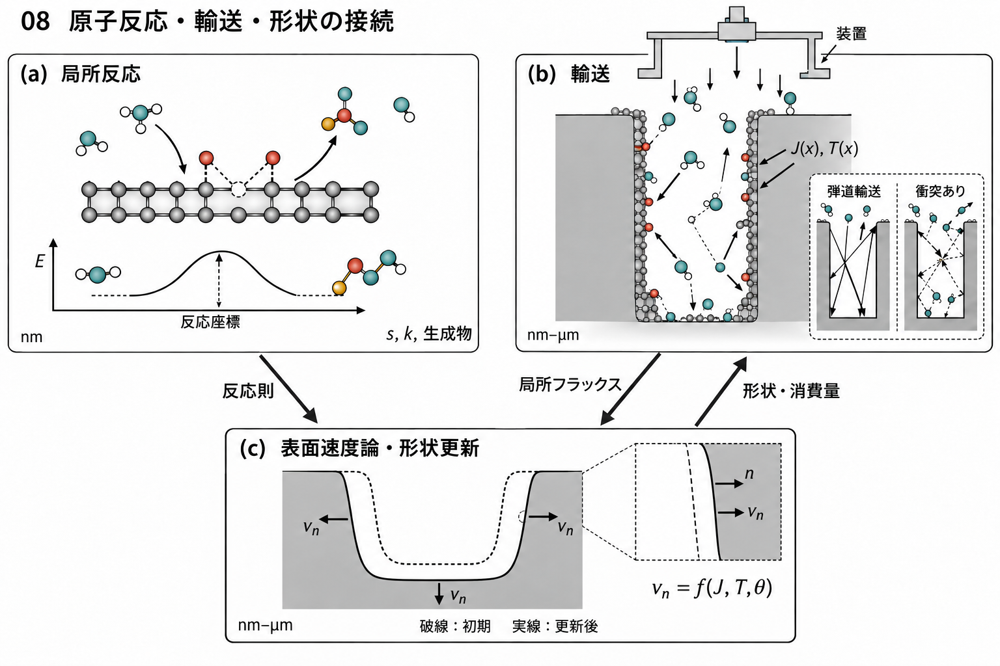

**概念図08　反応・輸送・形状の接続。** 輸送による局所到達量、壁での反応と再放出、法線方向の形状移動を示す。反応機構を特定せずに形状だけから原因を一意に逆算することはできない。

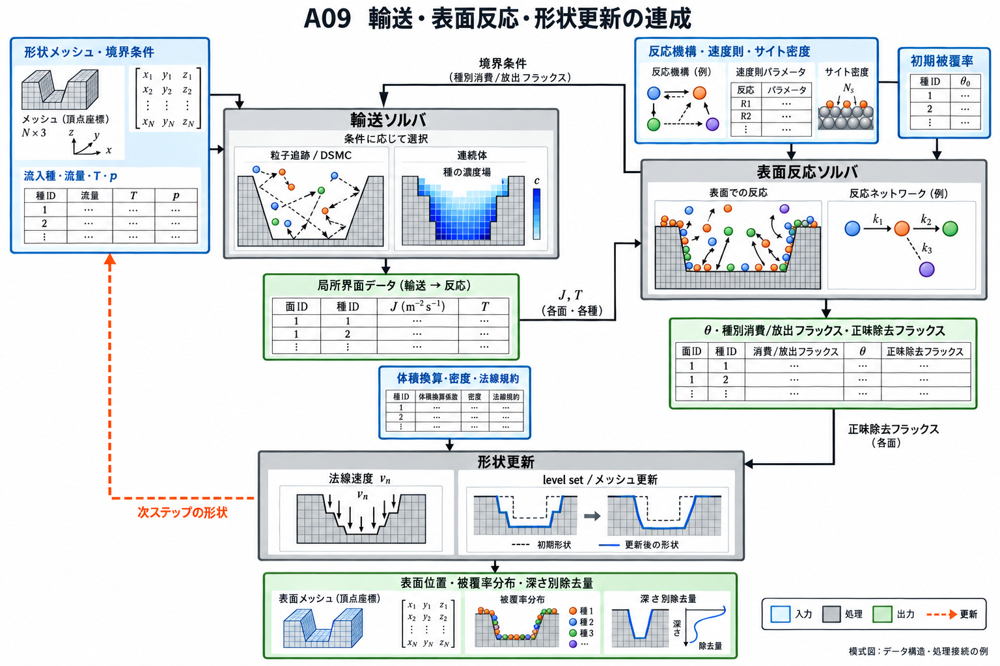

**構成図A09　輸送・表面反応・形状更新ループ。** 形状・入射分布→局所フラックス→表面状態と正味物質収支→法線速度→形状更新のループ。法線方向は各表面位置の局所法線として実装し、図中の模式矢印の向きを全壁共通の方向として使わない。

分子間衝突を無視できるフィーチャーの形状予測にはViennaPSを優先候補にする。希薄気体で分子間衝突や速度分布自体が必要ならSPARTA等のDSMC、連続体近似が妥当な装置流れには反応輸送・CFDを選ぶ。Canteraはその化学・熱化学を担う構成要素として用い、移動境界や任意の三次元流体計算まで自動で担うと見積もらない。[[S17](#s17)–[S19](#s19)]

正味除去フラックスを $J_{\mathrm{rem}}$、除去する化学式単位の体積を $\Omega$ とすると、単純な除去モデルで速度の大きさは $\Omega J_{\mathrm{rem}}$ となる。符号は採用した外向き法線とlevel setの定義に合わせる。体積膨張を伴う塩層、内部拡散、再堆積がある場合は追加の状態変数と収支を実装する。

### 用途例 HF系でSiO2とSiNxを比較する

#### 問うべきこと

HF系の新規添加ガス探索では、反応を速めるかだけでなく、対象膜と保護膜のどちらを促進するか、塩や終端が残るか、パルスと加熱で反応が分離できるかを比較する。乾燥度、OH終端、膜中H、NH₃などの共反応物を明示する。

| 段階 | 推奨計算と入力 | 次段階へ渡す出力 |
| --- | --- | --- |
| 1 反応候補 | 対象・保護膜の複数終端とHF・添加分子のDFT | 吸着、プロトン移動、フッ化、脱離生成物の候補 |
| 2 経路の確認 | NEB・鞍点探索。未知の会合や多分子過程はAFIR・AIMD | 競合障壁、塩形成と直接揮発化の分岐 |
| 3 被覆と改質 | 表面MKM。必要なら検証済み反応MDやMLIP MD | 被覆率、改質層厚さ、時間依存の反応係数 |
| 4 パルスと形状 | 曝露・パージ・加熱の速度論と輸送・形状計算 | EPC、停止条件、深さ依存、残渣リスク |
| 5 検証 | 平面の速度・表面組成・生成物、独立した溝条件 | 候補の選択性とプロセス窓、モデルの適用範囲 |

#### 文献から使える知見と使えない飛躍

SiO₂対SiのHF選択エッチングにはDFTの直接例がある。[[R01](#r01)] HFとSiO₂の反応性MDにも専用ReaxFFの例がある。[[R03](#r03)] さらに2024年には、非晶質Si₃N₄に対するHFエッチングをMLIPで扱い、原子計算から連続体モデルへつないだ研究がある。[[R04](#r04)]

これらを単一の条件のデータとして合算しない。材料の水素含有、表面終端、入射エネルギー、力場の学習範囲が異なる。特に高い入射エネルギーで測った除去収率と、熱的な分子吸着・脱離の速度は異なる量である。

#### 選定判断

少数の新規添加分子を比べる段階はDFTと経路計算を優先する。候補が絞れ、非晶質サイトや被覆の統計を多数必要とする段階で、専用MLIPや反応力場の投資が有利になりやすい。工程の飽和・時間依存が主題なら、長いMDより表面MKMを先に構築する。溝の均一性はその後に輸送と結合する。

### 用途例 金属酸化物の新規除去ガスを探す

#### 単一ガスから反応の組合せへ

金属酸化物の熱ALEでは、改質した表面層を配位子交換や付加体形成で揮発化させる設計が有力な探索軸となる。候補は「ガス分子1種類」だけでなく、改質剤、除去剤、供給順、温度の組合せとして管理する。

2026年の会議要旨には、ZrO₂のH₂O/SOCl₂系や、N複素環式カルベンを用いる配位子付加型の熱ALEが報告されている。新規ガス探索を、改質反応と金属の揮発化反応の組合せとして考える最近の候補例である。査読済み機構の確定とは分けて扱う。[[R16](#r16)]

2025年のAl₂O₃/HF/TMA研究は、非晶質表面、フッ化層、除去生成物を含む第一原理解析の具体例である。分子状TMAの反応熱だけを比べるのではなく、改質された固体表面と揮発性錯体の両方を計算する設計が参考になる。[[R05](#r05)]

| 比較対象 | 必要な入力 | 計算して判断すること |
| --- | --- | --- |
| 改質の深さと飽和 | 表面相、終端、改質剤の化学ポテンシャル | 表面反応で止まるか、内部まで進行するか |
| 除去剤の配位子 | 吸着配置、単量体・会合体、競合生成物 | 金属を含む脱離物が生成するか、表面結合が切れるか |
| 選択性 | 対象膜、下地、マスクの同条件モデル | 対象だけが除去される温度・分圧域があるか |
| 工程の自己制御 | 反応後の終端と次分子の反応経路 | 追加曝露で停止するか、連続エッチになるか |
| 残渣と再堆積 | 配位子分解、C・F・Clを含む表面状態 | 除去と堆積が競合しないか、生成物が再吸着しないか |

#### 推奨する計算の順番

分子DFTで複数の脱離錯体と気相安定性を比較する。次に周期表面DFTで吸着と金属原子を抜く経路を比較し、有望な組合せに限って自由エネルギーと速度を計算する。大きな配位子の配置探索はxTBや検証済みMLモデルで前処理できるが、最終障壁と反応エネルギーは統一したDFT条件で再評価する。

公開された一般材料モデルに対象元素が含まれていても、金属フッ化物と有機配位子の混合環境が学習されているとは限らない。新配位子を広く変える探索では分子計算を残し、特定の反応系列を大量に計算する段階で専用MLIPへ移る。

#### 実験と結ぶ成果物

候補ごとに、想定脱離生成物、律速候補、成立温度域、停止機構、保護膜への反応、未評価経路を一枚の評価票へ記録する。反応が熱力学的に有利という結果だけで、実用エッチングガスと判定しない。

### 非ML計算で注目する最近の進展

以下は調査範囲で用途上の価値が高い進展である。公開年の新しさより、目的の反応に直接検証されているか、導入可能な実装があるかを優先する。

| 年と対象 | 内容と有用性 | エビデンスと採用条件 |
| --- | --- | --- |
| 2025 Al₂O₃の熱ALE | AIMDによる非晶質構造とDFTによるHF/TMA機構を接続 | 査読論文。対象化学に直接関連。別ガスへの結果転用は再評価 [[R05](#r05)] |
| 2026 GRRM26 | 高速な計算器を使った反応経路探索の実行効率を改善 | 公式リリース。AFIR自体はMLを必須にしない。有償 [[S10](#s10)] |
| 2026 HF/NH₃のSiO₂ ALE | 輸送、改質層、直接除去、形状変化を統合 | 会議要旨。実装構成の候補。査読・コード提供の範囲は別確認 [[R10](#r10)] |
| 2026 EATR flooding | バイアスを使った稀な遷移の速度推定を拡張 | 査読論文。確認した実証対象はエッチング表面ではない [[R11](#r11)] |

#### 新手法をすぐ採用する場合と待つ場合

GRRMやNEBの探索効率改善は、最終的にDFTでTSと生成物を検証できるため、比較的明確に価値を判定できる。一方、新しい加速時間法は、反応の発見に使えることと速度が正しく復元できることを別々に評価する。まず既知の小さなエッチング関連反応で通常計算や実験と比較する。

EATR系のような方法も、得られた速度を反応器の長時間計算に使うには、状態定義、バイアスによる遷移状態への影響、独立な待ち時間統計を検証する必要がある。一般分子系での改善率を、そのまま表面反応の加速率として採算計算に入れない。

#### 新規ガス探索における実務的な優先順位

第一に、反応前後の表面状態と生成物を網羅する。第二に、支配的な障壁とその不確かさを絞る。第三に、被覆・時間・輸送の効果を加える。高度な加速アルゴリズムは、これらの課題が特定できた後に導入する。未知ガスの比較では、速度のない大規模な構造動画より、反応ネットワークと成立条件の方が判断に直結しやすい。

### 気相反応と追加の物理を計算する

#### 非ML計算による到達化学種の評価

新規ガスを導入したとき、表面へ届く前の分解や会合が重要なら、表面計算とは別に気相反応ネットワークを作る。分子DFTで反応物・中間体・TSを探索し、支配的な経路を高精度波動関数法で再評価する。CCSD(T)などは少数の分子反応の参照計算に有用だが、DFTより高価で、大きな周期表面の通常MDの計算器には向かない。

| 方法 | 入力と出力 | 使う条件と限界 |
| --- | --- | --- |
| 高精度分子電子状態 | 分子、電荷・スピン、基底 → エネルギーと障壁 | 候補順位に影響するDFT誤差の確認。単一参照近似が悪い場合は多参照法を検討 |
| RRKMとmaster equation | 井戸・障壁・振動、衝突エネルギー移動、T、P → 圧力依存の速度・分岐 | 化学活性化した会合体、解離、第三体安定化。衝突パラメータが必要 |
| 気相反応器MKM | 素反応、流入組成、温度、圧力、滞留時間 → 到達種候補 | Cantera等で0次元から開始。壁損失・輸送は必要に応じ追加 |
| 量子核効果 | ポテンシャル、H移動経路、温度 → トンネル補正・量子自由エネルギー | 低温・軽い原子で影響を検討。経路積分のサンプリング時間を反応の実時間としない |
| 非断熱・励起状態 | 電子状態、結合、遷移条件 → 電子状態間の遷移と反応 | 励起種や荷電粒子で必要な場合。通常の基底状態MLIPだけでは表せない |

#### 直接関連する原著の使い方

NF₃とリモート放電NH₃/N₂の研究では、分子DFT、高精度単一点計算、統計速度論、master equation、Canteraによる気相モデルを組み合わせている。新規ガスが上流で変換される場合の手順として参考になる。[[R02](#r02)] 表面への入力としては、装置条件に対応した到達種のフラックスと分布を渡す。

#### 実装と費用の位置付け

ORCA等の分子電子状態計算器と、圧力依存速度の専用計算、Cantera等の反応器モデルを分担させる。Cantera単独で未知反応の障壁やRRKMネットワークを生成できるわけではない。追加の量子核・非断熱計算は、本レポートの標準構成への必須追加ではなく、実験の温度依存や電子状態に基づき必要性を判断する。

## B 機械学習

- [機械学習を役割で分ける](#section-17)
- [一般事前学習モデルの候補](#section-18)
- [専用MLIPを作る場合の選択](#section-19)
- [事前学習と追加学習の採用基準](#section-20)
- [代理モデルと実験条件の最適化](#section-21)
- [機械学習で注目する最近の実証](#section-22)

### 機械学習を役割で分ける

機械学習を使う目的は少なくとも四つに分かれる。原子の力を近似すること、次に計算する構造を選ぶこと、プロセス性能を近似すること、次の実験条件を選ぶことである。これらは入力も検証方法も異なる。

| 用途 | 入力と出力 | 事前学習と主要な制約 |
| --- | --- | --- |
| MLIPによるMD・経路計算 | 構造、元素、必要に応じ電荷・スピン → エネルギーと力 | 一般事前学習または専用学習。反応領域の学習範囲が重要 |
| 能動学習 | 候補構造とモデル不確かさ → 次のDFT計算点 | 汎用重みは必須でない。評価の偏りと探索漏れに注意 |
| 物性・速度の代理モデル | 分子記述子、表面、T、P、条件 → 障壁・速度・選択比等 | 通常は目的データで学習。未知化学への外挿は別検証 |
| Bayesian optimization | 過去実験・計算と目的・制約 → 次の候補条件 | 用途に合う観測データが必要。反応機構は自動的には説明しない |
| 学習CV・状態分類 | 軌跡や局所構造 → 進行度・状態ラベル | 探索補助。物理的反応の定義と速度検証は残る |

#### 事前学習済みという言葉を四段階に分ける

汎用事前学習は、材料や分子の幅広いデータを学んだ状態である。用途特化の既存重みは、特定のガス・基板・条件を学んだモデルである。追加学習はそのどちらかを目的系のDFTデータで更新する。新規学習は、重みを初期化して目的系からモデルを作る。採用票ではこの四者を明示し、「学習済み」の一語で済ませない。

#### 化学計算との関係

MLIPを使ってもMDの時間積分、NEB、自由エネルギー計算の原理は同じである。MLIPはその中のエネルギー・力計算を置き換える。MLによる高速化後も、表面モデル、反応経路、十分な統計、実時間への変換は必要である。

新規ガス探索に対して、汎用事前学習モデルの初期構造最適化を試す価値はある。ただし候補ガスの採否を決める障壁・脱離・生成物に使う前に、独立した量子化学データで検証する。検証に不合格でも、構造提案器として使い、DFTで再最適化する用途を残せる。

#### 化学モデルのどの部分を学習に置き換えるか

概念図09の教師データは、入力構造とそのDFTラベルの対である。推論時には新しい構造からエネルギーと力を出す。プロセスのエッチ速度を直接学習する代理モデルとは、入力空間も出力も異なる。

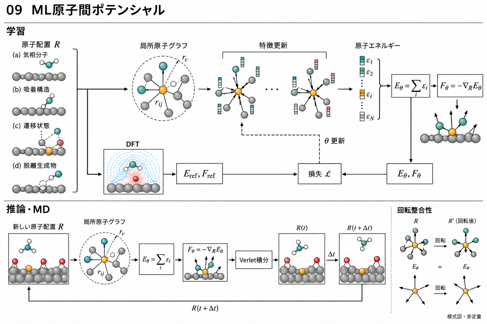

**概念図09　MLIPの教師データと推論。** 同じ構造を電子状態計算と機械学習の入力処理へ渡し、参照エネルギー・力との誤差で学習する。推論時に各ステップでDFTを必ず実行する構成ではない。

MLIP開発の成果物は、モデル重みだけでは完結しない。参照DFT条件、適用する元素・電荷・表面状態、独立検証結果、MDとの接続、外挿を検出したときの扱いを一組にする。一方、ガス候補や工程条件を選ぶ代理モデルの成果物は、実験条件と観測値のデータ集合、予測の不確かさ、次の候補選択則である。[代理モデルと実験条件の最適化](#section-21)で別に扱う。

### 一般事前学習モデルの候補

用途別の候補選定と採否の決め方は、[事前学習モデル専門表](ガスケミカルエッチング_計算手法選定レポート_20261005.md#pretrained-specialist)を参照する。UMAを単独の最良モデルとは位置付けず、分子・表面反応・改質層MD・継続開発の各用途で同条件の比較を行う。

各モデルの学習データ・入力・用途・追加学習・利用条件を比較する一覧は、[本文5.3の事前学習モデル表](ガスケミカルエッチング_計算手法選定レポート_20261005.md#pretrained-models)に集約した。ここでは、重みを選んだ後に必要なデータの調査と実装の確認をまとめる。

| 選ぶモデルの系統 | 具体的な候補 | 開発で確認する点 |
| --- | --- | --- |
| 多領域・表面 | UMA-S-1.2.1、MACE-MH-1 | task／head、表面・分子を評価するDFT基準、代表反応の障壁 |
| 分子・静電相互作用 | MACE-OMOL、MACE-POLAR-1、OrbMol-v2、UMA-omol | 電荷・多重度、長距離項、周期系への適用、生成物の安定性 |
| 無機材料 | MACE-MP/MPA/OMAT/MATPES、NequIP/Allegro-OAM、Orb-v3、CHGNet、MatGL、MatterSim | 結晶から実膜・終端・非平衡反応へ拡張するデータ |
| 商用の多領域推論 | PFP v9／Matlantis | 計算モード、評価範囲、契約資源、更新・持出し・追加学習条件 |

一般モデルの利用は、目的系での独立テストから開始する。対象エッチングへの専用学習済みと分類するには、対象ガス・膜・終端・反応が訓練または追加学習データに含まれる記録と、その外側での評価結果を残す。

#### 学習データを調べる際の確認表

| 調査項目 | 確認する実データ／モデルカード | 利用判断に反映する内容 |
| --- | --- | --- |
| 構造の単位 | 分子、クラスター、スラブ、周期バルク、軌跡フレーム | 原子数だけでなく、境界・密度・表面環境の一致 |
| 化学範囲 | 元素ペア、配位、電荷、多重度、吸着・解離・脱離・TS | FやClを含むだけでなく、実反応に必要な環境を含むか |
| 正解ラベル | 全系エネルギー／原子当たりエネルギー、F、応力、磁気モーメント | エネルギーの換算、力と応力の単位・符号、学習する出力 |
| 参照計算 | 汎関数、+U、基底／擬ポテンシャル、分散補正、孤立原子参照 | 追加DFTと学習head／taskの整合 |
| データ件数 | 総構造数、重複、独立系数、採用部分集合、軌跡相関 | 件数よりも反応・材料の多様性を評価 |
| 配布・利用条件 | データ、重み、コードの各ライセンスと版 | 推論、再学習、社内配布、外部提供を別々に確認 |
| 評価分割 | 未使用ガス系列、表面、被覆、反応、温度範囲 | 同じ軌跡の近接フレームを分けただけの過大評価を避ける |

#### UMAを導入するときに固定する設定

| 項目 | 採用記録に残す値 | 確認の方法 |
| --- | --- | --- |
| 重み | `uma-s-1p2p1`等の正確な識別子、チェックサム | 公式モデルカードと実ファイルを照合 |
| 実行環境 | fairchem-core、PyTorch、CUDA、GPU、精度・推論設定 | 小さな固定構造でE/Fを記録し再現性を確認 |
| task | `oc20`／`oc22`／`oc25`／`omat`／`omol`／`omc`／`odac` | 1.2系列の対応と学習DFTを確認。本文のタスク表を参照 |
| 電子状態 | 全電荷、多重度、各taskの入力規約 | `omol`は物理的な全電荷・多重度を明示。その他のtaskの規約を別管理 |
| エネルギー差 | 反応前後の構造群、全元素収支、同一基準 | 吸着・解離・脱離を一つのtask／参照DFTで評価 |
| 目的データ | 自社反応の学習集合と固定テスト、データ版 | ゼロショット→追加学習→新規学習を同じテストで比較 |

UMAの旧1.0には既知のサイズ拡張性の問題があり、現行の推奨から外れる。公式変更履歴では旧1.0に対応するfairchem-coreの上限も案内している。新規開発は現行推奨モデルを使い、過去の結果の再現には当時の重み・環境を保存する。[S30](#s30)

OrbMol-v2の内部電荷は、エネルギー・力に対する学習から得られる潜在量として読む。電荷移動の定量的な説明へ利用する場合は、採用したDFTの電荷解析と別に比較する。MatGLは版更新でグラフ／応力規約と重みの対応が変わるため、旧重みを新しい実装へ移すときにE/F/応力の一致を確認する。[S32](#s32)、[S34](#s34)

#### エネルギーを混ぜる落とし穴

気体を分子用の高精度学習head、固体を別のPBE系headで計算し、その値を単純に引いて反応エネルギーにしない。汎関数、原子基準、補正、モデルのタスク定義が異なるためである。反応前後を同じ計算条件で扱うか、明示的な校正と検証を行う。

#### PFPの最近の更新

2026年7月のPFP v9公式発表は、r²SCANモードの96元素対応と、表面・吸着、配位錯体などへの拡張を案内している。これはベンダーによる製品情報であり、任意のエッチングTSや絶対速度の精度保証ではない。対象反応の比較試験を行ったうえで契約価値を判断する。[[S23](#s23)]

### 専用MLIPを作る場合の選択

#### 目的用途に合わせた学習

ガス、基板、生成物、反応途中を同じ参照計算で学習する専用MLIPは、非晶質表面、被覆変化、多数の衝突の統計を繰り返す用途に向く。専用モデルを開発する場合も、DFTのモデル誤差は残る。学習器の誤差と参照DFTの誤差を分けて評価する。

| 候補 | 得意な構成 | 事前学習と実装負担 |
| --- | --- | --- |
| MACE | 等変表現によるエネルギー・力。追加学習と専用学習 | 一般重みを利用できるがライセンス別。PyTorch系。ASE接続から開始 |
| NequIP・Allegro | 等変モデル。Allegroは局所性を活かした並列MD | 専用学習の基盤。一般重みの存在と対象適合は別。LAMMPS連携版を揃える |
| DeepMD kit | Deep Potentialと能動学習、LAMMPS連携 | 枠組みだけではエッチ用重みを得ない。対応backendと導入手順を固定 |
| NEPとGPUMD | コンパクトな原子環境記述と高速GPU MD | 通常は対象データで学習。GPU実行を重視する候補 |
| ACE・GAP系 | 系統的な基底やカーネルによる局所エネルギー学習 | 少数元素の専用モデル候補。実装とモデルごとの利用条件を確認 |

#### データ集合に必要なもの

清浄面・改質面・欠陥・複数被覆、単離ガス、ラジカル、主要生成物、吸着配置、結合伸長、NEB周辺、短距離接近、温度で歪んだ構造を含める。入射を扱う場合は、そのエネルギー域の反発と表面損傷も必要となる。安定構造だけの学習では、障壁や反応経路を支えられない。

#### 能動学習の運用

初期DFT集合で複数モデルを学習し、短いMD・経路探索・被覆探索を行う。モデル間差や外挿指標で候補を選び、DFTでラベル付けして再学習する。同時に、低い不確かさで共通して誤る場合を検出するため、無作為点と重要反応の固定テスト集合を残す。モデルの正しさは独立したDFTテストで確認する。

コストの中心は学習GPUだけでなく、DFTラベル、探索、失敗した構造の診断、モデル更新の管理である。大量の繰返し計算が予定されていない場合は、少数のDFT経路計算で目的を満たす方が合理的なこともある。[[R08](#r08),[R12](#r12),[S21](#s21),[S24](#s24)–[S27](#s27)]

#### データ処理とモデル内部のアーキテクチャ

構成図B01では、データ集合の作成・分割を学習より先に行う。反応系列や表面モデルをまたいだ独立評価を残し、学習後のMD試験で物理的安定性を確認する。

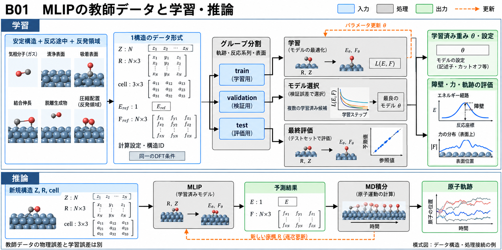

**構成図B01　MLIPデータ集合・学習・評価・推論。** 構造と参照エネルギー・力から学習用データを作り、学習・検証・固定テストを分ける。推論結果をMDへ渡す前に、反応エネルギー・障壁・構造安定性を評価する。応力は参照計算と用途に応じて追加するラベルである。

構成図B02の入力グラフは、原子をノード、カットオフ内の相互作用を辺として扱う。記述子型と等変モデルでは環境の表現方法が異なる。回転に対してエネルギーが不変、力がベクトルとして変換されることと、目的化学に高精度であることは別の条件である。

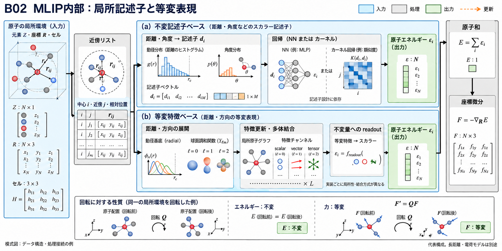

**構成図B02　記述子・等変モデル・エネルギー勾配。** 原子環境から原子ごとのエネルギー寄与を求め、全エネルギーを集約して座標微分から力を得るエネルギーベースMLIPの模式構成。電荷・長距離相互作用などの追加項が必要なモデルもある。

| 開発上の優先事項 | 比較を始める実装 | 選定時に確認すること |
| --- | --- | --- |
| ASEから少数構造・経路計算へ導入 | MACE | 目的反応の誤差、重み利用条件、追加学習費用 |
| 専用等変モデルと並列MD | NequIP・Allegro | 局所性、メモリ、近傍通信、LAMMPS連携版 |
| 学習・探索・LAMMPS配備を継続運用 | DeepMD-kit | 使用backendと各機能・配備経路の対応、モデル形式 |
| 限定化学系のGPU軌跡を大量実行 | NEP・GPUMD | 同じ反応テストでの精度とスループット |
| 少数元素で表現・データ量を系統的に検討 | ACE・GAP系 | 基底／記述子の収束、外挿、実装とモデルの利用条件 |

この表は性能順位ではなく、比較試験の入口を定めるための判断表である。PyTorchを開発基盤にする場合はMACE、NequIP/Allegroから試し、DeepMD-kitは採用版のbackend・学習・MD配備の組合せを固定する。異なるモデルを比較するときは、同じ参照データ、同じ反応テスト、同じGPU条件を使う。[[S21](#s21),[S24](#s24)–[S27](#s27)]

#### 能動学習で増やすデータと残す評価データ

概念図11は探索と追加ラベル取得の循環を示す。構成図B04の選別は、DFT計算を実施する候補を決める処理であり、モデル自身の予測を正解ラベルとして再投入する処理ではない。

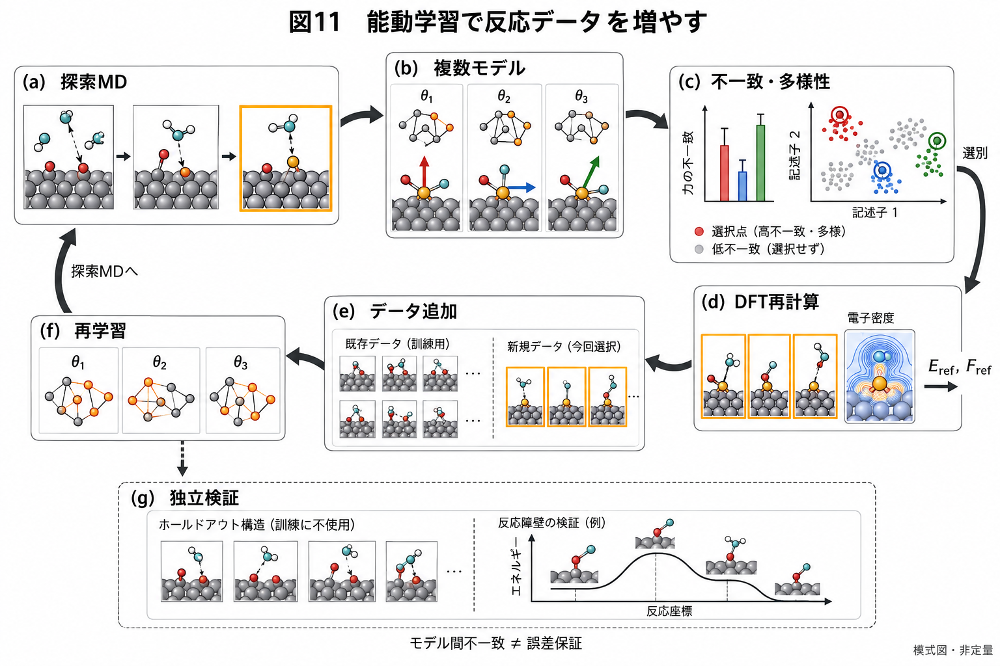

**概念図11　能動学習によるDFTデータ追加。** 暫定モデルによる探索、候補の選別、DFT評価、学習集合の拡張を繰り返す。既知の領域だけを反復しないよう、表面状態・反応系列ごとの被覆を確認する。

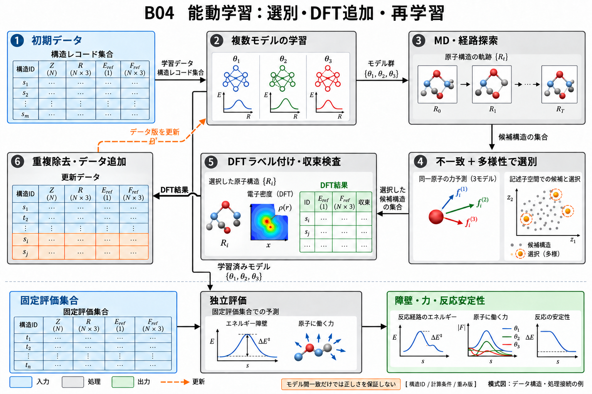

**構成図B04　能動学習の選別・DFT・再学習ループ。** 候補構造を参照DFTへ渡し、収束した計算のラベルだけをデータ集合へ追加する。独立テストは候補選別と再学習から分離し、モデル更新ごとに同じ基準で再評価する。

初期探索では、清浄面の熱振動だけでなく、ガスの接近、吸着、結合伸長、脱離、短距離反発を含む起点を用意する。委員会モデルが全て同じ未知領域で誤る可能性があるため、不確かさ上位点だけでなく、反応上重要な点と無作為点をDFTへ回す。停止条件は「モデル間差が小さい」だけでなく、未使用の反応系列・温度・被覆で必要な予測が安定したこととする。

### 事前学習と追加学習の採用基準

| 判定 | 確認する証拠 | 推奨する選択 |
| --- | --- | --- |
| 対象に近い公開重みがある | 同じガス・基板・被覆・温度域、学習データ、テスト条件、重み入手性 | 独立テストを通れば再利用。文献の存在だけでは採用しない |
| 一般事前学習の対応は広い | 目的結合、表面、電荷・スピン、生成物、TSへの誤差 | 構造前処理から試す。速度に使う前に反応特化の検証 |
| 近いが重要な領域が欠ける | 小規模DFTテストで局所的な誤り、学習・改変権限がある | 追加学習。元領域の忘却も同時に評価 |
| 大きく領域が異なる | 未対応元素・電荷、別の電子状態、重大な反応経路誤り | 専用学習または量子計算を継続。汎用重みを無理に使わない |
| 契約が学習・持出しを制約 | 企業利用、派生重み、社外データ、再配布、利用期間 | 権利と運用が合う実装へ変更、または契約条件を確定 |

#### 合格判定の具体化

初期の検証集合は、単離ガスと生成物、複数の表面終端、低・高被覆、主要な反応前後と経路、実温度の短いMDから構成する。必要数を一律に決めず、候補の順位や速度の感度が安定するまで増やす。反応物から生成物へのエネルギー差とTSの相対エネルギーを、総エネルギーRMSEとは別に評価する。

データ分割は、軌跡、反応系列、表面構造、ガス候補で分ける。同じMD軌跡の隣り合うフレームを無作為に訓練・テストへ分けるだけでは、新しい反応への性能を過大評価しやすい。未知ガスへの利用を主張するなら、ガス系列を丸ごと外した検証を設ける。

MDでは原子の異常接近、エネルギードリフト、非物理的な分解、誤った生成物安定化を調べる。短い軌跡の安定性だけで長時間の反応統計を承認しない。少数でも独立したDFT経路と実験の速度・組成に照合する。

#### 採用記録に残すもの

重みの版とハッシュ、参照汎関数、原子エネルギー基準、対応する電荷・スピン、学習・検証範囲、利用権、使用を止める外挿条件を記録する。ゼロショット、追加学習、専用学習を同一条件で比較し、必要精度を満たす総費用が最小の構成を選ぶ。

#### 事前学習の採用は重みの入口と目的データを分けて判断する

概念図10と構成図B03の三経路は、ゼロショット、追加学習、新規学習である。ゼロショットでも目的系の評価データは必要であり、追加学習しないことと検証しないことを同一視しない。

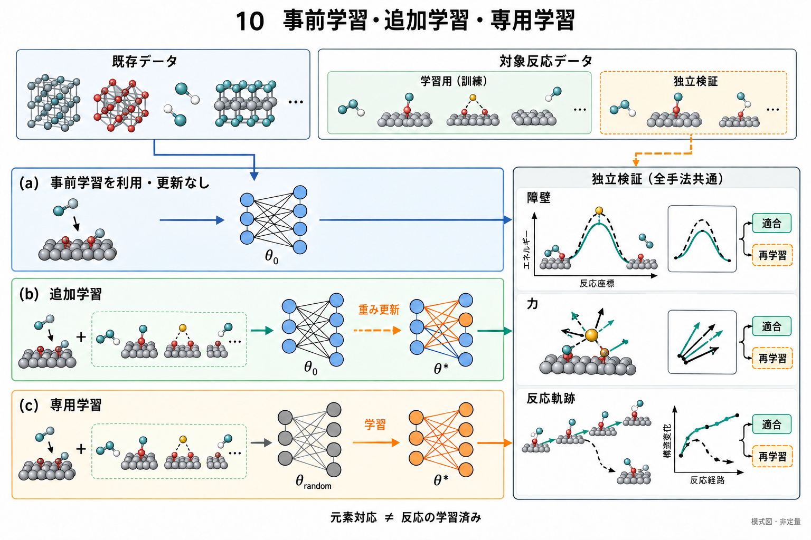

**概念図10　事前学習・追加学習・新規学習。** 既存重みをそのまま評価する経路、既存重みを目的データで更新する経路、目的データで新たに学習する経路を比較する。

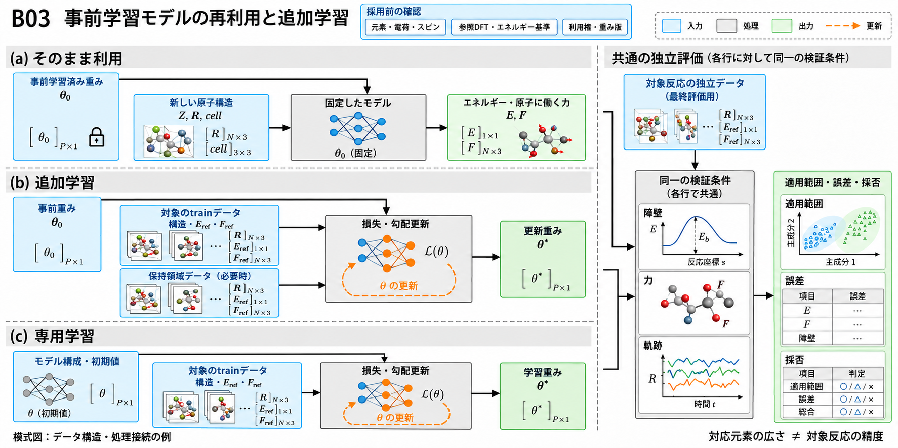

**構成図B03　事前学習利用の三経路と採用判定。** 既存重みと目的DFTデータを独立の入力として管理し、各経路の結果を共通の反応・MD評価へ渡す。目的DFTラベルを作らずに転用の妥当性を判断する構成ではない。

目的用途に特化した公開重みを採用するには、同じガス名だけでなく、表面相・終端・荷電状態・温度・入射エネルギー・生成物を照合する。一般材料の事前学習モデルは、初期構造の提案には使えても、脱離障壁や残渣形成の順位付けには追加検証を要する。一般モデルからの追加学習と新規学習のどちらが有利かは、必要なDFT点数と最終精度、運用費用を同じ条件で比較して決める。

採用記録には「目的系で事前学習済み」「一般事前学習から転用」「目的系で追加学習」「目的系で新規学習」の区分を必須項目として設ける。モデル名だけでは再現できないため、重み版・計算タスク・エネルギー基準も併記する。[一般事前学習モデルの候補](#section-18)の一般モデル一覧は、この判定の候補リストである。

### 代理モデルと実験条件の最適化

#### ガス候補を順位付けする代理モデル

入力はガスの構造・記述子、対象材料、表面終端、共反応物、温度・圧力などで、出力は反応障壁、生成物形成、エッチ速度、選択比などである。Gaussian process、木モデル、GNNなどが候補となる。これらは原子の力を出すMLIPとは別のモデルである。

学習には、目的条件に対応するDFTまたは実験のラベルが必要となる。分子物性の事前学習表現を使っても、エッチ速度が事前学習されていることにはならない。同じガスでも装置、表面、曝露履歴によって結果が変わるため、欠測したプロセス情報を単一のガス記述子で代用しない。

#### Bayesian optimization

少数の高価な実験を逐次選ぶ目的に適する。現在の性能と不確かさをモデル化し、獲得関数で次の候補を選ぶ。温度、混合比、パルス時間、候補分子の離散選択を扱い、速度、選択比、残渣などの多目的・制約付き探索にする。BoTorchはPyTorchベースの実装候補である。[[S29](#s29)]

| 用途 | 事前学習の要否 | メリットとデメリット |
| --- | --- | --- |
| 既存ガスの条件最適化 | 専用の実験履歴で学習。一般目的の観測データから開始できる | 少数実験を選びやすい。装置ドリフトとノイズの扱いが必要 |
| 新規ガスの探索 | 分子表現の転用は可能。目的ラベルは別途必要 | 候補数を減らせる。未知化学領域では外挿の根拠が弱い |
| 多忠実度最適化 | 粗い計算、DFT、実験の関係を学習 | 安価な計算を活用。低精度と高精度の順位が合わないと失敗 |
| 速度論の代理化 | 既存MKMや形状計算の出力で学習 | 多数条件を高速走査。基礎モデルの誤差を継承する |

#### 実用の評価方法

ランダム探索や単純な実験計画と、同じ実験予算で比較する。探索範囲外を予測できると仮定せず、候補の信頼区間、棄却条件、確認実験を残す。学習・推論は原子計算より軽いことが多いが、費用の大半がラベル取得であることは変わらない。

反応機構の説明が目的なら、相関を学ぶ代理モデルだけで結論を出さない。選ばれた候補について、DFTの反応経路または表面・生成物測定を追加し、性能が変わる理由を確認する。

#### 実験データを戻す最適化ループ

概念図12は、現在の予測を用いて次の条件を選び、観測を追加する循環である。構成図B05では、ガス・材料・工程条件の特徴量、目的値、不確かさ、獲得関数、実験または高精度計算を別の処理として管理する。

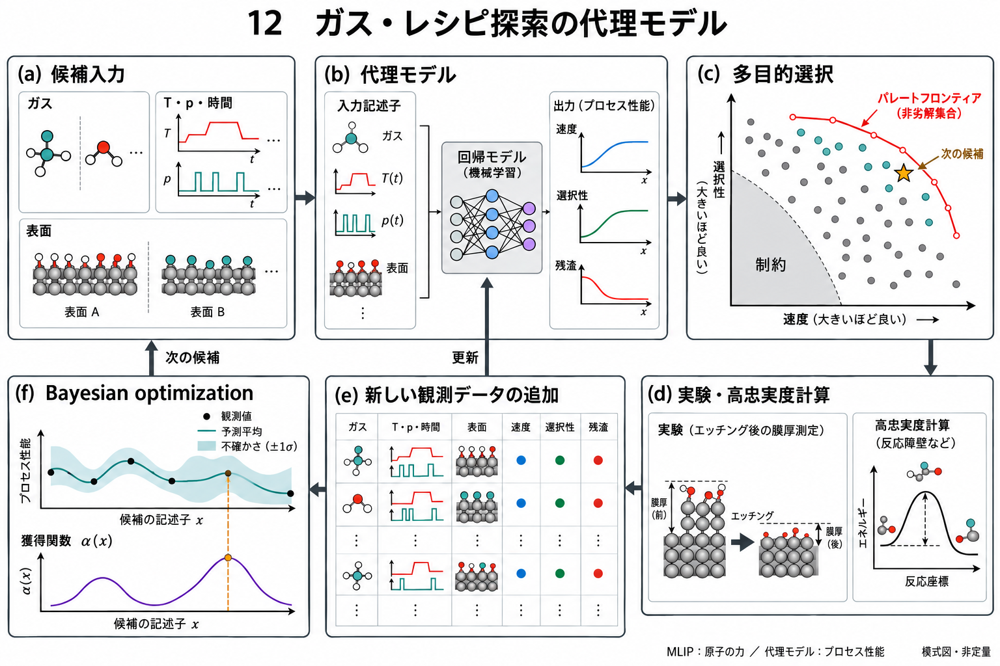

**概念図12　代理モデルと逐次実験選択。** 予測平均と不確かさから次の候補を選ぶ。模式的な曲線や点は実験データではない。選ばれた条件を実行し、得られた観測値を学習へ戻す。

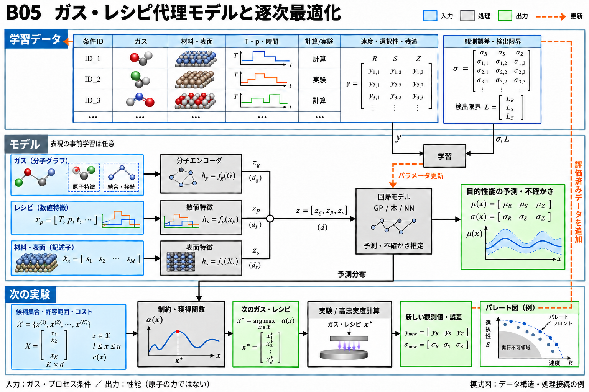

**構成図B05　プロセス代理モデルと最適化ループ。** データ前処理→代理モデル→制約を含む候補選択→実験／計算→観測追加のループ。MLIPのエネルギー・力ではなく、エッチ速度、選択性、残渣などの目的量を扱う。

装置と材料を固定した温度・曝露・混合比の最適化では、目的データで学習するGaussian processとBoTorchを初期候補とする。少数の高価な観測で不確かさを使って実験を選ぶ設計に適している。表形式データが増えたら木モデルを予測の比較基準とし、分子構造を広く変える場合は記述子やGNN表現の寄与を独立に評価する。分子表現の事前学習を導入しても、目的のエッチング性能ラベルは必要である。[[S29](#s29)]

実験データには、未反応、検出限界以下、装置異常による欠測を区別して記録する。ガス系列や装置が異なるデータを統合する際は、装置条件・膜履歴の変数を保持する。モデル更新後に既知条件の反復点を確認し、装置ドリフトを新規ガスの効果と混同しない。

### 機械学習で注目する最近の実証

| 年と文献 | 確認できる成果 | エッチングへの判断 |
| --- | --- | --- |
| 2024 HFと非晶質Si₃N₄ [[R04](#r04)] | MLIP MDによるエッチングと連続体への接続 | 直接関連。終端・入射条件の範囲を確認。一般の熱反応へは再検証 |
| 2025 Pyntaと反応MLP [[R07](#r07)] | Ag上のメタノール反応でTS計算を高速化 | 触媒での実証。エッチング専用ではない。反応群別学習の設計が参考 |
| 2025 能動学習と拡張サンプリング [[R08](#r08)] | 反応領域を含むデータ収集を効率化 | 触媒系からの応用候補。表面・ガスに合わせCVと探索範囲を設計 |
| 2025 chemtrain deploy [[R13](#r13)] | 学習モデルを並列MDへ接続する実装 | 大規模推論の候補。反応精度を保証する成果ではない |
| 2026 F・CF₂とSi・SiO₂ [[R09](#r09)] | 能動学習DeepMD、イオン支援収率、表面速度モデルへの接続 | エッチングに直接関連。ただしArイオン支援条件。中性熱反応と区別 |
| 2026 大規模MPNN実装 [[R14](#r14)] | 大規模原子系への並列推論と反応系の別実証 | 大原子数の実証を、同規模のエッチング検証と取り違えない |

#### 性能向上の数字の読み方

Pynta連携の2025年論文では、53反応を対象とする専用反応MLPでDFT単独比7倍の高速化を報告し、別の事前学習モデルの追加学習構成では20倍とTS探索成功率89%を報告する。対象はAg触媒上の反応であり、エッチングで同じ倍率が得られるという意味ではない。失敗したTSのDFT再計算も含めて導入効果を評価する。[[R07](#r07)]

#### 再利用前に確認する公開範囲

エッチングの専用MLIPを報告した論文があっても、再利用可能な重み、完全な学習データ、学習スクリプト、対象外条件での検証が揃うとは限らない。本レポートでは、R04とR09の公開重みを実際に取得して再現試験したわけではない。採用前に本文・補足資料・データ公開欄と利用条件を確認する。

一般事前学習、能動学習、並列推論は組合せ可能である。ただし採用判断は、最終的に必要な障壁、生成物、速度、選択性を再現できるかで行う。最大原子数やベンチマーク総合順位だけで決めない。

## C 費用・実装・データ・検証

- [必要な空間と時間を分ける](#section-2)
- [計算に必要な入力と成果物](#section-3)
- [手法を用途で比較する](#section-23)
- [計算費用を同じ基準で見積もる](#section-24)
- [化学計算ソフトと導入の比較](#section-25)
- [探索と速度論と形状の実装比較](#section-26)
- [機械学習実装と利用条件の比較](#section-27)
- [具体的な実装とデータの受け渡し](#section-28)
- [実験と照合して予測範囲を決める](#section-29)
- [採用と開発を決める実行計画](#section-30)

### 必要な空間と時間を分ける

原子反応を追跡する領域と、装置・パターン全体を計算する領域を分ける。下表は計画用の代表的な対象範囲であり、各ソフトの性能上限ではない。原子数、電子状態、ハードウェア、必要な統計精度で実行可能範囲は大きく変わる。

| 階層 | 主な対象 | 計算から得る情報 |
| --- | --- | --- |
| 分子と局所反応 | 分子、吸着サイト、数層の表面 | 生成物、反応経路、吸着自由エネルギー、障壁 |
| 原子集団 | nm領域の表面、改質層、衝突 | 欠陥、被覆、生成物分布、反応確率、局所構造 |
| 表面速度論 | 長時間の被覆率と組成変化 | 秒単位の速度、誘導時間、飽和、EPC |
| フィーチャー | nm〜µmの溝・孔・側壁 | 局所フラックス、深さ方向の均一性、形状変化 |
| 装置 | 反応器とウエハ近傍 | 到達化学種、分圧、滞留時間、供給均一性 |

#### 全原子MDで大空間と長時間を同時に扱う難しさ

原子密度を仮に50 atoms/nm³とすると、10 nm立方体は約5万原子、100 nm立方体は約5千万原子、1 µm立方体は約500億原子になる。1 µm角の表面を厚さ10 nmだけ切り出しても約5億原子である。表面反応に重要な局所領域だけを原子で表す理由は、この体積増大にある。

時間刻みを0.5 fsと仮定すると、1 µsには20億ステップが必要である。また、単一の反応について試行頻度10¹³ s⁻¹、障壁1.0 eV、400 Kを仮定したArrhenius式では、平均待ち時間は約0.4 sとなる。どちらも説明用の計算であり、特定のエッチング反応の実測値ではない。

#### 目的のスケールに必要な接続

DFT・MDから局所反応の速度または確率を抽出し、表面速度論へ渡す。表面速度論は、輸送計算が与える局所フラックスと温度を受け取り、除去速度、消費フラックス、生成物放出量を返す。level setなどはその除去速度から形状を更新する。これにより、反応機構の説明と実用寸法の予測を同一のモデル体系にできる。

空間拡大と時間拡大を別々に見積もる。GPU化、並列化、MLIPは1ステップを速くするが、低頻度反応の待ち時間そのものを消さない。加速MDや速度論モデルには、別の仮定と検証が必要である。

#### 全体アーキテクチャと責任分界

構成図A01は、原子反応の計算とプロセス計算の間で渡す量を示す。電子状態計算のエネルギーを直接形状ソルバーへ入れるのではなく、熱化学補正、反応速度、表面での物質収支を順に構成する。各段階に入力の適用温度・被覆範囲と不確かさを添える。

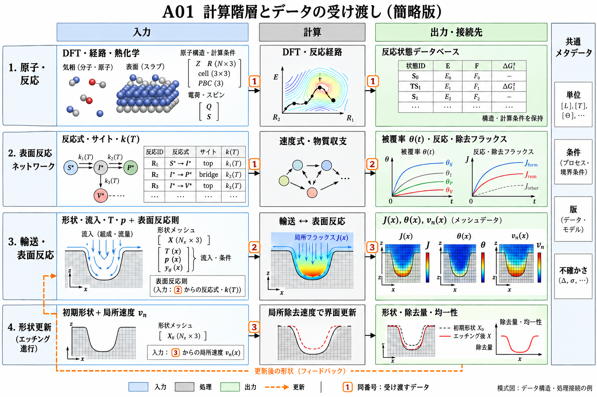

**構成図A01　全体構成とスケール間の受け渡し。** 左から局所反応、表面速度論、輸送、形状を読む。矢印はモデル間の情報交換であり、全ソフトを一体化した既製製品を示すものではない。色分布と構造は模式例である。

開発の最小単位は、単一の材料・ガス条件で閉じた反応サイクルを計算し、平面の除去速度まで接続する構成とする。ASEと一つのDFT計算器、表面MKMを初期構成に選ぶ。形状の課題がある場合だけ輸送ソルバーを追加する。MLIPは原子計算の力評価を置き換える選択肢であり、全体アーキテクチャを成立させる必須要素ではない。実装候補と契約条件は[実装・利用条件一覧](#section-25)にまとめる。

### 計算に必要な入力と成果物

「ガス名と基板材料」だけでは、機構や速度を一意に計算できない。特に表面終端、微量水分、共反応物、改質層の履歴は、候補ガスの優劣を反転させ得る。次の情報を計算仕様書として最初に固定する。

| 入力群 | 最低限の内容 | 不足した場合の扱い |
| --- | --- | --- |
| 材料と表面 | 組成、相、結晶面または非晶質、膜密度、OH・H・F終端、欠陥 | 複数の表面モデルを用意し、結果の幅を報告 |
| ガスと供給 | 分子・ラジカル・イオンの区別、混合比、分圧、供給順、パルス・パージ | 導入ガスと到達種を区別し、未測定量を感度解析 |
| 熱・エネルギー | 基板温度、ガス温度、入射角・エネルギー分布、電荷状態 | 熱反応と高エネルギー衝突を別条件として計算 |
| 幾何と履歴 | 形状、深さ、幅、側壁、前処理、改質層、サイクル番号 | 平面で校正し、別形状で予測を検証 |
| 判定指標 | 速度、選択比、残渣、粗さ、損傷、均一性、EPC | 優先順位と許容範囲を数値で定義 |

#### 階層ごとの出力を混ぜない

量子化学の出力は構造、エネルギー、力、振動、電荷密度、反応障壁である。MDの出力は軌跡とその統計である。いずれも、そのまま装置条件でのnm/minを意味しない。温度・分圧依存の速度定数、反応確率、サイト密度へ変換して初めて、プロセス速度に接続できる。

保存する成果物は、候補ガス一覧、表面構造集合、反応ネットワーク、各反応の根拠、速度式、適用温度・被覆率範囲、生成物分布、モデル誤差、検証条件である。候補が不適合だった理由も残す。反応しなかった計算と、計算範囲内では観測されなかった計算を区別する。

#### リモートプラズマの場合

供給したNF₃や添加ガスが、そのまま表面に到達するとは限らない。分解、気相反応、壁損失、再結合を含めて到達種を定める。NF₃/NH₃/N₂系の原著は気相反応経路とHF形成を扱っており、上流の化学が表面入力を左右する具体例となる。ただし、その気相モデルだけで表面エッチング機構まで決まるわけではない。[[R02](#r02)]

### 手法を用途で比較する

記号は、◎が主用途、○が適切な設定で有用、△が補助またはモデル入力に依存、―が直接の用途ではない、を意味する。各欄は本レポートの判断であり、精度の順位ではない。

| 手法 | 新反応 | 反応統計 | 長時間速度 | 形状 |
| --- | --- | --- | --- | --- |
| DFTとTS | ◎ | △ | ○ | ― |
| AIMD | ○ | △ | △ | ― |
| DFTB・xTB | ○ | ○ | △ | ― |
| 反応力場MD | ○ | ◎ | △ | △ |
| AFIRなどの経路探索 | ◎ | ― | ○ | ― |
| 拡張サンプリング | ○ | ○ | ○ | ― |
| 加速MD・WE | △ | ○ | ○ | ― |
| QM/MM | ○ | △ | △ | ― |
| 粗視化MD・DPD | △ | ○ | △ | ○ |
| MKM・反応拡散 | ― | △ | ◎ | ○ |
| kMC | △ | ◎ | ◎ | ○ |
| 輸送とlevel set | ― | ― | ○ | ◎ |
| MLIPとMD・TS | ○ | ◎ | ○ | △ |
| 代理モデルとBO | △ | ― | △ | △ |

DFTとTSの「長時間速度」は、TST等を介した推定を意味する。MLIPも同様に、MDの時計を自動で加速する意味ではない。kMCの「新反応」は自己学習型の拡張を想定し、通常の固定イベント表型では新規反応を発見しない。粗視化の反応は、組み込んだ反応則またはポテンシャルに依存する。

#### 最初の選択を三つに絞る

未知のガス化学が課題なら、DFT・TSと反応探索を選ぶ。既知に近い化学で原子統計が不足するなら、検証済みの反応力場または専用MLIPを選ぶ。化学の入力が揃い、実時間・大空間が課題なら、MKM・反応拡散と輸送・形状計算を選ぶ。複数の課題があれば、この順序で接続を設計する。

### 計算費用を同じ基準で見積もる

以下は相対的な計画目安であり、測定された実行時間ではない。ソフトの速度比較は、原子数、系、精度、時間刻み、ハードウェアを揃えた自社ベンチマークで行う。

| 区分 | 初期費用 | 反復時の主な費用 |
| --- | --- | --- |
| 分子・表面DFTとTS | 構造、収束、経路の設計 | 力評価数、SCF収束、NEB像、汎関数。中〜非常に高 |
| AIMD | 電子状態と表面の準備 | 全ステップで電子状態計算。非常に高 |
| DFTB・反応力場MD | 適合するパラメータ検証。新規開発なら高 | 原子数×ステップ×軌跡数。低〜中だが統計で増大 |
| 専用MLIP | DFTラベル・学習・検証。高 | GPU推論、近傍通信、軌跡数。DFTより軽いことが多い |
| MKM・反応拡散 | ネットワークとパラメータ同定 | 反応数、剛性、空間格子、感度解析。低〜中 |
| kMC・輸送・形状 | 反応則と幾何、境界の実装 | イベント・粒子・格子・サイクル数。中〜高 |
| 代理モデル・BO | 目的ラベルと評価設計 | 学習・推論は比較的軽い。実験・DFT取得が支配的 |

#### 再現できる見積もりの式

DFTラベルの資源量は、構造数×1構造の平均時間×割当コア数で概算する。MDは、目標物理時間/時間刻み×1ステップ時間×独立軌跡数で求める。料金はコア時またはGPU時に契約単価を掛ける。待ち行列、再実行、保存、ライセンス、担当者の開発時間を別項目にする。

仮にDFTラベル1構造が64コアで30分、必要数が2,000なら64,000 core-hoursである。10ノードで理想的に分散すれば100時間だが、実際は不均一なSCFと待ち時間で変わる。仮にMDの1ステップが1 GPUで5 ms、0.5 fs刻みなら、1 nsは約2.8 GPU-hours、1 µsは約2,778 GPU-hoursとなる。これらは仮定から算出した例で、特定ソフトの性能値ではない。

#### 追加学習の採算

学習前の計算費用をC₀、学習後をC₁、データ作成・開発費をCtrainとすると、同等精度を仮定した損益分岐の反復回数は概ねCtrain/(C₀−C₁)である。未知化学への拡張ごとに再学習費が発生する場合、その分も入れる。高速化率だけでML採用を決めない。

### 化学計算ソフトと導入の比較

費用と利用条件は2026年10月5日の公式情報を基準とする。導入容易度は、容易が配布バイナリやPython中心、中が依存関係と計算環境の準備、高難度がHPC連携やモデル開発を要する、という評価である。科学的に妥当な入力を作る難しさは、インストールの難しさとは別である。

| ソフトと参照 | 費用とライセンス | 導入と対象用途 |
| --- | --- | --- |
| CP2K [[S01](#s01)] | 無償。GPL系 | 中。周期DFT、AIMD、QM/MM。コンテナや配布版を入口に、MPI・GPU構成を固定 |
| Quantum ESPRESSO [[S02](#s02)] | 無償。GPL | 中。周期DFTと関連計算。擬ポテンシャル、平面波収束、並列設定が必要 |
| VASP [[S03](#s03)] | 有償のライセンス契約 | 中。周期DFT・AIMD。入手資格、コンパイル、契約と擬ポテンシャル管理 |
| ORCA [[S04](#s04)] | 学術利用は無償。企業利用は有償 | 比較的容易。分子・クラスターDFT、高精度電子状態。周期スラブの主実装とは分ける |
| xTB [[S05](#s05)] | 無償。LGPLv3系 | 容易〜中。分子・クラスターの前処理、構造探索。DFT検証が必要 |
| DFTB plus [[S07](#s07)] | 本体無償。LGPLv3以降。パラメータは別確認 | 中。周期・分子の近似量子計算。対象元素ペアのパラメータが導入判断を左右 |
| LAMMPS [[S08](#s08)] | 無償。GPLv2。力場ファイルは別確認 | 中。反応性MD、加速法など。必要packageとGPUビルドの確認 |
| AMS ReaxFF [[S09](#s09)] | 有償。モジュールと契約条件による | GUIにより準備しやすい。パラメータの妥当性を保証するものではない |

#### 企業導入時に比較する実費

公開価格が一定でない製品は見積り取得を前提とする。ライセンスが無料でも、HPC・GPU、ストレージ、研究者の検証時間、継続保守には費用がかかる。複数のDFT実装を混ぜる場合は、擬ポテンシャルやエネルギー基準の違いを校正する。

OSS本体、力場パラメータ、擬ポテンシャル、配布コンテナの条件を別々に記録する。商用可否は単に「ソースコードが見えるか」では判断できない。

### 探索と速度論と形状の実装比較

| 実装と参照 | 費用と導入 | 用途と開発上の要点 |
| --- | --- | --- |
| ASE [[S06](#s06)] | 無償OSS。Python中心で比較的容易 | 構造操作、計算器接続、NEB。計算器を別途導入 |
| GRRMとAFIR [[S10](#s10)] | 有償。中〜高難度 | 反応探索、ネットワーク。計算器の対応と領域設計が必要 |
| Pynta [[S11](#s11)] | 無償。GPLv3。高難度 | 表面TS・熱化学の自動化。FireWorks、DFT、表面モデルを統合 |
| PLUMED [[S12](#s12)] | 無償。LGPLv3。中〜高難度 | CV、metadynamics、OPES。MD実装との連携ビルド |
| LAMMPS加速法 [[S13](#s13)] | 本体に対応。中〜高難度 | hyper、prd、tad。状態・バイアス・温度加速の仮定検証 |
| WESTPA [[S14](#s14)] | 無償OSS。中〜高難度 | weighted ensemble。外部軌跡計算器と状態・ビン定義 |
| Cantera [[S17](#s17)] | 無償。BSD 3 clause。中 | 気相・表面速度論、熱化学。目的反応機構の入力が必要 |
| ViennaPS [[S18](#s18)] | 4.3.0以降はGPLv3。無償。中 | Python配布が入口。独自表面則やGPU版は追加開発 |
| SPARTA [[S19](#s19)] | 無償。GPLv2。中〜高難度 | DSMC。気相衝突・境界反応モデルを準備 |
| Zacros [[S20](#s20)] | 商用ライセンス。学術条件は別途。中〜高難度 | 格子kMC。相互作用を含む表面反応。無料OSSとは扱わない |
| SPPARKS [[S20](#s20)] | 無償。GPL。中〜高難度 | 並列kMC基盤。目的の反応モデル実装が必要 |

#### 実装があることとモデルが完成していることは別

CanteraやViennaPSを導入しても、特定の新規ガスに対する反応式・付着係数・改質層モデルが自動的に揃うわけではない。最初の開発課題は、異なるスケール間のデータ形式と反応則の定義である。

ViennaPSは古い資料のMIT表記を最新版の条件として転用しない。ここでは公式リポジトリが示す版ごとのライセンス変更を反映した。導入時にはソフト版、依存ライブラリ、配布形態を固定して記録する。

### 機械学習実装と利用条件の比較

| 実装またはモデル | 費用と利用条件 | 導入と事前学習の注意 |
| --- | --- | --- |
| MACE本体 [[S21](#s21)] | MITの公開コード | Python・GPU環境で中程度。学習済み重みの条件は別 |
| MACE MP・MPA [[S21](#s21)] | モデル一覧ではMITの版がある | 汎用事前学習。対象反応での検証と、必要に応じた追加学習 |
| MACE OMAT・MATPES・OMOL・MH・POLAR [[S21](#s21),[S31](#s31)] | 一覧ではASLの版。学術非商用を前提。企業利用は別権利の確認 | コード本体がMITでも重みに自動で適用しない |
| fairchemとUMA [[S22](#s22)] | コードはMIT。UMA重みはFAIR Chemistry License | 無償取得と条件同意。独自ライセンスをMITや一律の非商用制限と混同しない |
| MatlantisとPFP [[S23](#s23)] | 有償SaaS。契約・見積りによる | 環境面は比較的容易。重み持出し・追加学習・データ取扱いは契約確認 |
| NequIP・Allegro [[S24](#s24)] | 公開コード。主要実装はMIT | 中〜高難度。PyTorchとLAMMPS接続版を揃える。公開重みは個別条件 |
| DeepMD kit [[S25](#s25)] | 無償。LGPLv3以降 | 中〜高難度。PyTorch・JAX・TensorFlow等の対応と配備経路を確認 |
| GPUMDとNEP [[S26](#s26)] | 無償。GPLv3の公開実装 | 中。GPU、学習・実行形式を揃える。対象重みは別 |
| GAP・ACE系 [[S27](#s27)] | 実装ごとに異なる。ASLを含むため採用実装ごとに企業利用条件を確認 | 専用学習の候補。権利・LAMMPS接続を個別確認 |
| CHGNet [[S28](#s28)] | 公開コード。BSD系の条件 | Python中心で中程度。結晶用の事前学習を対象化学へ検証 |
| Orb／OrbMol [[S32](#s32)] | 公式READMEではモデルをApache-2.0で提供 | PyTorch・ASE、追加学習。保存力型、近傍数、電荷・スピン、重み版を固定 |
| NequIP／Allegro OAM-L重み [[S35](#s35)] | 対象モデルカードはCC-BY-4.0、本体MIT | 追加学習可能。材料データ起点なので反応データの補充とMD検証を計画 |
| MatterSim [[S33](#s33)] | MITの公開実装とv1重み | PyTorch、ASE、追加学習。主領域はバルク材料 |
| MatGL [[S34](#s34)] | BSD系のコード、重みは個別の配布条件 | PyTorchを基本とする。JAX推論は対応モデルの範囲で比較 |
| scikit-learn／Optuna [[S36](#s36)] | BSD／MITの公開コード | 目的データから性能予測／評価関数から探索。導入は比較的容易 |
| BoTorch [[S29](#s29)] | 無償。MIT | Python・PyTorch。ガス探索用のラベルと最適化設計が必要 |

ASLの非商用制限は公式ライセンス本文による。企業研究を学術研究と同一視しない。一方、UMAの独自ライセンスには利用・改変等の権利と条件があるため、名称だけで商用禁止と断定しない。[[S21](#s21),[S22](#s22)]

導入比較では、ソフト、重み、データ、クラウド契約を四つの別項目にする。価格や権利が公開資料だけで確定しないものは、調達時の確認事項として残す。

### 具体的な実装とデータの受け渡し

#### 最小構成から始める

非MLの初期構成は、ASEで構造・計算ジョブを管理し、CP2KまたはQuantum ESPRESSO等でDFTとNEBを実行し、表面MKMをCantera等に渡す。形状が必要になった段階でViennaPSを追加する。反応統計が不足した場合にのみ、LAMMPSの反応力場または専用MLIPを追加する。これは選択例であり、既存のVASPや商用環境があれば置き換えられる。

| 受け渡す記録 | 必須項目 | 利用先 |
| --- | --- | --- |
| 構造 | 元素、座標、セル、周期境界、電荷・スピン、終端、生成元、単位 | DFT、力場、MLIP、再現計算 |
| 量子ラベル | エネルギー、力、応力、計算設定、収束状態、参照エネルギー | MLIP学習、反応エネルギー |
| 素反応 | 反応物・生成物、サイト、TS、ΔG‡(T)、逆反応、適用被覆範囲 | MKMまたはkMC |
| 入射イベント | 種、E、角度、温度、表面状態、成功数、試行数、生成物 | 反応確率と輸送境界 |
| 表面則 | 反応・付着・脱離・拡散、表面状態の更新、体積換算、誤差 | 形状・輸送モデル |
| 実験記録 | 装置条件、膜履歴、計測法、検出限界、日付、反復、不確かさ | 校正と独立検証 |

#### 入出力の整合で最も起きやすい失敗

eVとJ/mol、barとPa、面積当たりフラックスとサイト当たり速度を混ぜない。反応式の元素・電荷・サイト収支を自動検査する。MDから得た「入射1個当たりの除去原子数」を、表面被覆と入射種の条件を落として定数にしない。

表面の法線速度は、正味の除去原子または化学式単位のフラックスと原子・分子体積から計算する。改質による体積増加、密度変化、生成物再堆積がある場合は、単純な除去量換算に追加項が必要となる。

#### ソフト接続の確認順

まず1構造のエネルギーと力を計算し、同じ構造の外部インターフェース出力と一致させる。次に短いMD、1本の経路、1種類の表面速度式、平面の除去量を確認してから形状へ進む。最初から全階層を接続すると、単位・モデル・連携のどこに誤りがあるか切り分けにくい。

#### 図の入出力を実装するための共通データ仕様

構成図A03・B01・B02の構造入力と、A02・A07の反応入力は別のデータ型として定義する。以下は推奨する内部仕様の例であり、各ソフトのAPI名を規定するものではない。外部ソフトへの入出力で単位を変換し、内部では一貫した単位を保持する。

| データ | 形状・単位の例 | 必須の付帯情報 |
| --- | --- | --- |
| 原子種・座標 | Z[N]、R[N,3]、Å | 原子ID、電荷・スピン、構造ID、生成経路 |
| セルと境界 | cell[3,3]、Å、pbc[3] | 真空層、固定原子、表面法線、座標規約 |
| 教師ラベル | E：スカラー eV、F[N,3]：eV/Å | 計算器・汎関数・擬ポテンシャル・収束・原子参照 |
| 応力 | 3×3テンソルまたは定義済み6成分 | 単位、符号、成分順。スラブの真空体積による規格化を明示 |
| 反応経路 | 構造ID列、TS ID、ΔG‡(T) | 反応式、原子対応、標準状態、検証済み接続先 |
| 速度則 | k(T,P,θ)または定義したパラメータ | 反応次数、単位、サイト基準、逆反応、適用範囲 |
| 入射と除去 | 分子または化学式単位／m²／s | 種、角度・エネルギー、被覆、正味／総量の区別 |
| MLモデル | 重みファイルと固定識別子 | データ版、分割ID、参照計算、用途への学習区分 |
| プロセス観測 | 条件ベクトルと目的量・不確かさ | 材料履歴、装置、単位、反復、欠測・検出限界 |

Nは構造ごとに異なり得る。学習バッチには構造ごとの境界を保持し、異なる構造の原子を一つの物理系として接続しない。データの採用状態は「計算失敗」「収束済み」「検証済み」などを分け、SCF未収束や不正な原子配置を通常の教師データに混ぜない。

構造の初期交換にはASEで読み書きできる形式、反応ネットワークには明示的なIDを持つ表・JSON等、速度論には実装が受け付ける機構形式を用いる。形式を統一するだけでなく、エネルギー基準とサイト密度が同じであることを確認する。[[S06](#s06),[S17](#s17)]

### 実験と照合して予測範囲を決める

学習やパラメータ調整に使った条件と、最終評価に使う条件を分ける。平面のエッチ速度に合わせたモデルが、溝や別の温度で正しいとは限らない。複数の観測量で、同じ速度を与える異なる機構を区別する。

| 検証対象 | 対応する観測例 | 判定の意味 |
| --- | --- | --- |
| 除去と飽和 | 膜厚、QCM、EPC、曝露時間依存 | 表面反応停止、遅い脱離、供給不足を区別 |
| 表面中間体 | XPS、FTIRなどの組成・結合状態 | 反応ネットワークと終端の妥当性を確認 |
| 揮発性生成物 | 排気の質量分析、ガス分析 | 基板原子が何として除去されるかを確認 |
| 温度依存 | 速度と生成物の温度変化 | 律速候補を比較。見掛け活性化エネルギーを単一障壁と同一視しない |
| 選択性と残渣 | 対象膜と保護膜の同条件比較、表面・深さ分析 | 候補ガスの採否に直結。低速度側の検出限界も記録 |
| 形状と粗さ | 断面観察、深さ方向の膜厚、AFM | 輸送、局所反応、相・面方位のばらつきを評価 |

#### 不確かさを三つに分ける

第一は参照物理の不確かさで、DFT汎関数、表面相、欠陥、反応ネットワーク漏れを含む。第二は数値・統計誤差で、セルサイズ、時間刻み、サンプル数、収束などである。第三はモデル移植の誤差で、DFTからMLIP、原子からMKM、平面から形状への近似を含む。各段階で誤差を別々に記録し、最終出力へ伝播する。

#### ガス探索の比較指標

エッチ速度最大化だけでなく、選択比、除去当たりの残渣、粗さ、供給と排気の成立性、サイクル時間を同時に比較する。選択比は分母が検出限界以下のとき、有限の確定値として扱わず下限値を報告する。膜厚変化がゼロに近い場合も、化学改質が起きていないとは限らない。

採用判断を左右する未測定量があれば、モデルをさらに複雑にする前に、その量を区別できる実験を優先する。例えば生成物分析は、同じ除去速度を与える直接揮発化と塩形成後脱離の区別に役立つ。

### 採用と開発を決める実行計画

以下は材料とガスが未指定の現段階での推奨計画である。期間を一律に約束するのではなく、各段階の成果物と進行条件を定めて投資を増やす。

| 段階 | 具体的な成果物 | 次へ進む条件 |
| --- | --- | --- |
| A 仕様を固定 | 対象膜と保護膜、表面履歴、ガス供給、温度域、目標指標 | 計算対象と実験の入力を対応させられる |
| B 候補を絞る | 反応物・生成物一覧、DFT熱化学、代表吸着、主要経路 | 候補ごとの除去仮説と不適合理由を説明できる |
| C 機構を確定 | TS、自由エネルギー、競合反応、終端・被覆依存 | 反応ネットワークと主要な不確かさを提示できる |
| D 必要な統計を増やす | 反応力場またはMLIPの検証、独立MD統計 | 必要精度と再利用回数が開発費に見合う |
| E プロセスへ接続 | MKM、局所反応則、輸送・形状、感度解析 | 平面とは異なる条件・形状で予測を評価できる |
| F 運用判断 | 再現手順、モデル版、費用、適用範囲、更新条件 | 社内で再実行でき、適用範囲外を検知できる |

#### 現時点での採用候補

新規ガス化学を重視する基本案は、DFT＋NEBまたは鞍点探索＋必要に応じAFIR/AIMDである。長時間速度にはMKM、実用形状には輸送とlevel setを追加する。kMCは局所相関や島形成が結果に効くと分かった場合に採用する。

MLの基本案は、最初に一般事前学習モデルを小さな検証集合で評価し、構造前処理や探索補助として使うことである。大量MDが必要となり、目的系のDFTデータが揃えば、追加学習と専用学習を比較する。目的の表面反応に適合する公開重みが見つかれば、それも同じ基準で比較する。

#### 開始前に確定すべき五つの情報

対象材料と保護材料、候補ガスと共反応物、熱反応か中性ラジカルかイオン支援か、欲しい出力と寸法・時間、利用可能な計算資源とライセンス予算。この五点が決まれば、最初のDFT検証集合とソフト構成を具体的に選べる。

判断の中心は「どの情報がまだ不足しているか」である。反応機構が不足していれば量子計算、原子統計が不足していれば反応MD、時間・空間への接続が不足していれば速度論と輸送、反復計算の費用が支配的なら機械学習を追加する。

#### 用途別に選ぶ初期開発パッケージ

以下は本レポートの手法選定を開発単位へまとめたものである。採用理由は必要な情報を取得できるかに置き、計算規模だけで順位を付けない。ライセンスと導入条件の根拠は[化学計算ソフトと導入の比較](#section-25)、[探索と速度論と形状の実装比較](#section-26)、[機械学習実装と利用条件の比較](#section-27)を参照する。

| 開発課題 | 最小の構成 | 最初の成果物 | 拡張を判断する証拠 |
| --- | --- | --- | --- |
| 未知ガス・添加剤の候補比較 | ASE＋周期DFT、分子DFT、NEB／TS探索 | 対象膜と保護膜の除去サイクル、競合障壁、脱離生成物 | 生成物が未確定ならAFIR/AIMD、複数配置が順位を変えるなら構造探索を追加 |
| 非晶質面・被覆率によるばらつき | 複数表面のDFT検証＋適合する反応MD | サイト別反応確率と信頼区間、改質・残渣分布 | 必要な軌跡数がDFT費用を支配するなら専用MLIPを比較 |
| 曝露時間・温度・サイクルの設計 | Cantera等の表面MKM＋実験校正 | 被覆率、EPC、生成物、曝露・パージ応答 | 局所相関が観測を左右するならkMC、厚い層内輸送なら反応拡散を追加 |
| 溝・孔の均一性と形状 | 局所表面反応則＋ViennaPS等 | 深さ別フラックス・除去量と形状 | 気相衝突が無視できなければDSMC、装置供給が律速なら装置輸送へ接続 |
| 計算資産のある化学系の大量MD | 固定DFT基準＋MLIP学習＋ASE/LAMMPS等 | 反応検証済みモデル、推論速度、適用範囲 | 能動学習で未検証領域を追加。新規元素・荷電状態へ拡張する前に再評価 |
| 少数の高価な試験で工程を改善 | 実験データ整備＋GP/BoTorch | 制約を満たす次の試験条件と確認試験 | 新規化学系列を増やす場合はDFT・機構評価の枝を追加 |

#### 開発段階ごとの受入条件

| 段階 | 完了時に残す記録 | 進めない場合の対応 |
| --- | --- | --- |
| 計算仕様 | 材料・表面履歴・供給種・条件範囲・目標観測量 | 表面状態が不明なら複数仮説を設定し、測定で絞る |
| 電子状態の基準 | セル・基底・k点・SCFの収束、採用汎関数、気相と表面の参照 | 設定差が候補順位を変えるなら基準計算を精密化 |
| 反応ネットワーク | 原子・電荷・サイト収支、TS接続、主要な競合経路 | 未確認の生成物や障壁が支配する場合は探索へ戻る |
| 原子モデル | 反応別誤差、短距離安定性、独立表面・軌跡の試験 | 対象反応に外れる力場・MLIPは用途を限定または再学習 |
| 平面プロセス | 速度・飽和・組成・生成物の同時比較 | 単一速度だけが合う場合は機構とパラメータ識別を再検討 |
| 形状への展開 | 未校正の形状・温度・曝露での予測と誤差 | 平面則の移植、輸送、改質層のどこが不足か切り分ける |
| 継続運用 | 実行環境、ソフト・重み版、データ、費用、適用外条件 | 担当者以外が再実行できない構成は運用移管しない |

受入基準の数値は、目標とする速度・選択性の許容誤差から決める。[物理的な速度と長時間を得る](#section-10)の障壁感度を用い、参照DFTの不確かさより小さい誤差をMLIPだけに要求しても、最終精度は改善しない点を考慮する。モデルの合否、判断根拠、適用を認める条件を一枚の採用票に記録する。

#### 担当範囲と実装の着手順

化学計算担当は表面モデル・参照DFT・反応機構、速度論担当は反応式・標準状態・時間発展、輸送担当はフラックス・境界・形状、ML担当はデータ分割・学習・外挿、実験担当は膜履歴・観測・検出限界を担当範囲とする。小規模チームでは兼任できるが、各境界の入力と出力を明記する。

最初の実装は一つの候補ガスと一つの表面状態に限定し、「DFTの構造とエネルギー→一つの検証済み反応→平面の物質収支」を通す。次に保護膜と競合経路、被覆依存、パルス工程を追加する。大量軌跡、MLIP、溝形状は、それぞれの必要性が確認できた段階で独立に拡張する。各段階のデータを保存しておけば、計算器を変更しても反応機構とプロセスモデルの全てを作り直す必要はない。

## 参考文献：研究論文と会議資料

公開情報の確認日：2026年10月5日。Rは研究文献、Sは公式実装と導入情報を示す。

### R01 Selective etching mechanism of silicon oxide against silicon by hydrogen fluoride

Phys. Chem. Chem. Phys. 25, 3890–3899, 2023. DOI 10.1039/D2CP05456F.

査読原著。出版社の書誌・要旨を確認。HF系の表面反応と選択性。

[https://doi.org/10.1039/D2CP05456F](https://doi.org/10.1039/D2CP05456F)

### R02 Gas-phase reaction mechanism in chemical dry etching using NF3 and remotely discharged NH3/N2 mixture

Matsugi et al. RSC Advances 10, 30806–30814, 2020. DOI 10.1039/D0RA05726F.

査読原著・全文公開。量子化学、統計速度論、気相反応器モデルの接続。

[https://pmc.ncbi.nlm.nih.gov/articles/PMC9056326/](https://pmc.ncbi.nlm.nih.gov/articles/PMC9056326/)

### R03 Molecular Dynamics Simulation of Silicon Dioxide Etching by Hydrogen Fluoride Using the Reactive Force Field

ACS Omega 6, 16009–16015, 2021. DOI 10.1021/acsomega.1c01824.

査読原著・全文公開。専用ReaxFFと入射条件を確認する入口。

[https://pmc.ncbi.nlm.nih.gov/articles/PMC8223409/](https://pmc.ncbi.nlm.nih.gov/articles/PMC8223409/)

### R04 Atomistic Simulation of HF Etching Process of Amorphous Si3N4 Using Machine Learning Potential

ACS Applied Materials & Interfaces 16, 48457–48469, 2024. DOI 10.1021/acsami.4c07949.

査読原著。要旨・補足資料の項目を確認。MLIPと連続体接続。重みの再現試験は未実施。

[https://doi.org/10.1021/acsami.4c07949](https://doi.org/10.1021/acsami.4c07949)

### R05 Thermal atomic layer etching mechanism of amorphous aluminum oxide by hydrogen fluoride and trimethylaluminum: First-principles study

Khumaini et al. Surfaces and Interfaces 72, 107114, 2025. DOI 10.1016/j.surfin.2025.107114.

査読原著。出版社要旨・著者所属機関の書誌を確認。非晶質酸化物の熱ALEに直接関連。

[https://doi.org/10.1016/j.surfin.2025.107114](https://doi.org/10.1016/j.surfin.2025.107114)

### R06 Pynta An Automated Workflow for Calculation of Surface and Gas–Surface Kinetics

Johnson et al. Journal of Chemical Information and Modeling 63, 5153–5168, 2023. DOI 10.1021/acs.jcim.3c00948.

査読原著と公式実装。反応定義を入力する自動化。未知化学全体の自動発見とは区別。

[https://doi.org/10.1021/acs.jcim.3c00948](https://doi.org/10.1021/acs.jcim.3c00948)

### R07 Automated Pynta-Based Curriculum for ML-Accelerated Calculation of Transition States

Journal of Physical Chemistry C 129, 7751–7761, 2025. DOI 10.1021/acs.jpcc.5c00305.

査読原著・全文公開。Ag上の53反応。専用モデルと事前学習追加学習の条件を区別。

[https://pmc.ncbi.nlm.nih.gov/articles/PMC12035851/](https://pmc.ncbi.nlm.nih.gov/articles/PMC12035851/)

### R08 Data efficient machine learning potentials for modeling catalytic reactivity via active learning and enhanced sampling

npj Computational Materials, 2025. DOI 10.1038/s41524-024-01481-6.

査読原著・出版社本文。能動学習とOPES系サンプリングの組合せ。触媒からの応用候補。

[https://www.nature.com/articles/s41524-024-01481-6](https://www.nature.com/articles/s41524-024-01481-6)

### R09 Development of a deep potential model for F and CF2 etching of Si and SiO2

Kounis-Melas, Panagiotopoulos and Graves. Journal of Vacuum Science & Technology A 44, 043205, 2026. DOI 10.1116/6.0005504.

査読原著。著者所属機関の書誌・要旨を確認。イオン支援エッチングの実証。

[https://doi.org/10.1116/6.0005504](https://doi.org/10.1116/6.0005504)

### R10 Modeling SiO2 Atomic Layer Etching Using HF/NH3 Co-Dosing

Haslhofer et al. ALD/ALE 2026, ALE1-TuM-6, 2026年6月30日. Program Book p.36.

会議要旨。ViennaPSによる輸送・改質・形状の結合。査読論文と同等の検証とは扱わない。

[https://ald2026.avs.org/wp-content/uploads/2026/03/ProgramBook_Complete.pdf](https://ald2026.avs.org/wp-content/uploads/2026/03/ProgramBook_Complete.pdf)

### R11 Stepping Up Enhanced Rate Calculations with EATR-Flooding

Journal of Chemical Theory and Computation 22, 7570–7580, 2026. DOI 10.1021/acs.jctc.6c00883.

査読原著。要旨・出版情報を確認。表面エッチングでの直接実証ではない。

[https://doi.org/10.1021/acs.jctc.6c00883](https://doi.org/10.1021/acs.jctc.6c00883)

### R12 Learning local equivariant representations for large-scale atomistic dynamics

Musaelian et al. Nature Communications 14, 579, 2023. DOI 10.1038/s41467-023-36329-y.

査読原著。Allegroの局所等変表現。並列性と化学的適合を別評価する根拠。

[https://www.nature.com/articles/s41467-023-36329-y](https://www.nature.com/articles/s41467-023-36329-y)

### R13 chemtrain-deploy A Parallel and Scalable Framework for Machine Learning Potentials in Million-Atom MD Simulations

Journal of Chemical Theory and Computation, 2025. DOI 10.1021/acs.jctc.5c00996.

査読原著・全文公開。並列MDへの実装接続。対象反応の学習は別課題。

[https://pmc.ncbi.nlm.nih.gov/articles/PMC12355694/](https://pmc.ncbi.nlm.nih.gov/articles/PMC12355694/)

### R14 Efficient Parallelization of Message Passing Neural Network Potentials for Large-Scale Molecular Dynamics

Xia and Jiang. JACS Au 6, 3239–3248, 2026. DOI 10.1021/jacsau.6c00210.

査読原著・出版社情報。バルク大規模実証とCHON反応系を区別。REANN-MPIの実装案内あり。

[https://doi.org/10.1021/jacsau.6c00210](https://doi.org/10.1021/jacsau.6c00210)

### R15 Kinetic activation-relaxation technique

Béland et al. Physical Review E 84, 046704, 2011. DOI 10.1103/PhysRevE.84.046704.

査読原著。非格子・自己学習kMCの基礎。事前イベント表を減らす手法の位置付け。

[https://doi.org/10.1103/PhysRevE.84.046704](https://doi.org/10.1103/PhysRevE.84.046704)

### R16 ALD ALE 2026の新規熱エッチング化学に関する発表

Jeong et al., ALE2-TuM-14, ZrO₂のH₂O/SOCl₂系。Abdulagatov et al., ALE2-TuM-15, N複素環式カルベンの配位子付加。2026年6月30日, Program Book p.37.

会議要旨。新しい組合せ探索の参考情報。査読済みの機構確定としては扱わない。

[https://ald2026.avs.org/wp-content/uploads/2026/03/ProgramBook_Complete.pdf](https://ald2026.avs.org/wp-content/uploads/2026/03/ProgramBook_Complete.pdf)

## 参考文献：公式ソフトと利用条件

### S01 CP2K

配布、ライセンス、DFTとAIMDの導入。

- [https://www.cp2k.org/download](https://www.cp2k.org/download)
- [https://www.cp2k.org/howto](https://www.cp2k.org/howto)

### S02 Quantum ESPRESSO

公式マニュアルとGPLに関する説明。

- [https://www.quantum-espresso.org/](https://www.quantum-espresso.org/)
- [https://www.quantum-espresso.org/Doc/pw_user_guide/node5.html](https://www.quantum-espresso.org/Doc/pw_user_guide/node5.html)

### S03 VASP

購入・ライセンスの公式案内。価格は契約条件で確認。

- [https://vasp.at/info/faq/purchase_vasp/](https://vasp.at/info/faq/purchase_vasp/)

### S04 ORCA

公式6.1マニュアルとインストール。学術・商用利用の条件を区別。

- [https://www.faccts.de/docs/orca/6.1/manual/contents/quickstartguide/about.html](https://www.faccts.de/docs/orca/6.1/manual/contents/quickstartguide/about.html)
- [https://www.faccts.de/docs/orca/6.1/tutorials/first_steps/install.html](https://www.faccts.de/docs/orca/6.1/tutorials/first_steps/install.html)

### S05 xTB

公式コードとマニュアル。近似量子計算、版・機能・ライセンスの入口。

- [https://github.com/grimme-lab/xtb](https://github.com/grimme-lab/xtb)
- [https://xtb-docs.readthedocs.io/en/latest/](https://xtb-docs.readthedocs.io/en/latest/)

### S06 ASEとSella

NEBの入力と実装、鞍点最適化。

- [https://docs.ase-lib.org/ase/neb.html](https://docs.ase-lib.org/ase/neb.html)
- [https://github.com/zadorlab/sella](https://github.com/zadorlab/sella)

### S07 DFTB plus

機能、パラメータ取得、LGPLv3以降の本体ライセンス。

- [https://dftbplus.org/about/features.html](https://dftbplus.org/about/features.html)
- [https://dftbplus.org/download/index.html](https://dftbplus.org/download/index.html)
- [https://github.com/dftbplus/dftbplus/blob/main/LICENSE](https://github.com/dftbplus/dftbplus/blob/main/LICENSE)

### S08 LAMMPSとReaxFF

本体配布とReaxFFの公式設定。力場の検証・利用条件は別。

- [https://www.lammps.org/download/](https://www.lammps.org/download/)
- [https://docs.lammps.org/pair_reaxff.html](https://docs.lammps.org/pair_reaxff.html)

### S09 Amsterdam Modeling Suite

有償製品と同梱ReaxFF力場の公式説明。

- [https://www.scm.com/amsterdam-modeling-suite/](https://www.scm.com/amsterdam-modeling-suite/)
- [https://www.scm.com/doc/ReaxFF/Included_Forcefields.html](https://www.scm.com/doc/ReaxFF/Included_Forcefields.html)

### S10 GRRMとAFIR

公式手法、利用登録、GRRM26公開情報。

- [https://afir.sci.hokudai.ac.jp/about_afir.html](https://afir.sci.hokudai.ac.jp/about_afir.html)
- [https://afir.sci.hokudai.ac.jp/register.html](https://afir.sci.hokudai.ac.jp/register.html)
- [https://afir.sci.hokudai.ac.jp/news.html](https://afir.sci.hokudai.ac.jp/news.html)

### S11 Pynta

化学反応計算のzadorlab版。同名の粒子追跡ソフトと混同しない。

- [https://github.com/zadorlab/pynta](https://github.com/zadorlab/pynta)
- [https://raw.githubusercontent.com/zadorlab/pynta/master/LICENSE](https://raw.githubusercontent.com/zadorlab/pynta/master/LICENSE)
- [https://zadorlab.github.io/pynta/](https://zadorlab.github.io/pynta/)

### S12 PLUMED

ライセンス、インストール、OPESの公式資料。

- [https://github.com/plumed/plumed2](https://github.com/plumed/plumed2)
- [https://www.plumed.org/doc-v2.10/user-doc/html/_installation.html](https://www.plumed.org/doc-v2.10/user-doc/html/_installation.html)
- [https://www.plumed.org/doc-v2.10/user-doc/html/_o_p_e_s.html](https://www.plumed.org/doc-v2.10/user-doc/html/_o_p_e_s.html)

- [https://www.plumed.org/doc-v2.10/user-doc/html/index.html](https://www.plumed.org/doc-v2.10/user-doc/html/index.html)

### S13 LAMMPSの時間加速

hyper、prd、tadの公式マニュアル。適用仮定と制約を先に読む。

- [https://docs.lammps.org/hyper.html](https://docs.lammps.org/hyper.html)
- [https://docs.lammps.org/prd.html](https://docs.lammps.org/prd.html)
- [https://docs.lammps.org/tad.html](https://docs.lammps.org/tad.html)

### S14 WESTPA

weighted ensembleの公式文書。外部伝播器、状態、ビンの設定。

- [https://westpa.readthedocs.io/en/stable/](https://westpa.readthedocs.io/en/stable/)
- [https://westpa.readthedocs.io/en/stable/users_guide/west/setup.html](https://westpa.readthedocs.io/en/stable/users_guide/west/setup.html)

### S15 CP2KのQM/MM

内蔵QM/MMの設定と結合方式。

- [https://manual.cp2k.org/trunk/methods/qm_mm/builtin.html](https://manual.cp2k.org/trunk/methods/qm_mm/builtin.html)

### S16 LAMMPSの粗視化反応とGCMC

反応モデルを必要とする粗視化機能と平衡粒子数サンプリング。

- [https://docs.lammps.org/pair_table_rx.html](https://docs.lammps.org/pair_table_rx.html)
- [https://docs.lammps.org/fix_gcmc.html](https://docs.lammps.org/fix_gcmc.html)

### S17 Cantera

公式導入文書、機能、BSD 3 clauseの説明。

- [https://www.cantera.org/stable/install/index.html](https://www.cantera.org/stable/install/index.html)
- [https://www.cantera.org/community.html](https://www.cantera.org/community.html)

- [https://cantera.org/](https://cantera.org/)

### S18 ViennaPS

公式コード、導入、版ごとのライセンス変更。4.3.0以降のGPLv3表記を確認。

- [https://github.com/ViennaTools/ViennaPS](https://github.com/ViennaTools/ViennaPS)

### S19 SPARTA

DSMCの公式コードと文書。

- [https://github.com/sparta/sparta](https://github.com/sparta/sparta)
- [https://sparta.github.io/](https://sparta.github.io/)

### S20 ZacrosとSPPARKS

kMC実装の取得条件。Zacrosの商用契約とSPPARKSの公開ライセンスを区別。

- [https://zacros.org/software/obtain-zacros](https://zacros.org/software/obtain-zacros)
- [https://spparks.github.io/open_source.html](https://spparks.github.io/open_source.html)

- [https://www.zacros.org/](https://www.zacros.org/)

### S21 MACEとモデル別ライセンス

公式モデル一覧、学習済みモデルの案内、Academic Software Licence本文。

- [https://github.com/ACEsuit/mace](https://github.com/ACEsuit/mace)
- [https://github.com/ACEsuit/mace-foundations](https://github.com/ACEsuit/mace-foundations)
- [https://mace-docs.readthedocs.io/en/latest/guide/foundation_models.html](https://mace-docs.readthedocs.io/en/latest/guide/foundation_models.html)
- [https://github.com/gabor1/ASL/blob/main/ASL.md](https://github.com/gabor1/ASL/blob/main/ASL.md)

### S22 fairchemとUMA

公式コード、タスク設定、重みの独自ライセンス。

- [https://github.com/facebookresearch/fairchem](https://github.com/facebookresearch/fairchem)
- [https://github.com/facebookresearch/fairchem/blob/main/docs/core/uma.md](https://github.com/facebookresearch/fairchem/blob/main/docs/core/uma.md)
- [https://huggingface.co/facebook/UMA/blob/main/LICENSE](https://huggingface.co/facebook/UMA/blob/main/LICENSE)

### S23 MatlantisとPFP

製品の公式説明と2026年7月16日のPFP v9発表。性能はベンダー発表と明記。

- [https://matlantis.com/en/product/about-pfp/](https://matlantis.com/en/product/about-pfp/)
- [https://matlantis.com/en/news/release-260716/](https://matlantis.com/en/news/release-260716/)

### S24 NequIPとAllegro

学習コード、LAMMPS連携、事前学習モデルの公式一覧。

- [https://github.com/mir-group/nequip](https://github.com/mir-group/nequip)
- [https://github.com/mir-group/allegro](https://github.com/mir-group/allegro)
- [https://github.com/mir-group/pair_nequip_allegro](https://github.com/mir-group/pair_nequip_allegro)
- [https://www.nequip.net/models](https://www.nequip.net/models)

### S25 DeepMD kit

公式コードと対応backend・ライセンス。論文使用版と新規導入版は別に固定する。

- [https://github.com/deepmodeling/deepmd-kit](https://github.com/deepmodeling/deepmd-kit)

### S26 GPUMDとNEP

公式コード。対象モデル、GPU条件、版のライセンスを確認する。

- [https://github.com/brucefan1983/GPUMD](https://github.com/brucefan1983/GPUMD)

### S27 GAPとACE系の実装

GAPおよびACE学習用pacemakerの公式コード。実装ごとの条件を確認。

- [https://github.com/libAtoms/GAP](https://github.com/libAtoms/GAP)
- [https://github.com/ICAMS/python-ace](https://github.com/ICAMS/python-ace)

### S28 CHGNet

学習領域と公開コード、ライセンス。

- [https://github.com/CederGroupHub/chgnet](https://github.com/CederGroupHub/chgnet)
- [https://github.com/CederGroupHub/chgnet/blob/main/LICENSE](https://github.com/CederGroupHub/chgnet/blob/main/LICENSE)

### S29 BoTorch

Bayesian optimizationの公式コードと説明。MITの公開実装。

- [https://github.com/meta-pytorch/botorch](https://github.com/meta-pytorch/botorch)
- [https://botorch.org/](https://botorch.org/)

### S30 UMAの現行モデル・タスク・データセット

2026年10月6日確認。現行推奨識別子、1.2系列の7タスク・約520M計算への拡張、モデル取得と利用条件を確認。公開説明に旧5タスクの記述が残るため、モデルカード・変更履歴・現行のタスク表を照合した。

- [FAIRChem公式README：推奨モデルと利用例](https://github.com/facebookresearch/fairchem)
- [UMAモデル概説：各taskのDFT条件](https://github.com/facebookresearch/fairchem/blob/main/docs/core/uma.md)
- [UMA変更履歴：1.2の学習データ拡張と旧版の互換性](https://github.com/facebookresearch/fairchem/blob/main/docs/core/uma_changelog.md)
- [UMA公式モデルカード・FAIR Chemistry License](https://huggingface.co/facebook/UMA)
- [UMA原著：多領域モデルとMoLE](https://arxiv.org/abs/2506.23971)
- [OMol25原著：100M超・83元素・電荷とスピン・反応構造](https://arxiv.org/abs/2505.08762)
- [OMol25配布ページ](https://huggingface.co/facebook/OMol25)
- [OMat24公式データセット案内](https://facebookresearch.github.io/fairchem/omat24/)
- [OC25原著：明示溶媒を含む固液界面](https://arxiv.org/abs/2509.17862)
- [FAIR Chemistry論文一覧：OMol／OMat／OMC／OPoly等](https://facebookresearch.github.io/fairchem/fair-chemistry-papers/)

UMAモデルカードは商用・非商用の利用を案内する。重み取得時の同意、利用規約、再配布条件は採用版に添付された文書で管理する。DFTデータの条件はモデル重みと別に確認する。

### S31 MACE-MH-1・MACE-POLAR-1と追加学習

2026年10月6日確認。MHは複数データのhead別学習、POLARはOMol25で学習した長距離静電相互作用を含むモデル。本文では分子・多領域の比較候補に置き、対象の企業利用権を採用条件とした。

- [公式事前学習モデル一覧](https://github.com/ACEsuit/mace-foundations)
- [公式リリース：MHの学習集合とPOLARの構成](https://github.com/ACEsuit/mace-foundations/releases)
- [MACEコードのリリース履歴：モデル対応・追加学習](https://github.com/ACEsuit/mace/releases)
- [MACE-POLAR-1原著](https://arxiv.org/abs/2602.19411)
- [Academic Software Licence本文](https://github.com/gabor1/ASL/blob/main/ASL.md)

### S32 Orb-v3・OrbMol-v2

2026年10月6日確認。2026年5月のOrbMol-v2、OMol25＋OPoly26、長距離電荷項、周期／非周期の実装、Orb-v3の保存力型／直接力型と学習集合を確認。公式READMEはOrbモデルをApache-2.0で提供すると記載する。

- [公式README：更新履歴、導入、ライセンス](https://github.com/orbital-materials/orb-models)
- [MODELS：学習データ・アーキテクチャ・近傍設定](https://github.com/orbital-materials/orb-models/blob/main/MODELS.md)
- [公式追加学習手順](https://github.com/orbital-materials/orb-models/blob/main/FINETUNING_GUIDE.md)
- [Orb-v3原著](https://arxiv.org/abs/2504.06231)

### S33 MatterSim

2026年10月6日確認。公開v1の1M／5M、PyTorch／ASE、追加学習、バルク材料としての適用領域を確認。モデルの学習で用いた温度・圧力範囲を、任意のエッチング反応の精度保証へ置き換えない。

- [公式コード・導入・追加学習](https://github.com/microsoft/mattersim)
- [MatterSim原著：能動学習と参照データ生成](https://arxiv.org/abs/2405.04967)

### S34 MatGL・MatPES

2026年10月6日確認。MatGLは現在materialyzeaiのリポジトリで公開されている。MatPES学習モデル、PyTorch学習、対応モデルに限ったJAX推論、更新時の規約・重み整合を確認。CHGNet旧MPTrj重みと、MatGL側のMatPES重みを分けて選ぶ。

- [MatGL公式コード](https://github.com/materialyzeai/matgl)
- [MatGL公式案内](https://matgl.ai/)
- [MatPES公式サイト](https://matpes.ai/)
- [CHGNet公式：モデル版とMatPESモデルの案内](https://github.com/CederGroupHub/chgnet)

### S35 NequIP・AllegroのOAM事前学習重み

2026年10月6日確認。NequIP-OAMは2026年2月25日、Allegro-OAM-Lは2025年8月28日の公式モデルカードを参照。LモデルはいずれもOMat24で事前学習、sAlexとMPTrjで追加学習した材料モデルで、重みはCC-BY-4.0。配布形式、コンパイル先、反発項などはモデルごとに固定する。

- [公開モデル一覧](https://www.nequip.net/models)
- [NequIP-OAM-L v0.1：学習データと利用条件](https://www.nequip.net/models/mir-group/NequIP-OAM-L:0.1)
- [Allegro-OAM-L v0.1：学習データと利用条件](https://www.nequip.net/models/mir-group/Allegro-OAM-L:0.1)

登録可能な元素の一覧よりも、実際の学習データにある元素組合せと化学環境を優先して判定する。目的エッチングへの適用では分子・表面・TSの追加検証と、必要に応じた追加学習を行う。

### S36 性能予測と評価関数の探索

2026年10月6日確認。scikit-learnは工程データの回帰・分類、Optunaは評価関数の探索として使用する。MLIPの事前学習モデルと分けて採用する。

- [scikit-learn公式：教師あり学習](https://scikit-learn.org/stable/supervised_learning.html)
- [Optuna公式ドキュメント](https://optuna.readthedocs.io/en/stable/)
