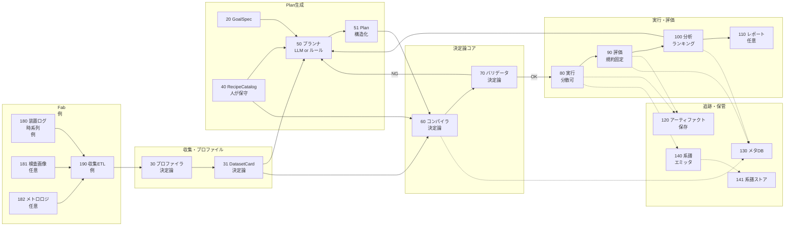
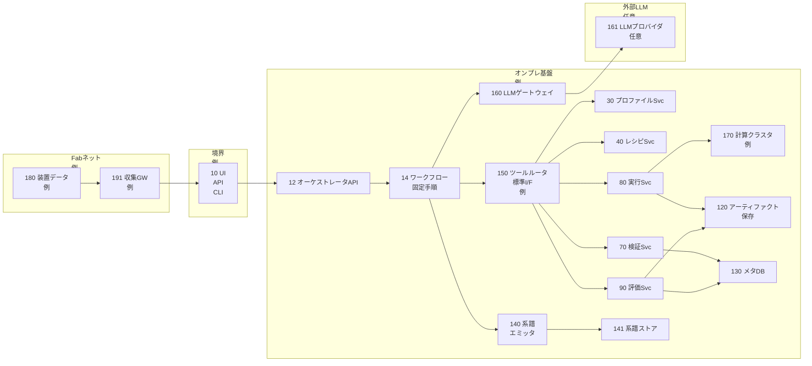
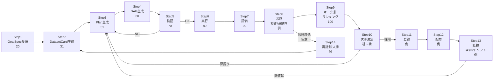
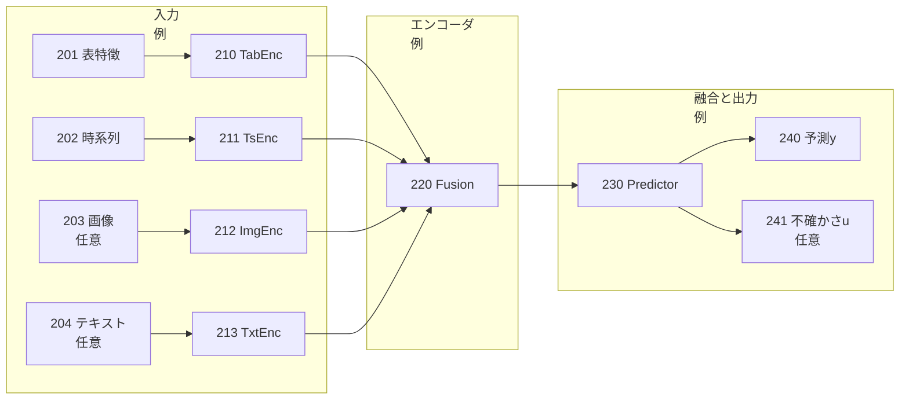
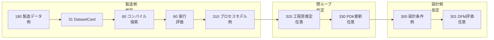

## 0. 管理情報（メタ）

* **資料種別**：特許資料（発明開示書〜明細書素材）ドラフト（技術説明素材＋請求項たたき台）
  ※本資料は**法的助言ではありません**（権利化可否判断・クレーム確定は弁理士等で要検討）。
* **作成日**：2026-03-02（Asia/Tokyo）
* **発明名称（案）**：
  **「構造化出力LLMエージェントと決定論コンパイラ／バリデータにより、マルチ手法MLパイプライン探索を比較可能性付きで再現実行する方法・装置・システム」**
* **想定の利用領域**：半導体製造×AI（工程解析・予測モデル開発・運用管理）
  ※ただし【技術文章】は汎用ML基盤の説明であり、半導体工程・装置・KPIは**適用例（仮定）**を含む。
* **匿名化方針**：会社名／製品名／顧客名／装置型番は原則伏せ、
  例：LLMプロバイダA、エージェントSDK B、系譜標準C、装置A、工程X、顧客X。
* **根拠文章**：【技術文章】「汎用LLM Agentによる『マルチ手法MLパイプライン探索』技術レポート」

---

## 1. 1ページ要約（発明の要旨／新規性の核3点／期待効果の定量）

### 発明の要旨

同一データセットに対して、**データクレンジング×前処理×特徴量化×学習手法×評価手法**の組合せ探索（組合せ爆発）を、

1. LLMは**提案（Plan）に限定**し、2) 実行可能性・整合性・再現性は**決定論（コンパイラ／バリデータ）で保証**しつつ、
2. **固定契約（DatasetCard／RecipeCatalog／Comparability Key）**をバージョン管理して長期運用する、
   **マルチ手法MLパイプライン探索・比較基盤**を提供する。

> 半導体製造に適用する場合（仮定）：装置ログ・計測・検査画像等の多様データで「CD/膜厚/欠陥/故障確率」等のモデル開発を、リーク／分割不備／比較不能を避けつつ高速化・監査可能化する。

### 新規性の核（3点）

1. **「LLMは提案のみ」＋「決定論コアが確定」分離**
   LLMは `recipe_id` 等の**小さい構造化Plan**（JSON Schema準拠を想定）だけを返し、
   パイプラインDAG生成・互換性検証・再現性担保は**決定論コンパイラ／バリデータ**で行う。
2. **長寿命の“固定契約”を中核資産化**
   生データではなく統計・メタ中心の**DatasetCard**、運用知見の**RecipeCatalog**、同条件比較の**Comparability Key**を固定し、
   LLM／エージェントSDK／オーケストレータが変わっても資産（レシピ・評価規約・ガードレール）を保持する。
3. **比較可能性キー＋評価規約＋系譜（lineage）を一体化した探索ループ**
   評価設計（CV/時系列/群分割・校正・頑健性・コスト等）を固定ワークフローに組込み、
   実験追跡・アーティファクト・系譜をキーに紐付けて、**“比較できる探索”**を継続実行する。

### 期待効果（定量：推定／要確認）

※以下は【技術文章】の狙い（意思決定コスト削減・比較可能性・監査・計算資源節約）からの**推定**。実データで要確認。

* **探索設計（人の意思決定）工数**：**30〜70%削減（推定）**
  理由：候補絞り込み・結果要約・次手提案をLLMに寄せ、比較不能をバリデータで抑止。
* **無駄計算（比較不能／リーク／条件混在によるやり直し）**：**20〜60%削減（推定）**
  理由：Comparability Keyで同条件比較を強制、リーク検査・分割固定を前段で実施。
* **監査・説明責任対応のリードタイム**：**半減（推定）**
  理由：Plan／DAG／データカード／メトリクス／系譜がRun単位で保存される。

---

## 2. 技術分野・適用範囲（工程/装置/タスク/導入形態）

### 技術分野

* **機械学習のパイプライン探索（AutoML/ML-Ops）**における
  *探索設計の自動化、比較可能性担保、再現性、監査、長期運用* に関する技術。
* LLMを用いたエージェント技術のうち、**幻覚・不整合を避けた運用設計**（構造化出力＋決定論コア）に関する技術。

### 適用範囲（半導体製造への当てはめは仮定）

| 観点    | 適用範囲                                                             |
| ----- | ---------------------------------------------------------------- |
| 工程（例） | Etch / Depo / CMP / Litho / Clean / Inspection 等（**仮定**）         |
| 装置（例） | 装置ログ、センサ時系列、レシピ履歴、計測（メトロロジ）、検査画像（**仮定**）                         |
| タスク   | 回帰（膜厚/CD等）、分類（欠陥種別等）、異常検知、故障確率推定（**仮定**）                         |
| 導入形態  | オンプレ／ハイブリッド（LLMはゲートウェイ経由で交換可能）（【技術文章】の構想）                        |
| 利用局面  | モデル開発（探索・比較）／運用監視（skew・ドリフト検知、再学習）（後者は【技術文章】に基づく概念、運用詳細は**要確認**） |

---

## 3. 従来技術（背景）と先行技術カテゴリ（※技術文章の言及＋一般的カテゴリ。最後に「先行との差分候補」）

### 従来技術（一般的カテゴリ）

* **AutoML/パイプライン自動探索**：前処理・特徴量・モデル・HPOを探索する枠組み
* **実験管理／アーティファクト管理**：パラメータ・メトリクス・モデル等を追跡する枠組み
* **データ検証／スキーマ検証**：統計量とスキーマで異常検知、training-serving skewやドリフト検知を支援する枠組み（【技術文章】で言及）
* **LLM/Agentでの自動化**：目的の言語化、候補の絞り込み、結果要約、次手提案（【技術文章】で言及）
* **ワークフローオーケストレーション**：固定手順（Workflow）と動的提案（Agent）の分離設計（【技術文章】で言及）

### 【技術文章】で明示される要点（従来枠組みの弱点）

* LLMは**列挙値・キー整合・実行可能性保証**が苦手で、LLMに設定ファイル等を直接書かせると運用が壊れる
* 比較条件が揃わないと実験比較が破綻する（評価設計・分割・リーク等）
* LLM/Agentフレームワークの進化が速く、LLM依存が強い資産は陳腐化しやすい

### 先行との差分候補（本発明の差分の置き方）

* **差分候補A**：LLMの役割を「Plan（recipe_id＋予算＋制約）」に限定し、**DAG生成・検証は決定論**で固定
* **差分候補B**：**DatasetCard／RecipeCatalog／Comparability Key**を固定契約としてバージョン管理し、LLM/フレームワーク交換耐性を持たせる
* **差分候補C**：評価規約（分割、校正、頑健性、運用制約）と比較可能性キーを統合し、**Leaderboardをキー単位で集計**することで“比較できる探索”を保証

---

## 4. 従来の課題（発生条件、現行対策の限界、評価指標、制約）

### 4.1 発生条件（典型）

* データ品質が揺れる（欠損・外れ値・重複・スキーマ逸脱・ラベルノイズ）
* データモダリティが多様（表・時系列・画像・テキスト・複合）
* 時系列／群（装置・ロット等）の分割が必要で、**未来リーク／群リーク**が起こりやすい
* 目的関数が多面（精度だけでなく、推論レイテンシ、説明可能性、運用頑健性、コスト）

### 4.2 現行対策の限界

* 人手の試行錯誤に依存し、**試す順序・切り捨て・深掘り**が属人化
* 実験ログが揃わず、**比較不能**や「別データ混入」が起きる
* LLMをそのまま実行系に入れると、幻覚（存在しない手法名等）で壊れる
* オーケストレーションやエージェントSDKの変更で、運用資産が崩れる

### 4.3 評価指標（例：技術文章で推奨される層）

* 性能：AUC/F1/RMSE等
* 分割妥当性：Time split / Group split / Nested CV
* 校正：Brier, ECE 等（確率の信用度）
* 頑健性：ノイズ付与・欠損率変化・分布シフト
* 運用制約：推論レイテンシ、メモリ、コスト
* データ健全性：スキーマ逸脱、ドリフト、training-serving skew

### 4.4 制約（運用上）

* セキュリティ：ツール連携増加により攻撃面が増えるため、最小権限・監査ログが必要（【技術文章】）
* 計算資源：組合せ爆発で計算が膨張するため、粗→精、多段探索、早期打ち切りが必要（【技術文章】）

---

## 5. 提案手法（データ→前処理→学習→推論→不確かさ→製造アクション→監視/更新）

> 注：本提案のコアは【技術文章】に基づき「探索・比較基盤」。
> “製造アクション”や“設計フィードバック”は半導体製造適用を意識した**拡張例（仮定）**として整理します。

### 5-1. システム構成（文章）

* **GoalSpec**：目的・制約・予算など、最小の入力（人／API）
* **Dataset Profiler（決定論）**：データ統計・スキーマ・リーク危険箇所等を解析し **DatasetCard** を生成
* **RecipeCatalog（人が保守）**：長寿命の“業務レシピ”集合（候補集合、適用条件、禁止事項、予算プリセット）
* **Planner（LLMまたはルール）**：DatasetCard と GoalSpec を参照し、**Plan（recipe_id 等）**を返す
  ※LLMは**構造化出力**でスキーマ準拠を前提（技術文章の推奨）
* **Recipe Compiler（決定論）**：Plan＋DatasetCard＋RecipeCatalogから **Pipeline DAG** を生成
* **Validator（決定論）**：互換性、リーク、比較可能性、再現性（seed/環境/分割固定等）を検証し、OK/NG分岐
* **Executor（決定論）**：DAG実行（分散実行含む）
* **Evaluator/Analyzer（決定論＋任意でLLM要約）**：評価規約でメトリクス算出、ランキング・診断、次手の探索へフィードバック
* **Tracking/Lineage**：実験追跡、アーティファクト保存、系譜（lineage）記録

### 5-2. 入力データ仕様（種類/同期/欠損/特徴量/独自性候補）

#### (A) データ種類（技術文章ベース）

* **モダリティ**：tabular / time_series / image / text / graph / multimodal
* **DatasetCard**：生データではなく、統計・スキーマ・リーク危険箇所・推奨分割・機微列などのメタ情報

#### (B) 同期・キー設計（半導体製造データ向け：仮定）

* **同期キー例（要確認）**：ロットID、ウェハID、装置ID、レシピID、工程ステップID、タイムスタンプ
* **同期方針例（要確認）**：

  * 装置ログ（高頻度）を工程イベント境界で集約（平均/最大/変動/勾配等）
  * メトロロジ（低頻度）を目的変数（ラベル）として紐付け
  * 検査画像はウェハ/ダイに紐付けて埋め込み化

#### (C) 欠損・外れ値・重複（技術文章ベース）

* 欠損：単純補完、KNN、MICE、欠損フラグ特徴
* 外れ値：IQR/Z-score/winsorize、Isolation Forest/LOF、時系列異常（CUSUM等）
* 重複：主キー重複、近似一致（距離＋ブロッキング）

#### (D) 特徴量化（技術文章ベース）

* 表：統計特徴、相互作用、集計（リーク注意）
* 時系列：ラグ、移動統計、Fourier、勾配、変化点
* 画像：CNN/ViT等の埋め込み抽出（モデルプラグインとして）
* テキスト：埋め込みまたはTF-IDF等

#### (E) 独自性候補（本発明の芯として押さえる点）

* **DatasetCardを決定論で生成**し、LLMには生データを渡さず**メタ情報でPlanを生成**する点（安全・再現性・長寿命化）
* **Comparability Key**を決定論生成し、Leaderboardをキー単位で集計して**比較不能を排除**する点
* RecipeCatalogの**禁止事項（bans）**により、リークや不適切操作を探索空間から除外する点

### 5-3. 教師データ/ラベル定義（生成/ノイズ/分割/リーク防止）

#### (A) ラベル定義（半導体向け例：仮定）

* 目的変数候補（要確認）：CD/膜厚/欠陥スコア/歩留まり代理指標/故障確率 等
* ラベル粒度（要確認）：ウェハ単位、ロット単位、ダイ単位、装置稼働サイクル単位

#### (B) ラベルノイズ（技術文章ベース）

* Cross-validated disagreement 等により疑わしいサンプルを抽出し、**人の再確認へ**（自動削除はリスク）

#### (C) データ分割・リーク防止（技術文章ベース）

* DatasetCardの `split_recommendation` を使い、**Time split / Group split** 等を固定
* 未来情報列（イベント後タイムスタンプ、将来集計列）の検出・禁止（Validator/Recipe bans）
* target encoding等、CV内での計算徹底（リーク防止）

#### (D) リーク防止の運用設計（独自性候補）

* **分割方法と分割seedをComparability Keyに含める**
  → “同条件比較”を強制し、誤った結論を抑止

### 5-4. AIモデル仕様（モデル種別/構造/学習/推論/閾値/不確かさ）

#### (A) モデル種別（技術文章ベース）

* 表：線形、木系、表用深層
* 画像：CNN/ViT系
* テキスト：Transformerエンコーダ系 or 埋め込み＋軽量モデル
* 時系列：TCN/Transformer/RNN、伝統モデル

#### (B) 学習・推論（技術文章ベース）

* パイプラインは `fit/transform` の状態を保存し、推論も同一適用（train-serve skew回避）
* 探索は粗→精（ベースライン→粗スクリーニング→深掘り→最終選抜）
* Multi-fidelity / Successive Halving、Bayesian Optimizationは“深掘り段階”で利用

#### (C) 不確かさ／信頼度（技術文章に基づく要素＋拡張の仮定）

* **技術文章に明示**：校正（Brier/ECE）、頑健性、ドリフト・skew検知
* **拡張（仮定）**：これら診断結果から **運用信頼度スコア**を算出し、

  * 信頼度低：再計測／人手確認／フォールバックモデル
  * 信頼度高：自動展開
    などの分岐に利用（※分岐の具体は**要確認**）

### 5-5. 製造アクション（APC/MES/FDC/保全/ホールド/再計測）

※【技術文章】は探索基盤の説明であり、以下は半導体製造適用の**拡張例（仮定）**。

* **APC連携（仮定）**：予測結果に基づくレシピ補正、工程条件の微調整
* **MES連携（仮定）**：ロットホールド、優先度変更、再計測指示
* **FDC連携（仮定）**：異常兆候がある装置の監視強化、アラーム閾値調整
* **保全（仮定）**：故障確率上昇時に予防保全チケット発行
* **再計測（仮定）**：不確かさ/信頼度が低い場合の追加計測でラベル品質改善

### 5-6. 実装制約（リアルタイム、計算資源、I/F、フェイルセーフ、監査）

* **計算資源**：粗→精探索、早期打ち切り、キャッシュ、上位kのみ深掘り
* **I/F**：ツール接続は標準プロトコル／互換API（例としてMCP相当）により疎結合（技術文章）
* **フェイルセーフ**：Validator NG時は実行しない／ベースラインへ戻す
* **監査**：Plan、DAG、DatasetCard、メトリクス、アーティファクト、系譜を保存
* **セキュリティ**：Tool Routerで最小権限・監査ログ・サンドボックス化（技術文章）

---

## 6. 提案手法による効果（従来vs提案の表、測定条件、因果説明）

### 6.1 従来 vs 提案（比較表）

| 観点      | 従来               | 提案（本発明）                            |
| ------- | ---------------- | ---------------------------------- |
| 探索設計の工数 | 人手で試行錯誤、属人化      | LLMは提案、決定論で実行保証。意思決定コスト低減          |
| 再現性     | 条件混在・設定散逸で破綻しがち  | DatasetCard／Plan／DAG／seed／環境を保存し再現 |
| 比較可能性   | 分割や前処理差で比較不能が混入  | Comparability Keyで同条件比較を強制、集計もキー単位 |
| リーク対策   | チェック漏れが発生        | Validator＋Recipe bans＋分割固定で抑止      |
| 計算資源    | 全探索や無駄試行が膨張      | 粗→精、多段探索、早期打ち切り                    |
| 監査/説明   | 事後に資料整備が重い       | Plan/履歴/系譜が自動で残り監査対応が容易            |
| 長寿命化    | LLM/SDK変更で資産が崩れる | 固定契約（スキーマ/カタログ/キー）が中核で交換耐性         |

### 6.2 測定条件（要確認）

* データ種別（表/時系列/画像/複合）、データ量、分割方針（Time/Group等）
* 探索予算（trial数、計算資源、時間）
* 運用制約（推論レイテンシ、説明性、監査要件）

### 6.3 因果説明（なぜ効くか）

* **比較可能性キー**で“同条件比較”を強制 → 誤結論と再試行を抑制
* **LLMの出力範囲をPlanに限定** → 幻覚による実行破綻を回避
* **決定論コンパイラ／バリデータ** → 実行可能性と再現性を担保
* **固定契約を資産化** → フレームワーク更新に耐える

---

## 7. 新規性・進歩性（差分表、必須要素/任意要素の切り分け）

### 7.1 差分表（先行カテゴリとの比較）

| 先行カテゴリ      | 典型構成              | 本発明の差分（コア）                                   |
| ----------- | ----------------- | -------------------------------------------- |
| AutoML/探索基盤 | 探索アルゴリズム中心        | LLM提案はPlan限定、**決定論コンパイル＋Validator**で実行保証     |
| LLMによる自動化   | LLMがコード/設定まで生成しがち | **構造化Plan（recipe_id等）**のみ許可、enum/スキーマで拘束     |
| 実験追跡/系譜     | ログはあるが比較単位が曖昧     | **Comparability Key**を生成し、キー単位でLeaderboard集計 |
| データ検証       | 検証は別ツールで点在        | DatasetCard生成→Validator→探索ループに統合             |
| 長期運用        | SDK/LLM変更で破綻      | スキーマ/カタログ/キーを固定契約としてバージョン管理                  |

### 7.2 必須要素（発明の芯）

* **E1**：DatasetCardを**決定論**で生成するデータプロファイル工程
* **E2**：LLM（又はルール）が返す出力を、`recipe_id` 等の**構造化Plan**に制限する工程
* **E3**：Plan＋DatasetCard＋RecipeCatalogから、**決定論コンパイラ**でPipeline DAGを生成する工程
* **E4**：Validatorにより、互換性・リーク・再現性・比較可能性を検証し、OK/NG分岐する工程
* **E5**：Comparability Keyを生成し、比較・ランキング・追跡・系譜をキーに紐付ける工程
* **E6（技術文章ベース）**：training-serving skew／ドリフト等の監視と、探索ループ（更新）に反映する工程

### 7.3 任意要素（差別化を厚くする拡張）

* **O1**：Multi-fidelity／Successive Halving等の探索スケジューラ
* **O2**：校正・頑健性・運用制約を含む多層評価
* **O3（仮定）**：不確かさ/信頼度に基づく再計測・人手確認・フォールバック分岐
* **O4（仮定）**：APC/MES/FDC/保全など製造アクション接続
* **O5（仮定）**：工程窓推定／逆設計／DFM/PDK更新など設計フィードバック

---

## 8. 実施例（最低2つ：代表ケース＋変形例。条件・手順・結果が書ける範囲で）

> 実施例は【技術文章】の汎用基盤を「半導体製造データ」に適用する**例（仮定）**です。
> 数値結果はデータ未提示のため断定せず、期待結果は「推定」として記載します。

### 実施例1（代表ケース）：検査画像＋装置ログの欠陥分類モデル探索（仮定）

* **目的（GoalSpec例）**：欠陥種別分類の性能最大化＋推論コスト上限＋監査ログ必須（仮定）
* **入力データ（仮定）**：

  * 検査画像（ウェハ/ダイ）
  * 装置イベントログ（時系列）
  * 付随メタ（装置ID、レシピID、工程ステップ）
* **手順**

  1. Dataset ProfilerでDatasetCard生成（欠損率、語彙、リーク危険列、推奨分割など）
  2. PlannerがDatasetCardを基に、画像＋ログのマルチモーダルレシピ（recipe_id）をPlanとして返す（構造化）
  3. Compilerがレシピに従い、画像埋め込み抽出＋ログ特徴量化＋融合モデル学習のDAGを生成
  4. Validatorが分割（Group split等）、リーク（未来情報）・比較可能性キーを検証
  5. Executorで学習・評価を回し、Evaluatorで性能・校正・頑健性を算出
  6. Analyzerでキー単位のランキングを作成し、上位kのみ深掘り（粗→精）
* **期待結果（推定／要確認）**

  * 比較不能（分割差等）の排除により、意思決定のやり直しが減る（推定）
  * 校正・頑健性評価により、運用での過信（誤アラーム/見逃し）を低減（推定）

### 実施例2（変形例）：装置センサ時系列による故障確率推定・再学習（仮定）

* **目的（GoalSpec例）**：故障予兆検知（高リコール重視）＋誤報コスト考慮（仮定）
* **入力データ（仮定）**：装置センサ時系列、アラームログ、保全履歴
* **手順**

  1. DatasetCardにより、時系列の分割（Time split）とリーク危険（未来集計）を明示
  2. Planは時系列レシピ（ラグ/移動統計/TCN等）と評価規約（未来リーク回避）を含む
  3. 実行後、drift/skew検知（分布シフト）を監視し、閾値超過時に探索ループで再学習候補を生成
  4. 承認フロー（仮定）を経てモデル更新・配布
* **期待結果（推定／要確認）**

  * ドリフトにより性能が落ちたモデルの放置を減らす（推定）
  * 再学習の再現性（同条件比較）を保ち、更新判断の監査性を向上（推定）

---

## 9. 図面（Mermaid／左→右）と図面説明（符号表も）

### 9-1. 図1：全体システム構成図

### 9-2. 図2：ネットワークアーキテクチャ（装置ネットワーク/DMZ/オンプレ/クラウド任意）

### 9-3. 図3：処理フロー（S1〜Sn、不確かさ分岐、再学習まで）

### 9-4. 図4（任意だが推奨）：AIモデル構造（マルチモーダル融合等）※技術文章に合う場合のみ

※図4は【技術文章】の「モダリティ別モデル（表/時系列/画像/テキスト）をプラグイン化する」説明に対応する**例**です。

### 9-5. 図5（推奨）：設計—製造の閉ループ（プロセス予測/工程窓/逆設計/DFM/PDK更新）

※図5は【技術文章】に直接の記載はなく、半導体製造×AIの価値創出としての**拡張例（仮定）**です。

### 9-6. 図面キャプション案（特許向けの短文）

* **図1**：構造化Planを生成するプランナと、決定論コンパイラ／バリデータによりパイプライン探索を再現可能に実行する全体構成を示す。
* **図2**：LLMをゲートウェイ経由で交換可能とし、ツール群を標準I/Fで疎結合に接続するネットワーク構成例を示す。
* **図3**：DatasetCard生成から検証分岐、実行、評価、診断、探索ループ、監視・再学習までの処理手順を示す。
* **図4（任意）**：複数モダリティの特徴をエンコードして融合し、予測と不確かさを出力するモデル構造例を示す。
* **図5（仮定）**：製造データから得たプロセスモデルを工程窓推定・設計ルール更新へ反映する閉ループ例を示す。

### 9-7. 符号の説明（表：符号→名称→役割）

|      符号 | 名称            | 役割                         |
| ------: | ------------- | -------------------------- |
|      10 | UI/API/CLI    | 利用者入力・起動インタフェース            |
|      12 | オーケストレータAPI   | ワークフロー制御の入口                |
|      14 | ワークフロー        | 固定手順（状態機械）で実行を統制           |
|      20 | GoalSpec      | 目的・制約・予算など最小入力             |
|      30 | プロファイラ        | 統計・スキーマ解析（決定論）             |
|      31 | DatasetCard   | メタ情報（統計・リーク危険・推奨分割等）       |
|      40 | RecipeCatalog | レシピ集合（適用条件・禁止事項・予算）        |
|      50 | プランナ          | Plan生成（LLMまたはルール）          |
|      51 | Plan          | `recipe_id` 等の構造化出力        |
|      60 | コンパイラ         | Plan等からPipeline DAG生成（決定論） |
|      70 | バリデータ         | 互換性・リーク・再現性・比較可能性検証        |
|      80 | 実行            | DAGの分散実行                   |
|      90 | 評価            | 分割規約・校正・頑健性等の算出            |
|     100 | 分析            | ランキング、診断、次手決定              |
|     110 | レポート          | 結果要約（任意でLLM）               |
|     120 | アーティファクト保存    | 特徴量・モデル・ログ・成果物を保存          |
|     130 | メタDB          | Run、設定、メトリクス等の追跡           |
|     140 | 系譜エミッタ        | Lineageメタデータの送出            |
|     141 | 系譜ストア         | Lineageの保管                 |
|     150 | ツールルータ        | ツール呼出しの統制（標準I/F等）          |
|     160 | LLMゲートウェイ     | LLM交換の境界（プロバイダ差を吸収）        |
|     161 | LLMプロバイダ      | 外部/内部LLM（任意）               |
|     170 | 計算クラスタ        | 学習・評価の計算資源（例）              |
|     180 | 製造データ         | 装置ログ等（例／仮定）                |
|     181 | 検査画像          | 画像データ（任意／仮定）               |
|     182 | メトロロジ         | 計測データ（任意／仮定）               |
|     190 | 収集ETL         | データ収集・前処理（例）               |
|     191 | 収集GW          | ネットワーク境界での収集ゲートウェイ（例）      |
| 201-204 | 入力            | 表/時系列/画像/テキスト入力（例）         |
| 210-213 | エンコーダ         | 各モダリティの特徴抽出（例）             |
|     220 | 融合            | マルチモーダル融合（例）               |
|     230 | 予測器           | 目的変数を推定するモデル（例）            |
|     240 | 予測y           | 推定結果（例）                    |
|     241 | 不確かさu         | 推定不確かさ（任意／例）               |
| 300-330 | 閉ループ要素        | 設計FB（仮定：DFM/PDK更新等）        |

---

## 10. 本技術により創出される新たな価値（Value Creation：予測/設計/設計FB/事業KPI）

> 10章は半導体製造に当てた価値整理を含み、【技術文章】にない箇所は**仮定**で明示します。

### 10-1. 従来困難だった意思決定（何が初めて可能になるか）

* **“比較できる探索”**を継続運用できる
  → 分割や前処理差による比較不能を排除し、組織で再利用可能な意思決定ログを形成
* LLMの幻覚を許さず、**提案と確定を分離**した形で探索を自動化できる
  → 実行不能・条件混在による事故を抑止
* LLM/SDKが変わっても、**固定契約（スキーマ/カタログ/キー）が資産として残る**

### 10-2. プロセス予測（運用）価値（例：先読み制御、計測負荷削減、停止削減）

* 運用モデルの更新判断を、校正・頑健性・ドリフト指標込みで標準化（技術文章ベース）
* （仮定）不確かさに応じて再計測や保全に分岐し、誤判断を低減

### 10-3. プロセス設計（開発）価値（例：DOE削減、工程窓推定、逆設計）

* 粗→精探索により、探索予算内で有望レシピを効率的に深掘り（技術文章ベース）
* （仮定）工程条件の探索（DOE相当）を“比較可能性キー付き”で体系化し、工程窓推定に繋げる

### 10-4. 設計フィードバック価値（DFM/PDK更新、マスク反復削減）

* （仮定）製造データ由来のプロセスモデルを、設計ルール（DFM/PDK）に反映する閉ループを構築可能
  ※図5は拡張例。実現には設計データの取り扱い・権限・品質保証が要確認。

### 10-5. 価値指標テーブル（領域×KPI×根拠）

| 領域        | KPI例                    | 根拠                                        |
| --------- | ----------------------- | ----------------------------------------- |
| 探索効率      | trialあたり有効比較率、無駄試行率     | Comparability Key＋Validatorで比較不能を排除（技術文章） |
| 品質        | リーク検出率、再現実行成功率          | 決定論コンパイル＋検証（技術文章）                         |
| 運用        | ドリフト検出までの時間、更新判断の監査対応時間 | skew/ドリフト監視＋追跡・系譜（技術文章）                   |
| コスト       | 計算資源消費、探索時間             | 粗→精、多段探索、早期打ち切り（技術文章）                     |
| 製造KPI（仮定） | 歩留まり、再計測率、装置停止          | 製造アクション接続は拡張例（仮定／要確認）                     |

---

## 11. 請求項例（たたき台）

> 注意：以下は**技術的構成を権利化表現に落とすための“たたき台”**です（法的助言ではありません）。
> 会社名等は匿名化しています。

### 11-1. 独立請求項（方法）※発明の芯を1本にまとめる

**【請求項1】（案）**
データセットに対して機械学習パイプラインの探索を行う方法であって、
(a) 前記データセットの参照情報と、目的・制約・予算を含む目標仕様（GoalSpec）とを取得し、
(b) 前記データセットに対して、統計量およびスキーマを含むメタ情報を決定論的に生成してデータセットカード（DatasetCard）を生成し、
(c) 前記DatasetCardおよび前記GoalSpecに基づき、レシピ識別子（recipe_id）を少なくとも含む構造化プラン（Plan）を、所定スキーマに準拠する構造化出力として生成し、
(d) 前記Planと、レシピカタログ（RecipeCatalog）と、前記DatasetCardとに基づき、データクレンジング、前処理、特徴量化、学習および評価を含む処理タスクの有向非巡回グラフ（Pipeline DAG）を決定論的に生成し、
(e) 前記Pipeline DAGについて、少なくともリーク検査、比較可能性検査および再現性検査を含む検証を行い、検証結果に応じて前記Planの生成工程に戻る分岐を行い、
(f) 検証に合格した前記Pipeline DAGを実行してモデルおよび評価結果を生成し、
(g) 前記評価結果を、前記データセットの分割条件および前記Pipeline DAGの条件から決定論的に生成される比較可能性キー（Comparability Key）に関連付けて保存し、
(h) 前記DatasetCardまたは前記評価結果に基づき、training-serving skewまたはドリフトを監視し、所定条件を満たすとき、前記(a)〜(g)を含む探索を再実行して更新モデルを生成し、更新モデルの配布を制御する、
ことを特徴とする機械学習パイプライン探索方法。

> ※必須要素として (i) データ構成（DatasetCard＋Comparability Key）と (iv) ドリフト監視・再学習・配布 を含め、さらにValidator分岐を含めています。

### 11-2. 従属請求項（不確かさ分岐、装置差補正、ドリフト監視/再学習、工程窓推定、逆設計、設計FBなど）

**【請求項2】（案）** 請求項1において、前記Planは、`recipe_id` と、探索予算を表すパラメータと、制約条件とを含み、前記Planが前記スキーマの列挙値に違反する場合に、前記Pipeline DAGの生成を禁止する方法。

**【請求項3】（案）** 請求項1において、前記検証は、前記DatasetCardに含まれるリーク危険情報に基づき、未来情報列または将来集計列の使用を検出し、当該列の使用を禁止する方法。

**【請求項4】（案）** 請求項1において、前記比較可能性キーは、少なくとも、データセット識別子、分割方式、分割seed、前処理方式、特徴量化方式、および評価方式を含む方法。

**【請求項5】（案）** 請求項1において、前記評価結果は、性能指標に加えて、校正指標および頑健性指標を含む方法。

**【請求項6】（案）** 請求項1において、探索は、ベースライン、粗スクリーニング、深掘り、および最終選抜の多段探索として実行される方法。

**【請求項7】（案）** 請求項1において、前記監視は、training-serving skewまたはドリフトの指標が閾値を超えた場合に、更新モデルの生成をトリガする方法。

**【請求項8】（案：不確かさ分岐の拡張）** 請求項1において、前記評価結果から算出される信頼度が所定閾値未満の場合に、追加計測または人手確認を要求し、信頼度が所定閾値以上の場合に、更新モデルの配布を許可する方法。
※「信頼度による再計測/人手分岐」は【技術文章】に直接記載がないため**拡張案（仮定）**。

**【請求項9】（案：製造アクション接続の拡張）** 請求項1において、前記更新モデルまたは前記評価結果に基づき、製造実行系に対して、レシピ更新、ロットホールド、再計測指示、または保全指示の少なくとも1つを出力する方法。
※製造アクションは**拡張案（仮定）**。

**【請求項10】（案：標準I/Fの拡張）** 請求項1において、前記Pipeline DAGの生成および実行に用いる外部ツール呼出しは、標準化されたツール接続プロトコルまたは互換APIを介して行われる方法。

**【請求項11】（案：設計FBの拡張）** 請求項1において、前記更新モデルに基づいて工程窓を推定し、当該工程窓情報を設計制約または設計ルール更新に用いる方法。
※設計FBは**拡張案（仮定）**。

### 11-3. 独立請求項（装置）

**【請求項12】（案）**
請求項1〜11のいずれかに記載の方法を実行する情報処理装置であって、
GoalSpec取得部、DatasetCard生成部、Plan生成部、Pipeline DAG生成部、検証部、実行部、評価部、比較可能性キー生成部、監視部、およびモデル配布制御部を備える情報処理装置。

### 11-4. 独立請求項（システム）

**【請求項13】（案）**
複数の計算資源および記憶資源を含む機械学習パイプライン探索システムであって、
オーケストレータ、LLMゲートウェイ、ツールルータ、プロファイルサービス、コンパイルサービス、検証サービス、実行サービス、評価サービス、メタデータデータベース、アーティファクトストア、および系譜ストアを含み、
請求項1〜11のいずれかに記載の方法を実行するシステム。

### 11-5. 独立請求項（プログラム/記録媒体）

**【請求項14】（案）**
コンピュータをして請求項1〜11のいずれかに記載の方法を実行させるためのプログラム。

**【請求項15】（案）**
請求項14に記載のプログラムを記録したコンピュータ読み取り可能な記録媒体。

### 11-6. クレーム設計メモ（広いクレーム/狭いクレーム、回避設計ポイント）

* **広いクレームの核**：

  * LLMはPlan限定（構造化）
  * 決定論コンパイル＋検証
  * Comparability Keyで比較単位を固定
  * 監視→再実行→配布制御（更新ループ）
* **狭い（補強）要素**：

  * 具体的な検証項目（リーク、group/time split、train-serve skew）
  * 粗→精探索（successive halving等）
  * 校正・頑健性を含む多層評価
  * ツール標準I/F（プロトコル）
* **回避設計ポイント（技術的観点）**：

  * LLMに設定全体を書かせる設計（ただし運用脆弱）
  * Comparability Keyを持たず、単純ランキングのみ
  * 検証を弱め、探索結果の再現性が保証されない構成
    → これらとの差分を「必須要素」として押さえる設計が重要。

---

## 12. 追加情報（実務で重要：データ量、汎化、更新、監査、セキュリティ/ガバナンス）

* **データ量・頻度**：探索の予算設計（trial数、multi-fidelity）に直結（要確認）
* **汎化**：装置・レシピ・期間での分布差、群分割設計が重要（技術文章のGroup split思想）
* **更新**：ドリフト・skew監視→再探索→承認→配布の運用規程（要確認）
* **監査**：Plan/DAG/DatasetCard/メトリクス/系譜の保存期間・アクセス制御（要確認）
* **セキュリティ**：ツール連携は最小権限、境界（DMZ等）、監査ログ、サンドボックス（技術文章）
* **LLMへの入力制限**：生データは渡さずDatasetCard中心（技術文章）

---

## 付録A. 用語集（略語/専門語）

* **LLM**：大規模言語モデル
* **Agent**：ツール呼出しや状態管理を伴う自動実行主体（提案・要約等）
* **Workflow**：固定経路の手順（状態機械）
* **GoalSpec**：目的・制約・予算などの入力仕様
* **DatasetCard**：データの統計・スキーマ・リーク危険・推奨分割などメタ情報
* **RecipeCatalog**：業務レシピのカタログ（適用条件・禁止事項・予算プリセット）
* **Plan**：LLM/ルールが返す構造化提案（例：recipe_id、予算、制約）
* **Pipeline DAG**：実行可能なタスクグラフ（有向非巡回）
* **Validator**：互換性・リーク・再現性・比較可能性の検証
* **Comparability Key**：同条件比較を強制するキー（分割/前処理等を含む）
* **train-serving skew**：学習時と推論時で入力分布や前処理がずれる問題
* **ドリフト**：時間経過等でデータ分布や関係が変化する現象
* **校正（calibration）**：確率出力の信頼性（当たりやすさ）の適合度
* **Lineage（系譜）**：データ・モデル・実行のつながり（出自）を追跡する情報

---

## 付録B. 追加で必要な情報（優先度：高/中/低。最大10項目）

> 不足があっても作成可能な範囲は埋めました。以下を頂けると、半導体工程に即した「実施例・効果・クレーム従属」を精密化できます（Yes/Noや選択式中心）。

1. **【高】対象工程/装置**：どれですか？（複数選択可）

   * [ ] Litho  - [ ] Etch  - [ ] Depo  - [ ] CMP  - [ ] Clean  - [ ] Inspection  - [ ] Metrology  - [ ] その他（工程名のみ）
2. **【高】主入力データ**：どれですか？（複数選択可）

   * [ ] 装置時系列  - [ ] イベントログ  - [ ] レシピ履歴  - [ ] メトロロジ  - [ ] 検査画像  - [ ] テキスト（作業記録）  - [ ] 複合
3. **【高】予測対象**：最優先は？（1つ選択）

   * [ ] CD  - [ ] 膜厚  - [ ] 欠陥/欠陥種別  - [ ] 歩留まり代理  - [ ] 故障確率  - [ ] その他（名称のみ）
4. **【高】評価分割の必須条件**：どれですか？（複数選択可）

   * [ ] Time split必須  - [ ] Group split（装置/ロット）必須  - [ ] 両方  - [ ] 特になし（要確認）
5. **【高】製造アクション接続の要否**：必要ですか？（Yes/No）

   * [ ] Yes（例：ホールド/再計測/保全/レシピ更新）  - [ ] No（まずは解析用途）
6. **【中】KPI（現状→目標）**：数値があれば（例：AUC、誤報率、停止削減%など）

   * [ ] あり（後で記入）  - [ ] なし
7. **【中】運用環境**：どれですか？

   * [ ] 完全オンプレ  - [ ] ハイブリッド（LLMは外部）  - [ ] クラウド中心
8. **【中】更新運用**：モデル更新に承認フローは必要？（Yes/No）

   * [ ] Yes（監査必須）  - [ ] No（自動更新可）  - [ ] 未定
9. **【低】先行として意識している方式**：名称だけ（製品/論文/社内方式など）

   * [ ] あり（名称のみ）  - [ ] なし
10. **【低】公開状況**：社外発表の予定は？

* [ ] なし（社内のみ）  - [ ] あり（時期未定）  - [ ] あり（時期あり）
