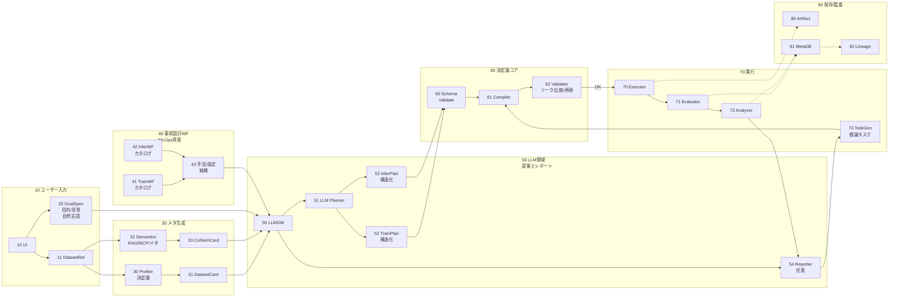
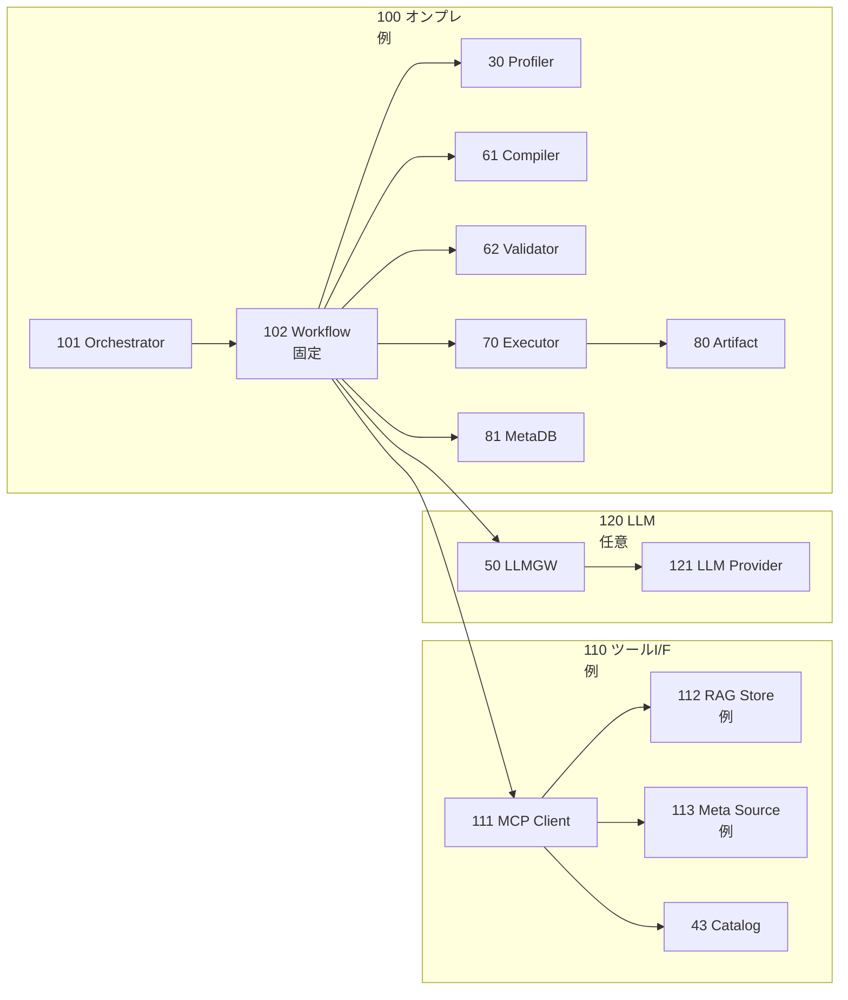
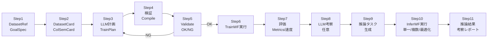
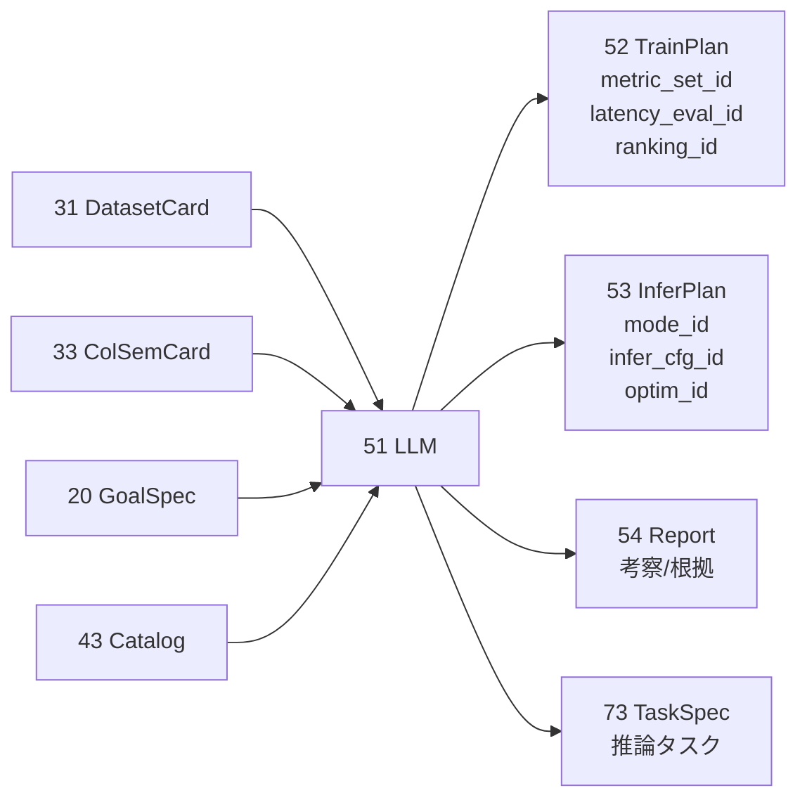
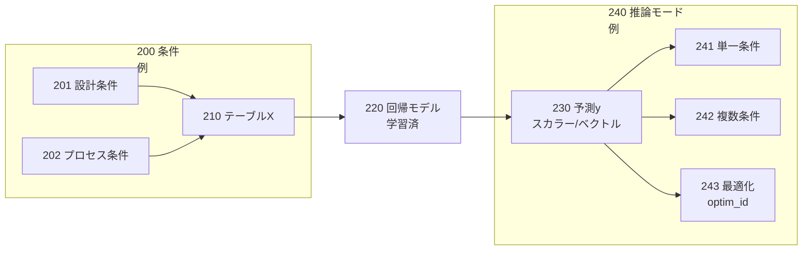

## 0. 管理情報（メタ）

* **資料種別**：特許開示書（発明開示書〜明細書素材）ドラフト（技術説明素材＋請求項たたき台）
  ※本資料は**法的助言ではありません**（権利化可否判断・クレーム確定は弁理士等で要検討）。
* **対象スコープ（明確化）**：

  * **入力**：テーブルデータ（ベクトルデータ）
  * **タスク**：回帰（目的変数は**スカラー**または**ベクトル**）
  * **LLMの役割**：目的/背景の自然言語入力に基づく **計画（Plan）** と **推論モード選択**、および **考察レポート生成**
  * **制約**：解析実行は、**事前にMLOpsで設計されたワークフロー**（学習・推論）内の手法・設定から選択（逸脱不可）
* **発明名称（案）**：
  **「事前設計MLOpsワークフローに準拠して、自然言語の目的に応じた評価基準・推論モードをLLMが計画し、決定論検証で実行保証するテーブル回帰の学習・推論制御システム」**
* **匿名化方針**：会社名/装置型番/顧客名/機密値は記載せず、例示は「装置A」「顧客X」「モデルA」等に置換。
* **根拠**：

  * 既提示の【技術文章】（LLMは提案、決定論コアで実行可能性・再現性保証、固定契約、比較可能性キー等）
  * 今回ユーザー追記の技術要件（学習/推論ワークフロー、自然言語目的、推論モード、RAG/MCP等）

---

## 1. 1ページ要約（発明の要旨／新規性の核3点／期待効果の定量）

### 1-1. 発明の要旨（本質）

同一データセットでも、**目的（精度重視/推論速度重視/説明性重視など）や背景**に応じて、適切な **評価基準（指標セット、推論速度評価など）** や **推論モード（単一条件/複数条件/最適化）** を選び分ける必要がある。
本発明は、ユーザーが **データセット選択＋目的/背景を自然言語で入力**すると、LLMが **事前定義されたMLOpsワークフローの範囲内**で、学習・評価・推論の「計画」を構造化出力し、決定論コア（コンパイラ/バリデータ）が **逸脱・不整合・リーク・比較不能**を排除して実行する。さらに推論時も、目的/背景に応じて推論モード/設定/最適化指標を選択し、**推論結果の考察レポート**を出力する。

---

### 1-2. カテゴリ別 5行要約欄（指定フォーマット）

#### (A) 従来技術内容（5行）

* テーブル回帰のMLは、前処理/特徴量/モデル/評価の組合せ探索で性能が大きく変動する
* MLOpsで学習パイプラインを自動実行できるが、目的に応じた評価基準選択は属人的になりやすい
* LLMを使う場合、自由記述で設定を生成するとキー不整合や誤設定が混入しやすい
* 同一データでも分割/前処理が異なると比較が歪み、誤結論につながる
* 推論も単一条件・複数条件・最適化など用途があるが、運用で選び分けが難しい

#### (B) 従来技術の問題点（5行）

* 目的/背景に応じた評価指標（精度、推論速度、説明性等）の選択が属人化
* 実験条件（分割、前処理、特徴量、モデル）が混在し、比較不能なランキングが発生
* LLMが設定や手法名を自由生成すると、実行不能・リーク・誤評価のリスク
* 推論ワークフロー（単一/複数/最適化）の切替や設定が場当たり的になりがち
* 監査用の証跡（なぜその基準/設定にしたか）が残らず説明責任が重い

#### (C) 問題点の解決手段（本技術システム）（5行）

* ユーザー入力は **データセット選択＋目的/背景の自然言語** とし、LLMは計画を立てる
* LLMは **MLOpsで事前設計された学習/推論ワークフロー**内の候補から、評価基準・手法・設定を選択
* LLM出力は **構造化Plan**（評価指標セット、推論モード、最適化指標等を含む）に限定し、決定論で検証
* 学習後、LLMは評価結果を踏まえた **考察レポート** と **推論ワークフロー実行タスク**を生成
* 推論時もLLMが推論モード/推論設定/最適化指標を選び、結果のレポートを生成

#### (D) 得られる効果（価値）（5行）

* 目的に整合した評価基準と推論モードが選べ、運用の意思決定が標準化される
* 比較可能性キー等により同条件比較を担保し、誤結論と手戻りを減らす
* LLM幻覚/逸脱を決定論検証で遮断し、実行の信頼性が上がる
* 学習→推論タスク生成→推論レポートまで一貫し、監査証跡が残る
* ワークフロー/候補集合（固定契約）を資産化でき、LLM/SDK変更への耐性が高い

---

### 1-3. 新規性の核（3点）

1. **自然言語の目的/背景に応じて、評価基準（メトリクス・推論速度等）をLLMが“計画”するが、選択対象はMLOps事前設計ワークフロー内に限定**
2. **学習だけでなく推論も対象：LLMが推論モード（単一条件/複数条件/最適化）・推論設定・事前定義の最適化指標を選択し、推論考察レポートまで生成**
3. **LLM出力を構造化Plan/タスクに限定し、決定論バリデータが逸脱・リーク・比較不能・再現性不備を事前遮断する“提案と確定の分離”**

---

### 1-4. 期待効果（定量：推定／要確認）

※目標値や現状KPIが未提示のため、以下は**推定**（要確認）。

* **評価基準選定・推論モード選択の工数**：30〜70%削減（推定）
* **比較不能/誤評価に起因する手戻り試行**：20〜60%削減（推定）
* **監査・説明資料作成（根拠提示）**：対応時間を半減（推定）
* **運用の一貫性**：目的に応じた評価基準の標準化により、意思決定のばらつき低減（定量は要確認）

---

## 2. 技術分野・適用範囲（工程/装置/タスク/導入形態）

### 2-1. 技術分野

* **テーブル回帰（スカラー/ベクトル目的変数）**における、学習・評価・推論ワークフローの実行制御技術
* LLMを用いた **計画（Plan）生成・推論モード選択・考察レポート生成**を、MLOpsの事前設計ワークフローに準拠させる技術

### 2-2. 適用範囲

| 観点    | 適用範囲                                    |
| ----- | --------------------------------------- |
| 入力    | テーブル（数値/カテゴリ/ID/条件列など）＝ベクトルデータ          |
| 出力    | 回帰：スカラー y またはベクトル y（多出力回帰）              |
| 学習    | 事前設計の学習ワークフロー（クレンジング→前処理→特徴量→回帰モデル→評価）  |
| 推論    | 事前設計の推論ワークフロー（モデル選択→推論→推論評価→レポート）       |
| 推論モード | **単一条件推論／複数条件推論／最適化**（3カテゴリ）            |
| LLM連携 | RAG / MCPサーバ / メタ情報参照により列名意味を考慮（詳細は要確認） |
| 業界例   | 半導体製造装置・プロセス条件の回帰モデル、装置設計条件の回帰モデル（例）    |

---

## 3. 従来技術（背景）と先行技術カテゴリ（※言及＋一般カテゴリ。最後に「先行との差分候補」）

### 3-1. 従来技術カテゴリ（一般）

* MLOps/パイプライン：事前定義した学習パイプラインの自動実行
* AutoML：前処理・モデル・HPO探索
* 実験追跡：メトリクス・パラメータ・アーティファクト管理
* LLM支援：候補の提案、結果要約
* 推論運用：モデル登録・配布・監視

### 3-2. 従来における不足（今回の焦点）

* 「目的/背景が違う」ことで評価基準（速度/精度/説明性）が変わるのに、**評価基準の選択が属人的**
* 推論用途（単一条件/複数条件/最適化）に応じた **推論モード選択**が運用で標準化されない
* LLMの自由記述は誤設定・実行不能・比較不能を生みやすい

### 3-3. 先行との差分候補

* **差分候補A**：自然言語の目的/背景に応じて評価基準・推論モードをLLMが計画するが、選択は事前設計ワークフロー内に拘束
* **差分候補B**：学習後にLLMが、評価モデル・考察レポート・推論タスク生成まで担う（ただしタスクは構造化し決定論検証）
* **差分候補C**：列名意味（設計条件/プロセス条件など）をRAG/MCP/メタ情報で補い、グルーピング・補完・採用/除外を計画に反映（詳細要確認）

---

## 4. 従来の課題（発生条件、現行対策の限界、評価指標、制約）

### 4-1. 発生条件（テーブル回帰で頻出）

* 欠損、外れ値、カテゴリ語彙増、ID列の混入
* 目的/背景が案件ごとに異なり、評価指標（RMSE/MAE/速度など）が変わる
* 推論が「単一条件で十分」か「条件スイープ」か「最適化」かで設計が変わる
* 半導体では装置/レシピ/ロット等のグループ性・時系列性が強く、リーク/比較不能が起きやすい（一般論＋要確認）

### 4-2. 現行対策の限界

* MLOpsワークフローはあっても **評価基準選び**・**推論モード選び**が人に依存
* 同一データでも条件が混ざり比較不能 → 誤結論・手戻り
* LLMを使うとき自由記述だと誤設定が混入しやすい
* 推論結果の考察レポートが属人的で監査に耐えない

### 4-3. 評価指標・最適化指標（例：要確認）

* 精度：RMSE/MAE/R² 等（案件により選択）
* 速度：推論レイテンシ、スループット（事前定義の測定タスク）
* 説明性：重要特徴量の安定性、説明可能性スコア（例）
* 最適化：予測y最大化/最小化、制約付き最適化（例）

### 4-4. 制約

* 計算資源：探索・推論スイープ・最適化で計算が膨張
* 監査：評価基準・推論モード選択の根拠が必要
* セキュリティ：生データの外部送信制約、ツール権限の最小化（要確認）

---

## 5. 提案手法（データ→前処理→学習→推論→不確かさ→製造アクション→監視/更新）

> 本章は「学習」と「推論」の**2つの事前設計ワークフロー**を中核に、LLMは計画とレポートを担当する形で整理します。

### 5-1. システム構成（文章）

#### (A) 入力

* **DatasetRef**：ユーザーが選択するデータセット参照（同一データセットでも目的が変わり得る）
* **GoalSpec（自然言語）**：目的、背景、制約（例：精度優先/推論速度優先/説明性優先、対象yの意味 等）

#### (B) 事前設計のワークフロー資産（MLOps側）

* **学習ワークフロー**：
  クレンジング→前処理→特徴量化→回帰モデル学習→評価（各工程は個別実行可能でワークフロー接続）
  各工程に複数手法と設定バリエーションがある（カタログ化）
* **推論ワークフロー**：
  学習済みモデル選択→推論（単一/複数/最適化の3カテゴリ）→推論評価→結果格納
  各工程に複数手法と設定バリエーションがある（カタログ化）

#### (C) LLMの役割（重要）

* 学習時：DatasetRef＋GoalSpec＋メタ情報から、**評価基準（メトリクス＋速度等）と学習設定候補をPlan**
* 実行後：評価されたモデルと結果を要約して**考察レポート**を生成し、良いモデルに対して**推論ワークフロー実行タスクを生成**
* 推論時：DatasetRef＋GoalSpecを受け、**推論モード/推論設定/事前定義の最適化指標を選択**し、推論結果の考察レポートを生成

#### (D) 決定論コア（必須）

* LLMの出力（Plan/タスク）を **スキーマ・列挙値・禁止事項・予算**で検証
* 検証合格したPlan/タスクのみを実行系へ渡し、逸脱・リーク・比較不能を事前遮断

---

### 5-2. 入力データ仕様（種類/同期/欠損/特徴量/独自性候補）

#### 5-2-1. データ形式（必須要件）

* **入力**：テーブル（行＝サンプル、列＝特徴量）＝ベクトルデータ
* **目的変数**：

  * **スカラー**（単一回帰）または
  * **ベクトル**（多出力回帰：例として複数条件の目的変数、複数品質指標など）
    ※どの列がyか、yの次元/意味は要確認。

#### 5-2-2. メタ情報（LLM計画に供する情報）

* DatasetCard：統計・スキーマ・欠損率・カテゴリ語彙数・推奨分割・リーク危険列候補 等
* 列名意味（セマンティクス）：

  * **RAG / MCPサーバ / 既存メタ情報**から、列が「装置設計条件」「プロセス条件」「識別子」「計測結果」等に分類される想定（ユーザー追記）
  * 具体の取得方法・辞書構造は要確認

#### 5-2-3. 独自性候補（入力データの作り方）

* **列名意味（セマンティクス）を考慮して、グルーピング・欠損補完・採用/除外方針をPlanに反映**（RAG/MCP/メタ情報参照）
* 同一データセットでも目的が違えば評価基準が変わる点を、**GoalSpec（自然言語）→評価基準選択**として形式化

---

### 5-3. 教師データ/ラベル定義（生成/ノイズ/分割/リーク防止）

* **ラベル定義**：y（スカラー/ベクトル）
* **ラベルノイズ**（例）：外れ値、計測誤差、混入（要確認）
* **分割**：ワークフローカタログで定義された split_id を選択

  * K-fold / Group split / Time split のいずれか（または組合せ）を採用可能
* **リーク防止**：

  * target encoding等は fold内fit を強制（実装要件）
  * 未来情報列（将来集計/後工程情報）候補をDatasetCardに記載し、禁止対象として扱う（要確認）

---

### 5-4. AIモデル仕様（モデル種別/構造/学習/推論/閾値/不確かさ）

#### 5-4-1. 回帰モデル（例：ワークフロー内の候補集合として）

* 線形（Ridge/Lasso/ElasticNet 等）
* 木系（GBDT系、RandomForest等）
* 目的/予算により深層系（表用NN等）を候補に含めることも可能（例／要確認）

#### 5-4-2. 評価基準の選択（本件の重要点）

* 同一DatasetRefでも、GoalSpecにより以下をLLMが選択計画（ただし列挙値から）：

  * **metric_set_id**（精度指標セット）
  * **latency_eval_id**（推論速度測定タスク）
  * **ranking_policy_id**（多目的：精度優先/速度優先/加重合成など）

#### 5-4-3. 推論モード（3カテゴリ）と最適化指標

* **単一条件推論**：入力条件1点に対するy推定
* **複数条件推論**：条件スイープ（候補集合）をまとめて推論
* **最適化**：事前定義の最適化指標（optimization_id）に基づき最良条件を探索（例：制約付き最大化）
  ※最適化アルゴリズムはワークフロー側に事前定義される想定（要確認）。

#### 5-4-4. 不確かさ/信頼度（扱い：要確認）

* 推論結果の信頼度を、CV分散・外れ値影響・データ健全性などから算出し、

  * 低信頼：再計測/人手確認/保守的モードへ
  * 高信頼：自動レポート・自動展開
    の分岐に利用することは可能（**推定/要確認**：運用設計次第）

---

### 5-5. 製造アクション（APC/MES/FDC/保全/ホールド/再計測）

* 本発明のコアは「学習・推論の計画とワークフロー準拠実行」。
* 半導体向け拡張として、推論結果や最適化結果を

  * 条件提案（レシピ候補）
  * 再計測指示
  * ホールド判断支援
  * 保全判断支援
    に接続可能（**例／要確認**）。

---

### 5-6. 実装制約（リアルタイム、計算資源、I/F、フェイルセーフ、監査）

* **I/F**：MCP等のツールI/Fにより、列意味辞書・メタ情報・ワークフローカタログへアクセス（要確認）
* **フェイルセーフ**：Plan/タスクが検証NGなら実行しない、またはベースラインにフォールバック
* **監査**：GoalSpec、DatasetRef、DatasetCard、Plan、実行DAG、評価結果、推論結果、レポート、系譜を保存
* **計算資源**：学習探索・条件スイープ・最適化は予算上限で制御

---

### 5-7. 手法バリエーション例（指定：テーブルで提示）

#### 5-7-1. 学習ワークフロー（クレンジング〜評価）のバリエーション例

| 区分        | バリエーション例（列挙候補）                  | 目的/注意点             |
| --------- | ------------------------------- | ------------------ |
| クレンジング    | スキーマ検証、重複除去、外れ値処理、ラベル異常候補抽出     | 比較不能/誤学習の予防        |
| 欠損処理      | 平均/中央値/最頻、KNN、MICE、欠損フラグ        | 欠損が情報のときはフラグが有効（例） |
| 前処理（数値）   | 標準化、Robust、対数/変換                | 外れ値耐性・スケール統一       |
| 前処理（カテゴリ） | one-hot、頻度、target-encode（fold内） | 高カーディナリティ対策、リーク注意  |
| 特徴量化      | 相互作用、ビニング、統計集約（リーク注意）           | 表現力向上、ただし将来集計は禁則   |
| 回帰モデル種    | 線形、GBDT系、RF系、表NN（例）             | 目的（速度/精度/説明性）で選択   |
| 精度メトリクス   | RMSE、MAE、R²、加重誤差（例）             | 目的/背景に応じLLMが計画選択   |
| 速度評価      | 推論レイテンシ、スループット測定タスク             | 運用制約を満たすか確認        |
| ランキング規約   | 精度優先、速度優先、加重合成、多目的Pareto（例）     | 比較の一貫性を担保          |

#### 5-7-2. 推論ワークフロー（推論モード/設定/評価）のバリエーション例

| 区分    | バリエーション例（列挙候補）        | 目的/注意点          |
| ----- | --------------------- | --------------- |
| 推論モード | 単一条件、複数条件、最適化（3カテゴリ）  | GoalSpecでLLMが選択 |
| 推論設定  | バッチサイズ、並列数、近似設定（例）    | 速度/コスト制約に影響     |
| 最適化指標 | y最大化、y最小化、制約付き最大化（例）  | **事前定義のID**から選択 |
| 推論評価  | 実行時間、制約違反率、再現性チェック（例） | 推論運用の品質保証       |

---

### 5-8. LLM技術バリエーション例（指定：テーブル）

| バリエーション       | 入力                               | 出力                 | 利用用途             | 留意点            |
| ------------- | -------------------------------- | ------------------ | ---------------- | -------------- |
| Planner（学習計画） | GoalSpec + DatasetCard + セマンティクス | TrainingPlan（構造化）  | 評価基準/手法/設定の選択    | 自由記述禁止、enum化   |
| Planner（推論計画） | GoalSpec + DatasetRef            | InferencePlan（構造化） | 推論モード/設定/最適化指標選択 | 最適化指標は事前定義     |
| Reporter（学習）  | 評価結果 + 比較キー                      | 考察レポート             | 結果の説明、次手提案       | 根拠メトリクス参照必須    |
| Reporter（推論）  | 推論結果 + 実行ログ                      | 考察レポート             | 推論結果の要点・注意点      | 過信防止（信頼度表示等）   |
| RAG併用         | 列辞書/過去知見                         | セマンティクス補助          | 列名意味の解釈補助        | 辞書の鮮度/正確性（要確認） |
| MCPツール接続      | メタDB/辞書/カタログ                     | 検索結果               | ワークフロー/設定の参照     | 権限/監査/境界設計     |

---

## 6. 提案手法による効果（従来vs提案の表、測定条件、因果説明）

### 6-1. 従来 vs 提案（表）

| 観点      | 従来             | 提案（本発明）                       |
| ------- | -------------- | ----------------------------- |
| 評価基準選択  | 属人的、目的と不整合が起きる | GoalSpec→LLMが計画、ただしワークフロー内で拘束 |
| 推論モード選択 | 場当たり、誤運用リスク    | 単一/複数/最適化をLLMが選択、設定も列挙値から選択   |
| 実行信頼性   | LLM自由記述で壊れやすい  | 構造化Plan/タスク＋決定論検証で遮断          |
| 比較可能性   | 条件混在で誤ランキング    | 比較キー・同条件集計で担保                 |
| 監査      | 根拠が残りにくい       | Plan/実行/結果/レポート/系譜を保存         |

### 6-2. 測定条件（要確認）

* データ規模、欠損率、カテゴリ語彙数、対象y（スカラー/ベクトル）
* split_id、metric_set_id、latency_eval_id、推論モード
* 多目的ランキングの規約（重み）

### 6-3. 因果説明

* **目的→評価基準選択**をLLM計画として形式化 → 目的不一致を減らす
* 実行は事前設計ワークフロー内に拘束 → 逸脱/幻覚の被害を抑える
* 比較キーで同条件集計 → 誤ランキング・誤結論を減らす
* 学習後に推論タスク生成まで繋ぐ → 運用移行が早い（推定）

---

## 7. 新規性・進歩性（差分表、必須要素/任意要素の切り分け）

### 7-1. 差分表

| 先行カテゴリ  | 典型        | 本発明の差分                          |
| ------- | --------- | ------------------------------- |
| MLOps実行 | 事前定義を実行   | **目的/背景に応じた評価基準選択**をLLM計画で補完    |
| LLM支援   | 自由記述で設定生成 | **構造化Plan/タスクのみ**＋決定論検証         |
| 推論運用    | 推論は固定手順   | **推論モード（単一/複数/最適化）選択**＋最適化指標選択  |
| データ意味   | 列名は人が解釈   | RAG/MCP/メタ情報で**列意味を計画に反映**（要確認） |
| 比較      | スコアで単純比較  | 比較キーで同条件比較を固定                   |

### 7-2. 必須要素（芯）

* **E1**：DatasetRef＋GoalSpec（自然言語）を受ける
* **E2**：事前設計ワークフロー（学習/推論）内の候補から、LLMが評価基準・推論モード等を計画する
* **E3**：LLM出力を構造化Plan/タスクに限定し、決定論検証で逸脱・不整合を排除する
* **E4**：学習結果から推論ワークフロー実行タスクを生成し、推論結果の考察レポートを生成する

### 7-3. 任意要素（拡張）

* **O1**：信頼度/不確かさに基づく再計測・人手確認分岐（要確認）
* **O2**：最適化モードでの制約付き探索（要確認）
* **O3**：半導体製造アクション接続（ホールド/再計測/保全）（要確認）

---

## 8. 実施例（最低2つ：代表ケース＋変形例。条件・手順・結果が書ける範囲で）

### 実施例1（代表）：同一データセットで「精度優先」と「推論速度優先」を切り替える

* **入力**：DatasetRefは同一、GoalSpecが異なる（自然言語）

  * ケースA：精度最優先
  * ケースB：推論速度最優先（SLAあり）
* **LLM計画（例）**：

  * A：metric_set_id=精度重視、latency_eval_id=軽
  * B：metric_set_id=標準、latency_eval_id=厳格、ranking_policy_id=速度重視
* **決定論実行**：ワークフロー内の候補（モデル/前処理/設定）から探索し評価
* **出力**：

  * 学習評価結果＋考察レポート
  * 良いモデルに対する推論タスク生成（推論設定含む）
* **期待効果（推定）**：目的不一致（速度が遅いのに採用等）を減らす

### 実施例2（変形）：推論で「単一条件」「複数条件」「最適化」を目的で切替

* **入力**：DatasetRef＋GoalSpec

  * 単一：現状条件のy推定
  * 複数：候補条件スイープ
  * 最適化：事前定義optimization_idに基づき最良条件探索
* **LLM計画**：推論モード/推論設定/最適化指標を列挙値から選択
* **出力**：推論結果＋考察レポート（注意点、制約、推奨条件等）

---

## 9. 図面（Mermaid／左→右）と図面説明（符号表も）

> **注意**：ここは特許向け図面素材として、既出Mermaidと同じ焼き直しにならないよう、**学習ワークフロー＋推論ワークフロー＋LLM機能**が分かる構成に再設計しています。

### 9-1. 図1：全体システム構成図（学習＋推論＋LLM計画）

### 9-2. 図2：ネットワークアーキテクチャ（MCP/RAGを含む例）

### 9-3. 図3：処理フロー（学習→評価→推論タスク生成→推論）

### 9-4. 図4：LLM側の機能分解（学習計画・推論計画・レポート）

### 9-5. 図5：半導体向け活用イメージ（任意：最適化モードの意味）

### 9-6. 図面キャプション案

* **図1**：自然言語の目的/背景に基づきLLMが学習・推論の計画を生成し、決定論検証を経て事前設計ワークフローを実行する全体構成を示す。
* **図2**：MCP/RAG等を用いたメタ情報参照とLLM連携を含むネットワーク構成例を示す。
* **図3**：学習計画、検証、学習実行、評価、推論タスク生成、推論実行までの処理手順を示す。
* **図4**：LLMが生成する学習計画、推論計画、レポートおよびタスク仕様を示す。
* **図5**：半導体条件をテーブル化した回帰モデルの推論モード（単一/複数/最適化）の概念例を示す。

### 9-7. 符号の説明（表）

|      符号 | 名称               | 役割                    |
| ------: | ---------------- | --------------------- |
|      10 | UI               | DatasetRef/GoalSpec入力 |
|      11 | DatasetRef       | データセット選択              |
|      20 | GoalSpec         | 目的/背景（自然言語）           |
|      30 | Profiler         | DatasetCard生成（決定論）    |
|      31 | DatasetCard      | 統計・スキーマ等メタ            |
|      32 | Semantics        | 列意味取得（RAG/MCP等）       |
|      33 | ColSemCard       | 列意味メタカード              |
|      40 | 事前設計WF           | MLOps資産               |
|      41 | TrainWF          | 学習ワークフロー              |
|      42 | InferWF          | 推論ワークフロー              |
|      43 | Catalog          | 手法/設定候補集合             |
|      50 | LLMGW            | LLM接続境界               |
|      51 | LLM              | 計画/レポート生成             |
|      52 | TrainPlan        | 評価基準・設定計画（構造化）        |
|      53 | InferPlan        | 推論モード・設定計画（構造化）       |
|      54 | Report           | 考察レポート                |
|      60 | SchemaValidate   | スキーマ検証                |
|      61 | Compiler         | WF実行構成生成              |
|      62 | Validator        | リーク/比較/再現性検証          |
|      70 | Executor         | 実行                    |
|      71 | Evaluator        | 評価（精度/速度等）            |
|      72 | Analyzer         | 集計/選抜                 |
|      73 | TaskGen/TaskSpec | 推論タスク生成/仕様            |
|      80 | Artifact         | 成果物保存                 |
|      81 | MetaDB           | 追跡DB                  |
|      82 | Lineage          | 系譜保存                  |
| 101-113 | ネットワーク要素         | 例示構成                  |
| 200-243 | 半導体例             | 任意の概念例                |

---

## 10. 本技術により創出される新たな価値（Value Creation）

### 10-1. 従来困難だった意思決定（初めて可能になること）

* 同一データでも目的に応じて **評価基準と推論モードを一貫して切替**できる（属人性低減）
* LLMを使っても **ワークフロー逸脱を起こさず**、実行信頼性を保てる
* 学習結果から推論タスク生成まで繋ぎ、**運用移行を標準化**できる
* 監査証跡（Plan・根拠・結果）が残り、説明責任対応が容易

### 10-2. プロセス予測（運用）価値（例）

* 推論速度制約を含めた評価で、運用SLAに合うモデル選定が可能（要確認）
* 推論結果レポートが標準化され、現場判断のブレが減る（推定）

### 10-3. プロセス設計（開発）価値（例）

* 複数条件推論・最適化推論により、条件探索の効率化（要確認）

### 10-4. 設計フィードバック価値（例）

* 列意味（設計条件/プロセス条件）を考慮した最適化推論により、設計・工程条件の意思決定を支援（要確認）

### 10-5. 半導体製造特有のデータ取り扱いと効果（指定：テーブル）

| データ特性（半導体例）      | 取り扱い（本システムでの実装観点）                         | 期待効果           | 根拠区分    |
| ---------------- | ----------------------------------------- | -------------- | ------- |
| 装置/レシピ/ロットのグループ性 | Group split をsplit_idとして事前定義し、LLMは目的に応じ選択 | 過大評価（リーク）防止    | 一般論＋要確認 |
| 列名がドメイン依存        | RAG/MCPで列意味をColSemCard化しPlanに反映           | 誤った前処理/採用列を減らす | ユーザー追記  |
| 欠損・外れ値が工程由来で多い   | 欠損処理/外れ値処理をカタログ化し選択                       | モデル頑健性向上       | 一般論     |
| 多目的（精度＋速度＋説明性）   | ranking_policy_id を事前定義しLLMが選択            | 運用SLAに整合       | ユーザー追記  |
| 条件探索（最適化）が重要     | 最適化推論モード＋optim_id（事前定義）                   | 条件提案の体系化       | ユーザー追記  |

### 10-6. 活用事例バリエーション（半導体製造装置業界：3例、課題→解決→効果）

| 事例（業務）         | 課題                          | 本手法での解決手段                             | 効果（期待）            |
| -------------- | --------------------------- | ------------------------------------- | ----------------- |
| 例1：装置条件で品質yを予測 | 顧客/装置で目的（精度/速度）が変わりモデル選定が迷走 | GoalSpecにより評価基準（精度/速度）をLLMが計画し、WF内で探索 | 目的不一致を減らし運用安定（推定） |
| 例2：条件スイープによる提案 | 候補条件が多く推論設計が属人的             | 推論モード=複数条件をLLMが選択、推論タスクを生成            | 条件比較が標準化（推定）      |
| 例3：最適化による条件提案  | 最適化指標が人によりバラつく              | optim_idを事前定義し、LLMが目的に応じ選択            | 条件提案の説明責任が向上（推定）  |

---

## 11. 請求項例（たたき台）

> 注意：法的助言ではありません。技術要件をクレーム化するための素材です。
> 独立請求項（方法）に **(i) 入力/メタ/列意味** と **(iv) 監視/更新** を必須要素として入れ、従属で推論モード等を厚くします。

### 11-1. 独立請求項（方法）

**【請求項1】（案）**
テーブルデータに基づく回帰モデルの学習および推論を行う方法であって、
(a) データセット参照情報と、目的および背景を自然言語で含む目標仕様とを取得し、
(b) 前記テーブルデータから統計量およびスキーマを含むデータセットカードを決定論的に生成し、さらに列名の意味情報をメタ情報、RAGまたはツールサーバを介して取得して列意味カードを生成し、
(c) 前記データセットカード、前記列意味カード、および前記目標仕様に基づき、事前にMLOpsで設計された学習ワークフロー内の候補から、評価基準を含む学習計画を構造化データとして生成し、
(d) 前記学習計画に基づいて、前記学習ワークフローを決定論的に構成し、リーク検査、比較可能性検査および再現性検査を含む検証を行い、検証合格時に学習を実行して評価結果を生成し、
(e) 前記評価結果に基づいて、事前にMLOpsで設計された推論ワークフロー内の候補から、推論モードおよび推論設定を含む推論計画を構造化データとして生成し、推論実行タスクを生成し、
(f) 前記推論実行タスクに基づいて推論を実行し、推論結果の考察レポートを生成し、
(g) 前記データセットカード、前記学習計画、前記推論計画、前記評価結果、前記推論結果、および前記考察レポートを関連付けて保存し、
(h) データ分布の変化またはtraining-serving skewを監視し、所定条件を満たす場合に前記(a)〜(g)の少なくとも一部を再実行して更新モデルの生成および配布を制御する、
ことを特徴とする方法。

### 11-2. 従属請求項（代表）

**【請求項2】** 請求項1において、前記学習計画が、精度メトリクスセット識別子および推論速度評価タスク識別子を含む方法。

**【請求項3】** 請求項1において、前記推論計画が、単一条件推論、複数条件推論、および最適化推論のいずれかを示す推論モード識別子を含む方法。

**【請求項4】** 請求項3において、前記最適化推論が、事前定義された最適化指標識別子に基づいて条件探索を行う方法。

**【請求項5】** 請求項1において、前記検証が、ターゲットエンコードを含む前処理についてfold内学習を必須とする方法。

**【請求項6】** 請求項1において、前記比較可能性検査が、分割方式、前処理方式、特徴量化方式、回帰モデル種別およびseedを含む比較可能性キーを生成する方法。

**【請求項7】（要確認：信頼度分岐）** 請求項1において、評価結果または推論結果から算出される信頼度が閾値未満の場合に再計測または人手確認を要求する方法。

**【請求項8】（半導体向け拡張：要確認）** 請求項1において、推論結果または最適化結果に基づいてレシピ条件候補を出力する方法。

### 11-3. 独立請求項（装置）

**【請求項9】（案）**
請求項1〜8のいずれかに記載の方法を実行する装置であって、
データセットカード生成部、列意味カード生成部、学習計画生成部、検証部、学習実行部、推論計画生成部、推論タスク生成部、推論実行部、レポート生成部、保存部、および監視・更新制御部を備える装置。

### 11-4. 独立請求項（システム）

**【請求項10】（案）**
事前設計された学習ワークフローおよび推論ワークフローを実行するオーケストレータと、
構造化計画を生成する言語モデルコンポーネントと、
前記構造化計画を検証する決定論バリデータとを含み、請求項1〜8のいずれかを実行するシステム。

### 11-5. 独立請求項（プログラム/記録媒体）

**【請求項11】（案）** 請求項1〜8の方法をコンピュータに実行させるプログラム。
**【請求項12】（案）** 請求項11のプログラムを記録した記録媒体。

### 11-6. クレーム設計メモ

* **広い核**：自然言語GoalSpec→評価基準/推論モード計画→事前設計WF内で実行→検証→レポート→監視更新
* **狭める要素**：列意味カード（RAG/MCP）、3推論モード、optim_id、比較キー生成、fold内fit強制
* **回避設計ポイント**：LLM自由記述で設定生成、WF逸脱許容、推論モードが固定でGoalに追随しない設計

---

## 12. 追加情報（実務で重要：データ量、汎化、更新、監査、セキュリティ/ガバナンス）

* **ワークフローカタログの列挙値**（モデル種、前処理、metric_set_id、optim_idなど）の確定が最重要（要確認）
* **列意味辞書（RAG/MCP）のソース**：誰が更新し、どの鮮度で保つか（要確認）
* **推論最適化の制約**：探索範囲、制約条件、停止条件（要確認）
* **監査証跡の要件**：保存期間、アクセス制御、改ざん防止（要確認）
* **セキュリティ**：生データはLLMへ渡さない方針、ツール権限最小化、監査ログ必須（要確認）

---

## 付録A. 用語集（略語/専門語）

* **GoalSpec**：目的/背景/制約を自然言語で含む入力仕様
* **DatasetRef**：データセット参照ID/選択情報
* **DatasetCard**：統計・スキーマ等のメタ情報
* **ColSemCard**：列名意味（設計条件/プロセス条件等）のメタ情報カード
* **TrainWF / InferWF**：MLOpsで事前設計された学習/推論ワークフロー
* **Plan**：LLMが出力する構造化計画（列挙値で拘束）
* **Validator**：リーク/比較可能性/再現性等の決定論検証
* **推論モード**：単一条件/複数条件/最適化
* **optim_id**：事前定義された最適化指標ID

---

## 付録B. 追加で必要な情報（優先度：高/中/低。最大10項目）

1. **【高】ワークフローカタログの実在項目**：候補（回帰モデル/前処理/特徴量/評価）を列挙できますか？（Yes/No）
2. **【高】metric_set_id の種類**：精度指標セットを何種類用意しますか？（例：1/3/5）
3. **【高】推論速度評価タスク**：latency_eval_id はありますか？（Yes/No）
4. **【高】推論モードの利用範囲**：単一/複数/最適化のうち必須は？（複数選択）
5. **【高】optim_id（最適化指標）の列挙**：事前定義の最適化指標は何ですか？（例：y最大化/制約付き等）
6. **【中】列意味辞書のソース**：RAG/MCP/メタDBのどれが主ですか？（選択式）
7. **【中】目的変数yの形**：スカラー/ベクトルのどちらですか？（選択式）
8. **【中】分割方式**：K-fold / Group / Time の必須条件は？（選択式）
9. **【低】信頼度分岐**：低信頼時に再計測/人手確認を入れますか？（Yes/No）
10. **【低】配布/承認ゲート**：モデル更新に承認フローは必要ですか？（Yes/No/未定）
