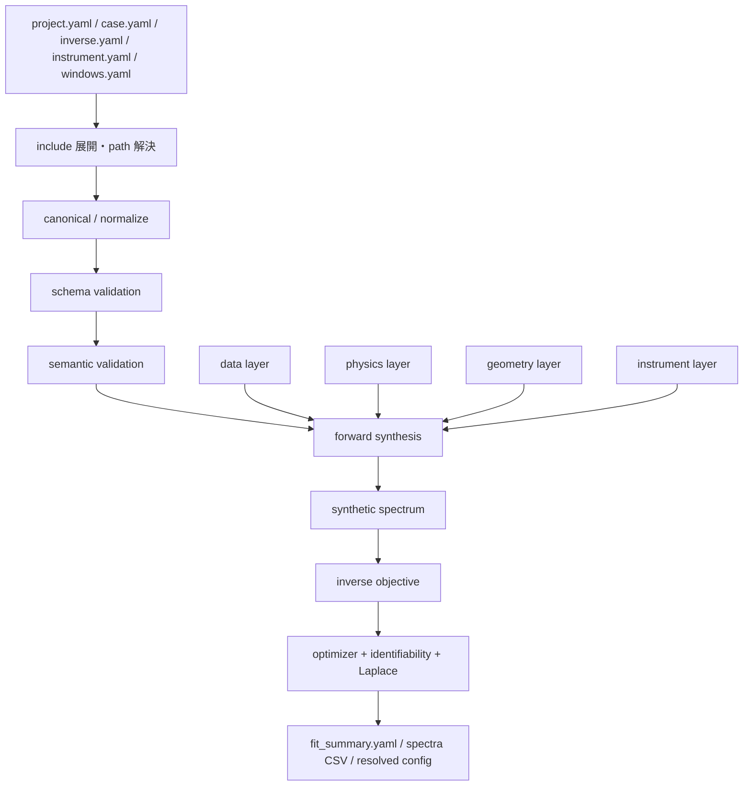
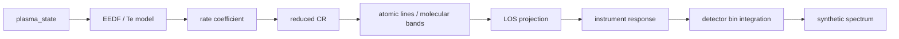
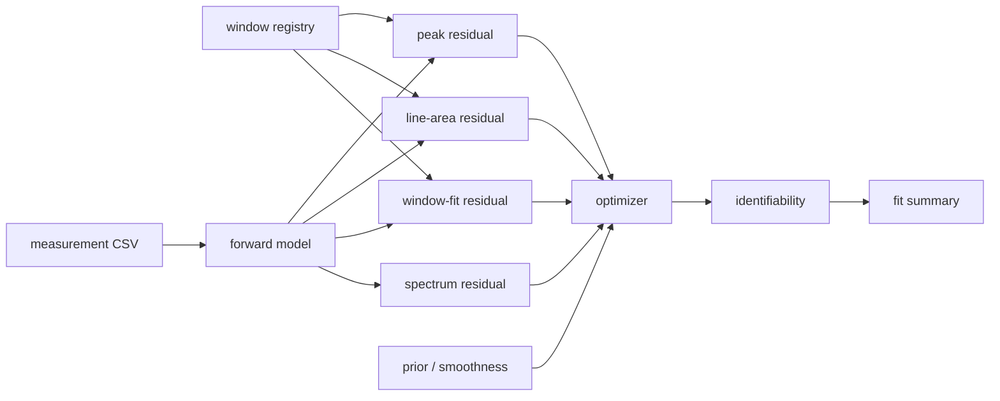
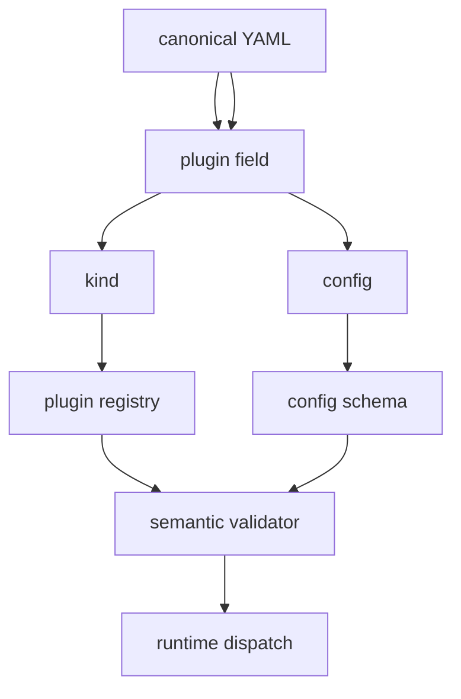
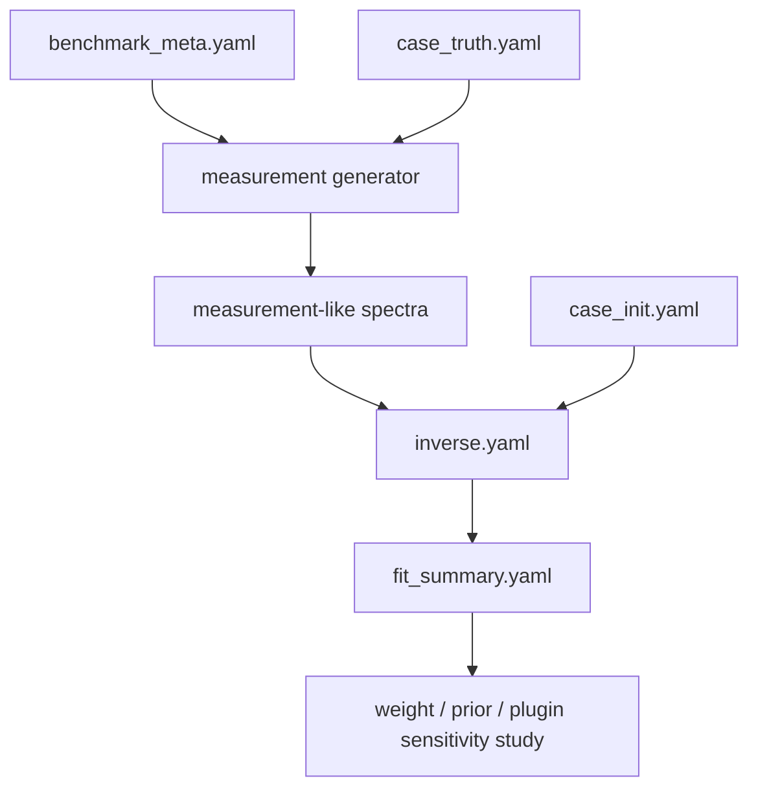

# 低圧半導体プロセスプラズマ向け OES-CR 解析基盤  
## 活用ユースケース先行・科研費様式の第三者向け技術レポート

---

## 研究課題名

**低圧半導体プロセスプラズマの OES 計測に対する、観測モデル内蔵 reduced collisional-radiative 解析基盤の整備と、厳密な設定契約に基づく継続開発可能なソフトウェア設計**

---

## 要旨

本レポートは、低圧プラズマの OES 計測エンジニアが、本コードを**どのような入力から何を出力できるか**、**どの範囲で有効か**、**なぜ既存の line ratio 中心解析より有用か**を短時間で把握できるように整理したものである。対象コードは、計算コア群 `oescr_refined` と、厳密な設定契約・ plugin 契約群 `oescr_canonicalized` から構成される。前者は低圧半導体プロセスプラズマ向けの reduced OES-CR forward / inverse 計算、5-chord 軸対称 shell 観測、window-fit・line-area 残差、benchmark パッケージを担い、後者は canonical YAML、JSON Schema、plugin registry により継続開発性を担保する。

本基盤の中心的な価値は、OES を単なる相対線強度の比較ではなく、  
\[
\text{EEDF/}T_e \rightarrow \text{rate coefficient} \rightarrow \text{excited-state balance} \rightarrow \text{emissivity} \rightarrow \text{LOS projection} \rightarrow \text{instrument response}
\]
という**観測モデル付き reduced CR 問題**として一貫して扱う点にある。特に、Ar を含むエッチングプラズマ、低分解能器、複数視線、装置差の大きい現場を想定し、計測器仕様を外部 YAML に切り出し、低分解能時の EEDF inverse を bi-Maxwell に制限する安全設計、window-fit と line-area を明示的に用いる逆問題設計、文献条件に基づく NF\(_3\)/Ar・Cl\(_2\)/Ar benchmark を整備している点が実用上の特徴である。

---

## 1. 本ソフトウェアの活用ユースケースと導入メリット

### 1.1 先に結論

本コードは、次のような現場に向く。

1. **OES 装置を入れ替えながら、解析手順だけは共通化したい場合**  
2. **Ar を actinometer / tracer として含むエッチングプラズマで、合成スペクトルと逆解析を同じ基盤で回したい場合**  
3. **NF\(_3\)/Ar や Cl\(_2\)/Ar の文献条件を benchmark 化し、自社装置との差分を比較したい場合**  
4. **物理モデル、観測モデル、逆問題の各層を切り離して改良したい場合**  
5. **第三者が引き継いでも読める設定契約・ plugin 契約を持つ研究コードを必要とする場合**

### 1.2 想定入力と主出力

| 観点 | 主入力 | 主出力 | 利用価値 |
|---|---|---|---|
| 順方向計算 | `case.yaml`、`instrument.yaml`、cross section CSV、band profile、windows YAML | 合成スペクトル CSV、window 強度、feature summary | 条件から見えるスペクトルの予測、窓設計、装置比較 |
| 逆問題 | `case_init.yaml`、`inverse.yaml`、実測スペクトル CSV、instrument YAML | `fit_summary.yaml`、最適パラメータ、residual 分解、識別性 summary | \(n_e\)、\(T_e\) または bi-Maxwell EEDF の推定、妥当窓の選別 |
| benchmark | truth case、measurement generator、benchmark meta | measurement-like spectra、truth / init / inverse 一式 | 文献条件との比較、回帰試験、重み付けや noise の感度評価 |
| 設定検証 | canonical YAML、JSON Schema、plugin registry | 構造検証結果、semantic 検証結果 | 設定ミスの早期検出、第三者運用、保守容易化 |
| モデル拡張 | plugin 実装、schema、docs | 新 EEDF / trapping / band / optimizer plugin | 継続開発、複数研究者での改良、実験条件ごとの分岐管理 |

### 1.3 利用者別の典型ユースケース

| 利用者 | 典型入力 | 期待出力 | 直接的メリット |
|---|---|---|---|
| OES 計測エンジニア | 実測スペクトル、装置仕様 YAML、解析窓 YAML | \(n_e\)、\(T_e\) / bi-Maxwell EEDF、window 残差、line area | 装置差を吸収しつつ OES 解釈を標準化できる |
| プロセス開発者 | ガス組成、圧力、RF 条件、候補窓 | 観測可能窓、感度の高い線 / 帯、合成スペクトル | 新レシピ・新装置で見るべき波長窓を絞れる |
| モデル開発者 | cross section CSV、band profile、plugin 実装 | 新物理の forward / inverse への組込み | reduced CR を壊さず拡張できる |
| 品質・運用担当 | benchmark package、project.yaml | 再現可能 benchmark 実行結果 | 変更が解析結果に与える影響を回帰試験で確認できる |

### 1.4 活用範囲

| 活用範囲 | 適合度 | 備考 |
|---|---|---|
| Ar を含む低圧 etch / clean plasma の forward OES | 高い | Ar/NF\(_3\)/Cl\(_2\) benchmark を同梱 |
| 低分解能器での \(n_e\)、\(T_e\) 逆解析 | 高い | full spectrum + window-fit + line area を使用 |
| 低分解能器での EEDF inverse | 中程度 | **bi-Maxwell まで**に制限 |
| 分子帯の高忠実度 rovibronic fitting | 限定的 | 現状は effective band emitter。PGOPHER 連携余地あり [8][9] |
| 0D 組成計算 | 対象外 | 本コードは組成ソルバではない |
| 光学的に厚い共鳴線の厳密放射輸送 | 限定的 | 現状は escape factor ベース |
| 2D/3D tomography | 限定的 | 現状 default は axisymmetric shell |

### 1.5 導入メリット

| 論点 | 本コードの特徴 | 期待効果 |
|---|---|---|
| 装置差の扱い | 計測器仕様を外部 YAML 化 | 装置更新・分解能変更への追随が容易 |
| 解析の再現性 | `project.yaml` + benchmark + resolved config | 手順の属人化を抑えられる |
| 第三者保守 | canonical YAML + JSON Schema + plugin registry | 設定とコード変更点が追いやすい |
| 解析の安全性 | 低分解能 EEDF inverse を bi-Maxwell に制限 | 過剰自由度による見かけの最適化を抑える |
| 物理の拡張性 | reaction rate / band / trapping / optimizer を plugin 化 | 将来の高忠実度化に備えられる |

---

## 2. 全体サマリー（科研費様式）

### 2.1 背景

低圧半導体プロセスプラズマの OES は、装置への非侵襲性、窓材越しのアクセス性、複数視線化の容易さから、エッチング、チャンバークリーニング、プロセス監視に広く用いられている。しかし、現場での運用はしばしば**相対線強度比**または**経験的 endpoint** にとどまり、電子エネルギー分布、準安定、壁損失、LOS 積分、分光器応答を十分に含んだ解析フレームワークは整備しにくい。加えて、装置仕様の変更、分解能の差、窓定義の差が解析再現性を損なう要因となる。

一方、原子線データについては NIST ASD が critically evaluated な波長・エネルギー準位・遷移確率を提供しており [1]、分子・ transient species に関しては NIST Chemistry WebBook [2]、PGOPHER [8][9] などの周辺資産がある。電子衝突データについては LXCat が低温プラズマ向けの cross section・swarm data を集約し [3][4]、BOLSIG+ [5][6] や LoKI-B [7] は EEDF / rate coefficient の高忠実度化のための基盤を提供する。したがって、OES 実務に必要な計算資産は外部に存在するが、**観測モデル込みで一貫して接続する中間層**が不足している。

### 2.2 課題

本課題で解くべき技術的課題は次の通りである。

| 課題 | 内容 |
|---|---|
| 課題 A | OES を line ratio のみで扱うと、EEDF・metastable・光学系の寄与が混ざる |
| 課題 B | 装置仕様の違いが解析結果の比較を難しくする |
| 課題 C | 低分解能器に対して自由度の高い EEDF inverse を行うと不適切な解が出やすい |
| 課題 D | 研究コードは物理と設定が密結合になりやすく、第三者保守が難しい |
| 課題 E | 文献条件をベンチマーク化しにくく、回帰試験が成立しにくい |

### 2.3 解題に対する独自の工夫

本コードの独自性は、次の 6 点に整理できる。

| 独自の工夫 | 要点 | 効果 |
|---|---|---|
| reduced CR + 観測モデル一体化 | EEDF/Te → rate → CR → emissivity → LOS → instrument を一貫化 | OES を計測モデル込みで扱える |
| 5-chord 軸対称 shell 設計 | 同一高さ半径方向 5 chord を default geometry とする | 現場の multi-view OES 条件に合う |
| low-res 安全設計 | 低分解能器での EEDF inverse を bi-Maxwell に制限 | 過学習・非識別性を抑える |
| window-fit + line area 併用 | full spectrum と feature residual を組み合わせる | 低分解能器でも頑健に使える |
| canonical YAML + plugin registry | すべての可変物理を `{kind, config}` で表現 | 設定の可読性と継続開発性を両立 |
| literature-anchored benchmark | NF\(_3\)/Ar、Cl\(_2\)/Ar の measurement-like benchmark を配布 | 回帰試験と文献比較が可能 |

### 2.4 期待される効果

1. **OES の forward / inverse を同一基盤で再利用できる**  
2. **計測器や窓定義が変わっても解析フレームを維持できる**  
3. **第三者が物理モデルを差し替えながら継続開発できる**  
4. **実測スペクトル投入前に benchmark で解析系の健全性を検証できる**  

---

## 3. コード全体の位置づけ

本配布物は、実質的には次の二層から成る。

| コンポーネント | 主役割 | 主な内容 |
|---|---|---|
| `oescr_refined` | **計算コア層** | forward / inverse、benchmark、project 実行、docs |
| `oescr_canonicalized` | **設定契約・拡張層** | canonical YAML、JSON Schema、plugin registry、migration CLI |

この分割は、時系列上の版違いとして読むよりも、**運用時の役割分担**として理解すると分かりやすい。すなわち、前者は「計算を回す層」、後者は「設定契約と拡張性を保証する層」である。

---

## 4. コード構成とワークフロー

### 4.1 パッケージ構成

```text
oescr_refined/
  oescr/
    api.py
    io/
    data/
    physics/
    geometry/
    instrument/
    forward/
    inverse/
  scripts/
  examples/
  docs/

oescr_canonicalized/
  oescr/
    io/
    plugins/
    schemas/
  scripts/
  docs/
  examples/
```

### 4.2 レイヤ責務

| レイヤ | 主ファイル群 | 主責務 |
|---|---|---|
| Configuration / Project | `io/*`, `scripts/run_project.py` | YAML 読込、include 展開、path 解決、project 実行 |
| Schema / Validation | `oescr_canonicalized/oescr/schemas/*`, `io/schema.py` | 構造検証、semantic 検証 |
| Plugin / Variation Points | `plugins/base.py`, `plugins/registry.py`, `plugins/builtin.py` | 物理・数値の差し替え点の明示 |
| Data | `data/*` | atomic / cross section / band / provenance の読込 |
| Physics | `physics/*` | EEDF、rate、CR、band、trapping、wall、residual |
| Geometry | `geometry/*` | shell path-length 行列、非軸対称補正 |
| Instrument | `instrument/*` | throughput、LSF、baseline、bin integration |
| Forward | `forward/*` | emissivity 合成、LOS 投影、計測器観測 |
| Inverse | `inverse/*` | objective、optimizer、識別性、Laplace UQ |

### 4.3 全体ワークフロー



### 4.4 順方向計算フロー



### 4.5 逆問題フロー



### 4.6 plugin 解決フロー



---

## 5. 入出力仕様と利用手順

### 5.1 基本入力ファイル

| ファイル | 役割 | 代表内容 |
|---|---|---|
| `project.yaml` | 実行単位のマニフェスト | case、inverse、出力先、project 名 |
| `case.yaml` | forward 物理条件 | ガス組成、EEDF/Te、geometry、states、reactions、transitions、bands |
| `inverse.yaml` | 逆解析条件 | measurement、optimizer、parameter groups、weights、priors |
| `instrument.yaml` | 計測器仕様 | 波長範囲、bin、LSF、throughput、baseline、measurement format |
| `windows.yaml` | 解析窓定義 | family、中心波長、帯域、area / peak / normalization 方針 |
| measurement CSV | 実測または benchmark 波形 | wavelength、intensity |

### 5.2 代表的な出力

| 出力 | 内容 | 用途 |
|---|---|---|
| `fit_summary.yaml` | 最適パラメータ、残差、識別性要約 | 実験ノート、比較表、 regression |
| synthetic spectra CSV | 合成スペクトル | 窓設計、計測器比較、forward 検証 |
| resolved config | include 展開後の設定 | 監査、再現性、第三者レビュー |
| benchmark measurement CSV | measurement-like 信号 | 回帰試験、重み付けの調整 |

### 5.3 canonical YAML の基本形

すべての可変物理は、YAML 上でも次の形に統一される。

```yaml
some_plugin_field:
  kind: plugin_name
  config:
    ...
```

この形式を採る対象は、少なくとも次のとおりである。

| plugin category | 典型フィールド |
|---|---|
| `eedf` | `plasma_state.eedf` |
| `geometry` | `geometry` |
| `wall_loss` | `wall` |
| `reaction_rate` | `reactions[].rate_model` |
| `line_profile` | `transitions[].profile` |
| `trapping` | `transitions[].trapping` |
| `band_emission` | `bands[].emission` |
| `band_profile` | `bands[].profile` |
| `throughput` | `instrument.throughput` |
| `lsf` | `instrument.lsf` |
| `baseline` | `instrument.baseline` |
| `optimizer` | `inverse.optimizer` |

### 5.4 実務的な使い方

| 手順 | 実務上の意味 |
|---|---|
| benchmark を 1 つ通す | 解析環境の健全性を確認する |
| instrument YAML を自装置仕様で置換する | 装置差を解析系に取り込む |
| windows YAML を自装置の有効帯域で絞る | 使えない窓を早めに除外する |
| case_init を実測条件へ寄せる | inverse の探索を安定化する |
| fit_summary と residual 分解を確認する | 「合っている」ではなく「何が合っていないか」を見る |

---

## 6. 物理理論の整理

以下では、計算カテゴリーごとに、**目的、代表方程式、現実装、近似、拡張余地**を整理する。

### 6.1 物理カテゴリ別総覧

| 計算カテゴリ | 代表方程式 | 現実装 | 主要ファイル | 現状の近似 | 拡張候補 |
|---|---|---|---|---|---|
| EEDF 表現 | \(\int_0^\infty f_E(E)\,dE = 1\) | Maxwell / Druyvesteyn / bi-Maxwell / tabulated | `physics/eedf.py` | low-res inverse は bi-Maxwell まで | BOLSIG+ / LoKI-B 連携、basis EEDF [5][6][7] |
| rate coefficient | \(k_r=\int \sigma_r(E)v(E)f_E(E)\,dE\) | table / surrogate | `physics/rates.py` | 角度依存・state-selective 詳細化なし | uncertainty-aware cross section、basis projection |
| atomic reduced CR | \(M(\theta)n^\*=b(\theta)\) | steady linear balance | `physics/cr_atomic.py` | full GCR ではない | adjacent ion stage、time-dependent CR |
| line emissivity | \(j_{ul}=\frac{hc}{4\pi\lambda}n_uA_{ul}^{\mathrm{eff}}\phi_{ul}\) | Gaussian intrinsic profile + effective A | `forward/emissivity.py` | Stark / Voigt / density broadening 簡略 | line-shape 高忠実度化、broadening DB 連携 |
| molecular band | \(j_{\mathrm{band}} = a\,P(\lambda)\) | effective excitation / density band | `physics/bands.py` | rovibronic CR ではない | PGOPHER 連携、vibrational kinetics [8][9] |
| radiation trapping | \(A_{\mathrm{eff}}=\beta A\) | escape factor | `physics/trapping.py` | self-absorption を簡略 | ray tracing、line-by-line RT |
| wall loss | \(k_{\mathrm{wall}}\approx \gamma v_{\mathrm{th}}/L_{\mathrm{char}}\) | effective first-order sink | `physics/wall.py` | surface chemistryを明示しない | 温度依存、表面反応 plugin |
| LOS projection | \(I_{m,\lambda}=\sum_k W_{mk}j_{k,\lambda}\) | axisymmetric shell | `geometry/axisym_shell.py` | full tomography ではない | Abel / ART / tomo-OES |
| instrument response | \(I_{\mathrm{det}}=\mathcal{B}_\Delta\{T(\lambda)\,[L*I](\lambda)+b(\lambda)\}\) | shift, LSF, throughput, baseline, bin average | `instrument/*` | stray-light matrix 等は簡略 | wavelength-dependent LSF, nonlinearity |
| inverse objective | \(\mathcal{L}=w_s\chi_s^2+w_w\chi_w^2+w_a\chi_a^2+w_p\chi_p^2+R\) | spectrum + window + area + peak + prior | `inverse/objectives.py` | correlated noise 未導入 | robust likelihood、heteroscedastic noise |
| identifiability / UQ | \(\Sigma \approx (J^\top J+\epsilon I)^{-1}\) | finite-difference Jacobian, SVD, Laplace | `inverse/identifiability.py`, `inverse/laplace.py` | full posterior sampling ではない | HMC / NUTS、profile likelihood |

### 6.2 EEDF と電子運動論

EEDF は energy-space PDF として扱われる。主式は

\[
\int_0^\infty f_E(E)\,dE = 1,
\qquad
k_r = \int_0^\infty \sigma_r(E)\,v(E)\,f_E(E)\,dE .
\]

ここで
\[
v(E)=\sqrt{\frac{2eE}{m_e}} .
\]

本コードは、**forward では柔軟に、inverse では安全側に**という方針を採る。すなわち forward 側では Maxwell, Druyvesteyn, bi-Maxwell, tabulated を受け入れる一方、低分解能器での inverse は bi-Maxwell に制限する。これは、line overlap、local gain、window normalization の自由度を考えると、低分解能スペクトルから arbitrary EEDF を再構成するのは一般に過剰自由度だからである。BOLSIG+ は weakly ionized gas、空間・時間一定電場、境界なし、二項近似の条件で Boltzmann 方程式を解くコードであり [5][6]、LoKI-B は space-independent two-term 電子 Boltzmann 方程式を DC/HF/time-varying field・混合ガスに対して扱う [7]。したがって、本コードではこれらを**外部高忠実度 EEDF 供給器**として接ぐのが自然である。

### 6.3 rate coefficient と surrogate

代表式は

\[
k_r = \int_0^\infty \sigma_r(E)\,v(E)\,f_E(E)\,dE .
\]

現在は cross section table か threshold-peak surrogate を用いる。surrogate の概念式は、しきい上で立ち上がり、ピーク後に減衰する

\[
\sigma(E) \sim \sigma_{\max}
\left(\frac{E-E_{\mathrm{th}}}{E_{\mathrm{peak}}-E_{\mathrm{th}}}\right)
\exp\!\left(
1-\frac{E-E_{\mathrm{th}}}{E_{\mathrm{peak}}-E_{\mathrm{th}}}
\right)
\]

型である。実務上、これは**初期検討・benchmark・欠損データの placeholder**として有用であり、最終的には LXCat 由来の tabulated cross section に置換することを想定する [3][4]。

### 6.4 atomic reduced CR

各 solved state について、定常励起準位バランス

\[
M(\theta)\,n^\* = b(\theta)
\]

を解く。ここで \(n^\*\) は solved excited states の密度ベクトル、\(M(\theta)\) は遷移・損失・クエンチ・壁損失を含む係数行列、\(b(\theta)\) は ground / metastable / radical からの source 項である。

現実装に含まれる過程は、概ね以下である。

| 過程 | 実装有無 | コメント |
|---|---|---|
| 電子衝突励起 | 有 | ground からの excitation |
| stepwise excitation | 有 | metastable からの励起 |
| 放射遷移 | 有 | effective \(A\) 値を用いる |
| gas quenching | 有 | 一次損失として扱う |
| wall loss | 有 | effective first-order sink |
| 電離段間結合 | 限定的 | full GCR ではない |
| 再結合 | 限定的 | 現状の主対象ではない |

本コードの atomic 部は、**あくまで reduced CR** である。この割り切りにより、0D chemistry を含まないまま、OES forward / inverse の透明性を維持している。

### 6.5 atomic line emissivity

上準位密度から line emissivity を

\[
j_{ul}(\lambda)=
\frac{hc}{4\pi\lambda_{ul}}
n_u A_{ul}^{\mathrm{eff}}
\phi_{ul}(\lambda)
\]

で与える。ここで \(\phi_{ul}(\lambda)\) は現在 Gaussian intrinsic profile であり、\(A_{ul}^{\mathrm{eff}}\) は trapping を含む effective 遷移確率である。原子線データの主要供給源は NIST ASD であり、version 5.12 は 2024 年 11 月にデータ更新されている [1]。

### 6.6 molecular band emitter

分子帯は atomic CR に無理に統合せず、effective band emitter として扱う。代表式は、

- excitation-driven band:
\[
j_{\mathrm{band}}(\lambda)=a\,n_e n_s k_r\,P(\lambda)
\]
- density-driven band:
\[
j_{\mathrm{band}}(\lambda)=c\,n_s\,P(\lambda)
\]

である。ここで \(P(\lambda)\) は band profile であり、Gaussian あるいは tabulated profile を用いる。NF\(_x\)、CF\(_x\)、BCl\(_x\) を含む低圧プロセスプラズマでは、この「effective emitter としての band 取扱い」は、現場実装上の折衷として妥当である。より高忠実度に進む場合は PGOPHER の line / band contour fitting を接続する [8][9]。

### 6.7 radiation trapping と self-absorption

現実装は

\[
A_{\mathrm{eff}}=\beta A
\]

という escape-factor ベースであり、共鳴線の selective な補正や、\(\tau_0\) の代表値からの調整に使う。低圧 Ar 系の CR 診断でも escape factor は有効な第一近似であるが [11]、光学的に厚い系や line-by-line 自己吸収が問題になる場合には不十分である。そのため、将来的には

- line-by-line self-absorption
- ray tracing
- resonance line の選択的高忠実度化

へ進む余地がある。

### 6.8 wall loss と residual gas

壁損失は

\[
k_{\mathrm{wall}} \approx \gamma \frac{v_{\mathrm{th}}}{L_{\mathrm{char}}},
\qquad
v_{\mathrm{th}}=\sqrt{\frac{8k_B T_g}{\pi m}}
\]

で表す effective first-order sink である。これは本コードが表面化学を full reaction network で解かないことと整合的である。ゆるい prior を付与し、装置差や表面状態差は逆解析上の nuisance / prior として吸収する。residual gas についても同様に、自己無撞着に計算するのではなく、入力または弱い prior として扱う。

### 6.9 geometry と LOS projection

default geometry は axisymmetric shell であり、各 shell の emissivity を chord ごとの LOS へ投影して

\[
I_{m,\lambda} = \sum_k W_{mk}\,j_{k,\lambda}
\]

とする。これは「同一高さ・半径方向 5 chord」という本コードの代表ユースケースと整合的である。Abel inversion は classical だが、ノイズ増幅や off-axis peak の扱いなどに課題があり、少数 chord では forward fitting の方が安定であることが多い。そのため、本コードでは Abel を主系にせず、**forward LOS fitting** を主系としている。

### 6.10 instrument model

観測器層は、fine-grid spectrum に対して、

1. wavelength shift  
2. LSF convolution  
3. throughput  
4. baseline  
5. detector bin integration  

を順に適用する。概念式は

\[
I_{\mathrm{det}}(\lambda_i)
=
\frac{1}{\Delta\lambda_i}
\int_{\lambda_i-\Delta\lambda_i/2}^{\lambda_i+\Delta\lambda_i/2}
\left[
g\,T(\lambda)\,(L*I_{\mathrm{LOS}})(\lambda)
+
b(\lambda)
\right]d\lambda .
\]

低分解能器では detector bin average を明示することが特に重要であり、channel center での point sampling に比べて feature extraction が安定する。

---

## 7. 拡張性のある物理

### 7.1 カテゴリ別拡張候補

| 拡張カテゴリ | 追加したい物理 | 追加理由 | 接続先 |
|---|---|---|---|
| EEDF 高忠実度化 | BOLSIG+ / LoKI-B coupling、basis EEDF、time-resolved EEDF | pulsed plasma、高分解能器、RF phase dependence への対応 | `physics/eedf.py`, `physics/rates.py` |
| atomic CR 高密度化 | ionization / recombination / adjacent ion stages | 高密度域での line ratio 解釈の安定化 | `physics/cr_atomic.py` |
| molecular spectroscopy | rovibronic contour、Franck–Condon、vibrational kinetics | NF\(_x\)、CF\(_x\)、BCl\(_x\) の帯構造解釈向上 | `physics/bands.py` |
| radiation transport | line-by-line absorption、ray tracing | resonance line、optically thick line 対応 | `physics/trapping.py` |
| line broadening | Stark, Doppler, pressure broadening | 高分解能器での density / temperature 情報抽出 | `forward/emissivity.py`, `instrument/lsf.py` |
| geometry | Abel, ART, tomo-OES, 2D/3D field | imaging OES、非軸対称場への拡張 | `geometry/*`, `forward/observe.py` |
| UQ 高忠実度化 | HMC / NUTS、atomic-data uncertainty | OES inverse の不確かさを研究水準で評価 | `inverse/*` |
| wall/surface | material-dependent \(\gamma\)、surface reaction plugin | chamber seasoning、表面状態差を取り込む | `physics/wall.py` |
| chemistry sidecar | optional 0D chemistry coupling | 組成入力との整合性向上 | package 分離が望ましい |

### 7.2 拡張優先度

| 優先度 | 項目 | 理由 |
|---|---|---|
| 高 | trapping の選択的高忠実度化 | 実スペクトルとのズレの説明力が高い |
| 高 | band emitter の高忠実度化 | NF\(_3\)、CF\(_4\)、BCl\(_3\) 系で有効 |
| 高 | atomic-data / cross section uncertainty 取扱い | inverse の信頼区間評価に必須 |
| 中 | sparse / JIT / batched numerics | inverse の反復高速化に効く |
| 中 | tomography 2D/3D | 利用装置が揃った場合に効果が大きい |
| 低 | 0D chemistry 内蔵 | 本コードの主目的からは外れる |

---

## 8. 数値計算方法

### 8.1 数値計算カテゴリ別まとめ

| 数値計算カテゴリ | 数式 / アルゴリズム | 現実装 | 改良余地 |
|---|---|---|---|
| cross section interpolation | 共通 energy grid への補間 | `np.interp` | monotone spline、log-log 補間 |
| rate quadrature | \(\int \sigma(E)v(E)f_E(E)\,dE\) | `trapz` | adaptive quadrature、basis projection |
| CR solve | \(Mn=b\) | dense solve + `lstsq` fallback | sparse solve、preconditioner |
| emissivity synthesis | line / band の fine-grid 合成 | NumPy 加算 | line batching、JIT |
| LOS projection | \(I=Wj\) | 行列積 | sparse \(W\)、2D/3D projector |
| LSF convolution | \(L * I\) | FFT convolution | wavelength-dependent kernel |
| bin integration | channel 幅平均 | mask + `trapz` | vectorized bin operator |
| objective assembly | residual vector 連結 | `least_squares` 向け残差設計 | correlated covariance |
| optimization | DE + local least squares | SciPy | CMA-ES、trust region、AD gradient |
| identifiability | finite-difference Jacobian、SVD | 明示的実装 | autodiff、global sensitivity |
| UQ | Laplace approximation | Hessian proxy inverse | MCMC / profile likelihood |

### 8.2 主要数式

#### 8.2.1 反応率係数

\[
k_r=\int_0^\infty \sigma_r(E)\,v(E)\,f_E(E)\,dE
\]

#### 8.2.2 reduced CR 線形系

\[
M(\theta)\,n^\*=b(\theta)
\]

#### 8.2.3 line emissivity

\[
j_{ul}(\lambda)=
\frac{hc}{4\pi\lambda_{ul}}
n_uA_{ul}^{\mathrm{eff}}\phi_{ul}(\lambda)
\]

#### 8.2.4 density-driven band

\[
j_{\mathrm{band}}(\lambda)=c\,n_s\,P(\lambda)
\]

#### 8.2.5 LOS projection

\[
I_{m,\lambda}
=
\sum_k W_{mk}j_{k,\lambda}
\]

#### 8.2.6 detector bin average

\[
I_i
=
\frac{1}{\Delta\lambda_i}
\int_{\lambda_i-\Delta\lambda_i/2}^{\lambda_i+\Delta\lambda_i/2}
I_{\mathrm{fine}}(\lambda)\,d\lambda
\]

#### 8.2.7 line area feature

\[
A_w
=
\int_{\lambda \in w}
\left[I(\lambda)-b_w(\lambda)\right]\,d\lambda
\]

#### 8.2.8 peak feature

\[
P_w
=
\max_{\lambda\in w}
\left[I(\lambda)-b_w(\lambda)\right]
\]

#### 8.2.9 複合 objective

\[
\mathcal{L}
=
w_s\chi_s^2
+
w_w\chi_w^2
+
w_a\chi_a^2
+
w_p\chi_p^2
+
R_{\mathrm{prior}}
+
R_{\mathrm{smooth}}
\]

#### 8.2.10 smoothing regularization

一次差分正則化:
\[
R_1(x)=\sum_i (x_{i+1}-x_i)^2
\]

二次差分正則化:
\[
R_2(x)=\sum_i (x_i-2x_{i+1}+x_{i+2})^2
\]

#### 8.2.11 finite-difference Jacobian

\[
J_{ij}
\approx
\frac{r_i(x+\Delta x_j e_j)-r_i(x)}{\Delta x_j}
\]

#### 8.2.12 Laplace 近似

\[
H \approx J^\top J + \epsilon I,
\qquad
\Sigma \approx H^{-1}
\]

### 8.3 数値計算設計の意図

| 設計判断 | 意図 |
|---|---|
| NumPy / SciPy 中心 | コードの可読性と追跡性を優先する |
| residual vector として objective を組む | standard least-squares 系が使いやすい |
| global + local + Laplace | 研究コードとして実務と透明性のバランスがよい |
| detector bin average を明示 | low-res OES での feature 解釈を安定化する |
| identifiability を分離 | 「解けるかどうか」を fit 成否と切り分ける |

---

## 9. benchmark と実用例

### 9.1 benchmark 一覧

| benchmark | 性格 | 文献アンカー | 主特徴 |
|---|---|---|---|
| NF\(_3\)/Ar CCP clean | literature-anchored, measurement-like | An & Hong (2023) [12] | N\(_2\) 2nd positive、N\(_2\) 1st positive、F 703.7/712.9、Ar 750.4 |
| Cl\(_2\)/Ar ICP actinometry | literature-anchored, measurement-like | Fuller et al. (2001) [13] | Cl\(_2\) 306 nm 帯、Ar\(^+\) 480.7、Cl\(^+\) 482.0、Cl 822.2 干渉付き |

### 9.2 NF\(_3\)/Ar benchmark の意義

NF\(_3\)/Ar benchmark は、PECVD chamber clean を念頭に置いた measurement-like package であり、NF\(_3\)/Ar の代表的な可視・近紫外特徴を一つの regression package としてまとめている。ここでは実測波形そのものを同梱するのではなく、文献条件と代表窓に基づく再生成可能 benchmark としている。これにより、

- instrument YAML の変更
- window weights の変更
- inverse parameterization の変更

が結果に与える影響を系統的に確認できる。

### 9.3 Cl\(_2\)/Ar benchmark の意義

Cl\(_2\)/Ar benchmark は、単純 actinometry の危うさを含めて検討するための package と位置付けるのが適切である。特に neutral Cl 線は dissociative excitation による Cl\(_2\) 起源の寄与を含みうるため [13]、本コードでは line ratio を盲目的に使わず、window-fit と干渉項を含む feature 評価へ寄せている。

### 9.4 benchmark 利用手順



---

## 10. 保守性・第三者開発性・コード運用性

### 10.1 第三者が理解しやすい理由

| 観点 | 整備内容 | 効果 |
|---|---|---|
| 設定契約 | canonical YAML + JSON Schema | 何が必須で何が plugin かが明確 |
| 物理差し替え点 | plugin category 明示 | 変更箇所が局所化される |
| ワークフロー | `project.yaml` と CLI を用意 | 実行入口が一本化される |
| 再現性 | benchmark、resolved config、fit summary | 再実行・レビューが容易 |
| ドキュメント | architecture / physics / numerics / io / developer guide | 読み始める場所が分かる |

### 10.2 物理ごとの変更窓口

| 変更したいもの | 主に触る場所 |
|---|---|
| EEDF モデル | `physics/eedf.py`, `plugins/builtin.py` |
| rate model | `physics/rates.py`, `plugins/builtin.py` |
| atomic CR | `physics/cr_atomic.py` |
| band model | `physics/bands.py` |
| trapping | `physics/trapping.py` |
| geometry | `geometry/*` |
| instrument response | `instrument/*` |
| inverse objective | `inverse/objectives.py` |
| optimizer | `inverse/optimize.py`, `plugins/builtin.py` |
| schema / config | `oescr_canonicalized/oescr/schemas/*`, `io/schema.py` |

### 10.3 保守性の観点からの評価

| 評価軸 | 評価 | コメント |
|---|---|---|
| レイヤ分離 | 良好 | physics / geometry / instrument / inverse が自然に分かれる |
| 設定の明示性 | 良好 | canonical YAML により shorthand が減る |
| third-party onboarding | 良好 | docs と benchmark が入口になる |
| runtime と strict schema の完全一体化 | 要整備 | 設定契約層と計算コアの完全統合は今後の主題 |
| 性能最適化 | 未成熟 | clarity 優先設計のため、今後の高速化余地は大きい |

---

## 11. 適用範囲、限界、運用上の注意

### 11.1 適用範囲

- 低圧半導体プロセスプラズマ
- Ar を tracer / actinometer として含む系
- NF\(_3\)/Ar、Cl\(_2\)/Ar を含む OES
- 5-chord same-height OES
- low-res spectrometer を含む multi-instrument 比較

### 11.2 明示的な限界

| 限界 | 意味 |
|---|---|
| 0D chemistry は内蔵しない | 組成は入力または逆解析変数として与える |
| molecular band は effective model | full rovibronic CR ではない |
| trapping は簡略 | optically thick line への厳密解ではない |
| low-res EEDF inverse は bi-Maxwell まで | arbitrary EEDF は許さない |
| UQ は Laplace 近似中心 | full Bayesian posterior ではない |

### 11.3 運用上の注意

1. **まず benchmark を通す**  
2. **instrument YAML を自装置仕様で必ず更新する**  
3. **使えない波長窓は windows YAML で無効化する**  
4. **line ratio だけで判断せず residual 分解を見る**  
5. **逆問題の成功と識別性の良さを区別する**  

---

## 12. 本コードを用いることの効果

### 12.1 研究面

- reduced CR と観測モデルを一体化した OES 解析基盤として、実験と数値計算の往復がしやすい  
- 物理モデルの改良を plugin と schema のレベルで局所化できる  
- benchmark により、変更が結果へ与える影響を継続的に確認できる  

### 12.2 実務面

- 計測器更新時の影響を instrument YAML の差し替えで管理できる  
- 複数視線 OES を axisymmetric shell として取り込める  
- 実験者ごとの差ではなく、設定差・モデル差として解析の違いを見られる  

### 12.3 組織面

- 引継ぎ資料として使える  
- 共同研究での役割分担がしやすい  
- 将来の高忠実度化（Boltzmann solver、PGOPHER、Bayesian UQ）への接続点が明確である  

---

## 13. まとめ

本コードは、低圧半導体プロセスプラズマの OES を、**線強度比の経験則**ではなく、**観測モデルを含む reduced CR forward / inverse 問題**として扱うための実装基盤である。特に、Ar を含むエッチング・クリーニング系、低分解能器、複数視線、装置差の大きい現場に対して、次の点で有効である。

- 入力と出力が project / case / inverse / instrument / windows に整理されている  
- 計測器差を YAML 化し、解析ロジックと分離している  
- 低分解能時の EEDF inverse を bi-Maxwell に制限し、安全側に倒している  
- window-fit と line-area を組み込み、実験 OES に合わせた feature 設計を採っている  
- benchmark を配布し、第三者が最初に何を確認すべきかが明確である  
- canonical YAML と plugin registry により、継続開発・第三者保守の足場を持つ  

要するに、本ソフトウェアは「一発で完成した高忠実度プラズマシミュレータ」ではない。しかし、**実験現場の OES 解釈を、物理・数値・設定・運用の四層で持続的に改良していくための、極めて実務的な研究基盤**としては筋が良い。研究と現場の接点に置くコードとしての価値は高い。

---

## 14. 参考文献

[1] NIST Atomic Spectra Database (ASD), Standard Reference Database 78, Version 5.12, last update to data content: November 2024. NIST official portal.  
[2] NIST Chemistry WebBook, SRD 69. NIST official portal.  
[3] LXCat Project, “About the project,” official website.  
[4] L. C. Pitchford et al., “LXCat: an Open-Access, Web-Based Platform for Data Needed for Modeling Low Temperature Plasmas,” *Plasma Processes and Polymers*, 14, e1600098 (2017).  
[5] BOLSIG+, official website: electron Boltzmann equation solver.  
[6] G. J. M. Hagelaar and L. C. Pitchford, “Solving the Boltzmann equation to obtain electron transport coefficients and rate coefficients for fluid models,” *Plasma Sources Science and Technology*, 14, 722–733 (2005).  
[7] A. Tejero-del-Caz et al., “The LisbOn KInetics Boltzmann solver,” *Plasma Sources Science and Technology*, 28, 043001 (2019).  
[8] PGOPHER, official website.  
[9] C. M. Western, “PGOPHER: A Program for Simulating Rotational, Vibrational and Electronic Spectra,” *Journal of Quantitative Spectroscopy and Radiative Transfer*, 186, 221–242 (2017).  
[10] H. Zheng et al., “Diagnosis of electron density and temperature by using collisional radiative model in capacitively coupled Ar plasmas I: triple-frequency discharges,” arXiv:2010.10714 / related journal version.  
[11] 低圧 Ar / He 系に対する collisional-radiative + escape factor に基づく OES 診断研究群（本コードの reduced CR と trapping 方針の理論的背景）。  
[12] S. An and S. J. Hong, “Spectroscopic Analysis of NF\(_3\) Plasmas with Oxygen Additive for PECVD Chamber Cleaning,” *Coatings*, 13(1), 91 (2023). DOI: 10.3390/coatings13010091.  
[13] N. C. M. Fuller, I. P. Herman, and V. M. Donnelly, “Optical actinometry of Cl\(_2\), Cl, Cl\(^+\), and Ar\(^+\) densities in inductively coupled Cl\(_2\)-Ar plasmas,” *Journal of Applied Physics*, 90, 3182–3191 (2001). DOI: 10.1063/1.1391222.  
[14] NIST official bibliography / line-broadening related resources available through ASD and related atomic spectroscopy documentation.  
[15] `oescr_refined/docs/architecture.md`, `physics_models.md`, `numerics_and_inverse.md`, `io_spec.md`, `developer_guide.md`.  
[16] `oescr_canonicalized/docs/schema_reference.md`, `plugin_interfaces.md`, `canonical_config.md`, `migration_guide.md`, `developer_guide.md`.

---

## 付録 A. 本コードを最初に読む順序

1. `README.md`  
2. `docs/architecture.md`  
3. `docs/physics_models.md`  
4. `examples/benchmarks/nf3_ar_ccp_clean_2023/project.yaml`  
5. `examples/benchmarks/cl2_ar_icp_fuller2001/project.yaml`  
6. `oescr_canonicalized/docs/schema_reference.md`  
7. `oescr_canonicalized/docs/plugin_interfaces.md`

## 付録 B. 第三者向け最小実行手順

```bash
python scripts/validate_project.py examples/project_cf4_o2_ar.yaml
python scripts/run_project.py examples/project_cf4_o2_ar.yaml --task inverse
python scripts/dump_resolved_config.py examples/case_init_cf4_o2_ar.yaml examples/inverse_cf4_o2_ar.yaml --out resolved_config
```

## 付録 C. Mermaid 表示の推奨環境

- GitHub Markdown viewer
- VS Code + Markdown Preview Mermaid Support
- Obsidian
- MkDocs Material
