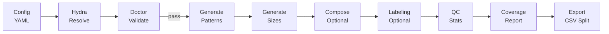
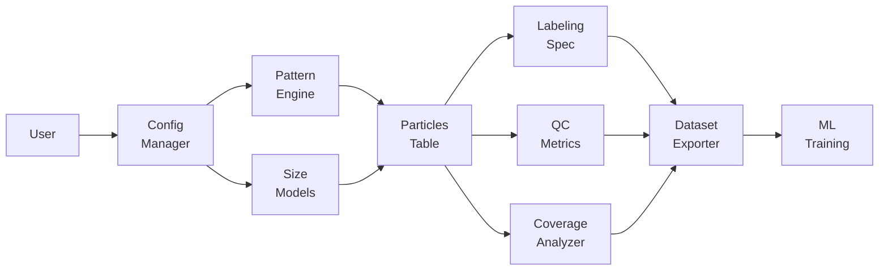

# 特許資料（発明開示書〜明細書素材）

> 注意（重要）
>
> * これは **法的助言ではありません**（弁理士の代替ではありません）。ただし、審査官・弁理士・技術者が理解しやすいように、**発明説明素材**と**請求項のたたき台**を作成します。
> * 本資料は **本チャットで共有された技術内容（点群ベースのウェハ粒子パターン疑似生成、Hydra設定管理、パターン/粒径分布/重ね合わせ/ラベル階層/QC/カバレッジ/エクスポート等）**に基づきます。
> * チャットで根拠が明示されていない項目は、必ず **「推定」「仮定」「要確認」**として記載します。
> * 会社名・顧客名・装置型番・機密値は **匿名化**して記載します（例：装置A、工程B）。

---

## 0. 発明の名称

**ウェハ上のパーティクル付着分布（点群）を、パターンテンプレートと粒径確率分布に基づいて疑似生成し、学習・評価・異常検出に用いるデータセットを一貫生成・検証・出力する方法、装置、及びプログラム**

（短縮名案）
**「点群ウェハ粒子マップのパターン×粒径分布混在ベンチマーク生成」**

---

## 1. 技術分野

本発明は、半導体製造におけるパーティクル付着（欠陥）解析に関し、特に、

* ウェハ面上の粒子位置（極座標）と粒径を含む **点群データ**としてのパーティクルマップを対象に、
* 複数の付着パターンおよび粒径分布モデルに基づいて **疑似データセット**を生成し、
* 機械学習（深層学習を含む）による分類・異常検出・特徴増強に供する技術に関する。

---

## 2. 背景技術（従来技術内容） 5行箇条書き

* 半導体製造におけるパーティクルマップは、測定装置から **粒子座標と粒径**（および付随情報）として出力される。
* 学習データ不足（実測が十数枚など）により、MLモデルは過学習しやすい。
* 欠陥パターンはリング、エッジ扇形、放射、スクラッチ等、多様であり希少パターンは観測されにくい。
* 従来は工程/装置ごとに個別スクリプトで疑似生成され、再現性・比較可能性・拡張性が低い。
* 画像化（ヒートマップ化）して生成/学習する方法もあるが、点群本来の情報（粒径や局所密度）と整合を取りにくい。

### 背景技術の詳細説明（要点）

* **点群（粒子表）**としてのデータは、粒径、極座標、ラベル（パターン）を自然に保持でき、物理的解釈（エッジ由来、局所発生源、搬送接触など）と結び付けやすい。
* しかし、従来の疑似生成は「特定のパターンだけ」「特定の固定パラメータだけ」になりがちで、**分布の揺らぎ（工程変動）**や**粒径分布の多様性**を反映しにくい。
* また、生成条件（設定、seed、パラメータ）が一貫管理されないと、生成データの比較評価が困難で、モデルの妥当性検証が再現できない。

---

## 3. 従来技術における問題点 5行箇条書き

* 実測データが少なく、希少パターンや分布シフトを含む学習・評価が困難。
* パターン追加や粒径分布変更のたびにコードが増殖し、レビュー困難・再利用困難。
* 生成物の品質（粒子がウェハ外に出る、粒径が不自然、偏り過多等）が検証されず、学習に悪影響。
* ラベル粒度を上げると運用不能になり、原因分析と見た目分類の混同が起こる。
* 生成条件（設定、seed、パラメータ、分布）を追跡できず、比較可能性・監査性が不足。

### 問題点の詳細説明（技術課題の分解）

| 問題     | 根本原因          | 影響                  |
| ------ | ------------- | ------------------- |
| データ不足  | 実測の希少性/コスト    | MLが汎化しない、異常検出が弱い    |
| コード乱立  | 付着パターンの追加が属人的 | 保守不能、再現不能           |
| 品質不確実  | 妥当性チェック不在     | 学習データが壊れる（skew/リーク） |
| ラベル破綻  | 粒度上げすぎ/定義が固定  | 運用不能、説明不能           |
| トレース不能 | 設定が分散/暗黙      | 比較評価不能、監査不能         |

---

## 4. 問題点の解決手段（本技術システム） 5行箇条書き

* **点群（粒子表）**としてのウェハ付着データを、パターンテンプレートにより生成する。
* パターンの幾何パラメータ（幅、長さ、角度、半径等）を **確率分布**として設定し、サンプルごとに振る。
* 粒径サイズを、ガウス/対数正規/ワイブル/パレート/混合等の **複数分布モデル**で生成し、データセット内で混在可能とする。
* 生成条件（設定・seed・分布パラメータ）を **メタ情報として保存**し、再現性と比較可能性を担保する。
* 生成前後の **設定検証（Doctor）**、統計QC、パターンカバレッジ評価、階層ラベル付与、エクスポートを一貫したプロセスとして実行する。

### 解決手段の詳細説明（技術要素）

以下の構成要素を含む（名称は説明用、実装名称は要確認）：

| 構成要素                        | 役割                    | 入力              | 出力                  |
| --------------------------- | --------------------- | --------------- | ------------------- |
| 設定管理（Hydra/YAML）            | 生成条件を単一真実として管理        | YAML + override | resolved設定          |
| パターン生成器（Pattern Engine）     | 座標（r,θ）をパターンに従い生成     | パターンID + パラメータ  | 粒子座標点群              |
| 粒径生成器（Size Model）           | 粒径を確率分布から生成           | 分布種 + パラメータ範囲   | 粒子サイズ列              |
| 分布選択器（Size Model Selection） | サンプル単位で分布タイプを割当       | ratios等         | size_model列         |
| 重ね合わせ（Compose）              | 複数パターンを同一サンプルへ合成      | 複数サンプル          | 合成サンプル              |
| 多層ラベリング                     | fine→macro等を外部specで付与 | labeling spec   | 派生ラベル列              |
| 品質ゲート（Doctor/QC/Coverage）   | 破綻検出・統計集計             | 設定/生成物          | レポート                |
| エクスポート                      | ML用データセット化            | 生成物             | CSV/Parquet + split |

---

## 5. 解決手段により得られる効果（本技術による価値） 5行箇条書き

* 少数実測しかない状況でも、希少パターンや分布変動を含む **ベンチマークデータセット**を迅速に構築できる。
* パターン・粒径分布・重ね合わせを組合せたデータで、分類/異常検出モデルの **頑健性評価**が可能。
* 設定・seed・分布パラメータを保存することで、生成物の **再現性、監査性、比較可能性**が向上する。
* 階層ラベル（macro等）により、ラベル粒度を上げ過ぎても運用不能にならず、原因分析軸を維持できる。
* 生成前後の品質ゲートにより、壊れたデータ（ウェハ外座標、異常粒径、偏り過多等）の混入を抑制できる。

### 効果の詳細（価値創出の整理）

| 価値       | どの機能が効くか                      | 成果指標（例）     |
| -------- | ----------------------------- | ----------- |
| データ不足の解消 | パターンテンプレ + 分布パラメータ揺らぎ         | 生成件数、希少クラス数 |
| 分布シフト耐性  | size model mix / param sweep  | シフト下精度、検知率  |
| 説明可能性    | 物理解釈可能なパラメータ                  | 原因仮説との整合    |
| 運用性      | labeling spec 外部化             | ラベル変更の容易さ   |
| 監査性      | meta/resolved + size_params保存 | 再現実行の成功率    |

---

## 6. 発明の概要（Summary）

### 6.1 生成対象データ（点群）

本発明は、各サンプル（1枚のウェハ）につき、粒子の

* 極座標位置 ((r,\theta))（ウェハ中心原点、半径はウェハ内）
* 粒径 (s)（nm/µm、範囲制約あり）
* ラベル（パターン種別）
  を含むテーブル（CSV/Parquet等）を出力する。

### 6.2 パターン生成（座標）

パターンテンプレート（例：リング、セクタ、スクラッチ、放射線等）ごとに、座標分布を規定する。
パラメータ（幅、長さ、角度、半径等）は固定値に限らず、**確率分布（例：一様、正規、切断正規、ベータ等）**として定義でき、サンプル毎にサンプリングされる。

### 6.3 粒径分布生成（サイズ）

粒径分布は複数の確率分布モデルから選択可能とし、さらにデータセット内でサンプルごとに異なる分布モデルを混在できる（例：gaussian/lognormal/weibull/pareto/mixture）。
加えて、サンプルごとに分布パラメータ（平均・分散等）を変動させ、工程変動を模擬する（per-sample）。

### 6.4 検証・出力

生成前に設定検証（Doctor）、生成後に統計QCとパターンカバレッジ評価を行い、ML学習に適した形式でエクスポートする。
（split比率、macroラベル付与など）

---

## 7. 処理フロー図（Mermaid）

### 7.1 生成〜検証〜出力フロー

### 7.2 システム構成（論理ブロック）

---

## 8. 数式・モデルの説明（明細書素材）

### 8.1 座標系（極座標）

ウェハ半径 (R)（例：300mm径なら (R=150)mm）として、各粒子の位置を
[
0 \le r \le R,\quad 0 \le \theta < 2\pi
]
で表す。
（(\theta)の定義域は実装依存の可能性があり **要確認**）

ウェハ外への逸脱を防ぐため、

* (r) を ([0,R]) へクランプ、または
* 逸脱点を再サンプル
  する（境界制約）。

### 8.2 代表パターンの確率モデル例（概念）

* **リング**: (r \sim \mathcal{N}(r_0,\sigma_r^2)) を ([0,R]) に切断し、(\theta \sim \mathrm{Uniform}(0,2\pi))
* **セクタ**: (\theta \sim \mathrm{Uniform}(\theta_0-\Delta\theta/2,\theta_0+\Delta\theta/2)), (r) はエッジ寄り帯域
* **直線スクラッチ**: 直線セグメント近傍の距離 (d_\perp \sim \mathcal{N}(0,\sigma_\perp^2))（幅に対応）
* **楕円ホットスポット**: ((x,y)) を回転楕円ガウス (\mathcal{N}(\mu,\Sigma))（(\Sigma)非等方）で生成し極座標へ変換

（具体実装はパターンごとのパラメータ定義に依存し、詳細は **要確認**）

### 8.3 粒径分布モデル（例）

* Gaussian
  [
  s \sim \mathcal{N}(\mu,\sigma^2)
  ]
* Lognormal
  [
  \ln s \sim \mathcal{N}(\mu_{\log},\sigma_{\log}^2)
  ]
* Weibull
  [
  f(s)=\frac{k}{\lambda}\left(\frac{s}{\lambda}\right)^{k-1} \exp\left(-(s/\lambda)^k\right)
  ]
* Pareto
  [
  f(s)=\alpha s_m^\alpha s^{-(\alpha+1)} \quad (s\ge s_m)
  ]
* Mixture（混合）
  [
  f(s)=\sum_{i=1}^M w_i f_i(s),\ \sum_i w_i=1
  ]

さらに、サンプル（ウェハ）ごとに (\mu,\sigma) 等のパラメータ自体を分布からサンプルする（per-sample）：
[
\mu \sim \mathrm{Uniform}(\mu_{\min},\mu_{\max}),\quad \sigma \sim \mathrm{Uniform}(\sigma_{\min},\sigma_{\max})
]

---

## 9. 各手法のバリエーション例（テーブル）

### 9.1 パターン生成のバリエーション

| 手法カテゴリ  | バリエーション例                          | 差分の芯         | 用途              |
| ------- | --------------------------------- | ------------ | --------------- |
| リング系    | Narrow/Wide, Arc, SemiRing, Donut | 幅/欠損/弧長/空洞   | 起因部位差の表現        |
| セクタ系    | Edge/Internal, 4Sectorの非一様化       | 角度帯/半径帯/確率分布 | 局所汚染の方向性        |
| ライン系    | Straight/Curved/Spiral/Radial     | 曲率/本数/幅/長さ   | 接触・搬送・流れ        |
| ホットスポット | Iso/Elliptic                      | 等方/異方（楕円）    | 方向性のある局所要因      |
| エッジ起点飛散 | Spray/Bursty                      | 放射状/塊状＋放射    | Focus ring等起点仮説 |

### 9.2 粒径分布のバリエーション

| 分布        | 変動させるパラメータ例  | 分布の特徴   | 使い分けの意義    |
| --------- | ------------ | ------- | ---------- |
| Gaussian  | μ, σ         | 対称・外れ値少 | “通常状態”の基準  |
| Lognormal | μ_log, σ_log | 右裾      | 粉体/凝集の典型   |
| Weibull   | k, λ         | 柔軟      | 破片/粉砕モデル   |
| Pareto    | α, s_m       | 超重尾     | 異常混入・最悪ケース |
| Mixture   | w_i, comps   | 複合      | 通常＋異常混在    |

### 9.3 データセット内混在のバリエーション

| 混在方式         | 説明             | 生成物に残すべきメタ              | 価値          |
| ------------ | -------------- | ----------------------- | ----------- |
| サンプル単位の分布選択  | 各サンプルに分布タイプ割当  | size_model, size_params | 分布シフト評価     |
| サンプル内混合      | 1サンプルで複数分布混合   | mixtureの内訳              | “混入”を模擬     |
| パターン×分布の相関付け | 特定パターンに特定分布を割当 | 要確認（実装/拡張）              | 起因と粒径の関係を表現 |

---

## 10. 半導体製造特有のデータ取り扱いと効果（テーブル）

| 半導体特有の要件  | 取り扱い方法（本技術）               | 効果         |
| --------- | ------------------------- | ---------- |
| ウェハ座標の規格化 | 300mm等を半径正規化、極座標          | 装置差・径差の吸収  |
| エッジ領域の重要性 | エッジ/内部を別パターン・別ラベル         | 起因推定の精度向上  |
| 粒径レンジ制約   | min/max clamp、分布パラメータ制約   | 非物理値の排除    |
| 実測少数問題    | 疑似生成＋キャリブレーション（推定/要確認）    | 学習可能性の確保   |
| 監査・再現性    | resolved設定・seed・分布パラメータ保存 | 比較可能/監査可能  |
| ラベル運用破綻   | labeling spec外部化で階層ラベル    | 粒度調整が容易    |
| 製造アクション接続 | macroラベル↔原因仮説（メタ）         | 改善施策に繋げやすい |

---

## 11. 活用事例（3レイヤ、課題→解決手段→効果）

> 「半導体製造装置業界の業務」に対して、レイヤ別に整理します。

### レイヤ1：現場運用（装置/工程の監視）

| 課題             | 解決手段（本技術）              | 効果         |
| -------------- | ---------------------- | ---------- |
| 新装置導入で学習データが無い | 代表パターン＋粒径分布mixでベンチ生成   | 立上げ期間短縮    |
| エッジ起点の異常が希少    | EdgeSource系パターンを高比率で生成 | 検知器の感度向上   |
| 分布が日々揺らぐ       | per-sampleでパラメータを振る    | 実運用への頑健性向上 |

### レイヤ2：解析（歩留まり/原因切り分け）

| 課題           | 解決手段（本技術）                | 効果         |
| ------------ | ------------------------ | ---------- |
| 見た目ラベルが細かすぎる | labeling specでmacro統合    | 分析軸の整理     |
| 異常検出が粒径に弱い   | heavy-tail（pareto等）混入ベンチ | 異常検出性能の定量化 |
| 複合欠陥が多い      | composeで複合サンプル生成         | 現実的な評価が可能  |

### レイヤ3：開発（装置設計/工程改善）

| 課題           | 解決手段（本技術）                | 効果        |
| ------------ | ------------------------ | --------- |
| 改善施策の効果検証が困難 | パターンパラメータを“施策”としてスイープ    | 感度解析が可能   |
| 新パターン要否が不明   | 実測との距離指標で判定（推定/要確認）      | 開発投資の最適化  |
| データ品質が揺らぐ    | Doctor/QC/Coverageで品質ゲート | 不良データ混入抑制 |

---

## 12. 請求項例（たたき台）

> 注意：これは **権利化の方向性を示すたたき台**です。表現・範囲・引用文献との対比等は弁理士と要調整です。

### 12.1 独立請求項案（方法）

**【請求項1】**
コンピュータにより実行される、半導体ウェハ上のパーティクル付着分布の疑似データセットを生成する方法であって、

1. ウェハ半径を含む生成条件を規定する設定情報を取得する工程と、
2. 複数の付着パターンテンプレートのうち少なくとも1つを選択し、当該付着パターンテンプレートに対応する幾何パラメータを確率分布に基づいてサンプルする工程と、
3. 前記付着パターンテンプレートおよび前記幾何パラメータに基づいて、ウェハ領域内に制約された粒子位置（極座標）を含む点群を生成する工程と、
4. 複数の粒径確率分布モデルのうち少なくとも1つを選択し、当該粒径確率分布モデルに基づいて粒子サイズを生成する工程と、
5. 前記点群および前記粒子サイズに、付着パターンに対応するラベル情報を付与してデータセットを出力する工程
   を含む方法。

### 12.2 独立請求項案（分布混在・メタ保存を芯に）

**【請求項2】**
請求項1に記載の方法において、
前記粒径確率分布モデルは、複数の分布タイプからなる候補集合を有し、前記データセット内のサンプル単位で分布タイプが選択され、かつ、当該分布タイプおよび当該分布タイプの分布パラメータが、サンプルに対応付けてメタ情報として保存される方法。

### 12.3 従属請求項案（階層ラベル・重ね合わせ）

**【請求項3】**
請求項1または2に記載の方法において、
外部ファイルとして与えられるラベル階層定義に基づいて、前記ラベル情報から上位ラベルを導出し、前記データセットに追加のラベル列として付与する方法。

**【請求項4】**
請求項1〜3のいずれかに記載の方法において、
複数の付着パターンテンプレートに基づいて生成された複数の点群を重ね合わせて、単一サンプル内に複数パターンを含む合成点群を生成する方法。

### 12.4 独立請求項案（装置・プログラム）

**【請求項5】**
請求項1〜4のいずれかの方法を実行するためのプログラムを記憶した非一時的記録媒体。

**【請求項6】**
請求項1〜4のいずれかの方法を実行するプロセッサ及びメモリを備える情報処理装置。

### 12.5（推定/要確認）新パターン登録必要性判定（距離指標）

本チャットでは「付着データから新規パターン登録の必要性を評価」機能が要件として提示されています。実装有無は **要確認**ですが、発明バリエーションとしては以下が考えられます。

**【請求項7（案）】**
実測点群データと疑似生成点群データとの間の距離指標を算出し、当該距離指標が閾値を超える場合に、新規付着パターンテンプレートの追加必要性を判定する工程をさらに含む方法。

---

## 13. 実施形態（例：設定例の概念）

> 実際のYAMLキー名は実装に依存し **要確認**。ここでは発明の理解用に概念を示す。

### 13.1 粒径分布混在（サンプル単位）

* gaussian: 60%
* lognormal: 20%
* weibull: 15%
* pareto: 5%（異常候補）

### 13.2 パターンパラメータを確率分布で振る

* スクラッチ長: 10〜100mm
* スクラッチ幅: 5〜10mm
* 放射線本数: 3〜8
* エッジセクタ角度幅: 10°〜60°

### 13.3 階層ラベル（外部spec）

* fine: C03_Ring, C07_StraightLine, …
* macro: Ring, Line, Hotspot, EdgeSource, …
* 類似グループ: “Ring系”, “Line系” …（運用補助）

---

## 14. 新規性・進歩性の観点（技術的整理）

> ここは “法的評価” ではなく、審査官・弁理士が検討しやすいように **差分ポイント**を構造化します。

### 14.1 新規性の芯になり得る要素（候補）

| 要素                    | 既存一般技術との差分（主張候補）                  |
| --------------------- | --------------------------------- |
| 点群（粒子表）を直接生成          | 画像ヒートマップ生成とは異なり、粒径・点密度・局所分布を自然に保持 |
| パターン×粒径分布の二層モデル       | 位置分布と粒径分布を独立/連携して構成し、工程変動を表現      |
| データセット内の分布混在          | 1データセットで複数分布タイプをサンプル単位で混在させ評価可能   |
| 分布パラメータのメタ保存          | 生成条件をサンプルに紐付けて追跡し、監査・比較を可能に       |
| 階層ラベルの外部spec          | ラベル粒度の運用問題を後処理で解決し、原因仮説軸を維持       |
| Doctor/QC/Coverageの統合 | 生成品質保証と偏り検出をプロセスとして標準化            |

### 14.2 進歩性の説明の組み立て例（技術的ストーリー）

* 「パターン生成」だけでは工程変動（粒径分布の揺らぎ）を表現できず、異常検出・頑健性評価が弱い。
* 「粒径分布」だけでは空間パターン（エッジ起点、スクラッチ等）を表現できず、原因推定の説明性が弱い。
* そこで、**点群生成**において「位置パターンテンプレ」と「粒径分布モデル」を分離・統合し、さらに**データセット内混在**と**メタ保存**で追跡性を確保する構成は、従来の個別スクリプトや単一分布生成に比べ、複数の課題（データ不足・偏り・追跡性・運用性）を同時に解決する。

---

## 15. 追加で必要な情報（優先度付き、最大10件）

不足情報があっても埋められる範囲で作成しましたが、以下は権利化・実装整合のために **優先度高**です（Yes/No or 選択式中心）。

1. **（Yes/No）** 生成データは「極座標（r,θ）」で固定ですか？ それとも内部では直交座標も保持しますか？
2. **（選択）** 粒径の標準保存単位はどれですか？ `nm / um / 両方`
3. **（Yes/No）** サンプル単位の `size_model` と `size_params_json` は現在の実装で必ず出力されますか？
4. **（Yes/No）** “新規パターン登録の必要性評価（距離指標）” はすでに実装済みですか？（未実装なら発明バリエーション扱い）
5. **（選択）** 出力の主形式はどれですか？ `CSV / Parquet / 両方`（特許記載の実施形態に反映）
6. **（選択）** パターン生成は「1サンプル1パターン」基本で、複合は `compose` のみですか？ それとも生成時に直接複合しますか？
7. **（Yes/No）** Doctor（設定検証）は必須ゲートとして運用しますか？（任意だと請求項の位置付けが変わる）
8. **（選択）** ラベル階層specは社内標準を想定しますか？ `固定 / 任意ユーザ定義`
9. **（Yes/No）** 実測データは「点群CSV形式」で取り込み、距離指標やキャリブレーションに使いますか？（将来計画でも可）
10. **（選択）** 製造アクション接続はどこまで想定しますか？ `分析支援のみ / 推奨アクション提示まで / 自動フィードバックまで（要確認）`

---

必要なら、次のステップとして

* **「明細書構成（課題→手段→効果→実施形態→実施例）」を出願フォーマットに近い文体で再編集**
* **請求項の“範囲の切り分け（広い独立・狭い従属）”の複数案**
* **先行技術調査の検索式（キーワード/IPC候補）案**（※法的助言ではなく、調査のたたき台）
  も作成できます。
