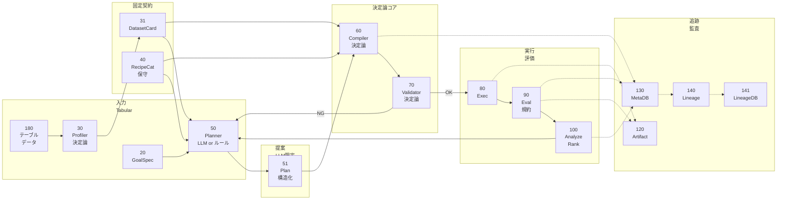
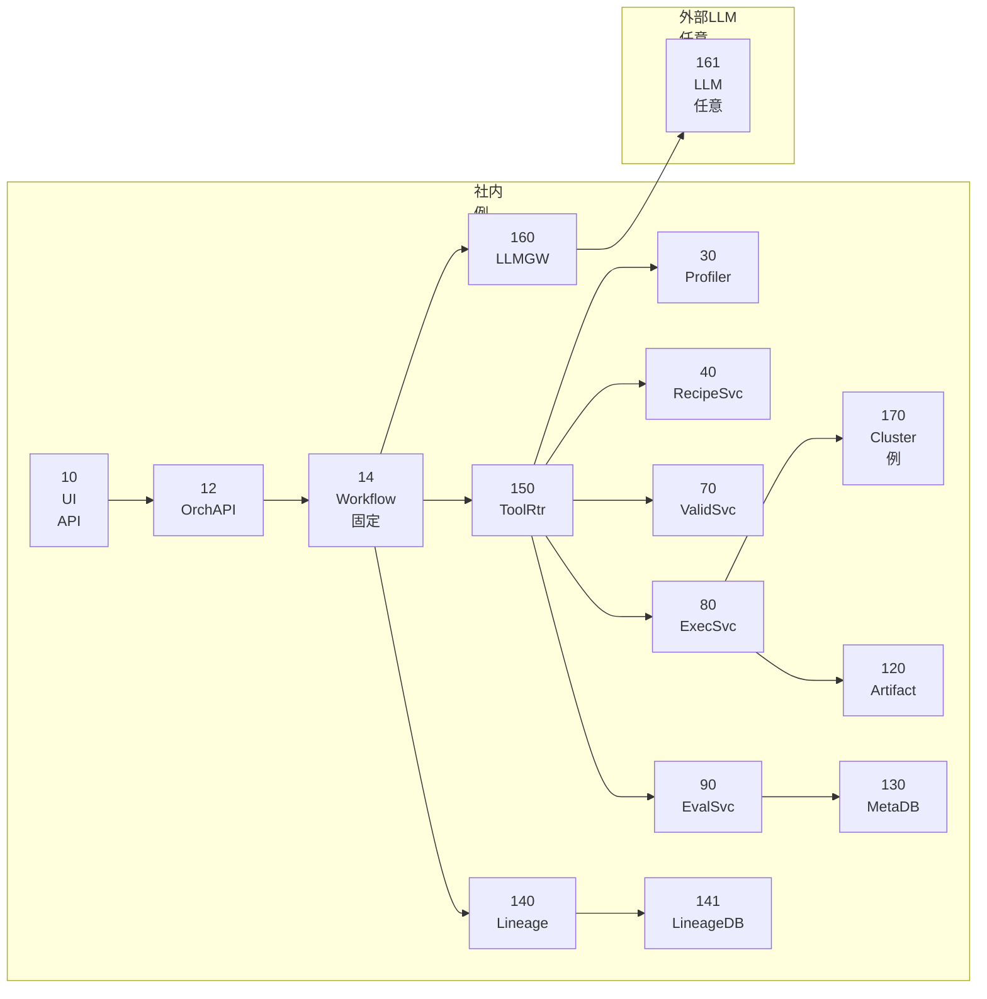
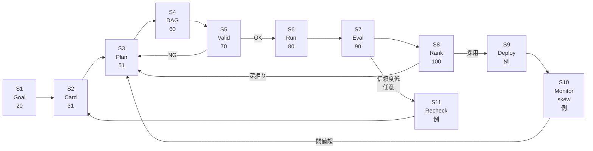
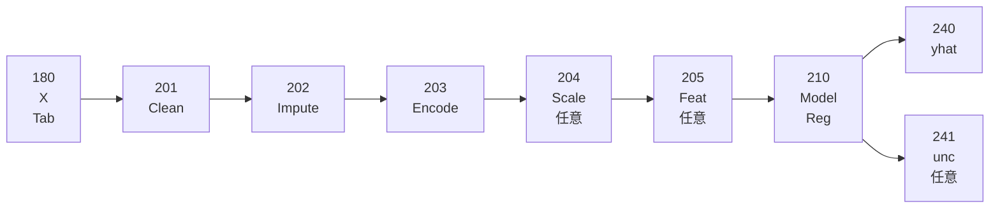
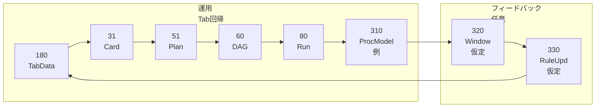

## 0. 管理情報（メタ）

* **資料種別**：特許資料（発明開示書〜明細書素材）ドラフト（技術説明素材＋請求項たたき台）
  ※本資料は**法的助言ではありません**（権利化可否判断・クレーム確定は弁理士等で要検討）。
* **対象範囲（今回の絞り込み）**：**テーブルデータ（tabular）×回帰（regression）**に限定した、LLM利用のMLパイプライン探索・運用基盤
* **作成日**：2026-03-02（Asia/Tokyo）
* **発明名称（案）**：
  **「構造化出力によりレシピIDを選定するLLM提案部と、決定論コンパイラ／バリデータにより比較可能性を担保したテーブル回帰MLパイプライン探索方法」**
* **匿名化方針**：会社名/顧客名/装置型番/機密値は記載せず、
  例：LLMプロバイダA、オーケストレータB、実験追跡C、系譜標準D、装置A、顧客X。
* **根拠文章**：【技術文章】「汎用LLM Agentによる『マルチ手法MLパイプライン探索』技術レポート」
  ※本資料は上記内容を「**tabular回帰**」へ特化して再構成。

---

## 1. 1ページ要約（発明の要旨／新規性の核3点／期待効果の定量）

### 発明の要旨

同一のテーブルデータ（数値・カテゴリ列を含む）に対して、**データクレンジング×前処理×特徴量化×回帰モデル×評価設計**の組合せ探索を、比較可能性と再現性を崩さず体系的に反復するために、

* LLMは「**提案（Plan）**」に限定し（例：`recipe_id`、探索予算、制約の構造化出力）、
* 実行可能性・整合性・再現性は「**決定論（コンパイラ／バリデータ）**」で保証し、
* 長期運用の要として「**固定契約（DatasetCard／RecipeCatalog／Comparability Key）**」をバージョン管理する、
  テーブル回帰向けのML探索・運用基盤を提供する。

### 新規性の核（3点）

1. **LLMの出力範囲を“構造化Plan（recipe_id等）”に限定**し、設定ファイルや手法名の自由記述を排除する点
   → LLM幻覚（存在しない手法名/キー不整合）による運用破綻を抑止。
2. **決定論コンパイラ＋決定論バリデータ**により、テーブル回帰パイプライン（欠損処理・エンコード・スケーリング・モデル等）の**実行可能性・リーク対策・再現性**を保証する点。
3. **Comparability Key（比較可能性キー）**を決定論生成し、Leaderboard/集計/監査をキー単位に固定する点
   → 分割方法・前処理差による「比較不能」を設計として排除。

### 期待効果の定量（推定／要確認）

※具体数値はデータ未提示のため断定せず、【技術文章】の目的（意思決定コスト削減・比較可能性担保・計算資源節約・監査）からの**推定**。

| 効果項目    | 従来の損失要因       | 提案での改善メカニズム                    | 期待効果（推定）     |
| ------- | ------------- | ------------------------------ | ------------ |
| 探索設計工数  | 何を試すかが属人      | LLMがPlan提案、ただし決定論で拘束           | **30〜70%削減** |
| やり直し計算  | 比較不能・リーク・条件混在 | Validator＋Comparability Keyで排除 | **20〜60%削減** |
| 監査/説明準備 | ログ散逸、条件不明     | Plan/DAG/データカード/系譜が自動保存        | **対応時間を半減**  |
| 長期保守    | SDK/LLM変更で破綻  | 固定契約（スキーマ/カタログ/キー）             | **改修範囲を局所化** |

---

## 2. 技術分野・適用範囲（工程/装置/タスク/導入形態）

### 技術分野

* **テーブル回帰（tabular regression）**の機械学習における、
  パイプライン探索（前処理・特徴量・モデル・評価設計の組合せ探索）と、再現性/比較可能性/監査性を担保する運用技術。
* LLM/Agentの利用において、**提案と確定を分離**して長寿命化する設計技術（LLMはPlan提案のみ、決定論コアで確定）。

### 適用範囲（導入形態含む）

| 観点   | 範囲                                                          |
| ---- | ----------------------------------------------------------- |
| データ型 | **テーブル**（数値列＋カテゴリ列、欠損・外れ値・重複を含み得る）                          |
| 予測対象 | **連続値**（回帰）例：品質指標、計測値、スコア、損失、予測値など                          |
| タスク  | 予測モデル開発、モデル比較、モデル更新（ドリフト対応）                                 |
| 評価設計 | K-fold、Group分割（例：装置/ロット/顧客）、Time分割（時系列列がある場合）               |
| 導入形態 | オンプレ/ハイブリッド（LLMはゲートウェイ経由で交換可能）                              |
| 業界適用 | 半導体製造へ適用する場合、装置ログ等を**集約してテーブル化**した特徴量＋メトロロジ値等の回帰（**例／要確認**） |

---

## 3. 従来技術（背景）と先行技術カテゴリ（※技術文章の言及＋一般的カテゴリ。最後に「先行との差分候補」）

### 従来技術（一般的カテゴリ）

* **AutoML/パイプライン探索**：前処理・モデル・HPO等の探索
* **データ品質/スキーマ検証**：欠損・型・範囲・語彙等の検証
* **実験追跡（tracking）/アーティファクト管理**：パラメータ、メトリクス、モデル等の保存
* **LLM/Agentによる支援**：候補提示、要約、次手提案
* **ワークフロー実行基盤**：固定手順（workflow）で反復実行

### 【技術文章】に基づく背景認識

* 実務では「モデル選び」より **手順（クレンジング〜評価）の組合せ探索**が支配的
* LLMは有用だが、**列挙値・キー整合・実行可能性保証が苦手**
  → LLMに設定全体を書かせると破綻しやすい
* 比較条件が揃わないと比較が破綻（誤結論）
  → 評価規約・リーク対策・比較可能性の固定が重要

### 先行との差分候補（本発明の差分の置き方）

* **差分候補A**：LLMは`recipe_id`等の**構造化Planのみ**生成し、パイプライン生成は**決定論コンパイラ**で行う
* **差分候補B**：DatasetCard/RecipeCatalog/Comparability Keyを**固定契約**としてバージョン管理し、LLM/SDK交換に耐える
* **差分候補C**：Validatorでリーク・比較可能性・再現性を検証し、NG時にPlan生成へ戻す**分岐制御**を固定ワークフローとして実装する

---

## 4. 従来の課題（発生条件、現行対策の限界、評価指標、制約）

### 4.1 発生条件（テーブル回帰で頻出）

* 欠損・外れ値・重複・型揺れ（カテゴリ/数値の混在）
* 高カーディナリティカテゴリ（ID系）による過学習・リーク
* 分割設計が難しい（Group leakage、Time leakage）
* 目的関数が多面（RMSEだけでなく、頑健性、説明性、推論コスト等）

### 4.2 現行対策の限界

* 試行錯誤の順序・判断が属人化（探索が再利用されない）
* 実験ログの欠落/条件混在で比較不能（誤結論）
* LLMを直接実行系に入れると、幻覚により実行不能設定が混入しやすい
* フレームワーク更新でワークフローが崩れ、運用品質が劣化

### 4.3 評価指標（テーブル回帰）

* 性能：RMSE/MAE/R² など（要件により選択）
* 妥当性：分割設計（K-fold/Group/Time）、Nested CV（必要時）
* 頑健性：欠損率変化、外れ値混入、分布シフト耐性
* 運用制約：推論レイテンシ、メモリ、説明可能性
* データ健全性：スキーマ逸脱、ドリフト、training-serving skew

### 4.4 制約

* 計算資源：組合せ爆発（全探索不可）→粗→精、多段探索、早期打ち切り
* セキュリティ/ガバナンス：ツール連携増加に伴う権限・監査の必要性
* 監査：なぜその前処理/特徴量/モデルを選んだかの履歴が必要

---

## 5. 提案手法（データ→前処理→学習→推論→不確かさ→製造アクション→監視/更新）

> 本章は【技術文章】を「テーブル回帰」に特化して具体化します。
> “製造アクション”“設計FB”は業界適用の**任意要素（例／仮定）**として扱います。

### 5-1. システム構成（文章）

1. **GoalSpec入力**：目的（回帰対象y）、制約（説明性/速度等）、探索予算
2. **Dataset Profiler（決定論）**：生データから統計・スキーマ・欠損/外れ値要約・リーク危険を抽出しDatasetCardを生成
3. **RecipeCatalog（人が保守）**：テーブル回帰の業務レシピ集合（適用条件、禁止事項、予算プリセット）
4. **Planner（LLMまたはルール）**：DatasetCard＋GoalSpec→**Plan（recipe_id等の構造化出力）**
5. **Recipe Compiler（決定論）**：Plan＋DatasetCard＋RecipeCatalog→**Pipeline DAG生成**
6. **Validator（決定論）**：互換性・リーク・比較可能性・再現性の検証、NGならPlan生成へ戻す
7. **Executor/Evaluator（決定論）**：DAG実行、評価規約に従い指標算出
8. **Analyzer（決定論＋任意でLLM要約）**：ランキング、診断、次手（深掘り）を決定
9. **監視/更新**：skew/ドリフト監視、閾値超過で再探索→承認→配布（運用規程は要確認）

### 5-2. 入力データ仕様（種類/同期/欠損/特徴量/独自性候補）

#### (A) 種類（tabular限定）

* **説明変数X**：数値列、カテゴリ列（文字列含む）
* **目的変数y**：連続値（回帰）
* **補助列（要確認）**：

  * グループ分割キー（例：装置ID/ロットID/顧客ID）
  * 時間分割キー（例：タイムスタンプ）
  * 機微列（匿名化対象）

#### (B) 同期（本件では原則不要、ただし例あり）

* テーブルに揃っている前提。
* **例（要確認）**：装置ログを集約（平均/分散/最大/傾き等）して行単位に付与し、結果をtabular化。

#### (C) 欠損・外れ値・重複（クレンジング候補）

* 欠損：単純補完、KNN/MICE、欠損フラグ追加
* 外れ値：IQR/Z-score、winsorize、ロバスト指標
* 重複：主キー重複、近似重複（必要なら）

#### (D) 前処理・特徴量（テーブル回帰）

* 数値：標準化、ロバストスケーリング、対数/冪変換
* カテゴリ：one-hot、頻度エンコード、ターゲットエンコード（**CV内で**実施）
* 相互作用：数値×カテゴリ、ビニング（必要時）
* 重要：fit/transform状態（補完値、スケーラ、エンコーダ語彙等）を保存し、推論でも同一適用

#### (E) 独自性候補（“入力データの作り方”としての芯）

* **DatasetCardを決定論生成**して、LLM入力を「統計・スキーマ中心」に限定（生データは渡さない）
* **高カーディナリティ列やリーク危険列をDatasetCardに明示**し、Recipe bans / Validatorで探索から排除
* **Comparability Key**に分割方式・前処理・特徴量化・モデル・seed等を含め、比較単位を固定

### 5-3. 教師データ/ラベル定義（生成/ノイズ/分割/リーク防止）

#### (A) ラベル定義

* `y` は連続値。単位・測定条件・粒度（行単位/ロット単位など）は**要確認**。

#### (B) ラベルノイズ（候補）

* クロスバリデーション不一致等で疑わしいサンプルを抽出し、**人手再確認**へ回す（自動削除はリスク）

#### (C) 分割設計（リーク防止の要）

* DatasetCardの推奨分割に従い、以下を固定：

  * **Group split**（同一グループが学習/評価に跨がない）
  * **Time split**（未来リーク回避：時間列がある場合）
  * 通常のK-fold
* ターゲットエンコード等、目的変数を使う変換は必ず**fold内fit**（未来リーク回避）

#### (D) リーク防止

* 未来情報列（イベント後値・将来集計）やID列の取り扱いをValidatorで検出・禁止（禁止ルールは要確認）

### 5-4. AIモデル仕様（モデル種別/構造/学習/推論/閾値/不確かさ）

#### (A) モデル候補（テーブル回帰）

* 線形：Ridge/Lasso/ElasticNet（説明性・ベースライン）
* 木系：GBDT系（非線形・相互作用）
* 深層：テーブル向けTransformer等（データ量が十分な場合の選択肢）※採用条件は要確認

#### (B) 学習・探索（粗→精）

* Stage0：低コストベースラインで完走
* Stage1：候補を広くスクリーニング（低予算）
* Stage2：上位kのみHPO/高コスト特徴へ深掘り
* Stage3：再現性・頑健性・運用制約で最終選抜

#### (C) 不確かさ／信頼度（扱い）

* 【技術文章】にある「校正・頑健性・データ健全性」を、回帰向けに以下で扱う：

  * CVの分散、外れ値耐性、欠損率変化耐性、分布シフト診断
* **予測区間や信頼度スコアに基づく分岐（再計測等）は拡張案（仮定）**
  ※採用する場合、どの不確かさ推定を使うかは要確認。

### 5-5. 製造アクション（APC/MES/FDC/保全/ホールド/再計測）

* 本発明のコアは探索・比較基盤。製造アクションは**任意要素（例／仮定）**。
* 例（仮定）：

  * 予測値が閾値超過→ロットホールド
  * 信頼度低→再計測指示
  * 異常兆候→保全指示
  * レシピ補正候補の提示（最終決定は人）

### 5-6. 実装制約（リアルタイム、計算資源、I/F、フェイルセーフ、監査）

* **計算資源**：粗→精、早期打ち切り、キャッシュ、上位kのみ深掘り
* **I/F**：LLMはゲートウェイ経由で交換可能、ツールは標準I/Fで疎結合（例）
* **フェイルセーフ**：Validator NGは実行しない、ベースラインへフォールバック（要確認）
* **監査**：Plan/DAG/DatasetCard/メトリクス/成果物/系譜をRun単位で保存
* **セキュリティ**：ツール権限の最小化、監査ログ、サンドボックス（要確認）

---

## 6. 提案手法による効果（従来vs提案の表、測定条件、因果説明）

### 6.1 従来 vs 提案（表）

| 観点    | 従来             | 提案（本発明）                           |
| ----- | -------------- | --------------------------------- |
| 探索設計  | 属人的、順序が再現不可    | Plan提案をLLMへ、確定は決定論で統制             |
| 比較可能性 | 分割/前処理差で比較不能混入 | Comparability Keyで比較単位固定、集計もキー単位  |
| リーク対策 | 目視・経験で漏れ       | DatasetCard＋Validator＋禁止事項で探索から排除 |
| 再現性   | seed/設定散逸      | Plan/DAG/設定/環境を保存し再現              |
| 計算コスト | 無駄試行が膨張        | 粗→精探索、早期打ち切り                      |
| 監査    | 後付けで大変         | Run単位で履歴・系譜を自動保存                  |

### 6.2 測定条件（要確認）

* データ行数/列数、欠損率、カテゴリ列のカーディナリティ
* 分割方式（K-fold/Group/Time）とfold数
* 探索予算（試行数、HPO範囲、計算環境）
* 運用制約（推論レイテンシ、説明責任）

### 6.3 因果説明

* LLMの出力をPlanに限定 → 幻覚による実行不能・条件混在を抑止
* 決定論コンパイル＋検証 → 実行可能性・リーク対策・再現性を前段で保証
* Comparability Key → 「比較単位の固定」により誤結論とやり直しを低減
* 固定契約のバージョン管理 → LLM/SDK更新でも資産が残る

---

## 7. 新規性・進歩性（差分表、必須要素/任意要素の切り分け）

### 7.1 差分表

| 先行カテゴリ | 典型                 | 本発明の差分                         |
| ------ | ------------------ | ------------------------------ |
| AutoML | 探索はするがLLMは不使用/自由度高 | LLMはPlanのみ、決定論で拘束              |
| LLM自動化 | LLMが設定やコード生成まで担当   | 構造化Planに限定、enum/スキーマで拘束        |
| 実験追跡   | 記録はあるが比較単位が曖昧      | Comparability Keyを生成しキー単位で集計   |
| データ検証  | 点在ツールで実施           | DatasetCard→Validator→探索ループに統合 |
| 長期運用   | SDK変更で破綻           | 固定契約（カード/カタログ/キー）を中核資産化        |

### 7.2 必須要素（芯）

* **E1**：テーブルデータからDatasetCardを**決定論**で生成
* **E2**：LLM（またはルール）が返す出力を、`recipe_id`等の**構造化Plan**に制限
* **E3**：Plan＋DatasetCard＋RecipeCatalogから、**決定論コンパイラ**でPipeline DAG生成
* **E4**：Validatorでリーク・比較可能性・再現性を検証し、NG時にPlan生成へ戻す分岐
* **E5**：Comparability Keyを決定論生成し、結果保存・集計をキー単位に固定
* **E6**：skew/ドリフト監視→再探索→配布制御（運用詳細は要確認）

### 7.3 任意要素（差別化を厚く）

* **O1**：多段探索（粗→精）と多忠実度（早期打ち切り等）
* **O2**：頑健性/運用制約を含む多層評価
* **O3（仮定）**：不確かさ/信頼度で再計測・人手確認に分岐
* **O4（仮定）**：製造アクション（ホールド/再計測/保全/レシピ更新）
* **O5（仮定）**：設計フィードバック（工程窓推定等）

---

## 8. 実施例（最低2つ：代表ケース＋変形例。条件・手順・結果が書ける範囲で）

> 実施例は「テーブル回帰」に限定。具体の工程名・KPIは未提示のため**要確認**。

### 実施例1（代表）：欠損＋高カーディナリティカテゴリを含む品質指標回帰

* **データ（例）**：

  * 数値列：工程条件・集約統計（例）
  * カテゴリ列：装置ID/レシピID/製品種別（例）
  * 目的変数：品質指標y（連続値）
* **手順**

  1. DatasetCard生成：欠損率、型、カテゴリ語彙数、外れ値要約、リーク危険列候補を抽出
  2. Plan生成：`recipe_id=tabular_reg_baseline`（例）、予算small、制約（説明性優先など）を構造化で返す
  3. コンパイル：欠損補完＋エンコード（one-hot/頻度/ターゲットエンコード候補）＋モデル（線形/GBDT）＋評価（Group split推奨等）をDAG化
  4. 検証：ターゲットエンコードはfold内fit強制、リーク危険列の使用禁止、比較可能性キー生成
  5. 実行・評価：RMSE/MAE＋頑健性（欠損率変化など）でランキング
  6. 上位kのみ深掘り（HPO・高コスト特徴）
* **期待結果（推定）**

  * 条件混在が減り比較が成立 → 手戻り削減（推定）
  * 高カーディナリティ対策（禁止/制限/適切なエンコード）で過学習を抑制（推定）

### 実施例2（変形）：Group split必須（装置/顧客/ロット）な回帰での再学習ループ

* **データ（例）**：カテゴリ列にグループキーを含み、同グループ混入がリークになるケース
* **手順**

  1. DatasetCardの`split_recommendation`をGroupに固定
  2. ValidatorでGroup混入を検査し、違反時はNG→Planへ戻す
  3. 運用中に分布シフト（カテゴリ語彙増、欠損率増）を監視し、閾値超で再探索→更新候補を生成
  4. 承認後に配布（承認要否は要確認）
* **期待結果（推定）**

  * Group leakageによる過大評価を抑制（推定）
  * ドリフト時の更新判断が履歴付きで監査可能（推定）

---

## 9. 図面（Mermaid／左→右）と図面説明（符号表も）

### 9-1. 図1：全体システム構成図（テーブル回帰版）

### 9-2. 図2：ネットワークアーキテクチャ（オンプレ/ハイブリッド任意）

### 9-3. 図3：処理フロー（S1〜Sn、不確かさ分岐、再学習まで）

### 9-4. 図4（任意だが推奨）：テーブル回帰パイプライン構造（前処理〜モデル）

### 9-5. 図5（推奨）：設計—製造の閉ループ（任意・例）

※テーブル回帰で得たプロセスモデルを工程条件最適化や設計側へ返すのは**拡張例（仮定）**です。

### 9-6. 図面キャプション案（特許向け短文）

* **図1**：テーブル回帰に対して、構造化Planを生成する提案部と決定論コンパイラ／バリデータにより探索を再現可能に実行する構成を示す。
* **図2**：LLMをゲートウェイ経由で交換可能とし、ツール群を疎結合に接続するネットワーク構成例を示す。
* **図3**：DatasetCard生成、検証分岐、実行、評価、ランキング、監視・再探索までの処理手順を示す。
* **図4**：テーブル回帰パイプラインにおけるクレンジング、補完、エンコード、スケーリング、特徴量化および回帰モデルの一例を示す。
* **図5**：回帰モデルの結果を工程条件や設計ルールへ反映する閉ループの例を示す（任意）。

### 9-7. 符号の説明（表：符号→名称→役割）

|  符号 | 名称                  | 役割                  |
| --: | ------------------- | ------------------- |
|  10 | UI/API              | 利用者入力・起動            |
|  12 | OrchAPI             | オーケストレーション入口        |
|  14 | Workflow            | 固定手順の制御             |
|  20 | GoalSpec            | 目的・制約・予算            |
|  30 | Profiler            | データプロファイル（決定論）      |
|  31 | DatasetCard         | 統計・スキーマ・リーク危険・推奨分割  |
|  40 | RecipeCat/RecipeSvc | レシピ集合・適用条件・禁止事項     |
|  50 | Planner             | Plan生成（LLM or ルール）  |
|  51 | Plan                | `recipe_id`等の構造化出力  |
|  60 | Compiler/DAG        | Pipeline DAG生成（決定論） |
|  70 | Validator           | 互換性/リーク/再現性/比較可能性検証 |
|  80 | Exec/ExecSvc        | DAG実行               |
|  90 | Eval/EvalSvc        | 回帰評価・頑健性等算出         |
| 100 | Analyze/Rank        | ランキング・診断・次手決定       |
| 120 | Artifact            | モデル/特徴/ログ等保存        |
| 130 | MetaDB              | 実験追跡DB              |
| 140 | Lineage             | 系譜送出                |
| 141 | LineageDB           | 系譜保管                |
| 150 | ToolRtr             | ツール呼出し制御            |
| 160 | LLMGW               | LLM交換境界             |
| 161 | LLM                 | LLM本体（任意）           |
| 170 | Cluster             | 計算資源（例）             |
| 180 | TabData/X           | テーブルデータ/説明変数        |
| 201 | Clean               | クレンジング              |
| 202 | Impute              | 欠損補完                |
| 203 | Encode              | カテゴリエンコード           |
| 204 | Scale               | スケーリング（任意）          |
| 205 | Feat                | 特徴量化（任意）            |
| 210 | Model               | 回帰モデル               |
| 240 | yhat                | 予測値                 |
| 241 | unc                 | 不確かさ（任意）            |
| 310 | ProcModel           | 予測モデル（例）            |
| 320 | Window              | 工程窓推定（仮定）           |
| 330 | RuleUpd             | ルール更新（仮定）           |

---

## 10. 本技術により創出される新たな価値（Value Creation：予測/設計/設計FB/事業KPI）

### 10-1. 従来困難だった意思決定（何が初めて可能になるか）

* **テーブル回帰の探索を“比較可能性付き”で継続運用**できる
  → 分割・前処理差による誤比較を排除し、組織の意思決定ログとして蓄積。
* LLMを使いながらも、**実行系の信頼性（決定論検証）**を落とさない
  → LLM幻覚起因の運用停止を抑止。
* LLM/SDK変更に耐える固定契約で、基盤資産を長寿命化。

### 10-2. プロセス予測（運用）価値（例：先読み制御、計測負荷削減、停止削減）

* ドリフト監視→再探索→配布制御の標準化により、モデル陳腐化の放置を減らす（要確認）
* （任意/仮定）信頼度が低い推定のみ再計測へ回し、計測負荷を抑える

### 10-3. プロセス設計（開発）価値（例：DOE削減、工程窓推定、逆設計）

* 粗→精探索により、探索予算内で有望レシピへ集中（計算資源節約）
* （仮定）工程条件最適化や工程窓推定に回帰モデルを利用し、試行回数を削減

### 10-4. 設計フィードバック価値（DFM/PDK更新、マスク反復削減）

* 本件はテーブル回帰基盤がコア。設計FBは**拡張（仮定）**
  → 製造条件と計測結果の回帰モデルから、設計側制約の更新候補を提示（要確認）

### 10-5. 価値指標テーブル（領域×KPI×根拠）

| 領域        | KPI例           | 根拠                                |
| --------- | -------------- | --------------------------------- |
| 探索効率      | 有効比較率、無駄試行率    | Comparability Key＋Validator（技術文章） |
| 品質        | リーク検出率、再現実行成功率 | 決定論コンパイル＋検証（技術文章）                 |
| 運用        | ドリフト検出〜更新までの時間 | skew/ドリフト監視（技術文章）                 |
| コスト       | 探索時間、計算資源使用量   | 粗→精、多段探索（技術文章）                    |
| 事業KPI（仮定） | 品質損失、停止/再計測コスト | 製造アクション連携は任意（仮定）                  |

---

## 11. 請求項例（たたき台）

> 注意：以下は“技術的構成を特許表現へ落とすためのたたき台”であり、法的助言ではありません。

### 11-1. 独立請求項（方法）※発明の芯を1本にまとめる

**【請求項1】（案：方法）**
テーブルデータに基づいて連続値を予測する回帰モデルの機械学習パイプラインを探索する方法であって、
(a) 目的変数および制約条件を含む目標仕様を取得し、
(b) 前記テーブルデータから、統計量およびスキーマを含むメタ情報を決定論的に生成してデータセットカードを生成し、
(c) 前記データセットカードおよび前記目標仕様に基づいて、レシピ識別子を少なくとも含む構造化プランを、所定スキーマに準拠する構造化出力として生成し、
(d) 前記構造化プラン、前記データセットカード、および、複数の前処理・特徴量化・回帰モデル・評価設計の組合せを定義するレシピカタログに基づいて、機械学習パイプラインの処理タスクからなる有向非巡回グラフを決定論的に生成し、
(e) 前記有向非巡回グラフについて、少なくとも、分割方式に関するリーク検査および再現性検査を含む検証を行い、検証結果に応じて前記構造化プランの生成工程へ戻る分岐を行い、
(f) 検証に合格した前記有向非巡回グラフを実行して回帰モデルおよび評価結果を生成し、
(g) 前記評価結果を、前記分割方式および前記機械学習パイプライン条件に基づいて決定論的に生成される比較可能性キーに関連付けて保存し、
(h) 前記テーブルデータの統計または前記評価結果に基づいてドリフトまたはtraining-serving skewを監視し、所定条件を満たす場合に前記(a)〜(g)を再実行して更新モデルの生成および配布を制御する、
ことを特徴とする方法。

> ※必須要素として、少なくとも (i) 入力データの構成（DatasetCard＋Comparability Key） と (iv) ドリフト監視と再学習/配布 を含めています。

### 11-2. 従属請求項（代表：6〜12本）

**【請求項2】** 請求項1において、前記構造化プランは、レシピ識別子と探索予算とを含み、前記レシピ識別子が列挙値に一致しない場合に実行を禁止する方法。

**【請求項3】** 請求項1において、前記データセットカードは、列ごとの欠損率、データ型、カテゴリ語彙数、およびリーク危険列の少なくとも一部を含む方法。

**【請求項4】** 請求項1において、前記検証は、グループ分割キーが指定されている場合に、同一グループが学習用データと評価用データの双方に含まれることを禁止する方法。

**【請求項5】** 請求項1において、目的変数を用いるエンコード処理を含む場合に、当該エンコード処理を分割の各fold内で学習することを必須とする方法。

**【請求項6】** 請求項1において、前記比較可能性キーが、少なくとも、データセット識別子、分割方式、分割seed、欠損補完方式、エンコード方式、回帰モデル種別、および評価指標セットの識別子を含む方法。

**【請求項7】** 請求項1において、探索が、ベースライン、粗スクリーニング、深掘り、および最終選抜の多段探索として実行される方法。

**【請求項8】** 請求項1において、前記評価結果が、性能指標に加えて、欠損率変化または外れ値混入に対する頑健性指標を含む方法。

**【請求項9】（任意/仮定：不確かさ分岐）** 請求項1において、予測の信頼度が所定閾値未満の場合に追加計測または人手確認を要求する方法。
※信頼度による分岐は【技術文章】の直接記載ではないため**拡張案（仮定）**。

**【請求項10】（任意/仮定：製造アクション接続）** 請求項1において、更新モデルまたは予測結果に基づき、ホールド、再計測、保全、または条件更新の少なくとも一つのアクションを出力する方法。

**【請求項11】（任意/仮定：設計FB）** 請求項1において、回帰モデルに基づいて工程条件の許容範囲を推定し、当該許容範囲をルール更新に用いる方法。

### 11-3. 独立請求項（装置）

**【請求項12】（案：装置）**
請求項1〜11のいずれかに記載の方法を実行する情報処理装置であって、
目標仕様取得部、データセットカード生成部、構造化プラン生成部、DAG生成部、検証部、実行部、評価部、比較可能性キー生成部、および監視・配布制御部を備える装置。

### 11-4. 独立請求項（システム）

**【請求項13】（案：システム）**
複数のサービスとして、プラン生成サービス、コンパイルサービス、検証サービス、実行サービス、評価サービス、および追跡・系譜保存サービスを含み、請求項1〜11のいずれかに記載の方法を実行するシステム。

### 11-5. 独立請求項（プログラム/記録媒体）

**【請求項14】（案：プログラム）**
コンピュータをして請求項1〜11のいずれかに記載の方法を実行させるためのプログラム。

**【請求項15】（案：記録媒体）**
請求項14に記載のプログラムを記録したコンピュータ読み取り可能な記録媒体。

### 11-6. クレーム設計メモ（広いクレーム/狭いクレーム、回避設計ポイント）

* **広いクレームの芯**：

  * LLMはPlan限定（構造化）
  * 決定論コンパイル＋検証
  * Comparability Keyで比較単位固定
  * ドリフト監視→再探索→配布制御
* **狭くする補強要素**：

  * ターゲットエンコードのfold内fit必須（リーク対策）
  * Group/Time分割の検証
  * 頑健性評価の具体指標
  * 多段探索（粗→精）
* **回避設計の観点**：

  * Comparability Keyを持たず単純スコア比較
  * 検証を持たず実行する
  * LLMに設定全体を書かせる（ただし運用上の脆弱性が増す）
    → 本件は「比較・再現・検証」を必須要素として押さえるのが核。

---

## 12. 追加情報（実務で重要：データ量、汎化、更新、監査、セキュリティ/ガバナンス）

* **データ量・カテゴリ語彙の上限**：探索空間設計（エンコード、モデル選定）に直結（要確認）
* **汎化**：Group（装置/製品/顧客）での性能劣化をどう扱うか（要確認）
* **更新運用**：ドリフト閾値、再学習頻度、承認フロー、配布手順（要確認）
* **監査**：保存期間、アクセス権、再現環境（コンテナ/依存）管理（要確認）
* **セキュリティ**：LLM入力はDatasetCard中心、ツールは最小権限・監査ログ（要確認）

---

## 付録A. 用語集（略語/専門語）

* **Tabular**：テーブルデータ（列＝特徴、行＝サンプル）
* **Regression**：連続値を予測する回帰
* **GoalSpec**：目的・制約・予算などの入力仕様
* **DatasetCard**：統計・スキーマ・リーク危険・推奨分割などのメタ情報
* **RecipeCatalog**：レシピ集合（適用条件、禁止事項、予算プリセット）
* **Plan**：LLM/ルールが返す構造化提案（例：recipe_id）
* **Pipeline DAG**：処理タスクの有向非巡回グラフ
* **Validator**：リーク・比較可能性・再現性等の検証
* **Comparability Key**：同条件比較の単位を固定するキー
* **training-serving skew**：学習時と推論時の入力分布/前処理差
* **ドリフト**：時間等で分布や関係が変化すること

---

## 付録B. 追加で必要な情報（優先度：高/中/低。最大10項目）

1. **【高】目的変数yの定義**：どれですか？（1つ選択）

   * [ ] 計測値（例：膜厚/CD等）  - [ ] 品質スコア  - [ ] 損失/コスト  - [ ] その他（名称のみ）
2. **【高】分割方式の必須条件**：どれですか？（複数可）

   * [ ] K-fold  - [ ] Group split（キー名：****）  - [ ] Time split（時間列：****）
3. **【高】カテゴリ列の状況**：高カーディナリティ列はありますか？（Yes/No）

   * [ ] Yes（列名は匿名で可）  - [ ] No
4. **【高】リーク懸念列の有無**：未来情報になり得る列はありますか？（Yes/No/不明）

   * [ ] Yes  - [ ] No  - [ ] 不明
5. **【中】運用更新**：モデル更新に承認が必要ですか？（Yes/No/未定）

   * [ ] Yes  - [ ] No  - [ ] 未定
6. **【中】優先KPI**：どれを最優先にしますか？（1つ）

   * [ ] RMSE  - [ ] MAE  - [ ] 外れ値に強い指標  - [ ] 推論速度  - [ ] 説明性
7. **【中】探索予算**：どれですか？（1つ）

   * [ ] 小（〜20試行）  - [ ] 中（〜100試行）  - [ ] 大（200試行以上）
8. **【低】製造アクション連携**：必要ですか？（Yes/No）

   * [ ] Yes（ホールド/再計測/保全/条件更新）  - [ ] No
9. **【低】不確かさ分岐**：信頼度で再計測/人手確認に分岐させたいですか？（Yes/No）

   * [ ] Yes  - [ ] No
10. **【低】公開状況**：社外発表予定は？

* [ ] なし  - [ ] あり（時期未定）  - [ ] あり（時期あり）
